---
title: "Fuga Identitária"
subtitle: "A Anatomia da Diluição do Eu"
author: "Sol Lima"
lang: "pt-BR"
description: "Uma investigação sobre como narrativas, pertencimentos e respostas prontas podem reduzir a autoria — e uma travessia prática para recuperar exame, responsabilidade e posicionamento."
subject:
  - "Identidade"
  - "Autoria"
  - "Narrativas"
  - "Pensamento crítico"
  - "Autoconhecimento"
---

# DIREITOS E EDIÇÃO {.unlisted}

Copyright © 2026 Sol Lima.

Todos os direitos reservados.

Primeira edição digital, 2026.

Autoria e conceitos autorais: **Sol Lima**.

Nenhuma parte desta obra pode ser reproduzida, distribuída ou transmitida por qualquer forma ou meio sem autorização prévia da autora, exceto em citações breves para resenhas, estudos e usos permitidos pela legislação aplicável.

*Fuga identitária*, Matriz NARRATIVA, Comandos de Autoria, Eixo de Autoria, valor operante, Mapa de Retorno da Autoria e as demais formulações assinaladas são empregadas nesta obra em sentido autoral e educativo. Não constituem diagnóstico clínico.

Os estudos de caso identificados como compostos foram construídos para tornar mecanismos compreensíveis sem corresponder a uma pessoa particular. Esta obra não substitui atendimento psicológico, médico, jurídico, social ou de segurança quando necessário.

# ANTES DE COMEÇAR

## O que este livro promete

Este livro não promete revelar uma essência escondida, entregar uma identidade pronta nem dizer a você em que lado deve ficar.

Promete algo mais difícil — e mais útil: ensinar você a perceber quando uma relação, um grupo, uma narrativa, uma missão, um rótulo ou uma história de dano começou a responder em seu lugar.

Durante a leitura, você acompanhará uma situação real da própria vida. Separará o que aconteceu do significado recebido; reconhecerá quem forneceu a interpretação, que valor venceu e quando a influência começou a diminuir sua liberdade de exame. Depois distinguirá o que não foi sua culpa, o que pertence ao outro, o que o contexto limita e o que já voltou às suas mãos.

> **A promessa desta travessia não é entregar uma definição de quem você é. É devolver critérios para que nenhuma definição ocupe o lugar da sua consciência.**

Ao final, você deverá conseguir formular uma decisão possível, segura e revisável — e assumir responsabilidade pelo que essa decisão produzir, sem carregar a culpa de quem causou o dano.

## Como atravessar esta leitura

Na primeira leitura, siga a ordem do livro. Cada pergunta prepara a seguinte: acontecimento, narrativa, fontes, ocupação, consequências e, somente então, posicionamento.

No final da introdução, você escolherá uma situação concreta. Não precisa ser a mais dolorosa nem ser exposta a ninguém. Ela retornará ao final de cada parte. Responda apenas o que conseguir com honestidade. **“Ainda não sei”, “não tenho segurança” e “preciso de ajuda” também podem ser respostas autorais.**

Os Comandos de Autoria não são slogans para decorar. Use-os como interrupções: pare onde algo tocar sua situação, observe o que a pergunta revela e prossiga sem transformar urgência em prova de coragem.

Este livro não oferece pontuação, diagnóstico ou resposta correta. Também não deve ser usado para invadir a consciência de outra pessoa. Em situação de coerção, vigilância ou perigo, segurança vem antes do confronto e nenhum registro deve aumentar seu risco.

Os principais conceitos e ferramentas estão reunidos no [Dicionário autoral](#dicionario-autoral), ao final. Consulte-o quando uma palavra precisar ser recuperada; não interrompa a leitura para memorizar terminologia.

## Mapa da travessia

O sumário navegável leva aos capítulos. Este mapa mostra o movimento que os une.

1. **[Recupere a pergunta — Parte I](#parte-i).** Antes de buscar propósito, distinga exploração, mudança, fuga e desaparecimento.
2. **[Leia a narrativa — Parte II](#parte-ii).** Separe fato, recorte, interpretação, reclassificação e comando; localize o valor operante e teste a lógica.
3. **[Identifique os fornecedores — Parte III](#parte-iii).** Observe o que família, telas, personagens, movimentos e rótulos oferecem — e o que passam a exigir.
4. **[Reconheça a ocupação — Parte IV](#parte-iv).** Acompanhe a passagem da exposição à fusão, calcule o custo da dúvida e preserve segurança e alternativas.
5. **[Separe dano de destino — Parte V](#parte-v).** Devolva culpa e reparação a quem pertencem; reconheça contexto, consequência e responsabilidade presente.
6. **[Retorne à autoria — Parte VI](#parte-vi).** Examine quem está pensando, pertença sem desaparecer, encontre um eixo e posicione-se.

O epílogo não oferece outra identidade pronta. Devolve a você o lugar de onde uma vida pode ser examinada, escolhida e respondida.

# Nota da autora

## Este livro não finge neutralidade

Este livro nasceu de uma preocupação pessoal que se tornou impossível guardar apenas para mim.

Ela apareceu primeiro em situações próximas, na distância entre aquilo que as pessoas diziam acreditar e aquilo que suas escolhas produziam. Depois, comecei a reconhecê-la em toda parte: na família, nos relacionamentos, na política, na religião, nos movimentos, nos rótulos, nas redes sociais, nos discursos sobre liberdade e até na indústria do autoconhecimento. Quanto mais se falava em “ser você mesmo”, mais eu via pessoas pedindo ao lado de fora uma resposta sobre quem deveriam ser.

Não escrevo como quem observa a humanidade de um lugar neutro e superior. Sou parte do que investigo. Também recebi crenças antes de ter condições de examiná-las. Também fui afetada por vínculos, perdas, medos, expectativas, injustiças, tecnologias e narrativas. Também precisei perguntar se certas decisões eram realmente minhas ou se eu apenas havia aprendido a sobreviver dentro delas.

Por isso, não reivindico onisciência. Reivindico o direito de observar, pensar, discordar, comparar, fazer perguntas difíceis e registrar uma posição.

Escrevo enquanto ainda podemos perguntar, discordar e deixar uma posição no mundo sem pedir licença a uma unanimidade.

Não confundo neutralidade com rigor. Neutralidade absoluta seria uma promessa falsa: toda autora escolhe o que observa, quais perguntas considera importantes e que consequências decide investigar. Rigor é outra coisa. Rigor é não deformar um fato para proteger uma convicção. É não transformar uma experiência particular em lei universal. É permitir que a pesquisa corrija um excesso, limite uma conclusão ou complique uma certeza. É distinguir o que vi, o que interpreto, o que consigo sustentar e o que ainda precisa permanecer como pergunta.

Minha posição não me autoriza a inventar provas. A pesquisa não me obriga a fingir que não tenho posição.

Também farei uma separação que considero indispensável: pessoa, ideia, comportamento e sistema não são a mesma coisa. Pessoas possuem dignidade humana. Ideias podem e devem ser examinadas. Comportamentos produzem consequências. Sistemas distribuem recompensas, punições, papéis e silêncios. Questionar uma ideia não é negar a humanidade de quem a sustenta; proteger a dignidade de alguém não exige declarar toda ideia intocável.

Essa distinção permitirá que eu trate de assuntos que facilmente se transformam em trincheiras. Falaremos de família, autoridade, algoritmos, influenciadores, movimentos feministas, masculinismos, identidades políticas, comunidades religiosas, grupos de alto controle, LGBTQIA+, microrrótulos, therians, relações abusivas, cancelamento, bullying, fuga digital e mantras de autenticidade. Não colocarei fenômenos diferentes dentro da mesma caixa. A pergunta será a mesma para todos, inclusive para as ideias com as quais eu concordo:

> Em que momento uma referência deixa de ampliar a consciência e começa a exigir a terceirização da autoria?

Não usarei pessoas da minha vida como espetáculo nem fotografias como prova de caráter, crença ou sofrimento. Experiências vividas podem originar perguntas, mas uma pergunta só se torna argumento quando resiste à análise. Quando houver estudos de caso, pessoas identificáveis serão protegidas e detalhes desnecessários serão retirados. O objetivo não é expor alguém. É tornar visível um mecanismo que muitas pessoas talvez reconheçam em silêncio.

Este livro também não foi escrito para trocar uma redoma por outra. Se, ao final, o leitor apenas repetir minhas palavras sem examiná-las, eu terei reproduzido o problema que pretendo denunciar. Quero que você questione inclusive a narrativa deste livro: verifique as distinções, teste a lógica, perceba os recortes, procure o que ficou de fora e observe como cada conclusão foi construída.

*Fuga Identitária* surgiu de uma raiz que já estava presente em *Reposicione-se™*. Ali, o movimento central era recuperar posição diante da própria vida. Aqui, precisei voltar um passo: antes de perguntar onde e como alguém deve se posicionar, é necessário descobrir quem está ocupando o lugar de autor das suas decisões. Os dois livros se complementam, mas este existe porque a pergunta era grande demais para permanecer como um capítulo.

**Influência é inevitável. Abdicar do exame não é.**

Não lhe ofereço imunidade contra influência. Ofereço critérios para distinguir receber linguagem de entregar governo; aprender com uma referência de conceder a ela posse sobre a consciência; pertencer de desaparecer; e assumir uma causa de permitir que ela assuma toda a pessoa.

Não seja impermeável à influência. Seja inegociável quanto à autoria. Este é meu posicionamento, mas o pacto que proponho não é de obediência: é de exame.

**Sol Lima**

# Nota conceitual

## Fuga identitária não é diagnóstico

“Fuga identitária”, como a expressão é usada neste livro, é um **conceito autoral de investigação**, não um diagnóstico médico, psiquiátrico ou psicológico. Não designa uma doença reconhecida por manuais clínicos e não deve ser usada para rotular, ridicularizar ou declarar incapaz uma pessoa, um grupo ou uma comunidade.

Também não é uma explicação total da vida humana. Não substitui análises sobre pobreza, desigualdade, violência material, trauma, transtornos clínicos, neurodesenvolvimento, deficiência, cultura, emergência, luto ou conflito legítimo. Pode coexistir com esses fenômenos; não os absorve nem autoriza reduzir toda dor, mudança ou diferença a uma única causa.

Neste livro, fuga identitária nomeia um processo: a transferência progressiva da autoria do eu para uma fonte externa que passa a responder, em nome da pessoa, quem ela é, o que deve pensar, quais sentimentos pode admitir, a quem precisa obedecer, quem deve temer, que contradições não pode examinar e qual missão provará que sua existência tem valor.

O centro da definição não é **qual** identidade alguém assume. É **como** essa identidade se relaciona com sua consciência.

Uma pessoa pode adotar um nome, uma fé, uma causa, uma posição política, uma comunidade, um diagnóstico, uma profissão ou uma linguagem nova e continuar autora de si: ela examina, pergunta, reconhece limites, admite fatos inconvenientes, conserva vínculos com quem discorda e pode revisar sua posição sem sentir que deixará de existir. Outra pessoa pode sustentar uma identidade socialmente tradicional e, ainda assim, viver inteiramente governada pelo medo, pela obediência ou pela necessidade de aprovação.

Por isso, mudança não é fuga. Dúvida não é fuga. Experimentação não é fuga. Pertencimento não é fuga. Influência não é fuga. Nem toda intensidade é fanatismo, nem toda certeza é captura, nem todo grupo é uma redoma.

O sinal de alerta aparece quando o pertencimento exige desaparecimento: quando a dúvida passa a ser prova de deslealdade; quando a crítica à ideia é sentida como ataque à existência; quando o custo de sair parece maior do que o direito de pensar; quando contradições recebem novos nomes para que não precisem ser vistas; quando a pessoa já não consegue distinguir “eu concluí” de “nós repetimos”; quando o outro deixa de ser pessoa e passa a existir apenas como aliado, inimigo, validação, utilidade ou obstáculo.

Termos como “captura”, “ocupação”, “redoma” e “diluição” serão usados como imagens analíticas para descrever graus e mecanismos, não como sentenças clínicas. A análise de uma conduta não autoriza inferir caráter por aparência, diagnosticar à distância nem reduzir uma história humana a uma única explicação.

Este livro oferece perguntas, critérios, estudos e ferramentas de metacognição. Ele não substitui psicoterapia, avaliação médica, orientação jurídica ou proteção especializada diante de abuso e controle coercitivo.

Seu propósito é devolver discernimento, não fabricar outro rótulo.

## Como não usar este conceito

Este livro perderá sua função se “fuga identitária” virar uma palavra nova para encerrar pessoas antigas.

Não use o conceito para diagnosticar um filho, desqualificar um parceiro, ridicularizar uma fé, explicar uma orientação sexual, reduzir um adversário político ou declarar que alguém “não possui identidade”. Uma fotografia, uma roupa, uma opinião, uma mudança de nome, uma comunidade, um comportamento intenso ou uma frase isolada não revelam quem governa a consciência de uma pessoa.

Pessoa, ideia, comportamento e sistema são categorias diferentes. Uma ideia pode ser examinada sem que a dignidade de quem a sustenta seja negada. Uma pessoa pode ser protegida sem que toda afirmação que faz se torne verdadeira ou intocável.

Use primeiro a ferramenta sobre o lugar em que você se sente mais certo. Pergunte que evidência corrigiria sua leitura, que exceção concede ao próprio lado e que custo pagaria para admitir um erro. Se o conceito servir apenas para confirmar que os outros foram capturados e você não, ele terá sido convertido na narrativa de superioridade que deveria ajudar a examinar.

Fuga identitária é um mapa para investigar relações entre influência, consciência, pertencimento e decisão. Não é licença para invadir a interioridade alheia.

## Sobre os casos-âncora

Alguns personagens compostos reaparecerão em partes diferentes da obra. Eles existem para que o leitor acompanhe um processo — vulnerabilidade, exposição, identificação, adoção, contradição, custo de discordar e recuperação gradual da autoria — em vez de receber apenas exemplos isolados.

Helena, Caio, Marina, Alex e Rafael são nomes fictícios. Suas cenas foram construídas a partir de padrões humanos recorrentes, reorganizados e descaracterizados. Nenhum deles corresponde a uma pessoa específica, e nenhuma sequência deve ser lida como reconstrução biográfica de familiar, cliente, aluno, paciente, integrante de grupo ou pessoa pública.

Os retornos também não funcionam como diagnóstico. Um gesto isolado não prova captura, abuso, dependência ou fuga identitária. O que será examinado é a progressão: o que a pessoa recebe, como interpreta, que liberdade conserva, que custo passa a pagar e que consequências começam a aparecer.

A continuidade serve à compreensão, não à exposição.

# Introdução

## Quem vem respondendo por você?

Talvez o seu problema não seja não saber quem você é.

Talvez seja haver vozes demais respondendo em seu lugar.

Você tem um nome. Tem uma história. Talvez tenha profissão, fé, opiniões, relacionamentos, causas, responsabilidades e uma imagem relativamente organizada para apresentar ao mundo. Sabe preencher uma biografia. Sabe dizer o que faz. Talvez também saiba informar seu signo, seu tipo de personalidade, seu diagnóstico, sua posição política, sua linguagem afetiva, seu estilo de apego e os grupos aos quais pertence.

Ainda assim, quando a pergunta deixa de ser “como você se apresenta?” e passa a ser “quem é você?”, alguma coisa vacila.

Não porque lhe faltem palavras.

Porque já não é simples saber quais delas você examinou, quais apenas herdou e quais aprendeu a repetir para continuar pertencendo.

Não existe um eu puro, formado no isolamento e intocado pelo mundo. Pensamos com palavras que recebemos. Aprendemos a nos enxergar nos olhos de outras pessoas. Somos atravessados por família, cultura, fé, afeto, perda, educação, trabalho, conflitos, livros, telas e encontros. A questão não é descobrir uma identidade sem influência.

A questão é saber se, em meio às influências, ainda existe autoria.

Autoria não significa inventar a si mesmo do nada. Significa poder examinar o que recebeu, conservar o que reconhece como verdadeiro, recusar o que produz apagamento, revisar o que deixou de fazer sentido e responder pelas consequências do que escolhe. Uma pessoa autora não é uma pessoa que nunca muda. É alguém que não precisa desaparecer para mudar.

Há pessoas que defendem uma opinião com firmeza, mas não se lembram de como chegaram a ela. Pessoas que repetem frases sobre liberdade enquanto vivem governadas pelo medo de desagradar. Pessoas capazes de explicar em detalhes o que seu grupo acredita, mas incapazes de dizer o que continuariam acreditando se aquele grupo deixasse de existir. Pessoas que aprenderam a nomear cada parte de si e, paradoxalmente, sentem-se cada vez menos inteiras.

Elas funcionam. Trabalham. Publicam. Cuidam. Reagem. Escolhem. Às vezes, lideram outras pessoas.

Mas não confiam na própria referência.

Antes de decidir, precisam consultar alguém. Antes de discordar, calculam o risco de perder o vínculo. Antes de admitir uma dúvida, verificam se aquela dúvida é permitida. Mudam o tom, o desejo, a convicção e até a personalidade conforme o ambiente. Não estão necessariamente mentindo. Muitas vezes, estão tentando sobreviver socialmente sem perceber quanto de si entregam em cada adaptação.

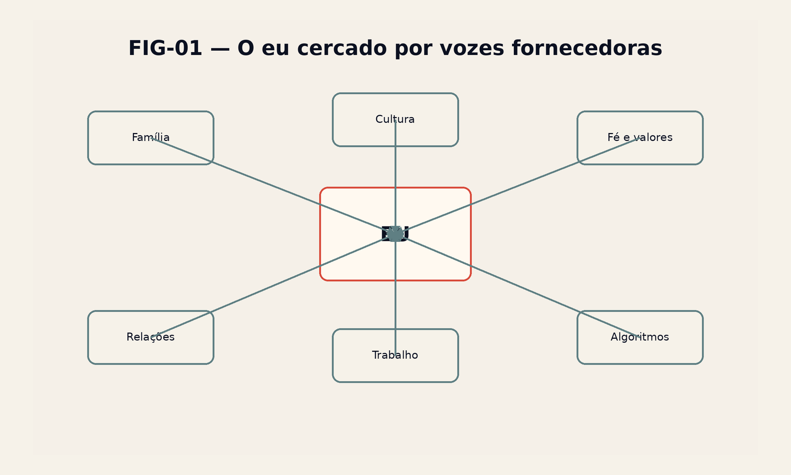

As pessoas não decidem a partir de uma realidade sem interpretação. Crenças influenciam o que parece verdadeiro; valores definem o que merece proteção; narrativas conectam acontecimentos e lhes atribuem direção. Quando esses elementos deixam de ser examináveis, uma contradição pode receber o nome de fidelidade e uma adaptação pode parecer escolha inteiramente própria.

As ferramentas virão em suas casas próprias. Aqui basta perceber o problema: antes de uma pessoa responder, alguma explicação pode já ter decidido o que a situação significa.

Quanto mais as pessoas falavam em autenticidade, mais eu via comportamentos copiados. Quanto mais repetiam “seja você”, mais pareciam precisar de plateia para confirmar quem eram. Quanto mais ferramentas surgiam para explicar a personalidade, mais gente se declarava confusa sobre si. Quanto mais se falava em encontrar propósito, mais propósitos prontos eram vendidos como produtos: escolha esta causa, adote esta linguagem, vista esta identidade, siga este líder, encontre sua tribo — e finalmente você saberá por que existe.

Mas quem procura propósito quando o próprio eu está em disputa?

Essa é a pergunta debaixo de todas as outras.

Uma pessoa pode passar anos tentando descobrir “para que veio ao mundo” sem perceber que a voz que formula a pergunta já está carregada de expectativas familiares, feridas relacionais, recompensas sociais, discursos políticos, promessas religiosas, tendências culturais e sugestões algorítmicas. Pode chamar de vocação aquilo que aprendeu a fazer para ser amada. Pode chamar de personalidade aquilo que construiu para não ser rejeitada. Pode chamar de convicção o que repete para não ser expulsa. Pode chamar de propósito o papel que finalmente lhe deu um lugar.

Isso não torna toda influência ruim.

**Influência é inevitável. Abdicar do exame não é.**

Precisamos de referências, pertencimento e outras pessoas para descobrir aspectos de nós que talvez nunca enxergássemos isoladamente. O problema começa quando a influência deixa de ampliar a consciência e passa a substituir a autoria.

Num vínculo saudável, linguagem, afeto, correção e perspectiva podem entrar sem confiscar o direito de perguntar. Você pode concordar sem se fundir, discordar sem deixar de existir e revisar uma posição sem perder junto toda a identidade.

Na fuga identitária, o processo é diferente.

Uma fonte externa — um grupo, um relacionamento, uma liderança, uma causa, uma comunidade, uma audiência ou um sistema de recomendação — encontra uma região sem nome: uma dúvida, uma dor, uma solidão, uma injustiça, um ressentimento ou uma necessidade de reconhecimento. Então oferece um pacote coerente. Explica quem você é, quem feriu você, quem você deve temer, qual linguagem usar, o que pensar, a quem admirar, contra quem lutar e por que sua existência importa.

O alívio pode ser imediato.

Finalmente, tudo parece fazer sentido.

O problema é o preço.

Pouco a pouco, pertencer deixa de ser uma relação e se torna uma condição para existir. Discordar já não significa rever uma ideia; significa ameaçar o próprio lugar no mundo. Uma crítica ao grupo é sentida como ataque pessoal. Uma mudança do líder provoca desorientação. A possibilidade de sair desperta não apenas medo da solidão, mas a pergunta mais silenciosa e mais grave:

> Se tudo isso desaparecesse amanhã, quem eu seria?

Não leia essa pergunta como diagnóstico. Leia como abertura.

Talvez sua resposta seja clara. Talvez você reconheça valores, vínculos e convicções que permaneceriam. Talvez perceba também algumas partes de si que só existem diante de determinada plateia. E talvez, pela primeira vez, encontre um silêncio onde esperava encontrar uma identidade.

É desse silêncio que estamos falando.

Hoje, ele não permanece vazio por muito tempo.

O algoritmo não precisa saber quem você é; basta aprender o que interrompe o movimento do seu dedo. O influenciador não precisa conhecer sua história inteira; basta nomear uma dor e produzir a sensação de reconhecimento. O grupo não precisa acolher tudo o que você é; basta oferecer pertencimento à parte de você que confirma sua narrativa.

E assim começa uma troca quase imperceptível: você entrega atenção e recebe linguagem; entrega dúvida e recebe certeza; entrega complexidade e recebe uma categoria; entrega solidão e recebe uma tribo; entrega autoria e recebe um personagem pronto para habitar.

Não acontece de uma vez.

Primeiro, você é exposto. Depois, reconhece algo de si naquela narrativa. Em seguida, adota palavras, explicações e gestos. Com o tempo, a fronteira entre “eu penso” e “nós pensamos” perde nitidez. Por fim, a identidade recebida torna-se tão necessária que qualquer ameaça a ela parece uma ameaça à própria estabilidade.

**Exposição. Identificação. Adoção. Fusão. Dependência.**

Esta é a anatomia da ocupação que investigaremos.

Mas existe outra fuga acontecendo ao mesmo tempo.

Construir identidade exige suportar períodos de dúvida. Exige permanecer diante de perguntas sem resposta rápida. Exige reconhecer contradições, lamentar escolhas, rever lealdades, admitir desejos inconvenientes e assumir responsabilidade pelo que se decide. Tudo isso produz desconforto.

E nós nos tornamos extraordinariamente eficientes em não permanecer no desconforto.

Rolamos a tela. Trabalhamos além do necessário. Consumimos conteúdo sobre autoconhecimento sem tempo para nos conhecer. Entramos em discussões que oferecem indignação instantânea. Jogamos, compramos, desejamos, produzimos, assistimos, publicamos. Até a busca por cura pode se transformar em uma sucessão de explicações que nos poupa do encontro com aquilo que nenhuma explicação pode viver por nós.

Chamo esse movimento de fuga cognitiva: não uma doença, nem uma condenação automática de telas, jogos, trabalho, prazer ou entretenimento, mas a função que qualquer um deles pode assumir quando serve para evitar sentir, pensar, escolher e enfrentar.

As duas fugas se alimentam.

> **A fuga cognitiva evita a pergunta. A fuga identitária aceita uma resposta pronta.**

Enquanto uma nos mantém ocupados demais para investigar, a outra oferece um eu que dispensa investigação.

É por isso que este livro também é sobre propósito.

Não porque eu pretenda lhe entregar uma frase que explique por que você nasceu. Já existem pessoas demais oferecendo respostas universais para experiências que não conhecem. Propósito não é um slogan suficientemente bonito para caber na biografia de um perfil. Não é sinônimo automático de profissão, relacionamento, audiência, causa, dor superada ou missão recebida de alguém.

Um propósito verdadeiramente próprio exige algum grau de autoria. Exige que a pessoa consiga examinar seus valores, reconhecer suas capacidades, responder à realidade, assumir responsabilidades, estabelecer vínculos e decidir o que fará com o lugar que ocupa no mundo.

Um eu emprestado também pode ter uma missão. Pode trabalhar com intensidade, defender uma causa, reunir seguidores e sentir-se absolutamente certo. Intensidade, porém, não prova autoria. Certeza não prova consciência. Pertencimento não prova identidade.

> **Ninguém encontra um propósito verdadeiramente próprio enquanto procura com um eu emprestado.**

Talvez você tenha chegado até aqui esperando que este livro ajude você a descobrir quem você é. Preciso ser honesta: não tenho o direito de lhe dar essa resposta.

E desconfie de quem afirma ter.

O que posso fazer é ajudar você a perceber quem vem respondendo por você.

Investigaremos as vozes que chegaram antes da sua, os papéis que garantiram amor ou proteção, as ideias que se tornaram familiares pela repetição, os grupos que ofereceram nome, os líderes que transformaram dor em lealdade, os rótulos que primeiro acolheram e depois começaram a limitar, os personagens construídos para ser vistos e os propósitos aceitos para não enfrentar o vazio de ainda não saber.

Antes de aplicar essa lente a movimentos, religiões, política, tecnologia, relacionamentos ou identidades, construiremos um sistema de exame. Você aprenderá a distinguir busca de fuga, fato de interpretação, valor declarado de valor operante, discordância de desumanização e pertencimento de fusão. Aprenderá também a localizar narrativas, testar simetria, reconhecer respostas absolutas e encontrar um critério que não mude apenas porque mudou a plateia.

Esse critério receberá, no capítulo 7, o nome de **Eixo de Autoria**. Ele é o ponto de equilíbrio da autoria — não uma ordem para ficar no meio, mas uma forma de impedir que submissão a um polo ou reação automática ao polo oposto continue pensando por você. Equilíbrio, aqui, não é dividir a razão pela metade: é aplicar aos lados o mesmo critério verificável e permitir que os fatos indiquem onde uma posição responsável precisa ficar.

Não faremos essa travessia para arrancar você de todo vínculo.

Este livro não é contra família, fé, comunidade, tecnologia, movimentos, causas, identidade ou pertencimento. É contra a abdicação silenciosa da autoria. Uma fé que não permite pergunta pode exigir submissão, não convicção. Um movimento que não tolera dúvida pode desejar obediência, não consciência. Um relacionamento que só preserva o vínculo quando você desaparece não preserva amor; preserva uma função. Uma tecnologia que mantém você reagindo sem parar pode conhecer seus padrões sem jamais conhecer sua humanidade.

Não lhe peço concordância antecipada. Peço exame.

Em uma sociedade na qual discordar rapidamente se confunde com atacar, examinar tornou-se um ato de responsabilidade. Ideias não possuem dignidade humana; pessoas possuem. Por isso, uma ideia pode ser questionada com firmeza sem que a pessoa que a sustenta seja desumanizada. Esse limite será importante, porque identidades rígidas podem transformar crítica em ameaça e, no extremo oposto, certas versões da autenticidade podem transformar o outro em obstáculo.

Quando o eu se torna absoluto, as pessoas ao redor deixam de ser sujeitos completos. Tornam-se plateia, validação, utilidade, problema ou descarte. A linguagem do amor-próprio pode, então, ser usada para não escutar, não reparar, não ceder, não cumprir compromissos e não responder pelos efeitos das próprias escolhas.

Autenticidade sem responsabilidade não é maturidade.

É um eu que age como se ninguém mais estivesse na sala.

Essa talvez seja uma das consequências mais graves da fuga identitária: ao tentar encontrar-se em identidades prontas, a pessoa não perde apenas a relação consigo. Pode perder também a capacidade de encontrar verdadeiramente o outro.

Por isso, nossa travessia não terminará na pergunta “quem sou eu?”. Ela precisará alcançar perguntas mais difíceis:

O que em mim é convicção e o que é medo de expulsão?

O que escolhi e o que apenas aprendi a representar?

O que continuaria verdadeiro se ninguém aplaudisse?

Meu propósito nasceu de uma identidade examinada ou da necessidade de finalmente pertencer?

Consigo estar em uma relação, grupo, fé ou causa sem entregar o governo da minha consciência?

E o que acontece com os outros quando uso “ser eu mesmo” como autorização para não responder por nada?

Este livro não vai dizer quem você é.

Vai ajudar você a perceber quem vem respondendo por você.

Não leia as próximas páginas como cobrança para que apresente imediatamente uma identidade sólida. Quem passou muito tempo adaptando-se pode precisar, antes de tudo, reaprender a tolerar o espaço entre a resposta antiga e a resposta própria. Não há vergonha em ainda não saber. O perigo não está na dúvida. Está em permitir que qualquer voz interessada ocupe depressa demais o lugar que a dúvida abriu.

Talvez, ao final, você não tenha uma definição perfeita de si.

Espero que tenha algo mais valioso: condições para não aceitar qualquer definição apenas porque ela oferece alívio.

## Escolha uma situação da sua vida

Antes de avançar, escolha uma situação concreta para acompanhar durante esta leitura. Pode ser uma relação, uma crença, uma comunidade, uma posição política, uma missão, um comportamento, um conflito familiar ou profissional, um nome que primeiro acolheu você ou uma história de dano que ainda organiza suas decisões.

Não escolha necessariamente a situação mais dolorosa. Escolha uma que você consiga observar com alguma segurança. Você não precisará expô-la, compartilhá-la nem resolvê-la agora. Se houver vigilância, coerção ou risco, não mantenha um registro que possa aumentar o perigo. Pensar de modo protegido também é uma forma legítima de começar.

Complete, apenas para si:

> **A situação que escolhi examinar durante este livro é…**

Voltaremos a ela ao final de cada parte. Primeiro recuperaremos o que aconteceu. Depois abriremos a narrativa, localizaremos quem forneceu a interpretação, observaremos quando influência começou a virar ocupação, distinguiremos o que pertence ao outro do que agora está em suas mãos e, somente no fim, formularemos uma decisão possível.

Você não está assinando um compromisso com uma conclusão. Está preservando uma situação real para que as ferramentas deste livro não permaneçam apenas no campo das ideias.

> **PARE.**
>
> Antes de perguntar o que nasceu para fazer, pergunte: **quem tem vivido em seu nome?**

É aqui que começamos.

# PARTE I {#parte-i}

## Antes do propósito, existe um eu

Antes de investigar narrativas e grupos, precisamos impedir que fuga identitária explique tudo. Mudança não é desaparecimento. Influência não é manipulação. Comunidade não é prisão.

Esta parte separa busca de fuga, mudança de apagamento e resposta recebida de autoria terceirizada. O método virá depois. Primeiro, precisamos reconhecer quem fará uso dele.

# CAPÍTULO 1 — A PERGUNTA DEBAIXO DA PERGUNTA

## Quem procura propósito quando o próprio eu está em disputa?

Você pergunta: “Qual é o meu propósito?”

Mas quem, exatamente, está fazendo essa pergunta?

É a pessoa que você se tornou depois de examinar a própria história? É a criança que aprendeu a ser útil para merecer afeto? É a adulta que teme decepcionar a família? É a profissional que só se sente valiosa quando produz? É a voz de uma comunidade que já definiu o que uma vida digna deve parecer? É o personagem que você construiu para não ser rejeitada?

Uma mesma boca pode pronunciar a pergunta. Isso não significa que a pergunta tenha uma única origem.

Muita gente procura propósito como quem procura uma senha capaz de abrir de uma vez todas as portas: profissão certa, relacionamento certo, missão certa, versão certa de si. A promessa é sedutora porque parece substituir a desordem por direção. Se eu descobrir para que nasci, penso, finalmente saberei o que escolher, o que abandonar, como me apresentar e por que meu sofrimento aconteceu.

O desejo de direção é humano. O problema começa quando pedimos à ideia de propósito que resolva uma questão anterior: a ausência de autoria.

## O vazio que pede uma missão

Há um vazio produzido pela falta de oportunidades, vínculos, segurança ou reconhecimento. Há outro produzido por perdas, transições e acontecimentos que desorganizam uma história. E há um vazio mais difícil de nomear: aquele que aparece quando a pessoa passou tanto tempo respondendo ao que esperavam dela que já não sabe diferenciar desejo de adaptação.

Esse vazio não significa que dentro dela não exista nada. Significa que a ligação com o que existe foi interrompida, abafada ou pouco exercitada.

Ela sabe perceber o humor dos outros antes de perceber o próprio limite. Sabe qual resposta evita conflito, qual aparência recebe aprovação e qual opinião preserva o vínculo. Talvez seja competente, generosa, disciplinada e admirada. Ainda assim, diante de uma escolha que não vem acompanhada de instruções, sente uma insegurança desproporcional.

Pergunta a muitas pessoas. Pesquisa sem parar. Faz testes. Consome vídeos sobre personalidade e vocação. Compara respostas incompatíveis. Por alguns dias, cada nova explicação parece definitiva. Depois, a antiga incerteza retorna.

O que está faltando talvez não seja informação.

Talvez seja confiança na própria capacidade de examinar a informação.

Pesquisas sobre desenvolvimento da identidade tratam a construção de um sentido relativamente coerente de si como um processo que envolve continuidade, exploração, compromissos e revisões ao longo do tempo. Esse processo não termina obrigatoriamente quando termina a adolescência. Ele atravessa a entrada na vida adulta e pode ser reaberto por mudanças de papel, rupturas e acontecimentos importantes (Branje et al., 2021).

Isso importa porque retira da dúvida uma condenação. Não saber imediatamente quem se é não prova vazio moral, fraqueza ou fracasso. Em muitos momentos, significa que uma organização antiga já não responde à realidade e uma nova ainda está sendo construída.

O espaço entre essas duas organizações, porém, é vulnerável. Quem não suporta permanecer nele pode aceitar depressa demais qualquer missão que prometa encerrá-lo.

## Caso-âncora — Helena, a mulher que sabia servir

Helena era a pessoa confiável de todos os ambientes.

Num almoço de família, alguém apenas olhava para a jarra vazia e ela já se levantava. O prato ainda estava quente quando empilhava os pratos dos outros. Se uma conversa começava a pesar, mudava o assunto, sorria um pouco mais alto e perguntava quem queria café. Quase ninguém percebia o movimento. Era justamente por isso que funcionava.

“Helena não dá trabalho”, diziam.

Ela recebia a frase como elogio. O corpo, porém, aprendia outra coisa: para continuar perto, era melhor perceber antes de pedir; resolver antes de cansar; ceder antes de produzir conflito.

No trabalho, antecipava problemas. Na família, reconhecia necessidades antes que fossem pronunciadas. Nos relacionamentos, ajustava desejos para preservar a paz. Ser necessária produzia reconhecimento, e o reconhecimento tornou-se tão constante que ela já não conseguia distinguir cuidado, valor, afeto e medo de perder lugar.

Quando uma mudança profissional interrompeu sua rotina, o silêncio chegou antes da pergunta. Na primeira segunda-feira sem agenda cheia, Helena abriu o computador, fechou, caminhou até a cozinha e voltou. Havia café na xícara, mas ela não lembrava de tê-lo preparado. Sem tarefas urgentes e pessoas chamando seu nome, não sentia descanso. Sentia ausência.

Foi então que disse que precisava “encontrar seu propósito”.

Fez cursos, procurou mentores e reuniu listas de talentos. Cada orientação nova produzia entusiasmo e, logo depois, paralisia. Se alguém admirado sugeria liderança, ela se imaginava liderando. Se outro elogiava sua sensibilidade, considerava uma profissão de cuidado. Se ouvia que prosperidade era sinal de alinhamento, reorganizava a vida em torno de metas financeiras.

Nada disso era necessariamente falso. Helena tinha capacidades reais. O problema estava no método: tentava reconhecer a si mesma apenas pelo reflexo que recebia.

A pergunta decisiva não foi “qual trabalho combina comigo?”. Foi outra:

> **O que você aprendeu que precisava ser para continuar sendo amada, necessária ou aceita?**

Helena não respondeu imediatamente. Olhou para as próprias mãos apoiadas sobre a mesa. Pela primeira vez, percebeu que até o silêncio lhe parecia uma tarefa que deveria realizar corretamente.

A pergunta não lhe entregou uma profissão. Entregou algo anterior: a possibilidade de perceber que parte de sua aparente vocação também funcionava como estratégia de vínculo.

O caso não prova que cuidar seja fuga, que servir seja submissão ou que uma escolha influenciada pela família seja falsa. Mostra por que uma ação não pode ser compreendida apenas pela aparência. Duas pessoas podem executar a mesma tarefa; uma a realiza por convicção examinada, outra por medo de perder valor. O comportamento é semelhante. A relação interna com a escolha é diferente.

Helena voltará a aparecer. Não porque represente toda pessoa que cuida, mas porque certas fugas começam muito antes de uma identidade pronta chegar. Começam quando alguém aprende que sua presença vale mais pelo que impede, resolve ou suporta do que pelo fato de existir.

## Propósito não é cargo, slogan ou explicação total

Na literatura sobre desenvolvimento humano, “propósito” costuma envolver uma intenção relativamente duradoura, significativa para a pessoa e capaz de orientar ações que importam também para além dela. Não é apenas desejar algo nem sentir entusiasmo durante alguns dias. Envolve direção, investimento e alguma relação com o mundo real (Damon, Menon e Bronk, 2003; OECD, 2024).

Estudos com jovens adultos associaram senso de propósito, bem-estar e autoimagem (Hill et al., 2016). Isso não autoriza prometer que “encontrar seu propósito” curará sofrimento, produzirá sucesso ou revelará uma missão única. Associação não é destino.

Ainda assim, a pesquisa ajuda a corrigir uma confusão comum: propósito não é uma palavra bonita colocada sobre qualquer atividade. Ele precisa manter alguma coerência entre valores, escolhas e participação no mundo.

Aqui entra uma distinção central deste livro.

Uma pessoa pode receber de fora o nome de uma missão e realizá-la com enorme intensidade. Pode ser elogiada, promovida, seguida e considerada exemplar. Pode até experimentar satisfação. Nada disso, isoladamente, responde se aquela missão foi integrada por exame ou assumida para garantir pertencimento, aprovação, proteção ou identidade.

Minha hipótese autoral é que **um propósito verdadeiramente próprio requer um grau suficiente de autoria**. Não autoria absoluta — isso não existe —, mas capacidade real de reconhecer por que se escolheu, quais custos foram aceitos, que valores estão sendo protegidos e o que aconteceria se a plateia deixasse de aplaudir.

Essa formulação é um posicionamento filosófico apoiado por pesquisas sobre autonomia e metas autoconcordantes; não é uma lei clínica. Estudos sobre autodeterminação distinguem agir com senso de escolha e endosso pessoal de agir sob pressão externa ou interna. Também mostram que valores recebidos socialmente podem ser compreendidos, internalizados e integrados, em vez de apenas obedecidos (Ryan e Deci, 2000; Ryan e Deci, 2006).

Portanto, uma missão não deixa de ser sua porque outra pessoa a apresentou. Um livro pode nomear algo que você já intuía. Uma tradição pode oferecer linguagem para um valor que você reconhece. Um professor pode enxergar uma capacidade antes de você. O ponto não é a origem externa da ideia.

O ponto é o que aconteceu com ela dentro de você. Você a examinou ou apenas se submeteu? Conseguiu relacioná-la à realidade ou precisou ignorar fatos para preservá-la? Pode ajustar a forma sem sentir que traiu toda a sua existência? Sabe explicar por que escolheu sem recorrer apenas à autoridade de quem ensinou?

Receber não é terceirizar. Aprender não é desaparecer.

## A pergunta retirada das mãos

Existe uma indústria inteira construída em torno da insegurança humana. Ela não vende apenas cursos, experiências ou conteúdos. Muitas vezes, vende um narrador.

“Eu direi qual é a sua essência.”

“Este teste revelará quem você realmente é.”

“Esta comunidade finalmente explicará por que você nunca se encaixou.”

“Siga este método e sua missão ficará óbvia.”

Algumas ferramentas são honestas e úteis. Um teste pode organizar observações. Uma conversa pode abrir caminhos. Uma comunidade pode oferecer linguagem, apoio e oportunidade. O risco aparece quando uma ferramenta provisória se transforma em autoridade final; quando uma descrição deixa de iluminar a experiência e passa a proibir tudo o que não cabe nela.

A pessoa aliviada por finalmente ter um nome pode começar a reorganizar toda a memória para provar que sempre foi aquilo. Seleciona fatos compatíveis, desconsidera exceções, adapta desejos e passa a vigiar a própria espontaneidade. Em vez de usar a definição para compreender-se, começa a usar a si mesma para confirmar a definição.

É possível sentir enorme certeza e ainda assim estar vivendo de uma resposta recebida.

Certeza é um estado subjetivo. Autoria é uma relação de responsabilidade com o processo pelo qual se chegou à escolha.

## O direito de não saber depressa

Nem toda fase da vida permite uma investigação longa. Às vezes, é preciso aceitar orientação, cumprir uma responsabilidade imediata ou seguir um protocolo antes de compreender tudo. Em uma crise, uma estrutura emprestada pode oferecer contenção. Uma pessoa esgotada pode precisar de uma decisão provisória. Um jovem pode adotar valores familiares antes de ter maturidade para examiná-los em profundidade.

Nada disso constitui, por si só, fuga identitária.

O problema não é usar um apoio provisório. É perder o direito de tratá-lo como provisório.

Também não devemos transformar “autoria” em culto à independência. Ninguém se forma sozinho. Uma decisão pode ser profundamente pessoal e, ao mesmo tempo, construída em diálogo, cuidado e compromisso com outras pessoas. O oposto da terceirização não é isolamento. É participação consciente.

Talvez, então, a primeira tarefa de quem busca propósito não seja encontrar a resposta certa. Seja recuperar a capacidade de fazer uma pergunta sem entregá-la imediatamente a quem promete resolvê-la.

> **PARE.**
>
> Não procure uma missão nova durante alguns minutos. Perceba quem está exigindo que você encontre uma resposta agora. É a realidade? Um compromisso concreto? O medo de parecer atrasado? A comparação? A necessidade de provar valor? A promessa de que nunca mais sentirá dúvida?

> **RECUPERE A PERGUNTA.**
>
> Escreva sem se corrigir: **O que eu estou realmente tentando resolver quando digo que preciso encontrar meu propósito?**
>
> Depois pergunte: **Qual parte desta urgência é minha, qual parte recebi e qual parte ainda não sei?**

Recuperar a pergunta não é resolvê-la. É impedir que ela seja sequestrada pela primeira resposta convincente.

Se você consegue nomear o que realmente tenta resolver, distinguir urgência de realidade e permanecer alguns minutos sem uma missão pronta, a primeira operação foi aprendida: a pergunta voltou às suas mãos.

E há uma consequência importante: se a identidade é construída, examinada e revista ao longo do tempo, então mudar não pode ser tratado automaticamente como desaparecer.

Antes de identificar uma fuga, precisamos aprender a reconhecer uma busca.

# CAPÍTULO 2 — BUSCAR-SE NÃO É FUGIR DE SI

## A diferença entre explorar, mudar e desaparecer

Há pessoas que permanecem em uma identidade por medo e são chamadas de firmes.

Há pessoas que revisam uma identidade por honestidade e são chamadas de confusas.

A aparência externa engana.

Uma pessoa pode conservar a mesma profissão, fé, posição ou relacionamento durante décadas porque os examinou e continua escolhendo-os. Outra pode fazer o mesmo porque não consegue imaginar quem seria sem eles. Uma pessoa pode mudar muitas vezes porque está experimentando possibilidades reais. Outra pode mudar de personagem toda vez que muda a plateia.

Nem permanência prova autoria, nem mudança prova fuga.

Por isso, a pergunta não é apenas “o que mudou?”. É “como essa mudança foi produzida, sustentada e integrada?”.

## Identidade é continuidade, não imobilidade

Uma identidade coerente não exige que a pessoa pense, deseje e aja da mesma forma para sempre. Coerência não é congelamento. É a capacidade de reconhecer continuidade através da mudança: compreender como experiências, decisões, rupturas e revisões participam de uma história que ainda pode ser assumida como própria.

Revisões contemporâneas da pesquisa sobre identidade descrevem processos de exploração, compromisso, avaliação e reconsideração. Pessoas investigam alternativas, assumem compromissos, examinam se esses compromissos continuam fazendo sentido e, quando necessário, reabrem escolhas. Há estabilidade e há transformação; as duas podem fazer parte do amadurecimento (Branje et al., 2021).

Isso desmonta uma fantasia perigosa: a de que em algum momento encontraremos uma definição perfeita, definitiva e imune ao tempo.

Você não precisa permanecer igual para provar que um dia foi sincero.

Uma decisão pode ter sido honesta e deixar de ser adequada. Uma crença pode ter organizado uma etapa da vida e depois revelar limites. Uma comunidade pode ter oferecido acolhimento real e, ainda assim, tornar-se pequena para perguntas novas. Reconhecer isso não apaga automaticamente o valor do que aconteceu.

O passado não precisa ser declarado fraude para que o presente possa ser revisto.

## Explorar, comprometer-se, reconsiderar

Uma tradição importante da psicologia da identidade descreve combinações entre exploração e compromisso. Em termos simplificados, alguém pode assumir compromissos depois de explorar alternativas; pode comprometer-se sem exploração relevante; pode explorar sem conseguir firmar compromissos; ou pode permanecer com pouco investimento e pouca exploração. Esses estados não são castas humanas nem diagnósticos. São formas de observar processos que podem variar entre áreas da vida e ao longo do tempo (Verschueren et al., 2017).

O compromisso assumido sem exploração costuma ser chamado de *foreclosure* — algo como fechamento antecipado. Ele merece cuidado, não condenação. Receber uma identidade pronta da família, da cultura ou de uma instituição pode oferecer estabilidade, autoestima e direção. Algumas pesquisas também associam esse fechamento a maior rigidez ou menor abertura em certos contextos, mas os resultados não autorizam declarar que toda continuidade herdada seja falsa ou prejudicial (Schwartz et al., 2011).

Da mesma forma, explorar não é automaticamente saudável. Existe uma exploração curiosa, que reúne experiência e aproxima decisões. Existe também uma exploração ruminativa, que gira em torno das mesmas dúvidas sem produzir contato novo com a realidade. A pessoa consome explicações sobre si, mas evita o risco de escolher. Reinventa a apresentação, mas não assume consequências.

Busca e fuga podem usar as mesmas palavras.

“Estou me descobrindo” pode significar que alguém está testando uma possibilidade com honestidade.

Pode também significar que adia indefinidamente qualquer compromisso capaz de expor limites.

Só o contexto, a função e as consequências permitem distinguir.

## Não existe um eu sem o outro

Alguns discursos de autoconhecimento tratam influência como contaminação. Mandam ignorar expectativas, afastar vozes externas e descobrir um “eu verdadeiro” escondido em algum lugar intocado. Essa imagem pode ser libertadora para quem viveu sob controle. Como descrição completa da identidade, porém, ela é insuficiente.

Aprendemos linguagem com outras pessoas. Reconhecemos capacidades em relações. Formamos valores em culturas. Construímos lembranças em narrativas compartilhadas. Até a discordância depende de algo recebido que decidimos contestar. A identidade pessoal e as identidades sociais se cruzam; pertencimento e singularidade não são inimigos automáticos (Branje et al., 2021).

Autonomia, portanto, não significa não precisar de ninguém. Na teoria da autodeterminação, autonomia está ligada à experiência de agir com vontade e endosso, e pode coexistir com vínculo, cuidado, tradição e interdependência. Uma pessoa pode escolher livremente honrar uma responsabilidade que limita opções imediatas. Pode considerar o bem de filhos, parceiros, familiares ou comunidade sem deixar de ser autora (Ryan e Deci, 2000).

O teste não é “fiz apenas o que eu quis?”.

É “participei conscientemente da escolha, compreendi o que estava protegendo e posso responder pelo efeito produzido?”.

Há decisões que parecem independentes e são governadas pela necessidade de provar independência. Há renúncias que parecem submissas e são escolhas profundamente conscientes. Liberdade não pode ser medida apenas pela quantidade de limites recusados.

## Cinco movimentos que não são iguais

Para não chamar tudo de fuga, precisamos separar cinco movimentos.

**Mudança** é a alteração de posição, papel, hábito, vínculo ou autodefinição. Pode resultar de amadurecimento, oportunidade, pressão, medo, aprendizado ou captura. A mudança descreve o que aconteceu; não explica por quê.

**Influência** é a participação de outras pessoas, ideias e ambientes na maneira como percebemos e escolhemos. É inevitável. Torna-se problemática quando não pode ser reconhecida, comparada ou recusada.

**Pertencimento** é a experiência de fazer parte de uma relação ou coletividade. Pode ampliar recursos, linguagem, cuidado e responsabilidade. Torna-se perigoso quando existir no vínculo exige apagar fatos, limites ou partes relevantes de si.

**Adoção** é assumir uma linguagem, prática, valor, compromisso ou identidade recebida. Pode ser deliberada e integrada. Torna-se um sinal de alerta quando a velocidade da adoção substitui a investigação e quando toda a história passa a ser reorganizada para caber na nova resposta.

**Desaparecimento** é a perda progressiva da capacidade de reconhecer, formular e sustentar uma perspectiva própria diante da fonte de pertencimento. Não significa que a pessoa fique silenciosa. Ela pode falar muito — desde que fale com a voz permitida.

Esses movimentos podem aparecer juntos, mas não devem ser confundidos. Alguém pode mudar sem desaparecer. Pode adotar sem se fundir. Pode pertencer e se tornar mais capaz de pensar. Também pode permanecer externamente igual enquanto sua autoria diminui.

## Caso composto: a mudança que parecia instabilidade

Caio — nome fictício, em um caso composto — cresceu em um ambiente no qual competência significava seguir um caminho profissional específico. Ele entrou na formação esperada, teve bom desempenho e recebeu reconhecimento. Anos depois, começou a perceber que sua curiosidade, suas habilidades e o tipo de contribuição que desejava fazer apontavam para outro campo.

Durante dois anos, pesquisou possibilidades, conversou com pessoas de áreas diferentes, realizou trabalhos pequenos e revisou o impacto financeiro da transição. Mudou de direção sem romper afetivamente com quem discordava. Conseguiu explicar o que estava deixando, o que pretendia construir e quais riscos assumiria. Também admitiu que poderia corrigir o percurso novamente.

Para alguns familiares, cada revisão provava que ele “não sabia quem era”. No entanto, o processo continha sinais de autoria: tempo, contato com a realidade, comparação de alternativas, tolerância a objeções, responsabilidade pelos custos e continuidade de valores.

Caio não estava trocando de identidade toda vez que recebia aprovação. Estava diferenciando uma expectativa herdada de uma escolha que conseguia sustentar.

Agora imagine uma alteração sutil no mesmo caso. A cada nova amizade, Caio adota uma vocação diferente. Oculta dúvidas para impressionar o grupo atual. Desqualifica violentamente o caminho anterior e rompe com qualquer pessoa que recorde suas contradições. Não testa a nova direção, mas publica imediatamente uma identidade completa. Quando a admiração diminui, procura outra explicação total.

A mudança exterior poderia ser parecida. O processo seria outro.

É por isso que não devemos analisar uma identidade apenas pelo nome, pela novidade ou pelo grau de estranheza que provoca em nós. O ridículo percebido pelo observador não é uma medida científica de captura. O familiar também pode aprisionar. O critério precisa alcançar autoria, liberdade de exame, integração com a realidade e responsabilidade por consequências.

## A coragem de revisar sem se apagar

Revisar uma identidade pode gerar luto. Ao abandonar uma resposta antiga, a pessoa perde previsibilidade, reconhecimento e, às vezes, vínculos. Pode descobrir que certa versão de si foi construída para sobreviver. Isso não transforma aquela versão em inimiga. Muitas adaptações nos protegeram antes de começarem a nos limitar.

Uma leitura madura não pergunta apenas: “Por que fui assim?”. Pergunta também: “O que isso protegeu, quanto passou a custar e o que preciso aprender agora?”.

Essa postura evita dois extremos.

No primeiro, a pessoa sacraliza o passado: se foi ensinado, não pode ser revisto.

No segundo, demoniza tudo o que recebeu: se não inventou sozinha, não pode ser verdadeiro.

O capítulo 7 formalizará o **Eixo de Autoria**. Aqui basta reconhecer sua função preliminar: não sacralizar tudo o que foi recebido nem destruí-lo apenas para provar independência; conservar o que resiste ao exame e revisar o que já não resiste.

Você pode reconhecer amor em quem lhe transmitiu uma crença e ainda questionar a crença. Pode agradecer o acolhimento de um grupo e recusar uma exigência. Pode admitir que uma escolha foi condicionada sem negar toda agência que possuía. Pode descobrir que estava errada sem transformar-se em alguém sem valor.

Autoria não é nunca ter sido influenciada.

É poder reelaborar a influência sem precisar falsificar a própria história.

## Quando a busca começa a girar

Existe, contudo, uma forma sofisticada de fuga que se apresenta como busca permanente.

A pessoa não aceita respostas prontas, mas também não permite que nenhuma resposta seja testada pelo tempo. Mantém todas as possibilidades abertas para não enfrentar perda, limite ou responsabilidade. Cada escolha concreta parece reduzir versões possíveis de si, e por isso é adiada. O autoconhecimento transforma-se em consumo: mais um curso, mais um método, mais uma leitura, mais uma linguagem.

Ela sabe explicar muitos conceitos e continua incapaz de dizer “eu escolho isto e aceito que escolher custa”.

Não há maturidade em encerrar a investigação cedo demais. Também não há liberdade em investigar para sempre sem permitir que a vida responda.

Uma busca saudável produz contato: com o corpo, com fatos, com pessoas reais, com capacidades, com limites e com consequências. Pode aumentar a dúvida antes de gerar clareza, mas não existe apenas para preservar a sensação de movimento.

> **SEPARE BUSCA DE FUGA.**
>
> Pergunte à mudança que você está vivendo:
>
> **Ela aumenta meu contato com a realidade ou apenas muda a explicação?**
>
> **Consigo reconhecer influências, dúvidas e custos sem sentir que minha nova identidade desmorona?**
>
> **Estou testando possibilidades ou colecionando personagens?**
>
> **Posso continuar em relação com quem discorda sem abandonar meus limites nem negar a humanidade do outro?**
>
> **A mudança amplia minha capacidade de decidir e responder — ou entrega essa capacidade a uma nova autoridade?**

Não use essas perguntas para julgar rapidamente outra pessoa. A vida interna não se revela por uma fotografia, por uma roupa, por uma palavra ou por um único comportamento. Use-as primeiro para examinar processos, inclusive os seus.

O teste foi aprendido quando você consegue descrever **como** uma mudança foi produzida — tempo, realidade, vínculo, custo e possibilidade de revisão — sem concluir apenas pelo nome, pela permanência ou pela novidade.

Buscar-se não é fugir de si.

Às vezes, buscar-se é justamente interromper a fuga.

Mas para isso é preciso reconhecer as duas formas de evasão que podem trabalhar juntas: uma nos afasta do desconforto da pergunta; a outra oferece uma identidade pronta para que nunca precisemos voltar a ela.

# CAPÍTULO 3 — DUAS FUGAS, O MESMO VAZIO

## Quando evitamos a pergunta e aceitamos uma resposta pronta

Nem toda fuga exige uma porta.

Algumas começam quando permanecemos no mesmo lugar, ocupados demais para perceber o que evitamos. Outras começam quando encontramos uma resposta tão completa que a investigação parece desnecessária.

Neste livro, chamarei o primeiro movimento de **fuga cognitiva** e o segundo de **fuga identitária**.

Os termos não são diagnósticos. São instrumentos de leitura. Não descrevem tipos fixos de pessoa, mas funções que comportamentos, hábitos, vínculos e sistemas podem assumir em determinado contexto.

A fuga cognitiva evita o encontro com uma experiência interna, uma pergunta, um conflito ou uma decisão.

A fuga identitária transfere para uma fonte externa a autoria da resposta sobre quem se é, como se deve interpretar a realidade e qual missão tornará a existência legítima.

Uma adia.

A outra encerra cedo demais.

## Fuga cognitiva: quando o alívio cobra atenção

Evitar é parte da vida. Afastamo-nos de perigos, interrompemos conversas quando estamos desregulados, buscamos distração depois de um dia difícil e adiamos uma questão até possuir recursos para enfrentá-la. Nem todo afastamento é covardia; às vezes, é proteção, estratégia ou descanso.

A psicologia comportamental usa a expressão “evitação experiencial” para investigar tentativas de escapar, suprimir ou alterar pensamentos, emoções, memórias e sensações indesejadas quando essas tentativas se tornam rígidas e custosas. O ponto central é funcional: não basta perguntar o que a pessoa faz; é preciso observar para que aquilo está servindo e que efeitos produz ao longo do tempo (Hayes et al., 1996).

Uma revisão sobre evitação adverte justamente contra tratá-la como mal absoluto. Evitar pode ser adaptativo dependendo do contexto, do tempo e da possibilidade de escolha. O problema aumenta quando a estratégia domina o repertório, reduz a vida e preserva o conflito que deveria apenas adiar (Hofmann e Hay, 2018).

Esse cuidado protege o conceito de exageros.

Assistir a uma série não é fuga cognitiva por definição. Trabalhar muito não prova evitação. Jogar, comprar, estudar, rezar, exercitar-se, conversar, dormir ou permanecer em silêncio podem cumprir funções completamente diferentes. O comportamento recebe sentido na relação entre antecedente, função, flexibilidade e consequência.

Pergunte:

O que acontece imediatamente antes?

O que deixo de sentir, pensar ou decidir enquanto faço isso?

Consigo parar quando escolho?

Depois do alívio, volto mais capaz de enfrentar a questão ou apenas preciso repetir a dose?

Quando a resposta é sempre “preciso continuar para não encontrar aquilo”, o descanso pode ter se transformado em evasão.

## Caso composto: ocupar-se até receber uma identidade

Lívia — nome fictício, em um caso composto — saiu de uma relação longa e perdeu, ao mesmo tempo, rotina, círculo social e uma parte importante da maneira como se reconhecia. Nos primeiros meses, manter-se ocupada foi necessário. Trabalhou, reorganizou a casa, assistiu a conteúdos leves e aceitou convites. A distração ofereceu intervalos para um sistema emocional sobrecarregado.

Com o tempo, porém, o intervalo virou regra. Qualquer silêncio era preenchido. Ela alternava vídeos curtos, trabalho noturno, compras e conteúdos de autoconhecimento. Dizia estar “se reconstruindo”, mas não conseguia permanecer alguns minutos diante de perguntas simples: O que eu desejava naquela relação? Que limites abandonei? O que temo repetir? O que ainda não sei?

Uma comunidade digital começou a aparecer repetidamente em seu consumo. As mensagens nomeavam com precisão parte de sua dor, ofereciam um vocabulário claro e dividiam o mundo em padrões fáceis de reconhecer. Havia explicações para o passado, regras para o presente e uma missão para o futuro.

Lívia sentiu alívio. Em poucas semanas, reorganizou toda a história sob aquela linguagem. Pessoas que faziam perguntas foram classificadas como incapazes de compreendê-la. Exceções deixaram de despertar curiosidade e passaram a parecer ameaças. A nova identidade não apenas descrevia uma experiência; determinava antecipadamente o significado de qualquer experiência.

Não foi a existência da comunidade que caracterizou a fuga. Também não foi o fato de ela usar palavras aprendidas. O sinal decisivo foi outro: a resposta recebida começou a substituir a capacidade de examinar.

A fuga cognitiva preparou o terreno mantendo a pergunta afastada. A fuga identitária ofereceu um encerramento. O alívio tornou as duas difíceis de reconhecer.

## Fuga identitária: a resposta que vem com narrador

Uma resposta pronta não chega necessariamente com aparência autoritária. Pode chegar como acolhimento, lucidez, libertação, amor, ciência, tradição, rebeldia ou descoberta. Pode conter fatos verdadeiros e ainda assim organizar esses fatos de modo a exigir obediência.

Ela se torna especialmente poderosa quando responde várias necessidades ao mesmo tempo:

nomeia a dor;

explica o passado;

define quem é a pessoa;

oferece pertencimento;

identifica culpados e aliados;

prescreve linguagem;

fornece uma missão;

e cria uma defesa contra dúvidas futuras.

Isso não significa que toda explicação abrangente seja falsa ou que toda identidade coletiva seja opressiva. Significa que uma resposta capaz de cumprir tantas funções merece ser examinada com atenção proporcional ao alívio que produz.

Pesquisas sobre incerteza e identificação grupal sugerem que, em determinadas condições, a incerteza sobre si pode aumentar a atração por grupos percebidos como muito coesos, claros e delimitados. Esses grupos oferecem protótipos: orientações sobre quem “nós” somos, como pensamos e como agimos (Hogg et al., 2007).

Mas é preciso preservar a nuance. Uma meta-análise posterior encontrou um quadro dependente de como a incerteza foi definida e estudada; a relação geral não foi simples nem uniforme. Quando o próprio grupo era fonte de incerteza, por exemplo, a identificação podia enfraquecer. Incerteza não empurra todas as pessoas para qualquer grupo, nem prova que quem pertence esteja fugindo (Choi e Hogg, 2020).

A pesquisa sustenta uma possibilidade contextual, não uma acusação universal.

Minha proposição autoral vai além: quando uma fonte de pertencimento oferece certeza identitária e, ao mesmo tempo, reduz a liberdade de examinar essa certeza, o alívio pode transformar-se em terceirização. O conceito de fuga identitária nomeia esse processo, não o grupo em si.

## O mesmo ciclo por caminhos diferentes

As duas fugas podem ser compreendidas como um ciclo.

**1. Surge um desconforto.** Uma ruptura, solidão, vergonha, incerteza, contradição, sensação de inadequação ou pergunta sem resposta abala a continuidade do eu.

**2. A pessoa busca alívio.** Pode preencher a atenção para não pensar ou procurar uma explicação que organize rapidamente a experiência.

**3. Uma estratégia funciona no curto prazo.** A distração reduz contato com a dor. A identidade pronta reduz ambiguidade. O corpo aprende que repetir aquela resposta traz alívio.

**4. A questão permanece pouco examinada.** O conflito não desaparece; perde acesso à consciência ou recebe uma interpretação que já não pode ser contestada.

**5. A repetição aumenta a dependência.** Mais ocupação é necessária para sustentar a distância. Mais lealdade é necessária para sustentar a certeza.

**6. A autoria diminui.** A pessoa pratica menos a capacidade de permanecer, perguntar, comparar, decidir e responder. Aquilo que ofereceu ajuda passa a ocupar o lugar de governo.

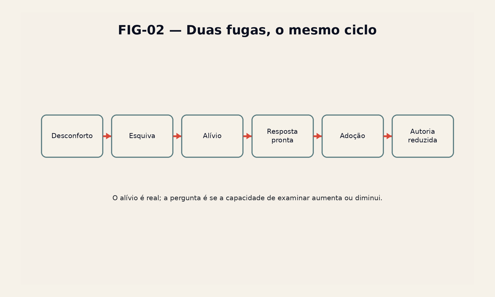

As setas da figura não pretendem representar uma sequência inevitável. Ciclos humanos admitem interrupção, retorno, apoio e escolha. A imagem mostra uma possibilidade: dois caminhos diferentes podem alimentar a mesma raiz quando ambos retiram da pessoa o encontro com a pergunta.

Na fuga cognitiva, terceirizamos a atenção: qualquer estímulo pode decidir o que ocupará nossa consciência.

Na fuga identitária, terceirizamos a interpretação: uma fonte externa decide o que a experiência significa e quem devemos ser diante dela.

Nos dois casos, o alívio é real.

E é justamente por ser real que não deve ser ridicularizado.

As pessoas não permanecem em ciclos apenas porque são ignorantes. Permanecem porque algo ali regula medo, oferece vínculo, organiza caos, protege contra vergonha ou devolve uma sensação de importância. Se ignorarmos a função, ofereceremos apenas julgamento — e o julgamento pode empurrá-las ainda mais para a resposta que promete compreensão.

## O alívio não é prova de verdade — nem prova de engano

Sentir alívio ao encontrar uma explicação não demonstra que ela seja verdadeira. Também não demonstra que seja falsa. O alívio informa que uma necessidade foi tocada.

Uma boa explicação pode aliviar porque organiza fatos antes dispersos. Uma explicação enganosa pode aliviar porque elimina complexidade. Uma comunidade saudável pode reduzir solidão. Um sistema controlador também pode fazê-lo. A experiência emocional, sozinha, não distingue.

É por isso que este livro não dirá “desconfie de tudo o que faz bem”. Tal ordem produziria paranoia e isolamento. Diremos algo mais exigente:

**não use o bem-estar imediato como única prova da qualidade daquilo que começou a governar sua vida.**

Examine também:

a correspondência com fatos;

a possibilidade de discordar;

a proporção entre promessa e evidência;

o tratamento dado a exceções;

o custo imposto aos vínculos;

a liberdade de sair;

a responsabilidade pelas consequências;

e o que acontece com sua capacidade de pensar sem a fonte.

Uma estrutura pode salvar alguém do caos e continuar sendo uma estrutura, não uma prisão. Um hábito pode oferecer descanso e continuar sendo escolha, não compulsão. O critério é flexibilidade com responsabilidade.

## A diferença entre apoio e substituição

O apoio sustenta uma capacidade que continua sua.

A substituição enfraquece a capacidade para tornar-se indispensável.

Um apoio diz: “Vamos pensar juntos”.

Uma substituição diz: “Pensar sozinho prova que você se perdeu”.

Um apoio admite limite: “Esta explicação alcança parte da experiência”.

Uma substituição reivindica totalidade: “Tudo o que acontecer confirmará esta explicação”.

Um apoio pode ser incorporado e, com o tempo, exigir menos dependência.

Uma substituição precisa renovar medo, urgência ou desconfiança para preservar sua autoridade.

Nenhum desses sinais deve ser usado isoladamente como veredito. Relações humanas são imperfeitas; grupos saudáveis também erram, e pessoas em sofrimento podem interpretar cuidado como controle. A análise precisa de contexto, repetição, assimetria de poder, liberdade real e consequência observável.

Este livro não ensinará você a suspeitar de toda influência.

Ensinará a perguntar se a influência ainda permite autoria.

> **IDENTIFIQUE A FUGA.**
>
> Diante de um hábito, vínculo, grupo ou explicação que oferece alívio, pergunte:
>
> **O que isso me ajuda a enfrentar — e o que me ajuda a não enfrentar?**
>
> **Depois do alívio, minha capacidade de pensar e decidir aumenta ou diminui?**
>
> **Posso formular uma dúvida sem ser humilhado, ameaçado, expulso ou reduzido a um rótulo?**
>
> **A explicação aceita fatos que a limitam ou transforma todo fato em confirmação?**
>
> **Se essa fonte desaparecesse amanhã, quais valores, vínculos e decisões eu ainda conseguiria reconhecer como meus?**

Não responda depressa. A pressa por demonstrar que você está livre pode ser outra forma de não examinar dependências.

## O começo da volta

Talvez você tenha se reconhecido em algum ponto deste ciclo. Não use o reconhecimento para produzir uma nova identidade: “eu sou uma pessoa sem eu”, “eu fui enganada em tudo”, “nada em mim é verdadeiro”. Isso seria entregar a este livro o mesmo poder que estamos aprendendo a questionar.

Você não precisa negar toda a sua história para recuperar autoria.

Comece menor.

Perceba uma pergunta evitada.

Reconheça uma resposta que trouxe alívio.

Separe o que nela descreve fatos do que exige obediência.

Observe o que você consegue sustentar sem plateia.

Procure ajuda qualificada quando trauma, violência, controle coercitivo, sofrimento psíquico ou risco tornam esse exame difícil ou inseguro. Observar o próprio pensamento não substitui proteção, tratamento nem rede de apoio.

Ao longo desta Parte I, fizemos distinções que protegerão todo o restante da investigação:

dúvida não é ausência de valor;

mudança não é desaparecimento;

influência não é captura;

pertencimento não é fusão;

descanso não é fuga;

certeza não é autoria;

e propósito não compensa um eu que já não participa da própria vida.

## Caso do leitor — recupere o fato e a pergunta

Volte à situação escolhida na introdução. Ainda não tente resolvê-la.

O que aconteceu de forma observável, antes de você explicar intenções e distribuir papéis? Que pergunta evita porque teme a resposta — ou porque ainda não possui elementos para respondê-la? Que explicação trouxe alívio depressa demais? O que nela descreve fatos e o que já começa a exigir obediência?

Escreva, se for seguro, uma frase que comece por: **“O que sei até agora é…”**. Depois acrescente: **“O que ainda não sei é…”**.

Uma coisa é reconhecer o que aconteceu com você. Outra é permitir que a primeira explicação recebida decida quem você será a partir disso. O ato de autoria desta parte não é concluir. É recuperar a pergunta e suportar, sem vergonha, o espaço do “ainda não sei”.

A partir daqui, podemos entrar na estrutura que organiza essas passagens.

Toda fuga identitária precisa de uma explicação capaz de parecer mundo. Ela seleciona fatos, distribui papéis, nomeia virtudes, produz inimigos, justifica contradições e transforma comandos em conclusões pessoais.

Essa estrutura tem um nome.

Narrativa.

Na próxima parte, não perguntaremos apenas “em que você acredita?”.

Perguntaremos:

**como essa crença aprendeu a pensar por você?**

# PARTE II {#parte-ii}

## Leia o que lê você

Uma mensagem sem resposta pode significar “ela está ocupada” ou “fui desconsiderada”. O acontecimento é o mesmo; a narrativa muda emoção e conduta.

Agora examinaremos como fatos são recortados, interpretados, reclassificados e transformados em comando. Narrativa mostrará a arquitetura da explicação. Lógica testará se ela resiste aos fatos, aos valores e às consequências.

A pergunta não é qual história adotar, mas **o que uma explicação acrescentou ao acontecimento — e se esse acréscimo continua de pé quando encontra a vida**.

# CAPÍTULO 4 — TODA FUGA IDENTITÁRIA PRECISA DE UMA NARRATIVA

Você entra numa sala depois de uma conversa interrompida. Duas pessoas se calam. Não ouviu o que diziam, não sabe se o assunto terminou e não dispõe de prova alguma sobre a razão do silêncio. Ainda assim, em segundos, uma explicação pode se formar: “Estavam falando de mim”.

O corpo reage à história antes de você verificar o acontecimento. O rosto se fecha. A distância aumenta. Uma pergunta que poderia esclarecer parece perigosa. Quando alguém tenta conversar, a interpretação já encontrou outros episódios, reorganizou lembranças e produziu uma conclusão: “Sempre me excluem”.

Não é preciso mentir para si de propósito. A mente procura continuidade. Um fato ambíguo recebe um sentido compatível com experiências anteriores; o sentido organiza uma emoção; a emoção faz alguns detalhes parecerem mais importantes do que outros. Em pouco tempo, aquilo que começou como possibilidade passa a ser vivido como realidade.

É nesse intervalo — entre o que aconteceu e o que o acontecimento passou a significar — que a narrativa trabalha.

## Narrativa não é sinônimo de mentira

Narrativas preservam memória, organizam experiência, transmitem fé e dão continuidade à vida. Na psicologia da identidade narrativa, a pessoa integra passado reconstruído, presente percebido e futuro imaginado por uma elaboração de sentido, não por uma gravação neutra (McAdams; McLean, 2013).

Neste livro, **narrativa é uma arquitetura de sentido que seleciona acontecimentos, conecta causas, distribui personagens, atribui valores, organiza emoções e orienta decisões.**

> **Narrativa transforma acontecimento em significado e significado em direção.**

Chamar algo de narrativa não o acusa de falsidade. A pergunta é outra: **que relação essa história mantém com fatos, limites e possibilidade de correção?**

## Como uma história ganha força

Uma lista de dados pode informar. Uma narrativa faz a pessoa ocupar uma posição.

Pesquisas sobre persuasão narrativa descrevem o envolvimento — frequentemente chamado de transporte — pelo qual atenção, imaginação e emoção se concentram no mundo apresentado por uma história. Em certos contextos experimentais, maior envolvimento narrativo esteve associado a crenças mais coerentes com a história e a menos contra-argumentação durante sua recepção (Green; Brock, 2000). Uma meta-análise posterior mostrou que esses efeitos variam conforme características da narrativa, de quem a recebe e do contexto; histórias não controlam todas as pessoas do mesmo modo nem dispensam exame crítico (van Laer et al., 2014).

Essa ressalva importa. Se dissermos que “uma história domina qualquer mente”, criaremos outra narrativa totalizante. Narrativas ganham força por caminhos reconhecíveis, não por magia.

## A anatomia da prisão narrativa

Uma narrativa raramente prende apenas porque apresentou um argumento brilhante. Ela prende quando começa a cumprir várias funções humanas ao mesmo tempo.

**1. Dor ou ambiguidade.** Algo dói, não se encaixa ou ainda não possui nome. Pode ser solidão, vergonha, injustiça, conflito, ressentimento, perda, medo ou a sensação de não saber quem se é.

**2. Explicação.** A narrativa conecta episódios e oferece uma causa. O que parecia disperso ganha desenho; o acaso diminui; uma pergunta difícil recebe uma resposta organizada.

**3. Alívio.** A complexidade recua. A pessoa sente que finalmente compreendeu o que viveu. Esse alívio não prova que a explicação seja falsa. Mostra apenas que ela passou a cumprir uma função emocional além de interpretar fatos.

**4. Reconhecimento.** A narrativa parece dizer: “Eu vejo o que ninguém viu”. A distância entre “isso aconteceu com alguém” e “isso fala de mim” diminui. A pessoa não recebe apenas informação; sente-se encontrada.

**5. Pertencimento.** Surge um “nós”. Outras pessoas confirmam a leitura, compartilham vocabulário e oferecem proteção contra a solidão. Duvidar já não ameaça apenas uma ideia; pode ameaçar vínculo, reputação, amor ou lugar social.

**6. Linguagem.** Palavras novas organizam memória, emoção, aparência, comportamento e expectativa. A linguagem pode iluminar experiências antes invisíveis. Também pode começar a selecionar quais experiências terão permissão para existir.

**7. Identidade.** A narrativa deixa de dizer somente “isto aconteceu” e passa a responder “isto revela quem você é”. Uma explicação sobre parte da vida começa a disputar o direito de narrar a pessoa inteira.

**8. Punição da dúvida.** Perguntas deixam de ser tratadas pelo conteúdo e recebem nomes morais: resistência, deslealdade, contaminação, ignorância, fraqueza, ingratidão ou traição. A dúvida passa a cobrar um preço.

**9. Custo da saída.** Rever a narrativa pode significar perder amigos, família, audiência, prestígio, renda, salvação simbólica, explicação para o sofrimento e a própria imagem de quem se é.

**10. Dependência.** A pessoa já não defende apenas uma ideia. Defende o sistema que mantém sua vida organizada. A evidência inconveniente não chega como informação; chega como ameaça de desabamento.

> **Dor ou ambiguidade → explicação → alívio → reconhecimento → pertencimento → linguagem → identidade → punição da dúvida → custo da saída → dependência.**

Essa sequência não é inevitável. Uma narrativa pode nomear a dor sem sequestrar o restante da pessoa. Pode oferecer comunidade sem proibir perguntas. Pode orientar uma ação sem exigir obediência total. O sinal decisivo aparece quando o alívio e o pertencimento começam a depender da redução da liberdade de examinar.

Autoridade pode acelerar o processo. A história pode vir de alguém amado, admirado, temido, considerado especialista ou reconhecido como representante de algo sagrado. A confiança pode ser razoável. O problema começa quando a posição da fonte transforma exame em deslealdade.

Os personagens recorrentes — herói, vítima, culpado, salvador, traidor e ameaça — também organizam o drama moral. Eles não provam que exista conspiração. Uma pessoa pode ocupar de fato a posição de vítima; uma ameaça pode ser real; alguém pode agir heroicamente. O risco surge quando os papéis deixam de descrever condutas e passam a blindar identidades: o herói não pode errar, a vítima não pode causar dano, o aliado não pode perguntar e o adversário não pode dizer a verdade.

## Quem transmite também pode estar convencido

É confortável imaginar que toda narrativa limitadora foi desenhada por um manipulador frio. Essa hipótese nos permite separar o mundo entre os que enganam e os que enxergam. A realidade costuma ser mais difícil.

Quem transmite uma explicação também pode ter sido formado por ela. Pode repetir uma regra porque acredita estar protegendo alguém. Pode omitir fatos sem perceber que os considera irrelevantes. Pode usar uma expressão eufemística porque já não consegue nomear a conduta de outro modo. Pode amar sinceramente e, ao mesmo tempo, defender uma estrutura que fere.

A persuasão não exige sempre um plano consciente. Exige uma explicação que pareça coerente, circule por fontes confiáveis, encontre necessidades reais e ofereça recompensa por adesão. Isso não elimina responsabilidade por consequências. Apenas impede que confundamos análise com caça a vilões.

Se procurarmos somente intenção maligna, deixaremos de reconhecer sistemas sustentados por pessoas bem-intencionadas. E talvez deixemos de examinar as narrativas que nós mesmos transmitimos convencidos de estar fazendo o bem.

## Da explicação corrigível à explicação totalizante

Uma explicação corrigível diz: “É assim que compreendo os fatos até aqui”. Ela apresenta razões, admite incerteza, reconhece limites, diferencia princípio de aplicação e conserva alguma condição sob a qual precisaria ser revista.

Uma explicação totalizante diz: “Tudo o que aconteceu, acontece ou acontecerá confirma o que já concluí”. O apoio prova que ela está certa. A dúvida também. Se alguém permanece, é porque reconheceu a verdade; se sai, é porque nunca foi digno dela. Se melhora, o método funcionou; se piora, não se entregou o bastante. Se pergunta, demonstra resistência; se silencia, demonstra concordância.

A primeira narrativa pode orientar sem ocupar todo o mundo. A segunda absorve o mundo para não encontrar limite.

Não é a força da convicção que distingue uma da outra. Uma pessoa pode sustentar com firmeza uma crença examinada. A diferença está no tratamento dado à evidência, à pergunta, à exceção, à consequência e à liberdade de revisar.

## As cinco camadas entre o acontecimento e o comando

Para perceber como uma narrativa se forma, precisamos separar cinco camadas. Elas não são um teste clínico nem uma prova automática de manipulação. São uma ferramenta de leitura: **acontecimento, recorte, interpretação, reclassificação e comando**.

Imagine uma equipe de trabalho diante de um novo projeto. Durante uma reunião, duas pessoas pedem dados sobre prazo e custo. A gestora encerra a conversa dizendo que voltará com informações. No dia seguinte, circula uma mensagem: “Precisamos proteger a cultura de inovação contra quem resiste a mudanças”.

### 1. Acontecimento ou fato

É aquilo que ocorreu e pode ser observado ou documentado com razoável segurança.

Duas pessoas fizeram perguntas sobre prazo e custo. A gestora encerrou a reunião. Uma mensagem foi enviada no dia seguinte.

O fato ainda não diz que as perguntas eram prudentes, hostis, necessárias ou sabotadoras. Ele delimita o que sabemos antes de atribuir motivo.

Pergunta da camada: **o que ocorreu?**

### 2. Recorte ou seleção

Nenhuma narrativa inclui tudo. O enquadramento seleciona aspectos da realidade e lhes dá maior saliência, influenciando como o problema, suas causas e possíveis respostas serão percebidos (Entman, 1993). Selecionar é inevitável; ocultar uma informação decisiva sem admitir o recorte é outra coisa.

Na mensagem, entraram as perguntas e a ideia de resistência. Ficaram de fora o orçamento incompleto, o prazo ainda não calculado, a responsabilidade profissional de quem perguntou e o fato de outras pessoas terem manifestado a mesma dúvida em particular.

Pergunta da camada: **o que entrou, o que ficou de fora e qual contexto mudaria a leitura?**

### 3. Interpretação

É o significado atribuído ao acontecimento e a relação causal construída entre os elementos.

As perguntas foram interpretadas como resistência. A hesitação foi ligada a uma suposta falta de compromisso. Outra leitura seria possível: as perguntas tentavam impedir uma promessa inviável. Ainda não sabemos qual interpretação é mais adequada; precisamos de evidência.

Pergunta da camada: **que significado ou causa foi acrescentado ao fato?**

### 4. Reclassificação

É a mudança do nome moral de uma conduta. Por meio dela, algo que pareceria condenável, questionável ou apenas ambíguo recebe um termo mais aceitável — ou o inverso. Estudos de Bandura sobre desligamento moral mostram como justificativas e linguagem sanitizada podem reduzir o contato com a responsabilidade por uma ação (Bandura, 1999). Isso não significa que toda troca de palavras seja enganosa; conceitos novos também corrigem injustiças antigas. O teste é observar o que o novo nome permite deixar de ver.

No exemplo, punir perguntas pode ser reclassificado como “proteger a cultura”. Conformidade pode receber o nome de “mentalidade inovadora”. A prudência pode ser rebatizada de “resistência”.

Pergunta da camada: **que novo nome tornou algo aceitável, condenável ou invisível?**

### 5. Comando

Toda narrativa com força prática conduz a algum movimento. O comando pode ser explícito — “não questione” — ou implícito: prove seu compromisso, escolha um lado, afaste-se, cale-se, compre, denuncie, tema, confie, repita.

No caso da equipe, o comando é: para pertencer ao grupo dos inovadores, reduza perguntas e demonstre entusiasmo. Talvez ninguém escreva essas palavras. Ainda assim, os membros aprendem qual conduta preserva sua posição.

Pergunta da camada: **o que devo pensar, sentir, fazer, evitar ou provar depois de aceitar esta explicação?**

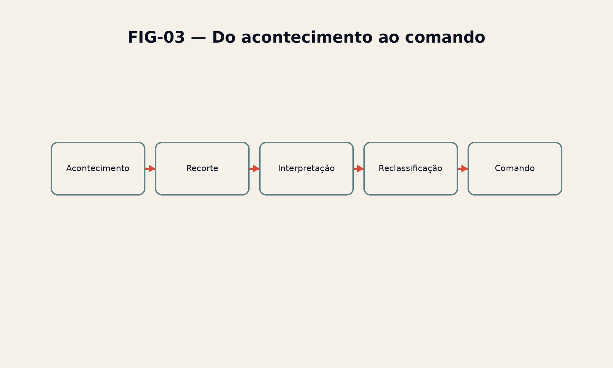

As camadas acrescentam elementos umas às outras. Um fato é selecionado; o recorte recebe significado; o significado recebe um nome moral; o nome orienta uma ação. Voltando pelo caminho inverso, é possível perguntar se o comando realmente decorre do que ocorreu.

## Quando mudar o nome muda o dever

> **A narrativa mais poderosa não apaga o fato. Muda seu nome até que a contradição pareça fidelidade.**

Omissão pode ser chamada de neutralidade; medo, de prudência; controle, de cuidado; perda da voz, de unidade. Esses pares não são equivalências universais. O teste é concreto: **o nome descreve a conduta ou a protege de exame?**

Sem essa cautela, a ferramenta vira máquina de suspeita. Ler narrativas exige voltar ao fato, recuperar o omitido e comparar consequências.

> **IDENTIFIQUE A NARRATIVA.**
>
> Complete: “Esta história diz que aconteceu \_\_\_ porque \_\_\_; nela, eu sou \_\_\_ e devo \_\_\_”.

> **SEPARE FATO DE INTERPRETAÇÃO.**
>
> De um lado, coloque o que poderia ser registrado. Do outro, motivos, causas e significados atribuídos.

As cinco camadas revelam o caminho do acontecimento ao comando. O próximo capítulo abrirá a arquitetura inteira.

# CAPÍTULO 5 — LEIA A NARRATIVA ANTES QUE ELA LEIA VOCÊ

Há momentos em que uma explicação incomoda antes que saibamos dizer por quê. As frases parecem corretas. A pessoa que fala parece segura. Há testemunhos, uma comunidade acolhedora e palavras que descrevem dores reais. Mesmo assim, alguma coisa não se encaixa.

Nessa hora, dois erros são comuns.

O primeiro é abandonar a percepção porque ainda não temos vocabulário: “Se não consigo provar, devo estar imaginando”.

O segundo é transformar a sensação em veredito: “Senti algo estranho, portanto tudo é manipulação”.

Nenhum dos dois produz autoria. No primeiro, entregamos o julgamento à segurança alheia. No segundo, entregamos o julgamento ao medo. Precisamos converter o incômodo em perguntas que possam ser examinadas.

## COMANDO DE AUTORIA — DESMONTE A NARRATIVA

Desmontar não é destruir.

Você desmonta uma estrutura para enxergar como as partes se sustentam. Depois do exame, pode conservar o que resiste, corrigir o que foi deformado e abandonar o que depende de omissão, coerção ou contradição.

Não comece perguntando se concorda. Comece perguntando **como a conclusão foi construída**.

### 1. Recupere o acontecimento

O que ocorreu antes que alguém explicasse o que aquilo significava? Descreva ações, palavras, documentos, datas e consequências observáveis. Retire, por alguns minutos, intenções presumidas e nomes morais.

### 2. Abra o recorte

O que entrou na história e o que ficou de fora? Que informação mudaria a leitura? Quem não foi ouvido? Que contexto foi reduzido a detalhe porque complicaria a conclusão?

### 3. Localize a interpretação

Que causa, intenção ou significado foi acrescentado? A interpretação é possível, provável ou demonstrada? Existem explicações alternativas capazes de acomodar os mesmos fatos?

### 4. Encontre o rebatizado

Que conduta recebeu um nome mais bonito, mais cruel ou mais absoluto do que aquilo que produz? O novo nome esclarece a realidade ou a protege de exame?

### 5. Revele o comando

Depois de aceitar a explicação, o que você deve pensar, sentir, fazer, evitar, comprar, abandonar, temer ou provar? Toda narrativa que orienta a vida contém alguma direção, mesmo quando não a formula como ordem.

### 6. Identifique a autoridade

Quem possui o direito de interpretar? De onde vem essa autoridade? Até onde vai sua competência? Que interesses, vínculos ou recompensas a atravessam? O que acontece quando sua leitura é questionada?

### 7. Encontre o valor operante

Qual valor é proclamado e qual vence quando existe custo? A linguagem diz liberdade, amor, verdade ou cuidado; a prática protege qual interesse concreto?

### 8. Procure a condição de revisão

O que faria essa explicação admitir erro, limite ou aplicação inadequada? Quando apoio, dúvida, sucesso e fracasso confirmam a mesma tese, a narrativa deixou de correr risco diante da realidade.

### 9. Calcule o custo da dúvida

O que você pode perder ao perguntar ou revisar: vínculo, reputação, renda, identidade, proteção, comunidade, salvação simbólica ou a explicação que dava sentido ao sofrimento?

### 10. Observe a consequência

O que essa narrativa produz em decisões, relações, liberdade de exame e responsabilidade? Quem é protegido? Quem paga? A ação realizada preserva ou destrói o valor usado para justificá-la?

> **Desmontar uma narrativa é abrir sua arquitetura para decidir conscientemente o que conservar, corrigir ou abandonar.**

Este é o comando nuclear da alfabetização narrativa deste livro. As cinco camadas do capítulo anterior revelam o caminho do acontecimento ao comando. Quando a explicação for mais complexa, a **Matriz NARRATIVA** aprofunda a desmontagem: audita sua tese, sua fonte, seus recortes, seus afetos, sua relação com a correção, seus valores e o preço que cobra da autoria.

A Matriz NARRATIVA é um modelo autoral composto por nove movimentos. Não é teste psicométrico, diagnóstico, escala clínica ou prova automática de manipulação. Não mede pessoas nem concede licença para rotular grupos. Sua função é produzir perguntas verificáveis.

Vamos aplicá-la a um estudo de caso composto. Ele reúne padrões observáveis em promessas contemporâneas de autoconhecimento, produtividade e pertencimento, mas não corresponde a uma pessoa, empresa ou programa específico.

Uma mulher a quem chamaremos de Elisa atravessa uma mudança profissional. Sente-se atrasada, insegura e incapaz de explicar o que quer. Encontra na internet um programa que promete revelar sua “identidade essencial” em vinte e um dias. A divulgação acerta em dores que ela nunca soube nomear: cansaço de agradar, medo de escolher e sensação de viver a vida dos outros.

No início, as aulas oferecem exercícios úteis. Elisa escreve sobre limites, reconhece decisões tomadas por aprovação e encontra pessoas com experiências semelhantes. O alívio é real. Depois, porém, a linguagem começa a fechar o campo: quem não obtém resultado “ainda está apegado ao personagem”; familiares que questionam o método “temem a versão desperta” da participante; críticas públicas são apresentadas como evidência de que o programa ameaça o sistema; e a renovação paga é descrita como prova de compromisso consigo.

Nada nessa cena permite concluir automaticamente que existe fraude ou controle. Pode haver conteúdo legítimo, resultados distintos e profissionais sinceros. A matriz não começa pelo veredito. Começa pela leitura.

## N — Núcleo

O núcleo é a tese sem a qual o restante perde força. Inclui a promessa central e, muitas vezes, a ameaça que torna a promessa urgente.

No caso de Elisa, a tese não é apenas “autoconhecimento pode ajudar”. É algo mais abrangente: “Você possui uma identidade essencial bloqueada por condicionamentos; nosso método consegue revelá-la; resistir ao método demonstra a força do bloqueio”.

A promessa é recuperar o verdadeiro eu. A ameaça é continuar vivendo uma identidade falsa. Se Elisa aceita esse núcleo inteiro, cada dificuldade posterior pode ser interpretada como nova prova de que precisa do programa.

Pergunte:

**O que preciso aceitar para que o restante pareça lógico?**

Tente escrever a resposta sem os slogans da fonte. Uma frase clara costuma mostrar o tamanho real da afirmação. “Este curso oferece exercícios de reflexão” é uma tese limitada. “Somente este processo atravessa as defesas que impedem você de ser quem nasceu para ser” reivindica outra autoridade e exige outra evidência.

## A — Autoridade

Autoridade não é um problema em si. Dependemos do conhecimento de outras pessoas. Ninguém verifica sozinho cada procedimento médico, cada cálculo de engenharia ou cada documento histórico. A vida coletiva exige confiança.

Por isso, o teste não é “essa voz tem autoridade?”. É: **de onde vem essa autoridade, para qual assunto ela é válida, quais interesses a atravessam e como pode ser examinada?**

Formação, experiência, método, transparência, responsabilidade profissional e disposição para corrigir erros fortalecem confiança. Carisma, número de seguidores, riqueza, sofrimento superado e depoimentos emocionantes podem ser relevantes para uma história pessoal, mas não substituem competência nem demonstram que uma promessa funciona para todos.

No programa, a liderança apresenta a própria transformação como principal credencial. Os relatos de participantes selecionados reforçam legitimidade. O interesse financeiro na renovação é pouco mencionado. Nada disso prova má-fé; apenas impede que admiração seja confundida com verificação.

Pergunte:

**Por que esta voz merece confiança, até onde vai sua competência e o que acontece quando alguém examina suas afirmações?**

## R — Recorte

Todo relato escolhe. O problema não é existir seleção; é a seleção decisiva desaparecer como se fosse o mundo inteiro.

O programa mostra participantes que mudaram de carreira, encerraram relações e relatam grande clareza. Não apresenta com a mesma visibilidade quem não percebeu mudança, quem abandonou sem conflito, quem melhorou por outros fatores ou quem teve efeitos indesejados. Depoimentos não são inúteis: revelam experiência. Mas uma coleção escolhida não informa, sozinha, frequência, causa ou generalização.

O recorte também atua sobre a história de Elisa. Quando ela conta que a irmã questionou o preço, o grupo destaca a falta de apoio. Ficam de fora anos de cuidado, o contexto financeiro e a possibilidade de a pergunta expressar preocupação legítima.

Pergunte:

**O que entrou, o que precisou ficar fora e qual informação ausente poderia mudar a conclusão?**

Localizar o omitido não significa inventar uma versão oposta. Significa procurar contexto antes de conceder totalidade ao recorte.

## R — Reclassificação

Reclassificar é alterar o nome moral de um acontecimento. O método pode chamar dúvida de “resistência”, discordância de “apego ao personagem”, dependência de “compromisso” e afastamento de vínculos de “elevação de frequência”. Em outro ambiente, o movimento pode ser inverso: prudência é chamada de covardia, cuidado é chamado de controle, crueldade é chamada de sinceridade.

Novos nomes às vezes libertam. Dar nome a uma violência antes naturalizada pode tornar o dano visível. Reconhecer um direito pode corrigir uma classificação injusta. Portanto, a pergunta não é se houve mudança de vocabulário, mas se o novo termo esclarece fatos ou os torna inalcançáveis.

No caso de Elisa, “resistência” pode nomear um fenômeno humano real: evitamos verdades desconfortáveis. Mas, se toda objeção recebe esse nome, a palavra deixa de explicar e passa a proteger o método.

Pergunte:

**Que contradição ganhou um nome mais aceitável — e o que deixo de enxergar quando aceito esse nome?**

## A — Afeto e atores

Narrativas não apresentam apenas ideias. Elas distribuem lugares e ensinam sentimentos.

Quem é o herói? Quem é a vítima? Quem salva? Quem ameaça? Quem trai? O que você deve temer perder? De que deve sentir vergonha? Que orgulho recebe ao pertencer?

Elisa é convidada a ocupar o papel de alguém “em despertar”. A liderança é apresentada como guia que atravessou o caminho. Os participantes comprometidos formam uma comunidade de coragem. Pessoas que questionam podem ser reunidas na categoria dos “adormecidos”. O medo de continuar falsa combina-se ao orgulho de fazer parte dos que enxergam.

O afeto não invalida o conteúdo. Uma história comovente pode ser verdadeira. Uma comunidade pode oferecer pertencimento saudável. O teste é observar se a emoção amplia a capacidade de conhecer ou se passa a decidir de antemão o que pode ser conhecido.

Pergunte:

**O que devo sentir e quem preciso me tornar para pertencer?**

Quando o único modo de continuar sendo “corajoso”, “consciente”, “leal” ou “bom” é concordar com a fonte, um papel moral começou a governar a investigação.

## T — Testabilidade

Uma explicação séria precisa correr algum risco diante da realidade. Isso não significa que toda convicção humana possa ser reduzida a um experimento simples. Questões morais, existenciais e religiosas não funcionam como teste de laboratório. Ainda assim, afirmações sobre resultados, causas e condutas podem apresentar critérios de correção.

Se um programa promete um efeito mensurável, o que contaria como fracasso? Se atribui toda melhora ao método, como distingue o efeito do tempo, de outras ajudas ou da expectativa? Se diz interpretar a identidade de alguém, que evidência permitiria reconhecer um erro?

No estudo de Friesen, Campbell e Kay (2015), elementos não testáveis puderam oferecer vantagens psicológicas a crenças valorizadas, inclusive proteção diante de evidências ameaçadoras. O resultado não autoriza chamar toda crença não testável de falsa; mostra por que uma explicação que não admite condição de erro pode ser atraente e difícil de revisar.

Pergunte:

**O que demonstraria que esta explicação está errada, limitada ou mal aplicada?**

Se a resposta for “nada”, talvez você não esteja diante de uma explicação que interpreta a realidade, mas de uma estrutura que a absorve.

## I — Imunização

Imunização é a preparação de uma narrativa contra qualquer crítica possível. A objeção deixa de ser informação e vira sintoma do objetor.

“Se você discorda, é porque ainda não entendeu.”

“Se saiu, prova que nunca esteve comprometido.”

“Se a família pergunta, é porque se sente ameaçada.”

“Se pesquisadores não confirmam, é porque o sistema os comprou.”

Em todas essas respostas, o conteúdo da crítica não precisa ser avaliado. A origem atribuída ao crítico basta para descartá-la.

Seria imprudente ignorar que interesses, preconceitos e conflitos existem. Fontes podem atacar uma ideia por razões ruins. Mas explicar *por que alguém critica* não responde *se a crítica procede*. A origem de uma objeção e sua validade são perguntas diferentes.

Aqui apenas reconhecemos o mecanismo. O fechamento completo de uma redoma — com perseguição, punição de saída e ruptura sistemática de vínculos — será examinado adiante, no capítulo próprio.

Pergunte:

**Como toda objeção pode ser transformada em nova prova a favor da narrativa?**

## V — Valores

Toda narrativa invoca valores. Liberdade, amor, verdade, família, justiça, pureza, segurança, autenticidade, progresso e lealdade dão peso moral à ação proposta.

A pergunta decisiva não é apenas “qual valor foi pronunciado?”, mas “qual valor vence quando há custo?”.

O programa afirma valorizar autonomia. Quando Elisa deseja pausar para avaliar as finanças, porém, a continuidade do vínculo é usada para pressioná-la. Nesse momento, talvez o valor operante não seja autonomia, mas permanência, receita, reputação ou confirmação do método.

Também é possível que participantes pressionem uns aos outros sem orientação explícita da liderança. Valores operam na cultura de um grupo por normas, recompensas e medos compartilhados.

Pergunte:

**Qual valor é declarado, qual vence na prática e quem arca com a consequência dessa hierarquia?**

No próximo capítulo, aprofundaremos essa diferença. Por enquanto, perceba que a linguagem moral não prova a realização do valor que nomeia.

## A — Ação e autoria

Uma narrativa mostra sua força no tipo de conduta que passa a exigir.

O que você deve fazer, comprar, abandonar, esconder, repetir ou provar? Quem se beneficia? Qual é o custo de discordar? É possível permanecer com perguntas? É possível sair sem perder dignidade, amizade, renda, reputação ou toda referência de si?

No caso de Elisa, o comando deixa de ser apenas “reflita sobre sua vida”. Torna-se “renove para provar compromisso, interprete dúvidas como resistência e reduza contato com quem ameaça sua transformação”. O preço já não é somente financeiro. Inclui entregar ao método o poder de dizer o que cada objeção significa.

Pergunte:

**O que devo fazer e quanto de consciência preciso entregar para continuar pertencendo?**

Uma ferramenta de autoconhecimento deveria aumentar a capacidade de Elisa formular critérios, pedir evidências, reconhecer limites e escolher. Se precisa tornar-se indispensável para continuar funcionando, talvez tenha começado a substituir a capacidade que prometeu fortalecer.

## A matriz inteira em movimento

Ao reunir os nove movimentos, a leitura fica mais precisa:

O **núcleo** promete revelar a identidade verdadeira e ameaça Elisa com a permanência no falso eu.

A **autoridade** se apoia na transformação pessoal da liderança, em carisma e testemunhos, sem deixar claros todos os limites e interesses.

O **recorte** privilegia resultados positivos e interpreta a preocupação familiar fora de seu contexto.

A **reclassificação** chama dúvida de resistência e renovação de compromisso.

O **afeto e os atores** oferecem orgulho de despertar, medo de regressão, guias, despertos e adormecidos.

A **testabilidade** é fraca quando sucesso confirma o método e fracasso confirma o bloqueio.

A **imunização** transforma crítica em prova do poder da transformação.

Os **valores** declarados são autonomia e verdade; a permanência pode tornar-se o valor operante.

A **ação e autoria** exigem renovação, lealdade interpretativa e custo crescente de saída.

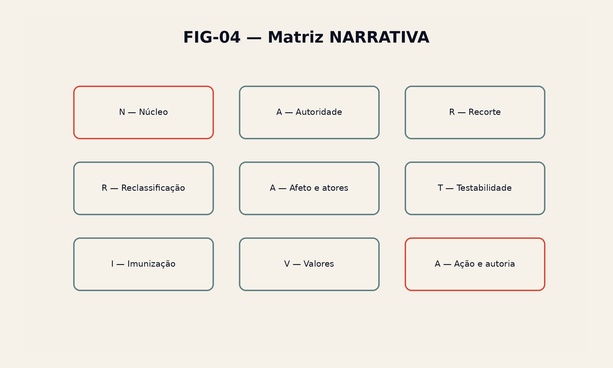

Esse conjunto justifica uma investigação. Ainda não autoriza uma sentença sobre cada pessoa envolvida. A matriz não substitui documentos, contexto, escuta, comparação e consequência observável.

> **LOCALIZE O OMITIDO.**
>
> Procure a informação que a narrativa teria mais dificuldade de acomodar: um resultado negativo, uma causa alternativa, o contexto anterior, o benefício da fonte ou a melhor versão da objeção.
>
> Não preencha o vazio com imaginação. Transforme-o em pergunta.

> **DESCUBRA O REBATIZADO.**
>
> Escolha uma palavra moralmente carregada — “amor”, “liberdade”, “lealdade”, “cura”, “neutralidade”, “coragem”.
>
> Descreva a conduta sem essa palavra. Depois pergunte: o nome esclarece o que ocorreu ou impede que eu o avalie?

## Um contracaso: a narrativa que não teme a saída

Compare o programa de Elisa com um grupo de orientação profissional que também conta histórias fortes. Participantes narram mudanças, reconhecem medos e encontram pertencimento. A coordenação apresenta um método, mas delimita sua finalidade: ajudar a organizar possibilidades, não revelar uma essência oculta.

Os responsáveis informam formação, custos, conflitos de interesse e limites. Resultados diferentes são registrados. Uma pessoa pode dizer “isto não me ajudou” sem ser transformada em exemplo de resistência. Dúvidas são respondidas pelo conteúdo, não pela desqualificação de quem pergunta. A saída não exige romper vínculos nem provar coragem. O grupo incentiva consulta a outras fontes e reconhece quando uma questão requer cuidado clínico, jurídico ou financeiro especializado.

Essa também é uma narrativa. Ela possui valores, personagens, memória e direção. Sua força não está em fingir neutralidade absoluta, mas em conservar porosidade: pode ser questionada, corrigida, complementada e deixada.

Narrativas saudáveis não são histórias sem convicção. São histórias cuja convicção não depende da destruição de toda alternativa.

## Quando não houver tempo para escrever tudo

Use o mesmo comando em versão oral: **o que aconteceu, o que foi selecionado, que significado e nome moral foram acrescentados, que ação passou a ser exigida, quem interpreta, qual valor venceu, o que corrigiria a tese, quanto custa duvidar e o que ela produz?**

Uma resposta preocupante não fecha o caso. Um padrão repetido merece investigação.

## Uma ferramenta não concorre com a outra

Você não recebeu vários métodos para escolher qual parece mais inteligente. Recebeu aproximações diferentes da mesma situação.

As **cinco camadas** mostram como um acontecimento recebe recorte, interpretação, novo nome moral e comando. **Desmonte a Narrativa** transforma essa passagem em roteiro de aplicação. A **Matriz NARRATIVA** aprofunda o exame quando a explicação envolve autoridade, pertencimento, emoção, imunização, valores e custo de saída. Os **cinco testes** do capítulo 7 verificarão se a justificativa permanece coerente quando encontra a vida. O **Eixo de Autoria** ajudará a formular um critério que não dependa do lado. O **Filtro da Sensatez** fará uma última verificação antes da ação.

Mais adiante, a **Auditoria Metacognitiva** perguntará quem está pensando, e os **Startes de Autoria** condensarão o percurso para momentos em que não há tempo de abrir a análise inteira.

Na prática, a ordem é simples: pare; separe fato de interpretação; identifique a narrativa; localize o omitido; descubra o rebatizado; identifique o valor operante; teste lógica e simetria; localize os polos; encontre o eixo; assuma a sua parte; posicione-se.

Você não precisa executar tudo diante de cada conversa. Use a menor ferramenta capaz de devolver exame. Aprofunde quando a decisão tiver alto custo, quando a narrativa absorver toda objeção ou quando sua identidade depender da conclusão.

# CAPÍTULO 6 — CRENÇAS E VALORES

Duas pessoas recebem a mesma notícia: a empresa em que trabalham será reorganizada.

Uma pensa: “Mudança é oportunidade; preciso me apresentar para a nova função”. A outra: “Mudança é o aviso que antecede o descarte; devo ficar invisível até a ameaça passar”. Nenhuma reagiu apenas ao comunicado. Cada uma encontrou a notícia com crenças sobre si, autoridade, risco, merecimento e futuro.

Se perguntarmos por que agiram de modos opostos, talvez ambas respondam: “Foi a decisão mais sensata”. E podem estar sendo sinceras. A sensatez, porém, já foi construída sobre aquilo que cada uma considera verdadeiro e importante.

**Crença responde: o que considero verdadeiro?**

**Valor responde: o que considero importante, bom ou sagrado?**

**Hierarquia de valores responde: qual princípio vence quando dois entram em conflito?**

Essas três perguntas explicam parte do caminho entre informação e conduta. Não explicam tudo. Uma pessoa pode saber o que valoriza e não conseguir agir por medo, coerção, trauma, dependência econômica ou risco real. Ainda assim, sem localizar crenças e hierarquias, muitas decisões parecem surgir do nada.

## O mundo que uma crença prepara

Algumas crenças são proposições verificáveis: “A reunião começa às nove”. Outras são modelos amplos que orientam percepção: “Autoridade protege”, “autoridade humilha”, “discordar rompe amor”, “o mundo recompensa esforço”, “ninguém é confiável”.

Ao longo da vida, formamos crenças sobre diferentes territórios.

Sobre **si mesmo**: sou capaz, sou difícil, sou descartável, preciso agradar, tenho direito de perguntar, não sobrevivo sozinho.

Sobre **o outro**: pessoas ajudam, pessoas exploram, quem me ama concorda, quem discorda deseja meu mal, ninguém faz algo sem interesse.

Sobre **Deus e o sagrado**: o divino acolhe pergunta, exige submissão, está presente na compaixão, fala exclusivamente por uma autoridade, julga intenção, julga regra.

Sobre **o mundo**: é lugar de cooperação possível, campo de batalha permanente, ordem moral, acaso, ameaça, oportunidade ou prova.

Sobre **autoridade**: merece confiança por posição, precisa prestar contas, sabe mais do que eu, pode ser corrigida, não deve ser contrariada.

Sobre **perigo**: está em todo desacordo, somente em dano observável, na exclusão, no fracasso, na mudança, na perda de controle.

Sobre **merecimento e pertencimento**: preciso provar valor; recebo dignidade por existir; pertenço enquanto obedeço; posso discordar e continuar amado.

Essas crenças não ficam guardadas numa sala abstrata da mente. Elas definem quais narrativas parecem plausíveis. Quem aprendeu que conflito significa abandono ouvirá uma discordância como ameaça de ruptura. Quem aprendeu que pergunta é cuidado poderá ouvir a mesma frase como tentativa de aperfeiçoar uma decisão.

Isso não torna a realidade relativa. Uma interpretação pode ser mais bem sustentada pelos fatos do que outra. Significa apenas que ninguém chega aos fatos sem história.

## Valores não vivem sozinhos

Valores são princípios amplos que orientam escolhas e transcendem uma situação específica. Na teoria de Schwartz, eles se organizam por motivações que podem ser compatíveis ou entrar em conflito; buscar segurança, autodireção, tradição, benevolência ou realização produz tensões reais, não defeitos automáticos de caráter (Schwartz, 2012).

Você pode valorizar liberdade e cuidado. Num momento, a liberdade exige dizer não; em outro, o cuidado exige permanecer. Pode valorizar verdade e privacidade. Pode defender lealdade e justiça, até descobrir que proteger uma pessoa exige contrariar o grupo.

O conflito não prova que um dos valores seja falso. Ele revela a necessidade de hierarquia, contexto e responsabilidade.

É aqui que proponho uma distinção central para esta obra.

**Valor declarado** é o princípio que uma pessoa afirma defender.

**Valor operante** é o princípio que efetivamente vence quando existe custo.

Uma organização declara transparência, mas pune quem informa um erro. A preservação da imagem tornou-se valor operante.

Uma família declara amor, mas exige silêncio de quem sofreu para evitar constrangimento. A aparência de união pode ter vencido o cuidado.

Uma pessoa declara autonomia, mas abandona todo critério próprio para conservar aprovação. O pertencimento pode estar operando acima da liberdade.

“Valor operante” não significa essência secreta nem caráter verdadeiro revelado por um episódio isolado. Condutas podem resultar de pânico, coerção, falta de recursos, hábito, informação incompleta ou risco. Para inferir uma hierarquia, precisamos observar repetição, alternativas disponíveis, consciência, poder e consequência.

É injusto dizer a alguém submetido a ameaça: “Se você não saiu, então não valoriza liberdade”. A ausência de ação pode revelar falta de segurança, não falta de valor. O conceito serve para examinar sistemas de decisão, não para culpar quem teve sua escolha reduzida.

Também é possível que um valor permaneça importante e, ainda assim, perca numa decisão. Uma mãe pode valorizar presença e trabalhar longas horas porque a sobrevivência material não oferece alternativa. Um profissional pode valorizar honestidade e adiar uma denúncia enquanto procura proteção contra retaliação. A conduta isolada não autoriza uma leitura moral total. O valor operante aparece melhor quando observamos aquilo que recebe prioridade repetida **entre opções realmente disponíveis**.

Essa precisão protege o leitor de uma armadilha: usar a ferramenta para transformar toda dificuldade alheia em confissão involuntária. Ler valores exige olhar para a liberdade concreta, não apenas para a frase pronunciada.

## Convicção examinada e convicção protegida

Uma convicção examinada pode ser profunda. Ela não precisa mudar a cada crítica. Sustenta razões, escuta evidência, distingue a crença de sua aplicação e reconhece o que não sabe. A pergunta pode fortalecê-la, limitá-la ou corrigi-la sem destruir a dignidade de quem crê.

Uma convicção protegida já classificou a dúvida como falha moral. Antes de ouvir a questão, sabe que ela nasceu de fraqueza, orgulho, impureza, ignorância ou deslealdade. Por isso, não precisa respondê-la.

A diferença não está entre fé e ciência, conservador e progressista, tradição e mudança. Todas essas esferas podem abrigar convicções examinadas ou protegidas. A diferença está na relação entre crença, evidência, identidade e correção.

Nós dependemos do testemunho de outras pessoas e desenvolvemos formas de avaliar a competência e a confiabilidade de quem comunica. Esse trabalho de vigilância epistêmica não elimina confiança; tenta torná-la calibrada (Sperber et al., 2010). Quando uma comunidade transforma toda verificação em traição, ela não pede apenas que o membro aceite uma conclusão. Pede que entregue o instrumento pelo qual poderia avaliá-la.

## Da crença à consequência

O caminho pode ser representado assim:

> **Crenças → hierarquia de valores → interpretação narrativa → atitude → intenção → decisão → ação → consequência → reforço ou revisão.**

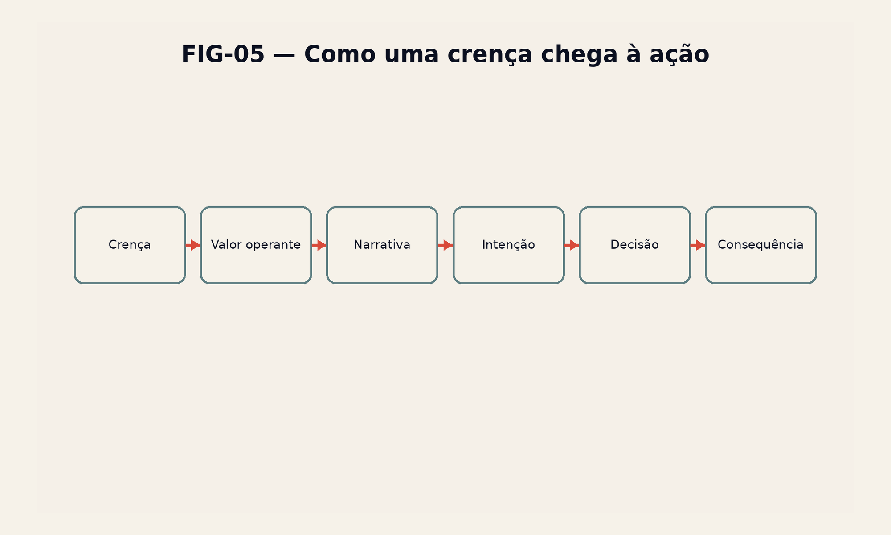

Imagine alguém que acredita: “Conflitos destroem famílias”. Essa crença encontra uma hierarquia na qual reputação e permanência estão acima de verdade e reparação. Quando ocorre uma agressão verbal, a narrativa interpreta o silêncio como proteção. A atitude em relação a denunciar o episódio é negativa. A intenção passa a ser “evitar escândalo”. A decisão é pedir à pessoa ferida que não fale. A ação preserva aparência imediata. A consequência pode ser repetição do dano e perda de confiança. Depois, o grupo pode revisar a crença — ou usar a própria ruptura produzida pelo silêncio como prova de que “falar destrói famílias”.

O encadeamento ajuda a localizar passagens; não descreve uma máquina. Na teoria do comportamento planejado, atitudes, normas percebidas e percepção de controle contribuem para intenções, enquanto intenção e controle não garantem sozinhos que a ação ocorrerá (Ajzen, 1991). Emoção, medo, coerção, trauma, recursos, vínculos, poder, contexto e alternativas reais interferem em cada etapa.

As **normas percebidas** respondem: “O que pessoas importantes esperam que eu faça?”. Mesmo sem ordem direta, a expectativa de aprovação ou rejeição pesa.

O **controle percebido** responde: “Tenho meios para agir?”. Alguém pode desejar denunciar uma injustiça, mas depender financeiramente de quem a cometeu. Pode querer sair de uma relação, mas não dispor de moradia, proteção ou rede. Pode querer discordar de um grupo e temer perder todos os vínculos ao mesmo tempo.

Autoria não é imaginar que contexto não existe. É enxergar com precisão onde a escolha está disponível, onde foi reduzida e que apoios são necessários para ampliá-la.

## Estudo de caso composto: a paz que exigia silêncio

O caso a seguir é composto e não representa uma família específica.

Numa casa, a palavra mais repetida é “paz”. Todos dizem valorizar família, amor e lealdade. Quando um dos membros ridiculariza outro diante de visitas, porém, a pessoa atingida é orientada a não responder: “Não estrague o encontro”. Depois, em particular, escuta que precisa ser mais compreensiva porque o agressor “é assim mesmo”.

O valor declarado é paz.

O acontecimento é humilhação pública.

A narrativa diz que o conflito começou quando a pessoa ferida reagiu, não quando foi atacada.

A reclassificação chama silêncio de maturidade e nomeia a tentativa de reparação como drama.

Quando surge custo — reconhecer o dano, contrariar alguém influente e suportar desconforto —, outro valor vence: preservação da aparência, controle do ambiente ou proteção da reputação.

Isso não significa que todo silêncio seja cumplicidade. Alguém pode calar para sobreviver, escolher o momento seguro ou evitar escalada. Também não significa que toda família deva expor conflitos diante de terceiros. A pergunta é se existe, depois, espaço real para reconhecer, reparar e impedir repetição.

Se a única “paz” disponível exige que a mesma pessoa sempre absorva o dano, não há paz compartilhada. Há distribuição desigual do custo.

> **IDENTIFIQUE O VALOR OPERANTE.**
>
> Escolha uma decisão em que dois valores entraram em conflito. Escreva o valor declarado e depois observe: quando apareceu custo, qual princípio recebeu proteção concreta?
>
> Antes de concluir, verifique liberdade real, risco, poder, repetição e alternativas. O objetivo não é condenar uma pessoa; é localizar quem governou a decisão.

## Contracaso: quando a hierarquia é revista

Na mesma situação, imagine outra resposta. Depois do encontro, uma das pessoas mais respeitadas da família procura quem foi ferido, ouve sem exigir silêncio e reconhece: “Chamamos de paz uma conduta que preservava nosso conforto”.

Ela conversa com quem humilhou, estabelece limite para novos episódios e admite aos demais que o grupo errou. Algumas pessoas ficam contrariadas. A imagem de harmonia sofre. O problema não desaparece numa conversa.

Ainda assim, a hierarquia mudou. A reputação deixou de vencer automaticamente. Dignidade, verdade e reparação passaram a orientar a ação. A família assumiu o custo da coerência.

Revisar uma hierarquia de valores não é escolher sempre a palavra mais bonita. É decidir que consequência estamos dispostos a suportar para não transferir o preço ao mais vulnerável.

No livro *Reposicione-se™*, crenças, valores e mapas herdados serão trabalhados como parte de um processo mais amplo de reposicionamento. Aqui, a função é específica: revelar quem está governando a decisão antes que você chame a decisão de sua.

Agora já podemos compreender por que alguém proclama um valor e pratica outro sem necessariamente planejar uma mentira. Falta testar a justificativa. A narrativa chama de paz, pureza, lealdade ou neutralidade aquilo que fez. Mas o nome continua coerente quando encontra a consequência?

É hora de aplicar a lógica da situação.

# CAPÍTULO 7 — A LÓGICA DA SITUAÇÃO

Lógica, neste livro, não significa frieza. Não é uma forma elegante de humilhar quem se contradiz. Também não é um certificado de superioridade concedido a quem fala com segurança.

Pessoas inteligentes racionalizam. Pessoas sinceras sustentam contradições. Pessoas amorosas podem reproduzir regras cruéis convencidas de que protegem alguém. E qualquer um de nós consegue exigir do adversário uma coerência que nunca aplicou ao próprio grupo.

Neste livro, **lógica da situação é o exame pelo qual uma explicação é confrontada com os fatos disponíveis, as premissas que utiliza, os valores que declara, os critérios que aplica, as diferenças reais de contexto e as consequências que produz.**

Ela não serve apenas para política, religião ou movimentos. Serve para dinheiro, casamento, família, trabalho, amizades, autoridade, consumo, promessas, conflitos, identidade e escolhas cotidianas. Sempre que uma justificativa muda conforme muda a pessoa beneficiada, o grupo envolvido ou o preço a pagar, a lógica da situação ajuda a tornar visível o critério em funcionamento.

Por isso, ela não começa com “como provo que o outro está errado?”. Começa com: **a explicação que recebi permanece coerente quando encontra o acontecimento, os valores que invoca e as consequências que produz?**

Uma contradição pode existir sem mentira consciente. Nem toda tensão, porém, é contradição. Dois valores legítimos podem colidir. Uma regra pode admitir exceção justificável. Um paradoxo aparente pode desaparecer quando recuperamos o contexto.

Nomear com precisão é parte da autoria.

## Antes de acusar, distinga

Há **contradição real** quando duas afirmações ou condutas não podem permanecer verdadeiras sob o mesmo sentido e as mesmas condições. Alguém afirma que “toda pessoa pode perguntar”, mas pune toda pergunta dirigida à liderança.

Há **aparente contradição** quando o contexto relevante mudou. Uma médica defende confidencialidade, mas comunica uma informação porque existe obrigação legal e risco delimitado. As condutas diferem; o princípio pode continuar coerente.

Há **tensão legítima entre valores** quando dois bens não podem ser realizados integralmente ao mesmo tempo. Proteger privacidade e alertar sobre perigo podem exigir uma decisão difícil. Não existe solução sem custo.

Uma **exceção justificada** apresenta razão pertinente, proporcional e aplicável a casos semelhantes. Uma **exceção conveniente** surge para proteger nosso lado do critério que usamos contra o outro.

**Racionalização** é a construção de uma justificativa aceitável depois que desejo, medo, hábito ou interesse já empurrou a decisão. A pessoa pode acreditar na razão que oferece.

**Incoerência performativa** ocorre quando o próprio ato contradiz o conteúdo proclamado — por exemplo, exigir que ninguém imponha regras enquanto se impõe essa proibição como regra absoluta.

**Hipocrisia consciente** envolve sustentar publicamente um princípio que se sabe violar para preservar vantagem ou imagem.

Chamo de **hipocrisia prática** a incoerência sustentada na conduta mesmo quando a pessoa não admite ou não percebe plenamente o mecanismo. A expressão não tenta adivinhar caráter. Nomeia a distância observável entre valor proclamado, critério aplicado e prática repetida.

Essas distinções impedem duas injustiças: aliviar toda incoerência com a frase “é complexo” e chamar qualquer complexidade de hipocrisia.

## Os cinco testes

### 1. Premissa

A premissa é o ponto de partida que precisa ser aceito para a conclusão parecer necessária.

Pergunte: **aquilo de que parti é verdadeiro, verificável e suficientemente completo?**

“Ela não respondeu porque me despreza” contém um fato — não respondeu — e uma premissa causal ainda não verificada. “Quem discorda deste método teme a verdade” pressupõe conhecer a motivação de todos os críticos. “Se uma regra veio de autoridade, cumpri-la sempre produz bem” transforma posição em garantia.

Testar a premissa não exige certeza absoluta. Exige distinguir o que sabemos, o que inferimos e o que apenas recebemos.

### 2. Coerência interna

Pergunte: **a conclusão contradiz outra crença que também declaro fundamental?**

Uma comunidade afirma que cada pessoa responde moralmente por suas decisões, mas proíbe o membro de examinar uma orientação. Uma família ensina honestidade, mas exige mentira para proteger reputação. Uma liderança proclama liberdade e interpreta toda saída como traição.

Às vezes, a contradição se resolve pela hierarquia: dois princípios entraram em conflito e um foi priorizado por razão defensável. O teste pede que essa prioridade seja reconhecida, não escondida.

### 3. Simetria

Pergunte: **aplico o mesmo critério ao meu grupo e ao grupo adversário?**

Se uma fonte ligada ao outro lado erra, isso prova corrupção do sistema; quando a nossa erra, é um caso isolado? Se o adversário muda de opinião, é oportunista; quando o aliado muda, amadureceu? Se o outro se beneficia de uma política, é interesse; se nós nos beneficiamos, é direito?

Simetria não significa fingir que casos diferentes são iguais. Significa que diferenças de tratamento precisam vir de diferenças relevantes nos fatos, não apenas de pertencimento.

### 4. Consequência

Pergunte: **o efeito concreto preserva ou destrói o valor invocado?**

Uma ação pode ser bem-intencionada e produzir dano. Uma regra pode ter surgido para proteger e, em outro contexto, passar a ferir. Consequência não é o único critério moral — alguns princípios custam caro justamente porque são princípios —, mas ignorá-la permite que qualquer resultado seja chamado de sucesso.

Se a “unidade” depende de silêncio forçado, que tipo de unidade foi preservado? Se a “proteção” aumenta isolamento e medo, o método precisa ser revisto. Se a “verdade” é comunicada por humilhação, talvez a conduta destrua a dignidade que a verdade deveria servir.

### 5. Congruência

Pergunte: **minha conduta pratica o que minha linguagem proclama?**

Congruência não é perfeição. Pessoas falham e podem reconhecer, reparar e mudar. O problema não é existir distância entre ideal e prática. É usar o ideal para impedir que a distância seja nomeada.

Quem diz valorizar pergunta pode demonstrá-lo ao responder uma pergunta difícil. Quem defende responsabilidade assume a consequência do próprio erro. Quem proclama compaixão não precisa abandonar convicções, mas precisa examinar se a forma escolhida ainda reconhece o outro como pessoa.

Os cinco testes trabalham juntos. Uma premissa pode estar correta, mas a aplicação ser assimétrica. Uma regra pode ser internamente coerente e produzir consequências incompatíveis com o valor que a justificava. Uma conduta pode ter bom efeito imediato e ainda violar o princípio declarado.

## Caso cotidiano: o excelente cobrador e o péssimo pagador

Às vezes, uma pessoa cobra compromissos com precisão. Lembra datas, exige retorno, denuncia atrasos e afirma que “palavra dada precisa ser cumprida”. Quando ocupa a posição de credora, responsabilidade parece um princípio absoluto.

Quando chega a sua vez de pagar, porém, o vocabulário muda. O atraso se torna “uma fase difícil”. A ausência de aviso vira “correria”. A cobrança que ela mesma faria passa a ser interpretada como falta de empatia. O compromisso do outro era dever; o próprio compromisso torna-se circunstância.

O problema não está em reconhecer circunstâncias. Uma emergência pode justificar renegociação. Prazos podem ser revistos. Pessoas podem falhar, comunicar, reparar e reorganizar um acordo. A lógica da situação não exige rigidez cega.

A questão é outra: **a circunstância que aceito para mim também teria força se fosse apresentada pelo outro?**

Aqui aparecem cinco operações.

**Assimetria.** O mesmo atraso recebe julgamentos diferentes conforme quem se beneficia da interpretação.

**Valor declarado.** A pessoa afirma defender responsabilidade e cumprimento de acordos.

**Valor operante.** Quando o princípio cobra um preço pessoal, talvez vençam conveniência, preservação da imagem ou proteção do próprio interesse.

**Justificativa seletiva.** O contexto do outro é reduzido a desculpa; o próprio contexto é ampliado até parecer exceção moral.

**Inversão dos papéis.** Ao trocar credor e devedor, descobrimos se havia um critério ou apenas uma narrativa favorável à posição ocupada.

> **A justificativa que uso para mim sobreviveria se saísse da boca do outro?**

Essa pergunta não serve apenas para dívidas. Pode ser aplicada a atrasos, promessas, fidelidade, autoridade, tarefas domésticas, erros profissionais, disciplina de filhos, conflitos entre amigos e julgamentos políticos. Ela não determina que todos os casos sejam iguais. Obriga a nomear qual diferença real de contexto justifica a diferença de tratamento.

O eixo, nesse caso, não está entre “ninguém precisa cumprir nada” e “todo atraso revela mau-caráter”. Está em responsabilidade recíproca com realidade, comunicação, proporcionalidade e reparação: reconhecer o compromisso, informar a impossibilidade, negociar o que for legítimo e assumir o efeito causado.

## Polos e Eixo de Autoria

Quando uma pessoa perde um critério interno, tende a procurar posição pela distância dos outros. Se um lado grita, corre para o oposto. Quando descobre abuso no grupo ao qual pertenceu, conclui que tudo o que o grupo negava deve ser verdadeiro. Troca de polo sem recuperar autoria.

Polos são respostas extremas, absolutizadas ou tratadas como mutuamente excludentes. Entre “toda autoridade deve ser obedecida” e “nenhuma autoridade merece confiança”, por exemplo, ambos os polos dispensam o trabalho de avaliar competência, limite e prestação de contas.

Localizar polos não obriga a dar metade da razão a cada um. O eixo não é neutralidade automática, covardia ou média aritmética. Se um polo é sustentado pelos fatos e o outro exige abuso, o critério pode nos levar para perto do primeiro. O eixo não está geometricamente no meio. Está epistemicamente no lugar que pode ser justificado.

Chamo de **Eixo de Autoria** o critério estável e verificável que impede a pessoa de escolher por submissão a um polo ou por reação automática ao polo oposto.

O Eixo de Autoria avalia as posições por realidade observável, valores conscientemente examinados, coerência, responsabilidade, consequências, simetria, diferenças relevantes de contexto e reconhecimento do outro.

Ele precisa ser distinguido com precisão:

- **eixo não é o meio** entre duas respostas;
- **eixo não é neutralidade** diante do que exige posição;
- **eixo não é dar metade da razão para cada lado**;
- **eixo não produz falsa equivalência** entre quem agride e quem precisa impor limite;
- **o eixo pode levar a uma posição firme**, inclusive muito próxima de um dos polos;
- a diferença está em chegar por **critério**, e não por reflexo, medo de expulsão ou necessidade de oposição.

### Protocolo do Eixo de Autoria

**1. Localize os polos.** Quais respostas absolutas ou reativas estão tentando encerrar a situação?

**2. Recupere fatos e contexto.** Que diferença concreta entre os casos pode justificar tratamentos diferentes?

**3. Identifique o valor operante.** Qual princípio é declarado e qual recebe proteção quando existe custo?

**4. Teste a simetria.** Você aceitaria o mesmo critério se os nomes, grupos, interesses e posições fossem trocados?

**5. Inclua consequências e pessoas.** Quem será protegido, ferido, silenciado, responsabilizado ou obrigado a pagar o custo?

**6. Formule o critério.** Que regra você aceitaria aplicar mesmo quando o resultado contrariasse seu lado?

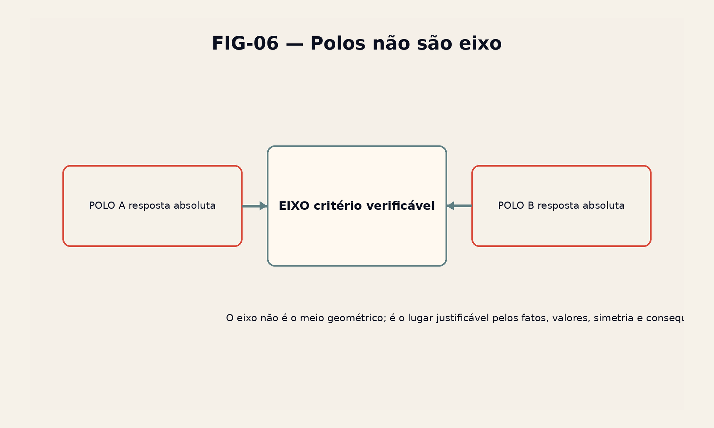

> **Sem eixo, a pessoa não se posiciona: oscila. E quem oscila entre extremos continua sendo governado de fora — apenas muda de lado.**

Encontrar o eixo não produz sempre uma resposta confortável. Pode obrigar você a contrariar seu grupo sem aderir ao grupo rival. Pode preservar parte de uma tradição e rejeitar uma aplicação. Pode reconhecer um direito sem endossar toda justificativa construída ao redor dele.

O eixo permite dizer: “Não escolherei pela identidade de quem falou. Aplicarei o mesmo critério”.

## Estudo de caso composto: a celebração proibida e o funeral permitido

O caso a seguir é composto, inteiramente anonimizado e não corresponde a uma pessoa ou comunidade particular.

Uma pessoa idosa chega a mais um aniversário. Em sua casa, parentes conversam e reconhecem a alegria de tê-la viva. Um representante de uma comunidade de fé chega para uma visita. Durante a conversa, fala sobre a responsabilidade de representar Deus na Terra.

A regra de sua comunidade considera inadequado celebrar aniversários. Por fidelidade a essa orientação, ele não oferece um abraço ligado à data nem diz que se alegra por mais um ano de vida. Se aquela pessoa morresse, contudo, poderia voltar à casa, abraçar a família e chorar no funeral.

A mesma tradição bíblica contém a orientação de alegrar-se com os que se alegram e chorar com os que choram, em Romanos 12:15.

A pergunta não acusa toda fé nem decide sozinha o que alguém deve celebrar:

> **Se o afeto é permitido diante do caixão, por que seria proibido diante da vida?**

Vamos aplicar os testes.

**Premissa.** É necessário distinguir participar de uma celebração contrária à consciência de oferecer reconhecimento humano à pessoa viva. A premissa de que qualquer gesto de alegria pela vida equivale à adesão religiosa à data precisa ser demonstrada, não apenas repetida.

**Coerência interna.** Se representar Deus inclui compaixão e participação no sofrimento, por que a participação na alegria recebe tratamento moral oposto? Pode existir uma interpretação teológica coerente para a diferença. Nesse caso, ela deve ser explicitada e examinada, não protegida apenas pela posição da autoridade.

**Simetria.** O sofrimento autoriza aproximação; a alegria exige distância. Qual diferença moral relevante sustenta a assimetria? A pergunta se torna mais importante quando o consolo no funeral é usado como evidência de amor, enquanto a ausência no aniversário também recebe o nome de amor.

**Consequência.** A regra pode preservar a consciência de quem não celebra. Também pode comunicar à pessoa idosa que uma formulação organizacional importa mais do que o reconhecimento de sua existência. O efeito não encerra a questão, mas precisa entrar na avaliação.

**Congruência.** A linguagem de representação divina e amor ao próximo encontra correspondência na conduta concreta? Congruência não exige abandonar a crença. Pode exigir procurar uma forma de demonstrar cuidado sem violar a consciência.

O contraditório é sério: alguém pode considerar a não celebração uma prática sincera, refletida e livre. Liberdade de consciência protege inclusive escolhas que outras pessoas não compreendem. Não cabe a este livro ordenar participação num rito ou decidir a interpretação religiosa de cada leitor.

A crítica começa em outro ponto: quando uma regra exige que a ausência de um gesto humano seja chamada de amor superior e proíbe examinar se existe outra forma coerente de preservar consciência e compaixão.

> **NOMEIE A CONTRADIÇÃO.**
>
> Não diga apenas “isso é hipócrita”. Escreva: “O princípio declarado é ___; a conduta é ___; a consequência é ___; a incoerência aparece porque ___”.
>
> Se você não consegue preencher sem adivinhar intenção, ainda precisa de contexto.

## Estudo de caso composto: a neutralidade que dependia da política

Este segundo caso também é composto e não identifica denominação, pessoa, partido ou eleição.

Uma comunidade descreve a ordem social como moralmente dominada pelo mal. Participar de uma escolha política é reclassificado como contaminação. O membro que se abstém preserva, segundo a narrativa, pureza, fidelidade ou neutralidade.

Ao mesmo tempo, os integrantes vivem legitimamente sob leis, usam ruas, escolas, serviços de saúde, infraestrutura, proteção institucional e políticas públicas construídas por decisões coletivas. A narrativa modifica o significado de participação: escolher conta como adesão moral ao sistema; receber os efeitos inevitáveis ou benéficos da escolha coletiva deixa de contar como relação com ele.

Minha posição autoral é que pode existir aí uma **hipocrisia prática da separação**: condenar moralmente a esfera comum, recusar responsabilidade por qualquer escolha e, ao mesmo tempo, negar a interdependência da qual a própria vida depende.

A definição precisa é essencial. Direitos e serviços públicos não são prêmio por voto. Ninguém perde dignidade, saúde, educação ou proteção porque se absteve. Usar um serviço público não significa apoiar partido, governo ou candidato. A Constituição brasileira protege liberdade de consciência e crença, define direitos sociais e organiza soberania popular e voto sem transformar cidadania em troca comercial (Brasil, 1988, arts. 5º, 6º e 14). O direito à saúde é declarado universal no artigo 196.

Liberdade religiosa inclui a possibilidade de neutralidade política. A abstenção pode resultar de consciência examinada. Pessoas contribuem para a vida comum por cuidado, trabalho, tributos, voluntariado, convivência, fiscalização e muitas outras formas. Também é possível examinar as opções disponíveis e concluir que nenhuma merece apoio.

A crítica, portanto, não é: “recebeu um direito, logo é hipócrita”. Esse raciocínio seria jurídica e moralmente errado.

A contradição investigada está na condenação total da esfera coletiva, na delegação da consciência e na mudança conveniente daquilo que recebe o nome de participação.

**Premissa.** “Qualquer escolha política constitui amizade moral com todo o sistema.” A premissa trata voto, apoio partidário, responsabilidade cívica e adesão espiritual como se fossem a mesma coisa. Eles podem se relacionar; não são automaticamente equivalentes.

**Coerência interna.** Se toda interação com a ordem comum contamina, por que leis e serviços não contam? Se algumas interações podem ser recebidas sem adesão moral, talvez escolher também possa ser distinguido de idolatrar.

**Simetria.** A ação de votar é atribuída ao “mundo”; os benefícios e proteções são recebidos como neutros. O critério muda conforme a ação cobra responsabilidade ou oferece recurso.

**Consequência.** A omissão não retira a pessoa dos efeitos da decisão. Apenas transfere a outros uma escolha que continuará alcançando sua família, sua liberdade e seus serviços. Em contextos de voto obrigatório, a legislação distingue voto, justificativa e regularidade eleitoral; o ponto deste caso, porém, é ético e narrativo, não acusação jurídica.

**Congruência.** Uma comunidade pode afirmar separação moral e reconhecer honestamente interdependência cívica. A incongruência surge quando precisa fingir que a própria vida não participa daquilo que condena integralmente.

> **O problema não é a pessoa receber um direito. É a narrativa exigir os frutos da vida coletiva enquanto transforma toda responsabilidade de escolha em amizade com o inimigo.**

> **Não participar de uma disputa partidária pode ser uma escolha. Fingir que nenhuma decisão política participa de sua vida é perder a lógica da situação.**

Há um contracaso importante. Uma pessoa pode não aderir a partido ou candidato, reconhecer que depende de decisões coletivas, examinar as opções por conta própria e assumir outras responsabilidades: acompanhar políticas locais, defender direitos, cuidar da comunidade, justificar sua abstenção, votar em branco ou manter neutralidade por convicção. Ela não chama todo cidadão participante de moralmente contaminado nem entrega a outro a definição do que pode examinar.

Essa pessoa não cabe automaticamente na crítica. O eixo não exige voto em candidato. Exige consciência sobre critérios, consequências e interdependência.

## Startes de Autoria — primeira sequência

Você não precisa sair desta parte desconfiando de todas as histórias. Precisa sair capaz de ouvir uma explicação sem desaparecer dentro dela.

Os comandos a seguir são **startes**: movimentos curtos que interrompem o automatismo e devolvem tempo à consciência. Eles não substituem a análise profunda; abrem a porta para ela.

Quando uma afirmação tocar sua dor, **identifique a narrativa**.

Quando a emoção transformar possibilidade em certeza, **separe fato de interpretação**.

Quando a história parecer perfeita, **localize o omitido**.

Quando uma virtude justificar uma conduta que a contradiz, **descubra o rebatizado**.

Quando dois princípios forem proclamados, **identifique o valor operante**.

Quando linguagem e prática se afastarem, **nomeie a contradição**.

Quando lhe oferecerem apenas dois lados, **localize os polos** e **encontre o eixo**.

E antes de exigir coerência do adversário, **teste a lógica** e **teste a simetria** em si.

Esses comandos não entregam uma decisão automática. Produzem espaço para que a decisão volte a ter autor.

Talvez você conclua que uma narrativa recebida é verdadeira e merece compromisso. Talvez reconheça uma contribuição real e rejeite sua pretensão de totalidade. Talvez descubra que uma crença precisa ser revista. Talvez perceba que ainda não dispõe de elementos. “Não sei” pode ser uma posição mais autoral do que uma certeza emprestada.

## Filtro da Sensatez

Depois de abrir a narrativa, testar a lógica e encontrar um eixo, faça uma verificação final:

> **FILTRO DA SENSATEZ**
>
> Antes de agir, pergunte:
>
> - Minha conclusão respeita os fatos?
> - Considerei o contexto?
> - A resposta é proporcional?
> - Estou usando o mesmo critério?
> - Reconheci as consequências?
> - Preservei responsabilidade?
> - O outro continua sendo uma pessoa?

Sensatez não é neutralidade automática. Proporcionalidade não é covardia. Preservar a humanidade do outro não torna verdadeira sua afirmação, não devolve acesso a quem oferece risco e não impede responsabilização.

O filtro serve para descobrir se o eixo sobrevive ao momento de agir. Uma decisão pode parecer coerente por dentro e ainda produzir um método cruel, uma exceção conveniente ou um custo transferido. Pergunte também qual parte pertence ao outro, qual pertence ao contexto e qual já está em suas mãos. Sensatez não dilui responsabilidade; impede que você a distribua conforme a identidade de quem será beneficiado.

## Aplique a ferramenta também a este livro

O treino de observar o pensamento começa quando você consegue perceber não apenas *o que* pensa, mas *como* chegou a pensar assim. A metacognição será formalizada no capítulo 22. Num experimento sobre contrainformação, os dois grupos revisaram crenças; o grupo orientado a uma reflexão metacognitiva apresentou mudança adicional que não alcançou o limiar convencional de significância estatística (O’Leary; Fletcher, 2024). O estudo é promissor, mas não autoriza transformar uma técnica breve em garantia de atualização. Metacognição não nos torna imunes. Torna o caminho mais visível.

Aplique as ferramentas também a estas páginas:

Qual fato Sol selecionou?

Que interpretação acrescentou?

Que valor ela colocou acima de outro?

Qual contraditório recebeu espaço?

O que poderia corrigir sua conclusão?

Que ação este livro pede — e quanto de sua consciência ele permite conservar?

Se o resultado desta parte for apenas concordância comigo, falhamos. O objetivo é que você possa discordar com mais precisão, concordar com mais consciência e suspender julgamento sem entregar seu pensamento a quem fala mais alto.

## Caso do leitor — leia a narrativa da situação

Volte ao acontecimento escolhido. Que narrativa organizou os fatos — o que entrou, o que ficou de fora e que intenção foi atribuída? Que conduta recebeu outro nome para parecer aceitável, condenável ou invisível? Qual valor é declarado — e qual vence quando existe custo?

Agora faça uma pergunta desconfortável: **minha explicação distribui toda a responsabilidade para fora?**

Não use a pergunta para negar o dano nem inventar culpa. Use-a para verificar se a história conservou espaço para contexto, correção e autoria. Ao fim desta parte, você não precisa ter uma decisão. Precisa possuir uma descrição mais honesta do que aconteceu e do significado que recebeu.

Agora você sabe ler a arquitetura de uma narrativa.

Na Parte III, poderemos observar onde ela encontra seus primeiros espelhos: quem nos ensina o que merece atenção, quem oferece personagens para o eu, como uma casa organiza silêncio e pertencimento, como sistemas aprendem nossos desejos e quando um movimento deixa de orientar uma pessoa para começar a usá-la.

Antes de perguntar a que grupo alguém pertence, perguntaremos:

**quem aprendeu a fornecer o mundo dentro do qual essa pessoa se reconhece?**

# PARTE III — OS FORNECEDORES DO EU {#parte-iii}

## Quem colocou o primeiro espelho diante de você?

A Parte II terminou com uma pergunta: **quem aprendeu a fornecer o mundo dentro do qual essa pessoa se reconhece?**

Agora precisamos olhar para os fornecedores.

Você não começou a vida diante de um espelho neutro. Antes de possuir linguagem suficiente para dizer quem era, outras pessoas já reagiam à sua presença. Um rosto se abria ou se fechava. Um comportamento recebia atenção; outro, silêncio. Algumas emoções eram acolhidas; outras pareciam produzir incômodo. Certas perguntas encontravam explicação. Outras descobriam, muito cedo, que perguntar tinha custo.

Depois vieram as telas, as comparações, as comunidades, as causas, os líderes, os personagens e os nomes. Cada fonte podia ampliar sua consciência. Também podia oferecer uma imagem tão coerente, tão repetida ou tão recompensada que você começasse a habitá-la sem perceber quanto havia deixado de examinar.

Esta parte não procura culpados universais. Família não é sinônimo de captura. Tecnologia não é sinônimo de alienação. Movimento não é sinônimo de fanatismo. Nome não é sinônimo de prisão. Nenhuma pessoa se forma sem referências, e nenhuma referência é ética apenas porque produz conforto.

A pergunta será outra:

> **Quando uma referência deixa de ampliar a consciência e passa a exigir a terceirização da autoria?**

A Parte II já entregou o método. Agora ele será aplicado, não reensinado: encontre a narrativa, teste a lógica da situação, observe a simetria, calcule o custo da dúvida, verifique a liberdade de revisão e pergunte quanto contato com a realidade e com outras pessoas continua possível.

Os fornecedores não operam da mesma forma: família oferece mapas precoces; algoritmo devolve padrões de atenção; personagem organiza visibilidade; movimento oferece história e ação; rótulo torna experiências comunicáveis. Cada fonte pode ampliar consciência ou exigir coerência.

Herança não é destino. O que veio de fora não é falso por origem, e o que parece vir de dentro não é verdadeiro por natureza. Autoria exige que aquilo que o constitui possa ser examinado, integrado, recusado ou revisto.

Não desconfie de tudo. Distinga fonte de dono. Uma fonte oferece elementos para pensar. Um dono exige o direito de concluir por você.

A transformação prometida é esta:

> **Você não escolhe o primeiro espelho que recebe. Pode, porém, aprender a reconhecer o que ele mostrou, o que ocultou e quanto de sua vida ainda tem permissão para refletir.**

# CAPÍTULO 8 — OS PRIMEIROS ESPELHOS

## Família, cuidado, autoridade e quem você aprendeu a ser antes de escolher

Antes de existir “eu sou”, existiu alguém dizendo, com palavras ou reações, “você é”.

Nem sempre a frase foi pronunciada. Talvez tenha chegado como suspiro, comparação, risada, impaciência, elogio, proteção, ausência ou medo. A criança observa o que produz proximidade e o que ameaça o vínculo. Aprende pela atenção, pela repetição, pela consequência e também pelo silêncio. Descobre quais emoções cabem na casa, quais comportamentos recebem reconhecimento e quais versões de si parecem tornar a convivência mais segura.

Esse aprendizado não ocorre apenas em uma configuração familiar específica. Crianças podem ser formadas por mães, pais, avós, irmãos, famílias extensas, cuidadores, famílias adotivas, famílias reconstituídas, lares com um ou mais responsáveis e redes comunitárias. O ponto não é definir uma forma legítima de família. É compreender que o primeiro mundo de qualquer pessoa é relacional.

A identidade não nasce pronta dentro da criança e depois apenas se revela. Ela se organiza em interação com pessoas, linguagem, cultura, limites, oportunidades e experiências. Pesquisas sobre desenvolvimento da identidade mostram que exploração e compromisso se transformam ao longo do tempo e são influenciados por relações e contextos, sem que nenhum episódio determine sozinho quem alguém será (Branje et al., 2021). O primeiro espelho é poderoso, mas não é uma sentença.

## Cinco coisas que costumam ser confundidas

Quando um adulto tenta compreender de onde veio sua maneira de existir, pode misturar fenômenos diferentes. Convém separá-los.

**Mapa herdado** é a explicação inicial sobre como o mundo funciona: quem pode ser confiável, o que significa amor, como se conquista reconhecimento, o que acontece quando alguém erra, qual emoção é permitida e o que a família considera perigo.

**Estratégia de adaptação** é o comportamento desenvolvido para sobreviver ou pertencer naquele ambiente: agradar, desaparecer, antecipar necessidades, fazer graça, ser impecável, cuidar dos outros, não pedir, enfrentar tudo sozinho, produzir conflito para receber atenção ou tornar-se “o responsável”.

**Crença sobre si** é a conclusão que a pessoa começa a tirar da repetição: “sou difícil”, “sou fraco”, “sou a única pessoa confiável”, “preciso merecer amor”, “minha presença pesa”, “só tenho valor quando resolvo”.

**Regra ou valor familiar** é aquilo que organiza a convivência: lealdade, estudo, trabalho, fé, reputação, silêncio, independência, obediência, humor, cuidado, desempenho. Uma família pode declarar um valor e operar por outro. Pode dizer que valoriza verdade, mas punir quem nomeia um problema; dizer que valoriza união, mas exigir apagamento para evitar conflito.

**Identidade escolhida mais tarde** é a forma como o adulto revisa, preserva, rejeita ou integra o que recebeu. A herança participa dessa identidade, mas não precisa governá-la sem exame.

Separar essas cinco camadas impede duas injustiças. A primeira é tratar toda influência familiar como manipulação. A segunda é chamar de “personalidade” aquilo que talvez tenha começado como resposta adaptativa a um contexto específico.

Uma criança considerada “madura demais” pode ter recebido reconhecimento porque não dava trabalho. Isso não prova que toda maturidade seja ferida. Indica apenas que elogio e função podem ter se fundido. Um menino chamado de “forte” por não chorar pode crescer valorizando coragem, mas também pode aprender que pedir ajuda ameaça sua identidade. Uma menina elogiada por cuidar de todos pode desenvolver generosidade verdadeira e, ao mesmo tempo, não saber onde termina o amor e começa a obrigação de desaparecer.

O objetivo não é desqualificar as qualidades adquiridas. É devolver escolha ao adulto que as carrega.

> **Uma adaptação pode ter salvado você em uma casa e limitado você em todas as outras.**

## Autoridade que forma e autoridade que substitui

Toda criança precisa de autoridade. Precisa de adultos que protejam, ensinem, contenham impulsos, expliquem consequências e sustentem limites que ela ainda não consegue sustentar sozinha. Confundir autoridade com opressão abandona a criança à própria imaturidade. Confundir autoridade com obediência absoluta abandona a criança ao poder de quem manda.

Autoridade saudável combina presença, previsibilidade, cuidado, limite e reparação. Não exige perfeição dos cuidadores. Exige que o adulto possa reconhecer o próprio erro sem perder toda legitimidade; que a regra possa ser explicada; que o limite não humilhe; que a proteção não impeça toda experiência; que a autonomia cresça conforme a capacidade cresce.

Autonomia, nesse sentido, não é fazer tudo o que se deseja. É desenvolver a possibilidade de endossar ações e valores como próprios, em vez de funcionar apenas por pressão externa. A literatura sobre apoio à autonomia parental mostra que esse processo depende de contexto, recursos e condições emocionais dos cuidadores; não é uma qualidade fixa que algumas famílias possuem e outras não (McCurdy et al., 2020; Distefano & Meuwissen, 2022).

Uma autoridade pode dizer “não” e ainda formar autoria. Pode explicar o perigo, ouvir a frustração, manter a decisão e, depois, permitir que a criança participe de escolhas proporcionais à idade. Outra autoridade pode dizer “sim” a tudo e ainda impedir autoria, porque transforma o adulto em solucionador permanente, evita qualquer consequência e ensina que desconforto significa incapacidade.

O critério não é dureza ou permissividade isoladamente. É o que a relação está ensinando sobre realidade, responsabilidade e voz.

## Fio de caso — Helena e o elogio que ensinou desaparecimento

Antes de ser a adulta que sabia servir, Helena foi a criança que sabia ler a sala.

Ela reconhecia o barulho da chave na porta e tentava adivinhar, pelo modo como o metal girava, se a noite seria leve. Quando as vozes dos adultos ficavam curtas, recolhia os brinquedos sem que pedissem. Se a mãe apertava a testa, Helena levava um copo de água. Se alguém discutia, sentava-se muito quieta, os joelhos unidos, como se ocupar menos espaço pudesse reduzir o conflito.

Ninguém lhe entregou uma regra escrita. O mapa chegou por consequências.

Quando ajudava, recebia ternura. Quando precisava, percebia cansaço. Quando chorava no momento errado, alguém dizia: “Agora não”. Quando se regulava sozinha, escutava: “Essa menina é madura”.

O elogio continha afeto verdadeiro. Também produzia aprendizagem: amor parecia mais seguro quando ela não acrescentava peso.

Anos depois, Helena chamaria isso de personalidade prestativa. Parte era valor; parte era adaptação. O primeiro espelho não lhe disse “desapareça”. Disse algo mais sutil: “Você é especialmente boa quando ninguém precisa parar por sua causa”.

Esse é o tipo de mapa herdado que não deve ser demonizado nem obedecido automaticamente. Ele precisa ser reconhecido. Sem reconhecimento, a estratégia antiga pode vestir o nome de vocação, amor, paciência ou propósito e continuar governando a vida adulta.

## Ausência não é uma palavra única

Quando um adulto reconhece que faltou cuidado em sua história, a palavra “abandono” pode parecer explicar tudo. Às vezes, houve abandono deliberado. Às vezes, houve violência, negligência grave ou recusa persistente de responsabilidade. Esses fatos não precisam ser suavizados.

Em outras histórias, porém, a ausência nasceu de exaustão, pobreza, jornadas extensas, doença, falta de rede, desigualdade na divisão do cuidado, migração, luto, incapacidade emocional, desconhecimento ou sobrevivência. O efeito sobre a criança pode ter sido real mesmo quando a intenção não era ferir.

Distinguir efeito de intenção não serve para inocentar automaticamente o adulto. Serve para impedir que a análise substitua uma história complexa por um vilão único. A pessoa pode dizer: “eu precisei de presença e não a tive” sem afirmar algo que não sabe sobre a intenção de quem faltou.

Essa distinção também protege o leitor de uma armadilha: transformar compreensão estrutural em nova forma de apagamento. Dizer que um cuidador estava sobrecarregado não apaga o que a criança perdeu. Dizer que a criança sofreu não prova que o cuidador desejava fazê-la sofrer.

Autoria adulta começa quando a pessoa consegue sustentar mais de uma verdade sem precisar destruir nenhuma delas.

## A tela que chegou antes do apoio

Famílias exaustas receberam tecnologias capazes de ocupar atenção antes de receberem informação, tempo, políticas de cuidado e alternativas suficientes. Uma tela pode ensinar, aproximar parentes, oferecer lazer, ampliar repertório, permitir comunicação e criar momentos legítimos de descanso. Não há base para tratar todo uso como dano ou toda família que recorre a ele como negligente.

A pergunta relevante é funcional: o que a tela está fazendo naquela relação?

Diretrizes da Organização Mundial da Saúde para crianças pequenas integram comportamento sedentário, atividade física e sono, em vez de tratar a tela como causa isolada de todo problema (WHO, 2019). Revisões sobre mediação parental também indicam que contexto, conteúdo, idade, acompanhamento e estilo de mediação importam; proibição total e ausência total de orientação não são as únicas opções (Collier et al., 2016; Sevilla-Fernández et al., 2025; Giovanelli et al., 2025).

A tela se torna relevante para os primeiros espelhos quando substitui, de modo persistente, experiências pelas quais a criança aprende reciprocidade: esperar resposta, interpretar expressão, reparar conflito, suportar tédio, negociar, movimentar o corpo, dormir, brincar e descobrir que outra pessoa não existe sob comando instantâneo.

Isso não significa que telas provoquem TDAH, TEA, TOD ou qualquer diagnóstico. Esses quadros exigem avaliação clínica e não podem ser reduzidos a uma explicação sociotécnica. Também não significa que retirar a tela “revele a criança verdadeira”. Mudanças ambientais podem modificar comportamento sem provar uma causa única.

O foco deste livro é mais estreito: se grande parte do alívio, do reconhecimento e da organização emocional chega por um dispositivo, quem está ensinando a criança a compreender a si, ao outro e ao desconforto?

## Estudo de caso composto: a paz que cabia na palma da mão

O caso a seguir é composto, inteiramente anonimizado e não corresponde a uma família particular.

Uma cuidadora trabalha em dois turnos, cuida da casa e quase nunca termina o dia sem culpa. A criança pede atenção quando ela ainda precisa preparar comida, responder mensagens e resolver problemas. O vídeo no telefone produz silêncio imediato. O corpo da adulta relaxa. Pela primeira vez em horas, ninguém exige nada.

Com o tempo, o dispositivo aparece em toda transição: para comer, vestir-se, esperar, viajar, acalmar-se e dormir. A criança reage quando a tela é retirada. A reação confirma à cuidadora que a criança “precisa” dela. A culpa aumenta. Para compensar a ausência, a regra cede. A paz momentânea passa a ser interpretada como sinal de cuidado suficiente.

Não há desamor nessa cena. Há exaustão, recurso limitado e um alívio que começou a organizar a relação.

A Matriz NARRATIVA permite ler o caso sem acusação. O núcleo é: “se a criança está calma, está bem”. A autoridade vem da eficácia imediata do dispositivo. O recorte mostra o silêncio e omite o que não está sendo praticado. A reclassificação transforma ausência de conflito em harmonia. O afeto combina alívio e culpa. A ação exigida é repetir a solução.

A contradição não está em usar uma tela. Está em confundir regulação terceirizada com desenvolvimento de regulação.

A cuidadora precisa de apoio, não de humilhação. A criança precisa de presença suficiente, não de perfeição. A mudança pode começar pequena: uma refeição sem tela, uma transição acompanhada, um limite previsível, um pedido de ajuda, uma reparação depois da explosão, um adulto que reconhece “eu usei isso para sobreviver, mas não quero que seja a única forma de ficarmos bem”.

## Contracaso: tecnologia dentro do vínculo

Em outra família, a tela também existe. A criança assiste a conteúdos escolhidos, joga, conversa com parentes e participa de atividades digitais. Os adultos acompanham parte do que ela consome, mantêm horários possíveis, protegem o sono e não tratam toda frustração como emergência. Às vezes cedem. Às vezes erram. Depois conversam e reorganizam a regra.

A tecnologia não ocupa o lugar de toda reciprocidade. Entra em uma relação que já possui voz, limite e reparação. Nesse contexto, o dispositivo pode ampliar experiências sem se tornar o principal intérprete do mundo interno da criança.

O contracaso importa porque impede a conclusão preguiçosa: “tela é captura”. Não é o objeto isolado que define a fuga. É a função que assume e a autoria que preserva ou substitui.

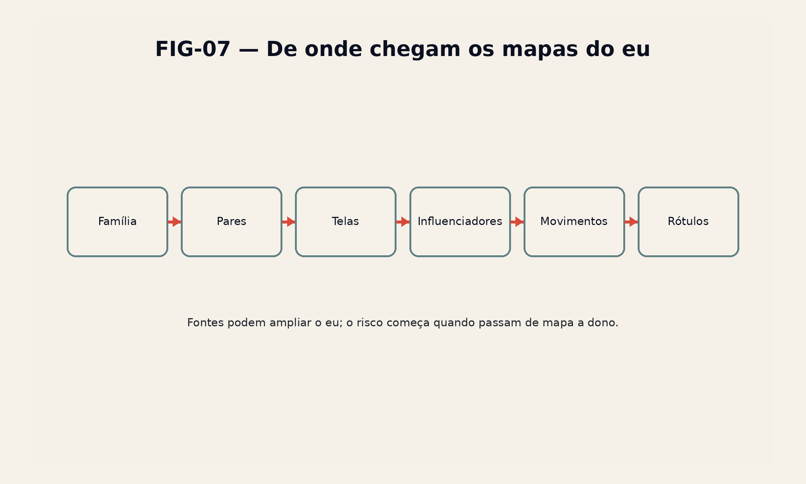

> **IDENTIFIQUE O MAPA HERDADO.**
>
> Escreva três regras que pareciam naturais em sua casa: sobre amor, conflito, autoridade, dinheiro, corpo, fé, sucesso, erro ou afeto.
>
> Depois pergunte: “essa regra descreve a realidade, uma estratégia daquela família ou uma conclusão que eu ainda não examinei?”
>
> **Aplicação:** Que frase sobre você começou como reação de outra pessoa e hoje parece definição?

Se você consegue distinguir mapa herdado, adaptação, efeito, intenção e resposta adulta possível, o primeiro espelho deixou de ser sentença e voltou a ser fonte examinável.

Reconhecer um mapa herdado não exige acusar quem o transmitiu. Muitos adultos entregam aos filhos aquilo que também receberam sem escolha.

Outros tentaram fazer melhor com os recursos que possuíam. Alguns falharam gravemente e precisam ser responsabilizados. Nenhuma dessas possibilidades muda a tarefa atual.

Você não escolheu o primeiro espelho.

Agora pode decidir se ele continuará sendo o único.

# CAPÍTULO 9 — O ALGORITMO NÃO SABE QUEM VOCÊ É

## Ele apenas aprende o que captura a sua atenção

Você pesquisa uma coisa uma vez e ela reaparece durante dias. Assiste a um vídeo por curiosidade e recebe uma sequência inteira sobre o mesmo assunto. Para diante de uma publicação que o irrita e, pouco depois, encontra mais conteúdos capazes de provocar a mesma reação.

A sensação pode ser estranha: “essa plataforma me conhece”.

Não necessariamente.

Um sistema de recomendação não precisa compreender sua história, seus valores, a diferença entre uma dúvida passageira e uma convicção, nem o motivo pelo qual você permaneceu diante de um conteúdo. Precisa estimar, com alguma precisão, o que tem maior probabilidade de produzir uma próxima ação observável.

Algoritmo é uma palavra ampla. Plataformas diferentes usam objetivos, modelos, sinais e sistemas diferentes. Alguns procedimentos selecionam candidatos; outros ordenam conteúdos; outros estimam relevância, segurança, interesse, probabilidade de clique, tempo de exibição, retorno, compartilhamento ou compra. A arquitetura industrial descrita historicamente pelo YouTube, por exemplo, separava geração de candidatos e ranqueamento, usando grandes quantidades de sinais comportamentais para prever o que apresentar (Covington, Adams & Sargin, 2016). Isso não autoriza afirmar que todas as plataformas funcionem hoje da mesma maneira. Autoriza uma distinção fundamental:

> **Predizer uma ação não é conhecer uma pessoa.**

## O que o sistema consegue observar

A plataforma não lê sua alma. Observa rastros.

Tempo de permanência. Retorno. Sequência de consumo. Busca. Curtida. Compartilhamento. Comentário. Seguimento. Abandono. Repetição. Compra. Bloqueio. Pausa. Abertura de notificação. Interação com conteúdos parecidos. Relação entre o que você fez e o que fizeram outras pessoas com padrões parcialmente semelhantes.

Esses sinais podem ser muito informativos. Também são ambíguos.

Você pode assistir a um vídeo porque concorda. Porque discorda. Porque está pesquisando. Porque ficou chocado. Porque alguém próximo vive aquilo. Porque a imagem prendeu sua atenção. Porque doeu. Porque teve medo. Porque desejou. Porque não entendeu.

Para um sistema que aprende com comportamento, essas motivações diferentes podem produzir o mesmo rastro: permanência.

É por isso que um feed pode confundir curiosidade com identidade, indignação com interesse, sofrimento com preferência e investigação com adesão.

A plataforma não precisa declarar “você é isso”. Basta repetir “pessoas que fizeram algo parecido também olharam isto”. A repetição começa a construir uma paisagem. E uma paisagem frequente pode adquirir aparência de mundo inteiro.

## A economia da atenção

Atenção não é apenas um estado psicológico. Em muitos modelos de negócio, é recurso econômico. Quanto mais tempo uma pessoa permanece, mais oportunidades existem para publicidade, coleta de sinais, venda, retenção, influência, assinatura, dados e crescimento de audiência.

Isso não significa que todo conteúdo recomendado faça parte de uma conspiração consciente. Sistemas podem produzir consequências sem intenção humana centralizada. Criadores respondem ao que recebe alcance. Usuários respondem ao que aparece. Plataformas ajustam modelos ao que aumenta determinados indicadores. A dinâmica emerge de muitos interesses, escolhas e mecanismos.

Por isso, a pergunta **quem lucra?** não deve ser usada como acusação automática. Lucro pode significar dinheiro, mas também atenção, reputação, adesão, dados, influência, preservação de grupo, poder de agenda ou crescimento de comunidade. Localizar o beneficiário ajuda a compreender o incentivo; não prova sozinho manipulação.

## O ciclo da recomendação

Um sistema observa atenção. Infere um padrão. Recomenda conteúdo. A recomendação produz nova atenção. O novo comportamento atualiza o padrão.

Essa sequência parece simples, mas muda a pergunta sobre preferência. O dado futuro não é totalmente independente da recomendação anterior. A pessoa escolhe entre opções que alguém ou algum sistema decidiu tornar visíveis. Sua resposta, então, é registrada como evidência de preferência e usada para selecionar a próxima oferta.

Pesquisas sobre ciclos de retroalimentação em sistemas de recomendação mostram que recomendações, consumo e atualização do modelo podem reforçar popularidade, reduzir diversidade agregada ou alterar a representação dos gostos ao longo do tempo, embora os efeitos dependam do sistema, do domínio e do comportamento dos usuários (Mansoury et al., 2020; Adomavicius et al., 2022; Zoralioglu & Yalcin, 2026).

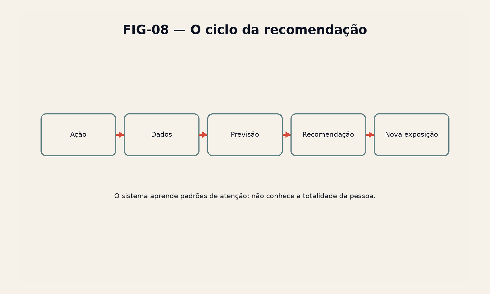

Esse ciclo não elimina agência. Você pode procurar fontes diferentes, interromper sequências, ajustar preferências, não interagir, sair, comparar e voltar deliberadamente a conteúdos longos ou divergentes. Mas existe assimetria: o usuário vê uma seleção; a plataforma possui mais dados, experimenta interfaces, mede respostas em escala e decide grande parte da ordem de exposição.

Autoria digital não exige fingir que essa assimetria não existe. Exige agir sabendo que existe.

## Familiaridade não é verdade

Uma ideia repetida parece mais familiar. E familiaridade pode ser confundida com plausibilidade. Esse fenômeno não nasceu com as redes, mas a distribuição personalizada aumenta a capacidade de repetir conteúdos em sequência e em formatos diferentes.

O ponto precisa ser formulado com cuidado: repetição não controla automaticamente a crença. Pessoas discordam do que veem, resistem, esquecem, procuram contrapontos e mudam de opinião por muitas razões. Ainda assim, o que aparece com frequência se torna mais disponível à memória e mais fácil de recuperar quando precisamos explicar o mundo.

Se durante semanas você recebe vídeos afirmando que relacionamentos são guerra, que toda mulher age de uma forma ou todo homem de outra, talvez não adote imediatamente a tese. Mas começará a reconhecer o vocabulário, os exemplos, os inimigos e as histórias. Quando algo acontecer, aquela explicação já estará pronta.

A repetição fornece material antes que a vida exija interpretação.

## Bolha, câmara de eco e mundo real

“Bolha” tornou-se uma explicação rápida para tudo o que há de errado na internet. A realidade é menos simples.

Pessoas escolhem amigos, fontes e grupos por afinidade. Redes sociais também podem expor usuários a divergência, notícias, arte, ciência e experiências que jamais encontrariam em seu círculo imediato. Um estudo amplamente citado sobre Facebook encontrou que tanto a composição da rede quanto o ranqueamento influenciavam a exposição a notícias ideologicamente divergentes; as escolhas do usuário também tinham papel relevante (Bakshy, Messing & Adamic, 2015). Outros trabalhos encontraram padrões de segregação e formação de câmaras de eco em plataformas diferentes, com intensidade variável conforme o desenho da plataforma e o tipo de conteúdo (Cinelli et al., 2021).

A conclusão responsável não é “o algoritmo prende todos em uma bolha”. É: personalização, seleção social e comportamento do usuário podem estreitar repertórios em determinados contextos; em outros, a recomendação pode ampliar descoberta.

Emoção também não deve ser tratada como veneno automático. Conteúdo que comove, diverte ou indigna pode informar e mobilizar. O risco aparece quando intensidade emocional substitui exame e quando o sistema aprende que sua atenção é mais previsível diante do choque do que diante da complexidade.

## Caso-âncora — Caio e a pesquisa que virou destino

Às 2h17, Caio ainda estava vestido com a camisa do trabalho.

A comida entregue permanecia fechada sobre a mesa. O telefone iluminava a sala escura, apoiado contra uma caneca. Havia três dias que a mulher com quem se relacionava encerrara a relação. Na última conversa, ela dissera que já não conseguia continuar. Caio ouvira razões, mas nenhuma parecia suficiente para organizar a dor.

Ele digitou: “por que fui trocado?”.

O primeiro vídeo prometia explicar padrões de atração em oito minutos. A voz era segura. Havia palavras para o que Caio sentia: perda de valor, humilhação, falta de respeito. O vídeo não eliminou o sofrimento, mas transformou confusão em estrutura. Ele assistiu até o fim.

Quando a reprodução terminou, outro vídeo já estava aberto.

Alguns conteúdos falavam de autoestima, limites e dignidade masculina. Outros descreviam mulheres como calculadoras de status. Outros afirmavam que vulnerabilidade masculina sempre produz desprezo. Nos comentários, desconhecidos escreviam: “Aconteceu exatamente comigo”; “Depois que acordei, nunca mais fui usado”; “Só quem passou entende”.

Caio leu até o polegar perder sensibilidade. Pela primeira vez naquela semana, não se sentiu sozinho.

Ele não procurava uma identidade. Procurava uma explicação.

O sistema registrou permanência, pausas, retornos e novos cliques. Não registrou o motivo pelo qual um homem ferido não conseguia dormir. A recomendação respondeu ao comportamento observável: mais do que o reteve.

Nos dias seguintes, a tese reapareceu em cortes, relatos, piadas e respostas a comentários. Algumas ideias corrigiam ingenuidades reais. Outras transformavam exceções em lei. A dor inicial encontrou uma narrativa total: relações são disputa; afeto é negociação; mulheres testam; homens lúcidos enxergam aquilo que os demais se recusam a aceitar.

Caio começou a reinterpretar relações antigas pela nova lente. Uma amiga que discordava estava “defendendo o próprio interesse”. Um casal cooperativo era “aparência”. Uma mulher que agia com generosidade apenas “investia onde via vantagem”. A exceção deixava de limitar a teoria e passava a confirmá-la de outro modo.

Aplique a Matriz NARRATIVA ao feed.

O **Núcleo** é a promessa de que uma teoria única explicará toda rejeição. A **Autoridade** vem da segurança dos criadores, dos relatos de conversão e de números apresentados sem contexto. O **Recorte** seleciona traições, exploração e humilhação, omitindo relações cooperativas e diferenças individuais. A **Reclassificação** transforma ressentimento em lucidez. O **Afeto** oferece alívio, orgulho e inimigo. A **Testabilidade** enfraquece porque qualquer mulher que discorde pode ser classificada como exemplo da própria manipulação. A **Imunização** chama críticos de ingênuos ou domesticados. O **Valor** declarado é respeito próprio; o valor operante pode tornar-se controle. A **Ação** exigida é consumir mais, suspeitar mais e provar que “acordou”.

O algoritmo não criou sozinho a dor, a narrativa ou a comunidade. Também não decidiu conscientemente capturá-lo. Fez algo mais limitado e ainda assim relevante: tornou mais disponível uma resposta que mantinha Caio olhando. O caso ilustra uma possibilidade funcional; não demonstra que a recomendação, isoladamente, tenha causado sua permanência.

Naquela madrugada, ele fechou o aplicativo apenas quando ouviu o primeiro ônibus da rua. O término continuava doendo. Mas agora a dor tinha personagens, causa, missão e um lugar onde Caio podia voltar para sentir que entendia.

Era apenas exposição. Ainda não era a ocupação completa.

Mas a tela já havia colocado uma resposta ao alcance da mão sempre que o vazio reaparecesse.

## Contracaso: recomendação que amplia repertório

Uma mulher começa a assistir a vídeos sobre jardinagem. Recebe conteúdos de botânica, pequenos produtores, agricultura urbana, conservação de sementes e paisagismo. Descobre autores, faz um curso técnico, entra em uma comunidade e passa a cultivar alimentos.

A recomendação não estreitou sua identidade. Abriu um campo de experiência que encontrou confirmação fora da tela: plantas cresceram ou morreram, técnicas funcionaram ou falharam, pessoas experientes corrigiram seus erros. Ela não precisou defender o sistema de recomendação para preservar o novo interesse. Pode sair da plataforma e continuar aprendendo.

O contracaso mostra o critério: uma recomendação amplia autoria quando oferece possibilidades que podem ser testadas na realidade, integradas a outros vínculos e abandonadas sem destruir o eu.

> **LOCALIZE A REPETIÇÃO.**
>
> Escolha um tema que aparece com frequência no seu feed. Não pergunte primeiro se é verdadeiro ou falso. Pergunte: “quantas vezes encontrei esta ideia, em quantos formatos e por quais caminhos?”
>
> Depois procure deliberadamente uma fonte competente que não dependa do mesmo circuito de referências.

> **PERGUNTE QUEM LUCRA.**
>
> Liste os possíveis beneficiários da sua atenção: plataforma, anunciante, criador, movimento, comunidade, produto, reputação, coleta de dados ou você mesmo.
>
> A existência de benefício não prova fraude. Ela revela o incentivo que precisa ser considerado.

A operação foi aprendida quando você consegue reconstruir o caminho da recomendação — repetição, incentivo, fonte e teste fora da plataforma — sem chamar previsão de atenção de revelação pessoal.

O algoritmo não sabe quem você é.

Ele sabe, em diferentes graus, o que você fez diante do que lhe foi mostrado.

O perigo começa quando essa diferença desaparece e você passa a tratar uma previsão de atenção como revelação de identidade.

# CAPÍTULO 10 — O EU IDEAL

## Quando uma possibilidade vira personagem

Você escolhe uma fotografia entre vinte. Corrige a luz. Retira o ruído do fundo. Escreve uma legenda que organiza o que sentiu. Nada disso é mentira por definição. Toda comunicação seleciona. Toda roupa apresenta alguma coisa. Toda fala deixa algo de fora.

O problema não começa quando você edita uma imagem.

Começa quando a vida passa a ser editada para não contradizer a imagem.

Existe o **eu vivido**: aquilo que você experimenta por dentro, com ambivalência, limite, desejo, vergonha, mudança e intimidade. Existe o **eu ideal**: a pessoa que você gostaria de ser, ou teme precisar ser, para alcançar valor, amor, segurança ou reconhecimento. Existe o **eu exibido**: a parte escolhida, enquadrada e tornada pública. E existe ainda o **eu percebido pela audiência**: a personagem que outras pessoas constroem a partir do que você mostrou, das expectativas delas e do contexto que nunca viram.

Esses quatro eus não coincidem completamente. Não deveriam.

Intimidade exige regiões que não pertencem à plateia. Aspiração exige distância entre quem somos e quem desejamos tornar-nos. Representação exige escolha. A discrepância, portanto, não prova falsidade. O risco aparece quando a diferença precisa ser escondida, quando o personagem deixa de ser um papel e começa a proibir a pessoa que o sustenta.

## Comparar não é apenas invejar

A comparação social faz parte da orientação humana. Observamos outras pessoas para estimar possibilidades, padrões, riscos e posição. Comparações “para cima” podem inspirar, ensinar e ampliar ambição; também podem aumentar insuficiência quando a distância parece intransponível ou quando ignoramos as condições que produziram o resultado. Comparações “para baixo” podem oferecer gratidão ou perspectiva; também podem alimentar superioridade ou impedir aprendizagem.

A teoria da autodiscrepância ajuda a compreender por que a distância entre o eu atual e certas representações ideais pode produzir emoções diferentes. A tensão depende do tipo de padrão, do significado atribuído a ele e da possibilidade percebida de aproximação, não apenas da existência de diferença (Higgins, 1987). Uma meta-análise de estudos experimentais encontrou, em média, efeitos negativos pequenos da exposição a alvos de comparação ascendente nas autoavaliações e emoções, com variação entre desfechos e contextos; isso não significa que toda comparação produza dano em toda pessoa (McComb, Vanman & Tobin, 2023).

Nas redes, porém, a comparação raramente ocorre entre duas vidas completas. Comparamos bastidores extensos com recortes eficientes. Comparamos um corpo em movimento com uma imagem escolhida. Comparamos uma semana comum com o ponto alto de outra pessoa. Comparamos processos longos com resultados apresentados sem o custo, a ajuda, o capital, a equipe, o fracasso ou a repetição que os precederam.

Isso não significa que influenciadores estejam sempre enganando. Produzir conteúdo é trabalho. Enquadrar, editar, selecionar e repetir formatos faz parte da atividade. O erro começa quando a audiência esquece que está diante de uma produção e a usa como medida direta da própria existência.

## Relação parassocial: vínculo percebido, não fraude automática

Quando alguém aparece todos os dias, fala olhando para a câmera, conta episódios íntimos e responde a comentários, o cérebro social recebe sinais de proximidade. O espectador pode sentir que conhece aquela pessoa. Horton e Wohl chamaram de relação parassocial a experiência de intimidade percebida com uma figura pública cuja reciprocidade é limitada ou inexistente (Horton & Wohl, 1956).

Esse vínculo pode informar, acompanhar e inspirar. Uma comunicadora pode ajudar alguém a dar nome a um problema. Um professor pode tornar o conhecimento acessível. Uma artista pode oferecer companhia durante um período difícil. A unilateralidade não torna o vínculo imaginário em seus efeitos emocionais, nem o torna automaticamente nocivo.

A assimetria, porém, precisa permanecer visível. A pessoa pública fala para milhares. Você conhece aquilo que ela decidiu tornar público. Ela pode não conhecer seu nome, sua história, seus riscos ou as consequências de você aplicar uma orientação geral à sua vida particular. Uma revisão contemporânea descreve relações parassociais como fenômenos heterogêneos, capazes de se associar a aprendizagem, pertencimento e bem-estar em alguns contextos, e a comparação negativa ou outros efeitos adversos em outros; o conteúdo, a vulnerabilidade do público e a forma de uso importam (Hoffner & Bond, 2022).

O influenciador é ao mesmo tempo pessoa, trabalho e posição numa economia de visibilidade. Pode acreditar sinceramente no que ensina e também depender de alcance, venda e permanência. Reconhecer o interesse não elimina a contribuição. Impede que afeto seja usado como certificado de competência universal.

## Avatar, skin e experimentação

Num jogo, você pode escolher outro corpo, outra voz, outra espécie, outra força, outra estética. Pode experimentar coragem, liderança, humor, beleza, poder, cooperação ou pertencimento. O avatar não é necessariamente uma fuga do eu. Pode ser ferramenta de brincadeira, aprendizagem, competência, criação e vínculo.

Pesquisas sobre o chamado efeito Proteus encontraram que características atribuídas a avatares podem influenciar temporariamente comportamento e autoapresentação em ambientes virtuais, embora o tamanho, a duração e a generalização dos efeitos variem, e não autorizem afirmar que uma skin reprograma uma identidade (Yee & Bailenson, 2007). Estudos posteriores mostram um quadro mais complexo, dependente de identificação, contexto, desenho da experiência e diferenças individuais.

A pergunta não é “por que alguém deseja ser diferente num ambiente imaginário?”. A imaginação humana sempre criou máscaras, personagens e mundos. A pergunta é: **o que essa possibilidade permite experimentar — e o que começa a proibir quando a pessoa volta?**

Um avatar pode oferecer um laboratório seguro para ensaiar habilidades que depois atravessam a vida. Também pode tornar-se o único lugar em que alguém se sente competente, desejado ou reconhecido. Nesse caso, o problema não é a fantasia. É a perda de pontes entre experiência virtual e agência fora dela.

## A audiência que entra na cabeça

A plateia não precisa estar presente para governar uma ação. Depois de muito tempo publicando, algumas pessoas passam a observar a si mesmas como conteúdo. Antes de viver, imaginam como a cena aparecerá. Antes de sentir, procuram a legenda. Antes de escolher, calculam se a decisão combina com a marca pessoal.

Chamo esse processo de **audiência internalizada**: agir como se um observador estivesse permanentemente avaliando a coerência do personagem.

Isso pode acontecer com qualquer identidade pública. A pessoa engraçada sente culpa por estar triste. A especialista em produtividade não admite cansaço. A mulher “forte” não pede ajuda. O homem “inabalável” não reconhece medo. A defensora da autenticidade precisa transformar toda hesitação em certeza performada. Até a espontaneidade passa a ser planejada para parecer espontânea.

A autenticidade, então, converte-se em desempenho de autenticidade.

Não porque tudo publicado seja falso, mas porque somente emoções que confirmam a narrativa podem ser exibidas. O personagem não mente necessariamente sobre o que existe. Ele impede que o restante exista com legitimidade.

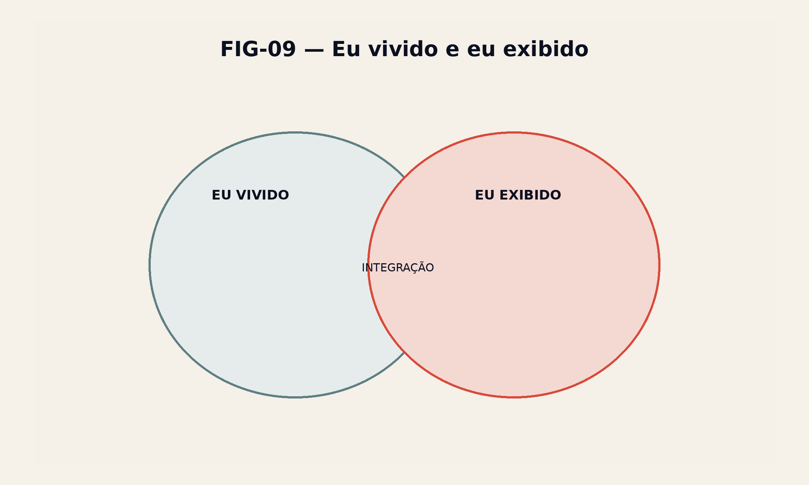

## Caso-âncora — Marina, a mulher que virou sua própria vitrine

A câmera estava ligada quando Marina começou a chorar.

Ela tinha gravado três versões do mesmo vídeo sobre recomeços. Na primeira, pareceu cansada demais. Na segunda, a voz falhou antes da frase principal. Na terceira, o enquadramento estava bonito, a luz atravessava a cortina e a lágrima apareceu exatamente quando ela dizia: “Você não pode abandonar a mulher que está tentando nascer”.

Marina interrompeu a gravação e ficou olhando para a própria imagem congelada.

A frase era verdadeira. Ela havia reconstruído a vida depois de uma ruptura, estudado, criado um negócio e aprendido a falar diante da câmera. Sua presença digital sobre independência, coragem e reinvenção profissional nasceu de experiências reais. Mulheres escreviam: “Você me fez levantar”; “Tomei uma decisão por sua causa”; “Queria ter sua força”.

O trabalho virou renda, comunidade e propósito.

No início, Marina preparava conteúdo a partir da vida. Depois, começou a experimentar a vida perguntando que conteúdo ela poderia render.

Quando desejava descansar, imaginava seguidoras decepcionadas. Quando precisava pedir ajuda, temia perder autoridade. Quando uma decisão não produzia uma boa narrativa de superação, escondia-a até de amigas. Uma manhã ruim precisava terminar em ensinamento. Uma perda precisava tornar-se método. Um silêncio precisava ser explicado antes que o alcance caísse.

No almoço com uma amiga, o telefone ficou entre as duas, apoiado na garrafa de água. Marina pediu que repetissem a entrada no restaurante porque “a primeira ficou espontânea demais”. A amiga sorriu, voltou à porta e entrou novamente. Na terceira tentativa, o sorriso já não chegou aos olhos.

Marina percebeu. Fingiu que não.

Ela não havia inventado uma personagem do nada. Havia transformado uma parte verdadeira em obrigação total.

A Matriz NARRATIVA revela a passagem. O núcleo dizia: “Eu sou a mulher que sempre se levanta”. A autoridade vinha de sua história e do reconhecimento público. O recorte preservava vitórias e escondia dependência, exaustão e ambivalência. A reclassificação chamava descanso de fraqueza e silêncio de irrelevância. O afeto combinava orgulho com medo de desaparecer. A ação exigida era continuar produzindo coerência.

O público não precisava obrigá-la de forma explícita. Parte da vigilância já havia entrado em sua cabeça.

À noite, Marina apagou a terceira gravação. Restaurou-a da lixeira cinco minutos depois. Não sabia se queria publicar ou se precisava publicar para continuar sendo quem todos acreditavam que ela era.

O sinal de captura não era possuir marca pessoal, planejar conteúdo ou influenciar pessoas. Era perder acesso a desejos que não rendiam material e a necessidades que não combinavam com a marca.

A vitrine havia sido construída para mostrar uma vida. Aos poucos, a vida passou a existir para manter a vitrine iluminada.

## Contracaso: papel público com porta de saída

Outra criadora define fronteiras. Explica que ensina a partir de uma área delimitada e não oferece orientação individual sobre temas que não conhece. Mantém vínculos que não dependem de audiência. Possui horários sem publicação, interesses que não monetiza e pessoas diante das quais não precisa representar competência.

Ela também seleciona imagens e planeja conteúdo. Mas consegue dizer “não sei”, mudar de opinião, desaparecer durante alguns dias e reconhecer uma dificuldade sem convertê-la imediatamente em produto. A persona organiza trabalho; não ocupa toda a pessoa.

O contracaso não exige ausência de performance. Toda função social possui performance. Exige permeabilidade: o papel pode terminar, ser corrigido e conviver com uma vida que não precisa provar nada.

> **COMPARE O EU VIVIDO AO EU EXIBIDO.**
>
> Escolha uma identidade que você apresenta ao mundo: profissional, afetiva, espiritual, estética, política ou digital.
>
> Pergunte: **o que existe em mim quando não há plateia, desempenho ou prova?**
>
> O que o personagem me permite experimentar? O que ele começou a proibir? Que necessidade eu teria vergonha de admitir porque ela contradiz a imagem?

A operação foi aprendida quando você consegue nomear o que o personagem permite, o que passou a proibir e onde existe uma vida que não precisa confirmar a própria vitrine.

Representar não é desaparecer.

O desaparecimento começa quando a representação se torna a única versão autorizada de você.

E o personagem individual não é o único fornecedor. Algumas identidades chegam como “nós”: uma causa, uma história coletiva, uma missão e um lugar moral. Elas podem ampliar a linguagem e tornar a ação possível. Também podem começar a exigir que toda a pessoa caiba no papel de membro.

# CAPÍTULO 11 — QUANDO O MOVIMENTO COMEÇA A USAR A PESSOA

## Uma causa pode precisar da sua ação sem precisar do seu desaparecimento

Movimentos sociais mudaram leis, ampliaram direitos, denunciaram violências, preservaram memórias, organizaram solidariedade e tornaram visíveis experiências antes silenciadas. Comunidades religiosas sustentaram pessoas em luto, criaram redes de cuidado, ofereceram disciplina, transcendência e serviço. Grupos políticos construíram participação cívica. Coletivos profissionais, terapêuticos e culturais deram linguagem a problemas reais.

Uma causa não se torna ilegítima porque possui identidade coletiva.

Nenhuma ação comum existiria se cada pessoa precisasse reinventar sozinha todos os conceitos, símbolos, estratégias e valores. O “nós” pode ampliar capacidade. O problema começa quando o “nós” passa a reivindicar monopólio sobre o “eu”.

Participação, engajamento, militância, devoção, identificação, fusão e alto controle não são sinônimos. Uma pessoa pode dedicar anos a uma causa examinada e continuar autora. Outra pode frequentar discretamente um grupo e já não conseguir formular uma pergunta sem consultar o vocabulário permitido.

A intensidade não decide. O mecanismo decide.

> **Uma causa pode precisar da sua ação. O perigo começa quando passa a precisar do seu desaparecimento.**

## Nove sinais de passagem

A passagem de “a pessoa usa o movimento” para “o movimento usa a pessoa” aparece em conjuntos, não num sinal isolado:

1.  **vocabulário exclusivo** que invalida perguntas externas;
2.  **identidade total** que ocupa todas as áreas da vida;
3.  **inimigo indispensável** à coesão;
4.  **testes de pureza** por linguagem, denúncia ou ruptura;
5.  **hierarquia moral interna** de intérpretes autorizados;
6.  **punição da pergunta** por diagnóstico moral;
7.  **missão que substitui vida**;
8.  **assimetria de critérios** entre aliado e adversário;
9.  **custo crescente de saída** em vínculos, reputação, trabalho ou salvação.

Normas, disciplina e compromisso não provam alto controle. O exame recai sobre correção, prestação de contas e possibilidade real de sair.

## O mesmo critério, contextos diferentes

Aplicar o mesmo método não significa declarar que todos os movimentos possuem a mesma história, o mesmo poder, a mesma reivindicação ou o mesmo efeito. A escravidão e a campanha por sua abolição não se tornam moralmente equivalentes porque ambos organizaram grupos. Um movimento por direitos civis e uma comunidade fundada em supremacia não se tornam iguais porque ambos usam símbolos.

Simetria exige critérios consistentes. Não exige cegueira às diferenças relevantes.

Aplique aqui a lógica da situação: não pergunte apenas se dois grupos usam símbolos, possuem líderes ou punem desvios. Pergunte que fatos sustentam a comparação, que poder cada estrutura possui, quais consequências produz, que diferença de contexto é moralmente relevante e se o critério permanece quando o movimento analisado é o seu.

A pergunta é mais precisa: **em cada contexto, a linguagem, o pertencimento e a missão ampliam a capacidade de reconhecer fatos e pessoas — ou começam a exigir identidade total?**

### Feminismos: direitos, correntes e trincheiras

Não existe um único feminismo. Há tradições liberais, socialistas, marxistas, radicais, negras, interseccionais, decoloniais, comunitárias e outras, com divergências profundas sobre sexo, gênero, classe, raça, trabalho, família, violência e Estado. Crenshaw mostrou como experiências de mulheres negras podiam desaparecer quando raça e gênero eram tratados separadamente; bell hooks criticou um feminismo incapaz de alcançar mulheres fora da experiência branca e de classe média (Crenshaw, 1989; hooks, 1984).

Reconhecer essa diversidade impede que “o feminismo” seja transformado em causa única de todas as mudanças familiares ou sociais. Direitos civis, acesso à educação, proteção contra violência, participação política e autonomia econômica não constituem captura por definição.

O mecanismo de trincheira pode aparecer quando uma corrente reivindica representar toda mulher; quando discordância interna é tratada como traição ao próprio sexo; quando a biografia de cada pessoa precisa caber numa explicação única de opressão; ou quando fatos inconvenientes sobre mulheres, homens ou instituições são recusados porque ameaçam a identidade moral do grupo.

Também pode aparecer no antifeminismo quando toda mulher que reivindica autonomia é transformada em inimiga da família, quando mudanças complexas são atribuídas a uma conspiração única ou quando o homem só consegue reconhecer a si mesmo pela oposição a uma caricatura de mulher.

A crítica à identidade total não pertence a um lado.

### Sofrimento masculino, masculinismos e manosfera

Homens enfrentam problemas reais: suicídio, violência, fracasso escolar em certos contextos, solidão, trabalho perigoso, dificuldades de cuidado, expectativas rígidas de força e falta de linguagem emocional. Discutir sofrimento masculino não é misoginia. Questionar uma tese feminista não transforma automaticamente alguém em incel ou adepto da red pill.

A manosfera reúne ecossistemas diferentes — fóruns de direitos dos homens, comunidades de sedução, grupos “red pill”, espaços de celibato involuntário e outras subculturas — que não devem ser comprimidos numa categoria única. A literatura descreve conexões, migrações de linguagem e gradações de misoginia, ressentimento e determinismo entre alguns desses espaços, sem autorizar a acusação de todo homem que procura orientação (Ging, 2019; Ribeiro et al., 2021).

O fornecedor identitário torna-se visível quando a dor recebe uma explicação total: mulheres formam uma classe inimiga; relações obedecem a regras imutáveis de mercado; vulnerabilidade é fraqueza; exceções confirmam a regra; pertencimento exige desprezo; e o homem prova lucidez repetindo o roteiro.

Um movimento pode começar nomeando solidão e terminar exigindo que a pessoa preserve a solidão para continuar confirmando o movimento.

### Política: participação e fusão

Movimentos progressistas, conservadores, nacionalistas e partidários podem organizar valores e ação legítima. Democracias dependem de associação, disputa e mobilização. O problema não é possuir posição política.

O sinal aparece quando o partido se torna medida de caráter total; quando toda notícia é avaliada primeiro pela identidade de quem a divulgou; quando o erro do aliado precisa ser rebatizado; quando vínculos pessoais só sobrevivem sob concordância; quando a vida recebe sentido principalmente pela vitória sobre o inimigo.

A personalização em torno de líderes e a fusão política serão aprofundadas no Capítulo 17. Aqui não precisamos transformar nomes próprios em centro da análise. Basta observar se a causa ainda permite que o membro aplique a ela o critério que exige do adversário.

### Fé, comunidade e alto controle

Fé não é sinônimo de fuga. Doutrina não é sinônimo de coerção. Disciplina religiosa pode ser livre, examinada e significativa. Comunidades de fé oferecem linguagem moral, esperança, ritual, memória, cuidado, serviço e pertencimento. Uma convicção não se torna ilegítima por não ser reduzível a um experimento de laboratório.

O objeto deste livro é o mecanismo de alto controle: quando uma autoridade humana reivindica interpretar toda dúvida; quando Deus, salvação ou pureza são usados para retirar da pessoa a possibilidade de exame; quando a comunidade se torna fonte única; quando a disciplina protege a liderança da prestação de contas; quando sair parece equivaler a perder identidade, vínculos e destino espiritual.

Não é necessário chamar toda religião de seita para reconhecer controle. Tampouco é preciso abandonar a fé para questionar uma organização. Uma comunidade pode sustentar convicções fortes e ainda distinguir doutrina de poder humano, aceitar perguntas, proteger quem denuncia dano e reconhecer que nenhuma liderança possui acesso ilimitado à consciência alheia.

### Gurus, coaches, fandoms e conspirações

Ensino, mentoria e coaching podem oferecer método, responsabilidade e aprendizagem. Fandoms podem produzir amizade, criatividade e prazer. Comunidades alternativas podem preservar conhecimentos negligenciados. O problema não está na existência de admiração ou orientação.

Ele aparece quando o profissional promete interpretar tudo; quando resultado positivo prova o método e resultado negativo prova resistência; quando renovação se torna prova de compromisso; quando o líder ocupa o lugar de consciência; quando fãs precisam defender qualquer conduta para preservar a própria identidade; quando uma teoria conspiratória absorve toda ausência de evidência como evidência de ocultação.

Carisma não prova fraude. Sofrimento superado não prova competência universal. Número de seguidores não prova verdade. E crítica não prova perseguição.

## Fio de caso — Rafael e a promessa de não ser comum

Rafael entrou num encontro de desenvolvimento depois de um ano profissional difícil. Chegou cedo, sentou-se perto da saída e manteve os braços cruzados durante a primeira hora.

O mentor caminhava sem notas. Falava de disciplina, coragem e pessoas que desperdiçavam talento por medo de assumir grandeza. Em determinado momento, parou diante de Rafael e perguntou:

“Você percebe coisas que os outros não percebem, não é?”

Rafael sorriu de lado. Era uma frase ampla. Ainda assim, atingiu um lugar preciso: o medo de ser capaz e continuar irrelevante.

Ao final, recebeu um convite para um grupo menor. Havia gente competente, contatos profissionais e tarefas concretas. Ninguém exigiu entrega total naquela noite. O que chegou primeiro foi reconhecimento.

Na semana seguinte, Rafael concluiu uma decisão que vinha adiando havia meses. O resultado reforçou a autoridade do mentor. Depois vieram novos projetos, amizades e uma linguagem comum para falar de excelência, mediocridade, coragem e resistência.

Os benefícios eram reais. É exatamente por isso que a história importa.

Uma estrutura de alto controle raramente precisa começar com dano evidente. Pode começar oferecendo aquilo que faltava: direção, comunidade, oportunidade e a sensação de que alguém finalmente reconheceu uma capacidade escondida.

Rafael ainda podia discordar. A questão seria observar o que aconteceria quando sua discordância deixasse de ser teórica e começasse a custar pertencimento.

## Estudo de caso composto comparativo: duas causas, mecanismos semelhantes

Os casos a seguir são compostos. As causas, histórias e efeitos não são declarados equivalentes. A comparação alcança apenas os mecanismos de pertencimento.

No primeiro grupo, uma jovem entra num coletivo progressista depois de vivenciar discriminação no trabalho. Encontra linguagem para descrever o que ocorreu, apoio para formalizar uma denúncia e pessoas que a ajudam a recuperar dignidade. Com o tempo, uma corrente interna começa a exigir demonstrações públicas de pureza. Uma pergunta sobre estratégia é tratada como reprodução da opressão. Amizades com pessoas “insuficientemente conscientes” tornam-se suspeitas. O silêncio numa campanha é interpretado como violência.

No segundo grupo, um jovem entra numa comunidade conservadora depois de sentir que seus valores familiares são ridicularizados. Encontra amizade, serviço voluntário e argumentos que o ajudam a sustentar convicções. Com o tempo, uma liderança começa a definir qualquer dúvida como infiltração ideológica. Fontes externas são condenadas em bloco. Relações com pessoas de posições diferentes tornam-se prova de fraqueza. Recusar uma publicação é tratado como covardia diante do inimigo.

As injustiças, teorias e objetivos dos grupos são distintos. O mecanismo observado é semelhante: linguagem que primeiro organiza; pertencimento que depois vigia; inimigo que mantém coesão; teste de pureza; pergunta convertida em falha moral; identidade total.

A Matriz NARRATIVA pode ser aplicada a ambos sem decidir previamente que suas causas possuem o mesmo valor. Localize o núcleo, a autoridade, o recorte, a reclassificação, o afeto, a possibilidade de correção, a imunização, os valores e a ação exigida.

Depois, aplique o teste de simetria: **o comportamento que você condena no movimento adversário recebe outro nome quando aparece no seu?**

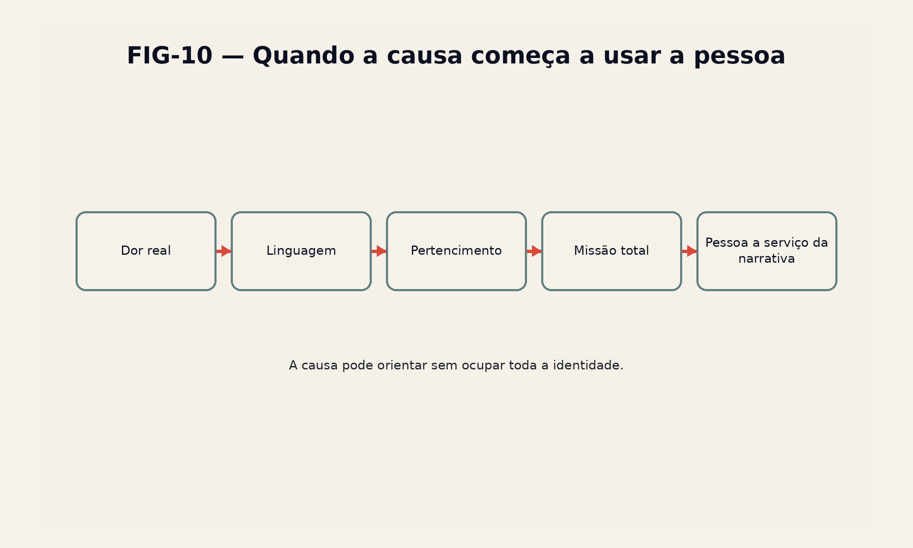

## Contracasos: pertencimento que conserva pessoa

Um movimento saudável não precisa ser indiferente nem fraco. Pode defender tese, organizar ação e criticar injustiça. O que preserva autoria é sua relação com a pergunta e a saída.

Um coletivo registra divergências internas, revisa estratégia, publica correções e permite que alguém reduza participação sem destruir sua reputação. A pessoa pode discordar da liderança e continuar comprometida com a causa.

Uma comunidade de fé ensina convicções, mas distingue mandamento, interpretação e decisão prudencial. Lideranças prestam contas. Denúncias são encaminhadas a autoridades competentes. Quem pergunta não é tratado como inimigo de Deus. Quem sai não precisa ser apagado para que os demais continuem crendo.

Uma militante mantém amizades, família, trabalho, arte e interesses que não servem à campanha. Lê fontes externas, reconhece fatos inconvenientes ao próprio lado e sabe dizer: “a causa importa muito, mas não é tudo o que sou”.

Esses contracasos demonstram que dissenso não destrói necessariamente pertencimento. Pode impedir que pertencimento se transforme em posse.

A operação deste capítulo foi aprendida quando você consegue examinar uma causa sem precisar escolher entre duas simplificações: “todo movimento liberta” ou “todo movimento captura”. O método precisa reconhecer contribuição, poder, contraditório, simetria e custo de saída na mesma análise.

> **IDENTIFIQUE A NARRATIVA.**
>
> Escreva, sem slogans: “Este movimento diz que o problema central é \_\_\_; a autoridade é \_\_\_; o inimigo é \_\_\_; o membro ideal deve \_\_\_; a dúvida será interpretada como \_\_\_”.

> **TESTE A LÓGICA E A SIMETRIA.**
>
> Escolha um comportamento que seu grupo condena. Procure o mesmo comportamento entre aliados. Se o nome mudar, identifique a diferença real que justifica a mudança — ou reconheça a exceção conveniente.

Você não precisa abandonar toda causa para recuperar autoria.

Precisa saber se pode participar sem transformar a causa em resposta para tudo o que é, ama, teme e deve fazer.

O próximo fornecedor é ainda mais íntimo. Não oferece apenas uma missão coletiva. Oferece um nome. E um nome pode ser o primeiro lugar em que alguém finalmente se reconhece.

Também pode tornar-se o molde diante do qual toda experiência precisa prestar contas.

# CAPÍTULO 12 — NOMES QUE ACOLHEM, RÓTULOS QUE APRISIONAM

## Um nome pode abrir a porta sem precisar fechar a casa

Há experiências que permanecem confusas enquanto não encontram linguagem. A pessoa percebe um padrão, uma atração, uma diferença, um sofrimento ou uma forma de pertencimento, mas não consegue comunicá-lo. Quando encontra um nome, algo se organiza.

“Não sou a única.”

“Isso existe.”

“Há outras pessoas que viveram algo parecido.”

O alívio não deve ser ridicularizado. Nomes podem reduzir isolamento, facilitar busca por comunidade e direitos, orientar pesquisa, preservar história e tornar uma experiência comunicável. Categorias ajudam instituições a medir desigualdades e formular políticas. Palavras permitem que pessoas encontrem cuidado e umas às outras.

Rótulo, portanto, não é automaticamente prisão.

E ausência de rótulo não garante liberdade. Alguém pode recusar todos os nomes e continuar inteiramente governado por uma identidade implícita que nunca examinou.

O critério continua sendo autoria.

## Seis funções que não são iguais

Um nome pode atuar como **descrição**: uma palavra que resume parte observável da experiência.

Pode oferecer **pertença**: acesso a pessoas, história, símbolos e apoio.

Pode funcionar como **hipótese de autocompreensão**: uma possibilidade que ajuda a investigar a própria vida sem encerrá-la.

Pode ser **categoria política ou institucional**: instrumento de organização coletiva, pesquisa e reivindicação de direitos.

Pode tornar-se **identidade total**: a chave que pretende explicar toda biografia, todo desejo, todo conflito e todo valor.

E pode produzir **exigência performativa**: a obrigação de demonstrar publicamente que se corresponde ao roteiro associado ao nome.

Essas funções podem coexistir. O problema surge quando uma palavra recebida para descrever começa a decidir o que a experiência tem permissão para ser.

## LGBT, LGBTQIA+ e o sinal de mais

Siglas relacionadas à diversidade sexual e de gênero variaram ao longo do tempo, entre países, instituições e comunidades. Termos como LGBT, LGBTQ, LGBTQIA+ e 2SLGBTQI+ não possuem uma única sequência universal. A ordem e a inclusão de letras respondem a histórias, prioridades e contextos diferentes.

Em usos institucionais atuais, o sinal “+” costuma indicar inclusão aberta de orientações sexuais, identidades e expressões de gênero não enumeradas na sequência principal. Não significa uma autorização oficial para que qualquer afirmação imaginável seja automaticamente incorporada à sigla. Também não transforma fenômenos identitários de outra natureza em extensão de LGBTQIA+ (Government of Canada, 2023; World Health Organization, 2024; American Psychological Association, 2023–2026).

É importante distinguir dimensões que frequentemente são confundidas. **Orientação sexual** refere-se a padrões de atração sexual e/ou afetiva. **Identidade de gênero** refere-se à experiência interna e individual de gênero. **Expressão de gênero** diz respeito à apresentação — roupa, linguagem, gestos, estética ou performance — e não permite concluir automaticamente orientação ou identidade. Essas dimensões podem relacionar-se, mas não são sinônimas.

Reconhecer distinções não obriga ninguém a aceitar sem exame toda teoria construída em torno delas. Também não autoriza reduzir pessoas a caricaturas ou tratar sua existência como argumento abstrato.

### Orientação não é contrato de relacionamento

Orientação sexual descreve possibilidades ou padrões de atração; não prescreve a forma do acordo afetivo. Uma pessoa bissexual pode escolher uma relação monogâmica com um homem, com uma mulher ou com uma pessoa de outro gênero. Pode também escolher, como pessoas de outras orientações, outro modelo consensual. **Bissexualidade não significa infidelidade, simultaneidade obrigatória de parceiros nem destino para um trisal.** Fidelidade, exclusividade e não monogamia pertencem aos acordos, ao compromisso e à conduta — não são deduções automáticas da orientação.

Da mesma forma, drag é expressão artística e performática. Fazer drag não determina, por si só, orientação sexual nem identidade de gênero. Confundir atração, identidade, expressão e contrato relacional produz perguntas erradas antes mesmo de examinar a pessoa concreta.

### Infância: informar, acolher, explorar e prescrever

Crianças e adolescentes precisam de proteção contra humilhação, violência e abuso, além de informação cientificamente correta e adequada à idade. Diretrizes internacionais sobre educação em sexualidade enfatizam progressão por desenvolvimento, segurança, consentimento, relações e tomada responsável de decisões; programas de qualidade não são equivalentes a incentivo indiscriminado à atividade sexual (World Health Organization, 2023; 2026).

Isso não torna toda prática escolar correta apenas porque recebe o nome de inclusão. Conteúdo, idade, método, autoridade, contexto e espaço para perguntas continuam sujeitos a exame. Para evitar os extremos, convém distinguir:

**Informar** é explicar que experiências humanas diferentes existem, com linguagem adequada à idade e sem humilhação.

**Acolher** é proteger a criança ou o adolescente contra violência e permitir que fale sem transformar sofrimento em culpa.

**Explorar** é permitir perguntas, ambivalência e tempo, sem exigir uma conclusão identitária imediata.

**Prescrever** é sugerir que uma dúvida, preferência, roupa, amizade, brincadeira ou desconforto já determina quem a pessoa é e a qual comunidade precisa pertencer.

O eixo não está entre silêncio e indução. Está em oferecer informação, proteção e liberdade de exame sem impor uma identidade tradicional nem empurrar uma identidade alternativa. A criança precisa ter direito a não ser humilhada — e também direito a não saber depressa.

O método deste livro não perguntará se determinada pessoa “é realmente” aquilo que diz ser. Não possuímos acesso total à experiência alheia. Perguntará como o nome funciona: o que descreve, que pertencimento oferece, que realidade reconhece, que perguntas admite e o que passa a exigir.

## Microrrótulos: precisão e vigilância

Microrrótulos podem oferecer precisão. Uma palavra mais específica pode ajudar alguém a distinguir experiência, encontrar interlocutores e deixar de interpretar diferença como falha individual. Em comunidades pequenas, o nome pode funcionar como gesto de reconhecimento.

A precisão, porém, possui uma ambivalência. Quanto mais estreita a categoria, maior pode tornar-se a vigilância sobre coerência. A pessoa observa cada emoção para verificar se continua pertencendo. Uma mudança comum do desejo ou da linguagem parece ameaça à identidade. O grupo pode exigir provas, histórias de origem e performances compatíveis.

Há ainda um risco de expansão conceitual: palavras criadas para nomear formas específicas de dano, sofrimento ou diferença começam a abranger situações cada vez mais leves ou distintas, sem que seus limites sejam novamente examinados. O fenômeno foi descrito na literatura como *concept creep*; reconhecê-lo não torna o conceito original falso, mas exige perguntar quanto território ele passou a ocupar (Haslam, 2016).

Isso não significa que toda nova nomenclatura nasce de busca por atenção. “Novidade como capital social” é uma hipótese contextual: em ambientes nos quais singularidade, ruptura e visibilidade recebem recompensa, apresentações mais específicas do eu podem circular melhor. Mas um mecanismo de plataforma não permite concluir a motivação íntima de cada pessoa.

Algumas pessoas encontram nome porque foram invisibilizadas. Outras experimentam palavras antes de decidir. Outras preferem categorias amplas. Outras recusam rótulos. Autoria inclui o direito de adotar, combinar, suspender, revisar ou abandonar nomes sem humilhar quem os utiliza de modo diferente.

## Apagamento bissexual: quando a inclusão também policia

A bissexualidade oferece um contracaso importante à ideia de que mais categorias sempre produzem reconhecimento automático. Pessoas bissexuais podem ser lidas exclusivamente pela parceria atual: “se está com homem, é heterossexual”; “se está com mulher, é lésbica”. Podem enfrentar suspeita de indecisão, promiscuidade, transição ou falta de compromisso.

Esse apagamento pode ocorrer fora e dentro de comunidades LGBTQIA+. Pesquisas descrevem invalidação, pressão monosexista e estresse de minoria associados a experiências de bissexualidade, com efeitos heterogêneos sobre bem-estar e saúde mental. Esses estudos não autorizam atribuir todo sofrimento ao rótulo nem tratam toda comunidade como hostil; mostram que um sistema criado para reconhecer identidades também pode reproduzir policiamento interno (Brewster & Moradi, 2010; Feinstein et al., 2022; McCole & Anderson, 2025).

A contradição revela o problema da identidade total: quando a categoria exige coerência simples, uma experiência ambivalente ou mutável parece ameaça ao mapa. A pessoa deixa de ser ouvida porque o grupo já decidiu qual nome sua vida deveria confirmar.

O nome que liberta uma pessoa pode ser usado por outra para vigiar.

## Therians e otherkin: fenômenos distintos, pesquisa limitada

Therians e otherkin não devem ser apresentados como uma letra implícita da sigla LGBTQIA+. São comunidades e formas de autoidentificação diferentes, com histórias, vocabulários e interpretações próprias.

Em descrições encontradas na literatura e nas próprias comunidades, pessoas *therian* relatam identificação interna, espiritual, psicológica ou simbólica com um animal não humano; *otherkin* é termo mais amplo usado por algumas pessoas que se identificam, de formas variadas, com seres não humanos, míticos ou ficcionais. Definições não são completamente uniformes.

A pesquisa empírica é pequena. Estudos qualitativos com comunidades therian descrevem construção de identidade, experiências de pertencimento, estigma e uso de espaços on-line, mas amostras restritas não permitem estimar prevalência nem estabelecer consenso clínico (Grivell, Clegg & Roxburgh, 2014; Laycock, 2012; Baldwin & Ripley, 2020).

Também é necessário distinguir autoidentificações comunitárias da expressão clínica **licantropia clínica**, usada em relatos raros de delírio no qual uma pessoa acredita ter se transformado ou estar se transformando fisicamente em animal. A existência dessa literatura não permite classificar therians ou otherkin, em bloco, como psicóticos. Diagnóstico exige avaliação individual, sofrimento, prejuízo, contexto e critérios clínicos; um nome comunitário não substitui avaliação.

Para uma análise responsável, é preciso distinguir identificação simbólica, espiritual ou comunitária de crença literal sobre transformação biológica; observar contato com a realidade compartilhada, sofrimento, prejuízo funcional, autocuidado e possibilidade de revisão. Nenhum desses elementos pode ser inferido de uma fotografia, de uma estética ou do rótulo isolado. Quando existe perda de contato com a realidade, sofrimento intenso ou prejuízo relevante, a resposta adequada é avaliação clínica individual — não ridicularização nem diagnóstico coletivo.

O livro não usará exemplos extravagantes como prova. Estranheza para o observador não mede autoria. Uma identidade tradicional também pode ser totalizante; uma identidade incomum pode permanecer simbólica, revisável e integrada à realidade.

A pergunta permanece: o nome é uma linguagem que a pessoa usa ou uma autoridade que passou a usar a pessoa?

## Quando a pessoa começa a servir ao nome

Um rótulo começou a exigir demais quando produz um ou vários destes movimentos:

um roteiro fixo sobre como sentir, vestir, desejar ou narrar o passado;

prova pública de autenticidade;

um inimigo necessário para sustentar o pertencimento;

recusa de nuance e ambivalência;

punição por mudança;

leitura total da biografia, como se todo episódio anterior sempre tivesse apontado inevitavelmente para aquela conclusão;

necessidade de reinterpretar exceções para preservar a categoria;

impossibilidade de dizer “isso explica parte de mim, não tudo”.

Nenhum sinal isolado decide. Uma pessoa recém-nomeada pode falar intensamente sobre o tema porque finalmente encontrou linguagem. Uma comunidade discriminada pode precisar de coesão para enfrentar dano real. Uma categoria política pode exigir definição para produzir dados e direitos. O contexto importa.

O critério decisivo é se a identidade conserva contato com realidade, possibilidade de revisão e reconhecimento do outro.

## Caso-âncora — Alex e o nome que primeiro acolheu

Alex encontrou o termo numa madrugada comum, sem revelação cinematográfica.

Estava deitado de lado, com o brilho do telefone reduzido para não acordar ninguém. Havia aberto um relato indicado por outra pessoa. Leu uma frase, voltou, leu de novo. Depois abriu os comentários.

“Eu achei que só eu sentia isso.”

Alex não escreveu nada. Apenas segurou o telefone com as duas mãos.

Durante anos, sua experiência afetiva não parecera caber nas expectativas do ambiente em que crescera. Havia lembranças que evitava organizar, perguntas que não conseguia formular e o medo de que qualquer resposta produzisse perda. Encontrar uma palavra trouxe alívio. Pela primeira vez, leu relatos semelhantes, conversou sem vergonha e encontrou pessoas que não tratavam sua diferença como defeito.

O nome serviu.

Ele não fabricou a experiência. Deu linguagem a algo que já pedia compreensão.

Com o tempo, porém, Alex entrou num subgrupo em que a palavra passou a exigir um roteiro. Para ser reconhecido, precisava descrever a infância de determinada forma, adotar vocabulário preciso e demonstrar posição sobre assuntos que nunca havia estudado. Quando mencionava ambivalência, alguém respondia que ainda estava preso a condicionamentos. Quando se relacionava com uma pessoa que não correspondia às expectativas do grupo, sua identidade era interrogada.

Numa conversa por áudio, Alex tentou dizer: “Eu ainda não sei o que isso significa para o resto da minha vida”.

A resposta chegou em segundos:

“Você precisa parar de pedir permissão para existir.”

A frase parecia libertadora. Também encerrava a pergunta que Alex estava tentando fazer.

Depois disso, começou a revisar mensagens antes de enviá-las. Trocava palavras simples pelas palavras corretas do grupo. Apagava dúvidas que poderiam ser interpretadas como regressão. Diante do espelho, não observava mais apenas o que sentia; observava se o sentimento confirmava o nome.

O termo que havia reduzido solidão começou a produzir vigilância.

Aplique as ferramentas da Parte II.

O fato é que o nome organizou experiências e permitiu pertencimento. O recorte posterior transformou certas histórias em modelo universal. A reclassificação chamou ambivalência de negação. O valor declarado era inclusão; o valor operante começou a ser coerência interna do grupo. A ação exigida era provar continuamente pertencimento.

Nada disso invalida a experiência original de Alex. O erro seria concluir: “Se o grupo policiou, então o nome era falso”. O que precisa ser examinado não é apenas a palavra, mas a autoridade concedida à comunidade para decidir sua forma legítima.

Naquela primeira madrugada, o nome abriu uma porta. O problema começou quando outras pessoas passaram a exigir que Alex fechasse todas as demais.

## Contracaso: um nome que continua ferramenta

Outra pessoa adota um rótulo porque ele descreve bem sua experiência atual. Usa-o para comunicar limites e encontrar comunidade. Reconhece que a palavra possui história e implicações coletivas, mas não exige que toda memória seja reorganizada para prová-la.

Quando surge uma exceção, observa em vez de escondê-la. Pode dizer “não sei”, “isso mudou”, “prefiro uma categoria mais ampla” ou “não quero usar nome algum agora”. Seus vínculos não dependem de demonstração pública constante. O grupo não perde estabilidade porque ela revisou a linguagem.

Nesse caso, o rótulo oferece precisão sem reivindicar soberania.

A operação foi aprendida quando você consegue separar a experiência da palavra, distinguir orientação, identidade, expressão e acordo relacional, e perguntar se o nome permanece ferramenta corrigível ou passou a exigir prova permanente de pertencimento.

> **TESTE O RÓTULO.**
>
> Escreva o nome e complete: “Ele descreve \_\_\_; não explica necessariamente \_\_\_; ajuda-me a \_\_\_; começa a limitar-me quando \_\_\_”.
>
> Depois pergunte se a experiência continua observável mesmo quando a palavra é retirada.

> **PERGUNTE O QUE ELE EXPLICA E O QUE PASSA A EXIGIR.**
>
> Se o nome desaparecer, a experiência continua podendo ser observada, narrada e examinada?
>
> Você pode revisar a palavra sem perder dignidade, vínculos e acesso à própria história? Pode reconhecer pessoas com experiências diferentes sem transformá-las em ameaça à sua?

Nomes podem acolher. Rótulos podem aprisionar. Às vezes, a mesma palavra faz as duas coisas em momentos diferentes.

O direito de nomear-se precisa caminhar com o direito de continuar maior do que o nome.

## O que os fornecedores têm em comum — e o que não têm

Família, algoritmo, personagem, movimento e rótulo não são uma causa única. Cada fonte oferece recursos e riscos próprios. O que as reúne é a pergunta: **ela aceita ser corrigida pela experiência, pela realidade e por outras fontes — ou só aceita confirmação?**

Reconhecer mapa herdado não exige acusar a família. Localizar repetição não exige negar toda recomendação. Examinar um personagem não obriga abandonar presença pública. Testar movimento ou rótulo não autoriza ridicularizar quem encontrou neles linguagem e proteção.

Algumas fontes se tornam especialmente atraentes porque distribuem a história inteira de uma vez: oferecem um culpado total, uma inocência total, um salvador, uma explicação sem resto e um pertencimento organizado pela ferida. Isso não torna falsa toda denúncia nem suspeita toda identidade de minoria. O mecanismo precisa ser examinado no caso concreto. O alerta aparece quando a narrativa só consegue conservar o membro se ele permanecer ferido, indignado ou dependente — e quando reconhecer a própria participação, uma exceção ou uma melhora passa a ameaçar o lugar recebido. Uma fonte pode nomear corretamente o dano e ainda extrapolar ao conceder licença para que ninguém do grupo examine os efeitos de suas próprias respostas.

## Caso do leitor — reconheça quem forneceu a interpretação

Retorne à sua situação. Quem lhe ensinou a explicá-la desse modo: uma pessoa, uma família, uma comunidade, uma tela, uma causa, uma autoridade ou uma experiência repetida? O que essa fonte mostrou corretamente — e o que não consegue acomodar?

Que pertencimento a explicação promete — e ela amplia sua capacidade de agir ou precisa que você continue dependente, ferido, indignado ou em guerra para conservar um lugar? Se a interpretação desaparecer, o dano e a experiência ainda poderão ser reconhecidos?

Não transforme a fonte em inimiga automática. Distinga fonte de dona. A pergunta é quanto de sua consciência ela permite conservar.

A Parte III mostrou **de onde** chegam os mapas. A Parte IV mostrará **como** um mapa começa a tomar o lugar do território.

# PARTE IV — A ANATOMIA DA OCUPAÇÃO {#parte-iv}

## Como um mapa começa a tomar o lugar do território

Uma referência pode nos ampliar. Uma palavra pode organizar uma dor que antes parecia apenas confusão. Uma comunidade pode interromper o isolamento. Uma tradição pode transmitir disciplina, memória e sentido. Um movimento pode revelar uma injustiça que o indivíduo, sozinho, não conseguia nomear. Um líder pode condensar uma esperança coletiva. Uma teoria pode oferecer perguntas melhores.

Nada disso é, por si, fuga identitária.

O problema começa quando a referência deixa de servir ao exame e passa a determinar o que pode ser percebido; quando o vocabulário recebido não apenas descreve a experiência, mas decide antecipadamente o que cada fato significa; quando o pertencimento exige que a dúvida seja escondida; quando a pessoa já não consulta a narrativa, mas precisa dela para permanecer reconhecível para si mesma.

Por isso, a pergunta não é: “Quem influenciou você?”. Todos somos influenciados. A pergunta é mais exigente:

> **Como uma referência que parecia útil passa a ocupar progressivamente a percepção, a linguagem, a decisão e o pertencimento?**

A ocupação raramente chega anunciando que ocupará. Ela costuma chegar como alívio. Repete-se até parecer familiar. Reconhece uma ferida. Oferece uma linguagem. Organiza valores e condutas. Protege-se contra o contraditório. Por fim, pode fundir-se à identidade de tal modo que revisar uma crença pareça perder família, missão, dignidade, futuro ou a própria biografia.

A sequência que examinaremos é esta:

**Exposição → Identificação → Adoção → Redoma narrativa → Fusão e dependência.**

Ela desenvolve, no tempo, a Anatomia da Prisão Narrativa apresentada no capítulo 4. Dor e explicação podem abrir reconhecimento; pertencimento e linguagem podem favorecer adoção; punição da dúvida fecha a redoma; custo de saída concentra dependências. A sequência não declara que todo reconhecimento chegará ao fim. Mostra os pontos em que a autoria pode diminuir — e também onde pode ser recuperada.

Dor, solidão e humilhação podem aumentar a receptividade a uma explicação que finalmente oferece ordem e companhia. Isso não torna a pessoa culpada por uma captura. Necessidade não é consentimento informado, e vulnerabilidade não é defeito moral. Quem transmite a narrativa também pode estar sinceramente convencido de que acolhe, protege ou salva. A ocupação se consolida não no instante em que alguém recebe ajuda, mas quando perguntar começa a custar identidade, relação, sustento ou segurança.

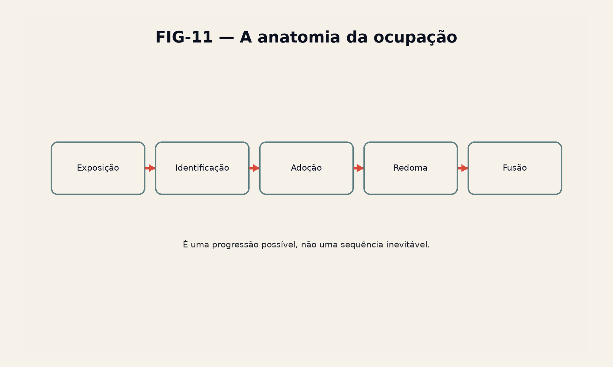

Não é uma escada inevitável. Há interrupções, retornos, recusas, aprendizagens autônomas e comunidades capazes de acolher sem confiscar. A mesma pessoa pode estar exposta sem se identificar, identificar-se sem adotar, adotar uma ideia sem fechar-se numa redoma e sustentar um compromisso profundo sem fundir o próprio valor ao grupo.

# CAPÍTULO 13 — EXPOSIÇÃO

## O que se repete começa a parecer verdade

Você abre uma tela e encontra uma tese. Fecha. Horas depois, encontra outra pessoa dizendo algo parecido. No dia seguinte, a frase reaparece em forma de piada. Depois vem um testemunho, uma notícia recortada, um vídeo com música grave, uma conversa de família, um comentário que parece espontâneo. Cada contato chega vestido de independência. Mas todos podem ter saído da mesma nascente, repetidos por contas que se observam, por grupos que compartilham as mesmas fontes ou por pessoas que aprenderam a reconhecer a realidade através do mesmo vocabulário.

A sensação produzida é simples: “Todo mundo está falando disso”. A conclusão seguinte parece ainda mais simples: “Se aparece tanto, deve estar acontecendo muito. Se tanta gente concorda, deve ser verdade”.

É aqui que a anatomia da ocupação começa: não na obediência, mas na disponibilidade.

Uma ideia disponível vem à mente com rapidez. E aquilo que vem rápido pode ser confundido com aquilo que é sólido. O cérebro não consulta uma biblioteca neutra antes de cada julgamento. Ele trabalha com aquilo que está acessível, com o que foi visto recentemente, com o que carrega emoção, com o que se conecta a uma necessidade e com o que já encontrou caminhos de reconhecimento dentro de nós.

A repetição não instala crenças como quem instala um programa. Ela não elimina a liberdade, não transforma toda pessoa em marionete e não prova que exista um manipulador consciente por trás de cada exposição. O efeito é mais discreto. Uma frase repetida pode tornar-se mais fácil de processar. E facilidade de processamento pode ser sentida como familiaridade. Em determinadas condições, familiaridade pode ser interpretada como plausibilidade.

É por isso que uma alegação pode parecer menos estranha na décima vez, mesmo que nenhuma evidência nova tenha sido apresentada.

O efeito de verdade ilusória descreve justamente esse aumento de crença que pode acompanhar a repetição (Udry e Barber, 2024). A literatura não autoriza dizer que toda repetição convence, nem que conhecimento prévio desaparece. Autoriza uma advertência mais precisa: repetir uma afirmação pode aumentar sua credibilidade percebida, inclusive quando ela é falsa, improvável ou contradiz algo que a pessoa sabia. O tamanho do efeito varia. Atenção, fonte, contexto, conhecimento, motivação e possibilidade de verificar importam. Mas a existência do risco já basta para uma disciplina de autoria: o número de encontros com uma afirmação não é o número de evidências a favor dela.

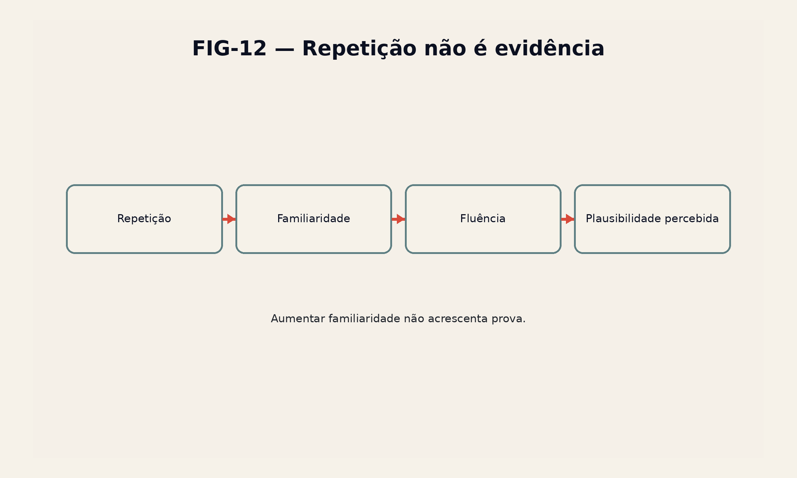

Há também a mera exposição (Montoya et al., 2017). Encontrar repetidamente um rosto, uma música, uma forma ou uma marca pode aumentar agrado ou preferência, sobretudo antes que a saturação ou a aversão apareçam. Isso não significa que gostaremos para sempre do que se repete. Os efeitos podem formar uma curva: o contato inicial reduz estranheza; o excesso pode produzir cansaço. Ainda assim, entre a estranheza e a saturação existe uma zona poderosa em que o familiar recebe uma vantagem que não conquistou por mérito.

Uma ideia política pode beneficiar-se dessa vantagem. Uma estética religiosa também. Um padrão de corpo. Um estilo de masculinidade. Uma interpretação de relacionamento. Um modo de narrar sofrimento. Um inimigo. Um herói. Um diagnóstico popular. Uma explicação total.

A exposição pode ser direta: você procura a tese, lê o livro, entra na aula, acompanha o canal. Pode ser incidental: a afirmação aparece enquanto você buscava outra coisa. Pode ser social: pessoas importantes começam a falar, vestir, rir e se indignar segundo o mesmo mapa. Esta terceira forma é especialmente relevante porque não comunica apenas conteúdo. Comunica custo e recompensa.

Quando todos à mesa riem da mesma piada, você aprende mais do que a piada. Aprende onde está o limite do grupo. Quando uma expressão recebe aplauso e outra recebe silêncio, você aprende o dialeto do pertencimento. Quando uma dúvida é acolhida, aprende-se que pensar é permitido. Quando uma dúvida é punida, aprende-se a selecionar o que pode chegar à boca — e, com o tempo, o que pode chegar à consciência.

A família participa disso antes de qualquer plataforma. A escola participa. O bairro, a igreja, o trabalho, a universidade, o partido, a clínica, a comunidade de fãs. A recomendação digital amplifica e personaliza caminhos, mas não inventou a repetição social. Há casas em que uma versão da realidade é repetida por décadas. Há grupos em que uma frase do líder circula como se fosse uma descoberta independente de cada membro. Há ambientes profissionais em que discordar de uma moda conceitual ameaça reputação. Há comunidades online em que cem perfis parecem cem testemunhas, embora todos citem o mesmo vídeo.

Essa convergência aparente produz uma ilusão de independência. Dez pessoas repetem uma alegação; você conta dez confirmações. Mas, se as dez receberam a alegação da mesma fonte, talvez exista apenas uma origem replicada dez vezes.

### Fio de caso — Caio e a tese que começou a aparecer em todo lugar

Na primeira semana, Caio ainda não dizia que concordava.

Dizia apenas que estava “ouvindo os dois lados”. No ônibus, deixava vídeos rodando com o telefone no colo. No trabalho, abria um corte durante o café. À noite, respondia a uma mensagem e voltava ao feed. A mesma tese chegava por vozes diferentes: um especialista de cenário escuro, um relato gravado dentro do carro, uma piada, um gráfico sem fonte, uma mulher dizendo que “homens precisam acordar”.

Cada aparição parecia independente.

Quando uma colega comentou que relações não podiam ser reduzidas àquela lógica, Caio não discutiu. Apenas sentiu que ela não estava vendo algo evidente. A evidência, porém, ainda não era um conjunto de fatos examinados. Era a familiaridade de uma explicação que já não encontrava silêncio suficiente para parecer estranha.

Num domingo, Caio percebeu que conseguia prever a conclusão antes de o vídeo terminar. Interpretou isso como domínio do assunto.

Também poderia ser repetição.

A exposição ainda não havia decidido sua identidade. Mas começara a modificar o que chegava primeiro à mente quando ele pensava em afeto, rejeição e mulheres. A pergunta deixava de ser “o que aconteceu nesta relação?” e começava a ser “onde está o padrão que me ensinaram a procurar?”.

> **COMANDO DE AUTORIA — LOCALIZE O OMITIDO.**
>
> Antes de contar quantas pessoas repetem uma afirmação, pergunte: quantas fontes realmente independentes existem? O que não aparece porque não circula nesse ambiente? Que evidência faria a tese perder força?

A exposição também altera a frequência percebida. Depois que você aprende uma palavra, parece que ela está em toda parte. Parte desse aumento pode ser real: você entrou num ambiente que a utiliza mais. Parte pode ser atencional: aquilo que ganhou relevância passa a ser detectado. Parte pode ser estratégica: uma plataforma percebeu seu interesse e ampliou conteúdos semelhantes. Parte pode ser social: seus contatos passaram a compartilhar o mesmo assunto. O erro está em escolher uma única causa sem examinar o conjunto.

Uma mulher assiste a três vídeos sobre relações com pessoas “emocionalmente indisponíveis”. A expressão oferece uma chave útil. Ela começa a reconhecer padrões antes invisíveis. Nas semanas seguintes, o termo aparece em quase toda história que consome. O antigo namorado, o pai, a amiga que demora a responder, o chefe pouco expressivo e até ela mesma são recortados por essa categoria. A palavra que inicialmente abriu percepção começa a substituir distinções. Diferenças de contexto, intenção, capacidade, vínculo e responsabilidade perdem lugar.

Não é necessário negar que a indisponibilidade emocional exista para perceber a expansão indevida. A pergunta não é se o conceito é real. É quanto território ele passou a ocupar.

O mesmo ocorre em polos opostos. Um homem encontra conteúdos sobre manipulação feminina. Alguns descrevem exploração concreta e ajudam a reconhecer abusos que homens também podem sofrer. A exposição seguinte, porém, começa a transformar qualquer limite em teste, qualquer ambivalência em estratégia, qualquer recusa em humilhação e qualquer autonomia feminina em disputa de poder. O conceito não precisa ser inteiramente falso para tornar-se total. Basta que deixe de encontrar fronteiras.

A repetição mais eficiente não repete apenas frases. Repete uma arquitetura emocional: indignação, alívio, suspeita, superioridade, urgência. A pessoa pode variar as palavras e ainda assim receber diariamente a mesma instrução: “Você está cercado”; “Só nós percebemos”; “O outro lado mente”; “Sua dor prova nossa teoria”; “Sua dúvida prova que você ainda não entendeu”.

Por isso a exposição seletiva não deve ser atribuída apenas ao algoritmo. Nós também selecionamos. Seguimos quem confirma, evitamos quem nos irrita, permanecemos onde nos sentimos competentes, compartilhamos o que melhora nossa posição diante do grupo. Plataformas podem favorecer permanência e reação, mas pessoas possuem histórias, valores, medos e desejos. A captura narrativa não é um raio tecnológico que atinge um indivíduo neutro. É um encontro entre oferta e necessidade.

Isso exige cuidado moral. Necessidade não é culpa. Quem procura linguagem para uma violência, sentido para um luto ou companhia para uma solidão não merece ser tratado como ingênuo. A vulnerabilidade não desqualifica a inteligência. Ela apenas altera o peso das recompensas. Uma explicação que reduz caos pode receber crédito antes de ser examinada porque, naquele momento, ordem é uma necessidade vital.

A emoção também não é inimiga da verdade. Medo pode sinalizar risco real. Indignação pode responder a injustiça. Esperança pode sustentar ação responsável. O problema surge quando a intensidade da emoção é usada como medida da veracidade da história que a provocou.

Sentir muito não prova que a interpretação esteja correta. Não sentir não prova que esteja errada.

Há repetições necessárias. Uma criança aprende a ler por exposição e prática. Uma equipe de saúde repete protocolos porque procedimentos verificáveis precisam tornar-se disponíveis sob pressão. Uma comunidade preserva memória histórica repetindo nomes que poderiam ser apagados. Uma pessoa em recuperação treina respostas novas porque não basta compreender uma vez. A educação depende de repetição.

O contracaso é decisivo: repetir verdade verificável não é o mesmo que fabricar plausibilidade sem exame.

Qual é a diferença? Na aprendizagem responsável, a repetição pode ser ligada a critérios externos. A conta pode ser refeita. A fonte pode ser consultada. O procedimento pode ser testado. O erro pode ser corrigido sem que a identidade do aprendiz desmorone. A frase não exige confiança porque é familiar; ela convida confirmação porque é verificável.

Em uma comunidade de estudo, por exemplo, um princípio é repetido semanalmente. Mas os participantes são convidados a aplicar, encontrar exceções, consultar fontes, registrar falhas e revisar a formulação. A repetição serve à memória, não substitui o julgamento. O conceito continua subordinado ao território.

A disciplina que proponho não é fugir de toda influência. Isso seria outra fantasia de pureza. É recusar que disponibilidade mental se apresente como evidência.

Pergunte-se: eu considero esta ideia verdadeira porque consigo demonstrá-la ou porque já não consigo imaginar o ambiente sem ouvi-la? Estou diante de fatos independentes ou de ecos coordenados? O assunto é realmente tão frequente quanto parece ou tornou-se um filtro da minha atenção? O que apareceria se eu alterasse deliberadamente minhas fontes?

> **COMANDO DE AUTORIA — PARE.**
>
> Quando uma afirmação parecer “óbvia demais para discutir”, suspenda a resposta. Nomeie onde a encontrou pela primeira vez, quantas origens independentes confirmou e qual condição concreta poderia refutá-la.

A exposição coloca uma ideia perto. A familiaridade reduz estranheza. A disponibilidade facilita lembrança. Nada disso, sozinho, produz ocupação completa.

Para avançar, a narrativa precisa fazer mais do que aparecer. Precisa olhar para você e dizer: “Eu sei quem você é. Eu sei o que fizeram com você. Aqui, finalmente, sua história faz sentido”.

É então que a ideia deixa de ser apenas frequente e começa a tornar-se íntima.

Antes de avançar, fixe a distinção: **exposição torna uma explicação disponível; ainda não significa que ela foi reconhecida como resposta para o eu.** O estágio seguinte começa quando a pessoa deixa de apenas encontrar a narrativa e passa a sentir que foi encontrada por ela.

# CAPÍTULO 14 — IDENTIFICAÇÃO

## Finalmente alguém parece me compreender

Há dores que existem antes de terem nome. A pessoa sente o efeito, mas não possui linguagem para organizar a experiência. Sabe que algo a diminui, mas não consegue explicar. Sabe que repete um padrão, mas cada episódio parece isolado. Sabe que está sozinha, embora esteja cercada. Quando encontra uma narrativa capaz de reunir acontecimentos dispersos, o alívio pode ser profundo.

“Então não era só comigo.”

Essa frase pode salvar uma vida simbólica. Pode interromper vergonha. Pode transformar culpa privada em reconhecimento de uma injustiça. Pode permitir que alguém procure ajuda, imponha limite, reconstrua memória e encontre companhia.

Identificação não é erro. É uma das maneiras pelas quais seres humanos compreendem a si mesmos. Reconhecemo-nos em histórias, personagens, testemunhos, tradições e grupos. Pegamos emprestada uma forma até conseguirmos dizer com palavras próprias. Às vezes, a voz alheia funciona como ponte para a autoria.

O problema começa quando a ponte cobra que você nunca chegue ao outro lado.

Identificar-se é perceber correspondência: “Isso se parece comigo”; “Essa história ilumina a minha”; “Esse conceito descreve algo que vivi”. Fundir-se é outra coisa: “Só consigo existir dentro dessa história”; “Qualquer limite à narrativa é um limite à minha dignidade”; “Se esta explicação falhar, minha experiência inteira perde validade”. Entre uma coisa e outra existe um percurso. O primeiro passo costuma ser o reconhecimento.

A narrativa que identifica bem não oferece apenas fatos. Oferece posição. Diz quem sofreu, quem causou, o que foi ocultado, qual valor foi violado e onde existe pertencimento. Em situações de incerteza, invisibilidade, humilhação ou ressentimento, essa estrutura pode ser mais atraente do que uma explicação tecnicamente cautelosa.

A cautela fala: “Há hipóteses”. O pertencimento fala: “Nós sabemos”.

A cautela pergunta: “Que outras variáveis existem?”. O pertencimento responde: “Você passou a vida sendo invalidado; não permita que façam isso novamente”.

A cautela pode parecer fria quando alguém sangra. O problema é que o calor de uma narrativa não garante sua precisão.

Uma pessoa humilhada procura mais do que informação. Procura reparação de posição. Quer deixar de ser aquela que “não entendeu”, “exagerou”, “fracassou” ou “mereceu”. Uma comunidade que oferece a frase “você não estava louca; havia um padrão” pode devolver realidade. E pode estar certa.

É por isso que seria cruel tratar todo reconhecimento como sedução manipuladora. Narrativas realmente nomeiam injustiças. Mulheres encontraram linguagem coletiva para violências naturalizadas. Trabalhadores reconheceram estruturas de exploração antes tratadas como incapacidade individual. Pessoas negras, indígenas, LGBTQIA+, pessoas com deficiência e outros grupos encontraram história, direitos e comunidade onde antes havia isolamento. Homens também encontraram palavras para abusos que a cultura lhes ensinava a silenciar. A possibilidade de captura não apaga a necessidade do nome.

A questão é o que acontece depois do nome.

Uma narrativa responsável diz: “Isto pode explicar parte do que você viveu; vamos examinar”. Uma narrativa ocupante diz: “Isto explica tudo; qualquer pergunta adicional é cumplicidade com quem feriu você”.

A primeira devolve complexidade. A segunda converte complexidade em ameaça.

### Caso composto — a explicação que acolheu e depois proibiu nuance

Este caso combina elementos recorrentes e não identifica pessoa real.

Depois de anos em relações instáveis, Clara encontrou uma comunidade online que discutia padrões de desvalorização emocional. Pela primeira vez, viu experiências semelhantes às suas descritas com precisão. As mudanças bruscas de afeto, as promessas seguidas de afastamento e a culpa que sempre terminava nela deixaram de parecer episódios desconexos.

A crença inicial era razoável: relações podem organizar-se por padrões; reconhecer um padrão ajuda a interrompê-lo. O valor declarado era dignidade. A narrativa conectava fatos antes dispersos: “Você foi treinada a aceitar migalhas e chamar isso de amor”. A recompensa foi imediata: linguagem, companhia, alívio da culpa e um lugar onde ninguém ria de sua dor.

Nos primeiros meses, Clara começou a impor limites melhores. Depois, a comunidade ampliou a chave. Divergência virou “gaslighting”. Pedido de tempo virou “descarte”. Conflito virou “abuso”. Um parceiro que assumia responsabilidade, mas discordava de uma interpretação, era apresentado como mais perigoso porque “sabia fingir”. Se uma relação melhorava, isso era “fase de reconquista”. Se piorava, confirmava a tese. Se terminava, provava que o outro nunca amou. Toda condição possível fechava o circuito.

A identificação que havia ampliado percepção começou a encerrar investigação.

Clara já não perguntava “o que aconteceu nesta relação?”. Perguntava “em qual etapa do roteiro estou?”. Não observava a pessoa diante dela; procurava o personagem já descrito. A crença que governava a interpretação tornara-se: “Quem questiona o meu diagnóstico da situação tenta retirar minha realidade”. O valor operante deixou de ser dignidade e passou a ser certeza protegida.

A contradição apareceu quando uma amiga — a mesma que a ajudara a sair de uma relação realmente destrutiva — perguntou se todos os conflitos novos cabiam na mesma categoria. Clara sentiu raiva antes de considerar a pergunta. A comunidade havia lhe ensinado que a raiva era prova de que um limite legítimo estava sendo violado. Portanto, a própria reação tornou-se evidência contra a amiga.

A pergunta metacognitiva não era “Clara sofreu?”. Ela sofreu. Não era “o conceito ajudou?”. Ajudou. Era: “Uma explicação precisa tornar-se irrefutável para validar uma experiência real?”.

A correção responsável não exigia voltar ao silêncio. Exigia recuperar gradações: conflito, negligência, incompatibilidade, imaturidade, manipulação, violência e abuso não são sinônimos. Nomear diferenças não reduz proteção; aumenta precisão.

> **COMANDO DE AUTORIA — IDENTIFIQUE A NARRATIVA.**
>
> Complete sem adornos: “Esta história me oferece o papel de \_\_\_\_\_\_; nomeia o outro como \_\_\_\_\_\_; promete que, se eu aceitar sua explicação, finalmente terei \_\_\_\_\_\_”. Depois pergunte: que parte da minha experiência ela ilumina e que parte ela me proíbe de enxergar?

O poder da identificação cresce quando há testemunho. Histórias de conversão — “eu era cego e agora vejo”, “eu vivia enganado e despertei”, “eu não sabia meu valor até entrar aqui” — não são falsas por definição. Pessoas realmente mudam. O testemunho transmite possibilidade. Mas também pode funcionar como atalho de plausibilidade: se a transformação foi intensa, a doutrina que a acompanha parece automaticamente verdadeira.

Uma vida melhor depois de uma comunidade prova que algo ali teve valor. Não prova que cada afirmação do grupo seja correta. Uma pessoa pode encontrar disciplina numa tradição e ainda receber interpretações históricas frágeis. Pode encontrar coragem num movimento e ainda adotar caricaturas do adversário. Pode abandonar um vício com apoio de um líder e ainda precisar auditá-lo. Pode sair de uma relação abusiva graças a uma narrativa que, em outros pontos, exagera categorias.

A gratidão costuma dificultar essa separação. Questionar a estrutura parece trair quem acolheu. A pessoa pensa: “Eles me encontraram quando ninguém encontrou. Como posso duvidar agora?”. O vínculo moral transforma uma ferramenta em dívida.

É aqui que o alívio pode cobrar autoria.

Ser compreendido não é o mesmo que ser definido. Quem compreende você deve suportar que você permaneça maior do que a explicação oferecida. Uma comunidade que reconhece uma dor não adquire propriedade sobre sua interpretação. Um terapeuta, pastor, professor, autor, influenciador, parceiro ou movimento pode entregar palavras; não recebe em troca o direito de determinar todos os sentidos futuros.

A identificação também pode nascer pela oposição. Algumas pessoas não se reconhecem no herói, mas no inimigo do inimigo. “Se aquele grupo me despreza, este deve ser meu lugar.” O pertencimento surge menos por afinidade examinada e mais por revanche. A humilhação antiga encontra uma comunidade que promete devolver força. Ressentimento não é uma falha moral simples; pode ser memória de injustiça. Mas, quando se torna critério de verdade, seleciona narrativas pelo prazer de inverter posições.

Quem foi tratado como inferior pode aderir a uma história que o declara superior. Quem foi invisível pode encontrar um grupo que o coloca no centro. Quem foi ridicularizado pode passar a ridicularizar em nome da lucidez. A ferida explica a recompensa; não absolve a conduta.

Há uma diferença importante entre identificação que amplia e identificação que encerra. A primeira permite comparação: “Essa história se parece comigo; o que coincide e o que não coincide?”. A segunda exige equivalência: “Se parte coincide, todo o roteiro é meu”. A primeira admite desidentificação parcial. A segunda trata revisão como perda de identidade.

O contracaso ajuda a enxergar.

### Fios de caso — quando a narrativa parece conhecer você

Caio ouviu um criador dizer: “Você não sente falta dela; sente falta do homem que era antes de ser desrespeitado”. Parou o vídeo e voltou dez segundos. A frase não descrevia toda a relação, mas tocava exatamente a vergonha que ele não conseguia nomear. Nos comentários, escreveu pela primeira vez: “Parece que você me conhece”. Não recebeu uma análise. Recebeu cento e vinte curtidas. O reconhecimento tornou a tese mais íntima.

Alex viveu algo diferente. Ao ler relatos de pessoas que usavam o mesmo nome que encontrara para si, não sentiu superioridade. Sentiu descanso. O peito desacelerou. A identificação inicial não o afastou da realidade; permitiu que olhasse para uma parte dela sem vergonha. O risco começou depois, quando semelhança passou a exigir equivalência e cada diferença precisou ser escondida para conservar o lugar.

Rafael reconheceu-se na promessa de excepcionalidade. O mentor não precisou provar que compreendia toda a sua história. Bastou nomear o medo de desperdiçar capacidade. Quando Rafael recebeu acesso ao grupo menor, guardou o crachá na primeira gaveta da mesa. Durante semanas, abria a gaveta sem necessidade. O objeto funcionava como confirmação: alguém importante havia visto nele aquilo que outros não viram.

Nos três casos, a identificação nasceu de experiências reais. Caio estava ferido. Alex precisava de linguagem. Rafael desejava direção e reconhecimento. Nenhum deles foi capturado no instante em que se sentiu compreendido.

O ponto decisivo viria depois: a narrativa permitiria que cada um dissesse “isso fala de uma parte de mim” ou começaria a exigir “isso explica quem eu sou por inteiro”?

### Contracaso — a comunidade que acolhe sem confiscar

Um grupo de apoio recebe pessoas que passaram por violência. Existem regras claras contra humilhação, exposição e aconselhamento irresponsável. Relatos são ouvidos sem interrogatório hostil. Ao mesmo tempo, facilitadores distinguem validação emocional de confirmação automática de toda interpretação.

Eles podem dizer: “Acredito que você viveu medo e desorganização. Para afirmar juridicamente ou clinicamente outra coisa, precisamos de critérios”. Podem acolher sem diagnosticar ausentes. Incentivam apoio profissional, redes externas e decisões graduais quando há segurança para isso. Divergências respeitosas não retiram pertencimento. O grupo reconhece que experiências semelhantes não são idênticas.

A recompensa continua existindo: companhia, linguagem e proteção. Mas o custo da nuance não é expulsão. O valor operante permanece cuidado com realidade, não apenas unidade narrativa.

Acolher não exige assinar embaixo de tudo. E examinar não exige abandonar quem sofre.

Essa distinção será decisiva adiante, quando tratarmos de crítica, bullying e proteção. Por enquanto, importa reconhecer o momento íntimo em que uma história parece nos conhecer. Esse momento pode ser fértil. Pode devolver existência. Também pode abrir a porta para uma troca silenciosa: eu entrego complexidade; recebo certeza e pertencimento.

Pergunte-se: o que entreguei em troca do alívio de me sentir visto? A narrativa me deu palavras ou também começou a escolher por mim? Posso reconhecer o bem que recebi sem transformar gratidão em submissão intelectual? Minha experiência continua válida se eu concluir que parte da explicação estava errada?

> **COMANDO DE AUTORIA — RECUPERE A AUTORIA.**
>
> Diga: “Esta narrativa nomeou algo real em mim, mas não possui minha história inteira”. Liste o que você conserva, o que revisa e o que ainda não sabe.

Quando a identificação se repete, ela procura estabilidade. A pessoa não quer apenas sentir-se vista por alguns minutos. Quer habitar uma linguagem, agir de modo coerente com o novo pertencimento e tornar reconhecível a própria transformação.

É então que as palavras recebidas começam a sair de sua boca como se sempre tivessem estado ali.

A identificação diz: “isso fala de mim”. Ainda não diz, necessariamente, “é assim que preciso pensar e viver”. A passagem seguinte ocorre quando a linguagem reconhecida começa a organizar decisões, apresentação e dever.

# CAPÍTULO 15 — ADOÇÃO

## Quando a linguagem recebida começa a parecer pensamento próprio

Linguagem não apenas comunica; oferece recortes e relações possíveis. Depois da identificação, a narrativa entra na rotina por palavras, slogans, personagens morais, estética, fontes autorizadas e modos de reagir.

A adoção pode ser autônoma: a pessoa examina o princípio, compara razões, testa consequências e consegue justificá-lo sem depender da aprovação da fonte. Pode também ser introjetada: a norma permanece sustentada por culpa, medo ou necessidade de reconhecimento. A boca diz “eu quero”; o corpo se prepara para a punição de não querer.

O mesmo comportamento pode nascer de relações internas diferentes. Autoria não é originalidade absoluta; é capacidade de examinar o recebido, assumir o que conserva e revisar sem pedir permissão a quem forneceu.

O perigo surge quando o slogan substitui o raciocínio. “Despertos e alienados”, “fortes e fracos”, “puros e contaminados” ou “produtivos e medíocres” podem decidir o caso antes que o caso seja visto. Categorias podem revelar poder e injustiça; tornam-se redoma quando dispensam fatos, contexto e consequência.

### Caso composto — o vocabulário que passou a escolher

André entrou num grupo de formação profissional depois de uma sequência de fracassos. O ambiente oferecia método, rotina e pessoas que celebravam esforço. Ele melhorou a organização, aumentou renda e recuperou confiança. O valor declarado do grupo era responsabilidade.

No começo, André adotou ferramentas: metas semanais, revisão de hábitos, registro financeiro. Depois vieram categorias morais. Quem não crescia “escolhia a mediocridade”. Descanso não planejado era “autossabotagem”. Amizades antigas eram “ambiente de escassez”. Críticas ao mentor eram “mentalidade de vítima”. A crença descritiva tornou-se: resultado financeiro revela maturidade. A norma subjetiva era clara: membros admiráveis exibiam disponibilidade permanente, compras associadas ao grupo e gratidão pública.

A estética mudou, depois a linguagem, depois o consumo. André passou a fotografar livros que não lia, repetir frases que não conseguia desenvolver e chamar ansiedade de “fome de crescimento”. Dizia escolher trabalhar até tarde, mas escondia cansaço porque imaginava a reação do grupo. A vontade pessoal e a aprovação antecipada haviam se misturado.

O valor declarado continuava responsabilidade. O valor operante tornara-se status dentro da comunidade.

A contradição apareceu quando um colega, igualmente disciplinado, recusou um produto caro e apresentou razões. André não examinou os números; classificou o colega como “não comprometido”. O vocabulário decidira antes da análise.

A possibilidade de correção não exigia abandonar metas, trabalho ou ambição. Exigia separar o método útil da hierarquia moral que media pessoas por adesão. André poderia conservar orçamento e disciplina, rejeitar a compra, descansar sem pedir absolvição e avaliar o mentor por critérios que também aplicaria a um concorrente.

### Fios de caso — quando a linguagem começa a escolher

Caio começou a usar “teste”, “valor” e “respeito” antes de perceber que as palavras haviam mudado sua maneira de encontrar pessoas. Num encontro, a mulher demorou a responder uma pergunta porque estava escolhendo as palavras. Caio não ouviu hesitação. Ouviu estratégia. Em vez de perguntar, recostou-se na cadeira e esperou que ela “se revelasse”. A teoria já chegara à situação antes dela.

Alex passou a editar a própria memória. Ao contar uma lembrança da adolescência, interrompeu-se no meio porque o episódio não combinava com o roteiro mais valorizado no grupo. Trocou “eu estava confuso” por “eu já sabia, mas não conseguia admitir”. A segunda frase podia ser verdadeira. O problema era que Alex a escolheu não por reconhecer melhor a experiência, mas porque sabia qual versão receberia acolhimento.

Marina começou a gravar respostas antes mesmo de viver completamente as perguntas. Diante de uma dificuldade, pensava no título, no gancho e na lição. Quando uma amiga perguntou como ela estava, Marina respondeu com a versão que caberia num vídeo. A amiga ouviu uma mensagem pronta; a mulher por trás dela permaneceu em silêncio.

Rafael adotou o vocabulário do círculo de desenvolvimento. Um colega pediu mais tempo para analisar um contrato. Rafael chamou a cautela de “medo de crescer”. Meses antes, teria examinado os números. Agora, uma categoria moral decidia antes da competência profissional.

A adoção não aconteceu porque essas pessoas aprenderam palavras novas. A linguagem é necessária para pensar. A passagem ocorreu quando as palavras deixaram de iluminar o acontecimento e começaram a escolher, antecipadamente, o que poderia ser visto.

> **COMANDO DE AUTORIA — DESCUBRA O REBATIZADO.**
>
> O que passou a receber um nome novo dentro da narrativa? Dúvida virou fraqueza? Limite virou sabotagem? Lealdade virou amor? Medo virou prudência? Controle virou cuidado? Renomear pode revelar; também pode esconder.

A hierarquia de valores aparece quando dois bens entram em conflito. Um grupo declara defender liberdade e verdade. Quando um membro publica um fato inconveniente, o grupo exige silêncio em nome da unidade. O valor operante não é o que está na parede; é o que vence o conflito.

Uma comunidade religiosa pode declarar que a verdade liberta, mas punir perguntas para proteger reputação. Um movimento pode declarar dignidade, mas humilhar dissidentes. Uma empresa pode declarar pessoas em primeiro lugar, mas premiar exaustão. Uma família pode declarar amor, mas exigir segredo. Um relacionamento pode declarar cuidado, mas controlar roupa, amizades e tempo.

Também há contracasos. Disciplina não é coerção. Toda comunidade possui normas. Uma equipe hospitalar não negocia higiene básica em nome da expressão individual. Uma tradição pode exigir práticas difíceis e ainda preservar consentimento, informação e possibilidade de saída. Um movimento pode estabelecer critérios de participação sem reduzir toda divergência a impureza. A existência de norma não prova captura; o exame recai sobre sua justificativa, proporcionalidade, transparência e custo de discordar.

A adoção autônoma suporta razões. Você consegue explicar o princípio sem citar autoridade como conclusão. Consegue aplicá-lo também quando prejudica sua posição. Consegue reconhecer exceções sem sentir que traiu a identidade. Consegue admitir “eu estava errado” sem precisar destruir a comunidade inteira.

A introjeção, ao contrário, costuma precisar de plateia mesmo quando ninguém está presente. O olhar do grupo foi internalizado. A pessoa antecipa comentários, curtidas, desaprovação, silêncio, punição espiritual ou perda de status. O policiamento torna-se econômico: já não é necessário vigiar de fora quem aprendeu a vigiar-se por dentro.

> **COMANDO DE AUTORIA — TESTE A LÓGICA E A SIMETRIA.**
>
> A regra que uso contra o adversário vale para meu líder, meu grupo e minha história preferida? Se o mesmo ato recebesse outro autor, eu o chamaria pelo mesmo nome?

A autoapresentação participa dessa mudança. Não mostramos apenas quem somos; também experimentamos quem desejamos ser. Isso pode ser saudável. Uma pessoa começa a agir como profissional antes de sentir-se plenamente segura e, pela prática, integra competência. O risco surge quando a versão exibida precisa ser protegida contra qualquer experiência que a contradiga.

A adoção também avança por pequenos atos públicos. A pessoa compartilha uma frase, recebe reconhecimento, compra um símbolo, corrige o vocabulário de alguém, participa de uma campanha. Nenhum gesto, isoladamente, prova submissão. Mas cada ato acrescenta testemunhas à identidade anunciada. Revisar depois já não parece apenas mudar de ideia; parece confessar incoerência diante de uma audiência.

Por isso, ambientes autorais precisam permitir atualização sem exigir humilhação. Quando toda correção recebe o nome de derrota, membros escondem dúvidas até que elas se tornem ruptura. Uma comunidade madura consegue dizer: “Você aprendeu mais; ajuste sua posição”. A narrativa ocupante diz: “Você nos representou publicamente; agora nos deve continuidade”.

Observe também a antecipação da norma. Às vezes ninguém ordena. O membro conhece tão bem os aplausos e silêncios que seleciona sozinho o que publicar, quem convidar, qual pergunta omitir e até qual emoção demonstrar. Essa obediência pode ser sentida como espontaneidade porque o conflito foi resolvido antes de chegar à consciência. Recuperar autoria exige tornar visível essa plateia interior.

A identidade pública torna-se credora. Quanto mais a pessoa investe em declarações, símbolos, conteúdos e relações baseadas na nova narrativa, mais caro parece revisar. Não porque seja falsa, mas porque a revisão agora ameaça coerência social. “O que dirão de mim?” torna-se uma pergunta mais forte do que “o que os fatos exigem?”.

O comportamento também alimenta crença. Depois de sacrificar tempo, dinheiro ou relações por uma doutrina, podemos procurar razões que tornem o sacrifício sensato. Isso não é prova de irracionalidade. É uma tentativa humana de preservar continuidade. Mas a necessidade de justificar investimento passado pode aprisionar decisão futura.

O contracaso é uma aprendizagem integrável. Uma mulher participa de uma formação sobre comunicação assertiva. Adota termos como limite, pedido, consequência e responsabilidade. Testa os conceitos em situações diferentes. Descobre que, às vezes, chamava controle de limite. Corrige. O professor recebe a crítica e ajusta um exemplo. Os participantes podem usar outras referências. A linguagem nova amplia precisão porque permanece corrigível.

Ela não pensa “com palavras puras”. Pensa com palavras recebidas e examinadas. Isso é autoria.

A adoção torna a narrativa operante. A pessoa passa a perceber, desejar e justificar segundo a nova gramática. Ainda existe contraditório. Ainda existem fontes externas. Ainda é possível comparar o mapa ao território.

Para que a ocupação avance, a narrativa precisa resolver esse problema: como impedir que fatos inconvenientes, ex-integrantes, perguntas difíceis e contradições internas desfaçam a unidade conquistada?

A resposta é construir uma redoma que transforme toda ameaça de correção em prova de perseguição.

A adoção torna a narrativa operante, mas não encerra o exame. A redoma começa quando a estrutura precisa proteger a nova gramática contra fatos, ex-integrantes, perguntas e contradições capazes de corrigi-la.

# CAPÍTULO 16 — A REDOMA NARRATIVA

## Bullying, cancelamento e a proteção que pode proibir o exame

Uma narrativa aberta encontra resistência e precisa responder. Uma narrativa fechada aprende a usar a resistência como combustível.

Se alguém concorda, confirma. Se discorda, demonstra ignorância. Se apresenta evidência, revela participação no sistema. Se é ex-integrante, fala por ressentimento. Se permanece, prova lealdade. Se sai, prova que nunca pertenceu. Se o líder acerta, manifesta autoridade. Se erra, foi mal interpretado, traído por auxiliares ou submetido a um teste que apenas os fiéis compreendem.

A redoma narrativa não é apenas um conjunto de crenças falsas. Pode conter fatos verdadeiros, denúncias necessárias, valores legítimos e experiências reais. O que a define é o modo de proteção: a estrutura reduz progressivamente as condições pelas quais poderia ser corrigida.

Toda comunidade precisa filtrar informação. Nem toda acusação merece o mesmo peso. Fontes possuem qualidade diferente. Um grupo perseguido pode precisar proteger membros contra assédio. Uma vítima não deve ser obrigada a debater com o agressor para provar abertura. Uma instituição responsável estabelece limites de convivência.

Vigilância epistêmica não é paranoia (Sperber et al., 2010). Dependemos da comunicação e, por isso, avaliamos competência, honestidade, coerência e evidência. O problema surge quando a vigilância é terceirizada por completo: “Nós já decidimos quem pode falar; você não precisa examinar”.

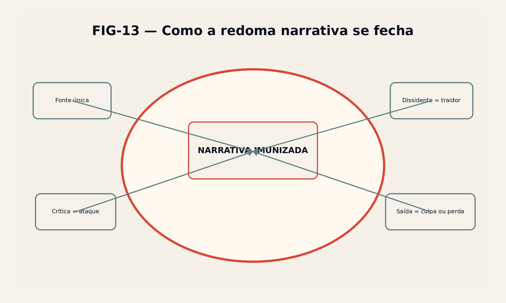

A redoma se fecha por reclassificação. A dúvida não é respondida; é renomeada. Vira pecado, violência, traição, contaminação, fragilidade, inveja, desinformação, falta de consciência ou ataque ao próprio grupo. A pergunta deixa de ter conteúdo e passa a ser evidência sobre o caráter de quem perguntou.

O membro aprende rapidamente. Antes de pensar “isso é verdade?”, pensa “que tipo de pessoa eu pareceria se perguntasse?”. A censura mais estável não proíbe frases; reorganiza o custo interno de formulá-las.

Testes de pureza aceleram esse aprendizado. Uma posição antes considerada suficiente passa a exigir demonstrações crescentes de lealdade. Não basta concordar; é preciso usar a expressão correta, condenar no tempo correto, compartilhar o símbolo correto e provar distância de pessoas classificadas como contaminadas. O teste não mede apenas crença. Mede disponibilidade para subordinar relações, linguagem e julgamento à autoridade do grupo.

Quando o pertencimento foi construído ao redor de um dano, a própria ferida pode entrar no teste. O membro precisa demonstrar que continua atingido, usar a dor como prova de pureza e conservar um inimigo permanente. Melhorar ameaça o vínculo; revisar a história parece traição; recuperar capacidade de ação diminui a indispensabilidade de quem ocupa o papel de salvador. Esse mecanismo não está presente em todo grupo de apoio ou movimento. Comunidades responsáveis reconhecem o dano, buscam reparação e trabalham para que seus membros recuperem escolha — mesmo que, ao melhorar, eles já não precisem do grupo da mesma maneira.

Esses testes podem existir em movimentos, empresas, círculos terapêuticos, comunidades religiosas, fandoms e ambientes políticos. Também podem ser confundidos com critérios legítimos. Uma organização antirracista pode exigir que integrantes não pratiquem discriminação; uma associação profissional pode punir fraude; uma igreja pode definir requisitos doutrinários para liderança. A redoma aparece quando o critério deixa de proteger a finalidade declarada e passa a servir à vigilância de pertencimento, sem proporcionalidade, processo ou possibilidade de correção.

A autoridade terceirizada torna a redoma eficiente. Em vez de analisar o conteúdo, o membro pergunta qual perfil autorizado já se pronunciou. Isso economiza energia e pode ser útil em temas especializados. Ninguém verifica sozinho todas as evidências médicas, jurídicas ou técnicas. O risco surge quando confiança especializada se converte em licença ilimitada e quando a mesma autoridade decide fatos, moral, inimigos, exceções e punições sem controle externo.

### Proteção necessária, conceitos dilatados

Bullying é dano real. A Lei nº 13.185/2015 define a intimidação sistemática como violência física ou psicológica intencional e repetitiva, em relação de desequilíbrio de poder. A Lei nº 14.811/2024 inseriu no Código Penal o art. 146-A, distinguindo intimidação sistemática e intimidação sistemática virtual (Brasil, 2015; Brasil, 2024).

Proteger melhor exige distinguir:

- **proteção:** interromper risco, perseguição ou humilhação;
- **acolhimento:** ouvir o sofrimento sem transformar a primeira interpretação em sentença;
- **discordância:** contestar ideia ou decisão sem negar dignidade;
- **conflito:** lidar com interesses ou versões incompatíveis;
- **humilhação:** expor ou degradar, sobretudo com repetição e poder desigual;
- **imunidade da afirmação:** proibir exame em nome da proteção.

Conflito não é automaticamente bullying; crítica não é automaticamente humilhação. Ao mesmo tempo, “discordância” não pode esconder perseguição.

> **Não quero a volta do bullying. Quero impedir que proteger a pessoa seja confundido com confirmar toda afirmação — e que a palavra “discordância” esconda humilhação.**

O eixo está entre proteção proporcional e preservação do exame. A expansão de conceitos de dano pode corrigir negligências antigas; também pode diluir fronteiras. A pergunta responsável é: **que elementos observáveis justificam este nome e que resposta proporcional ele exige?**

> **COMANDO DE AUTORIA — APLIQUE O EIXO À PROTEÇÃO.**
>
> Polo 1: abandono — “suporte qualquer coisa”. Polo 2: imunidade — “ninguém pode contrariar”.
>
> Pergunte: existe repetição? Há intenção de intimidar ou humilhar? Existe desequilíbrio de poder? Que risco precisa ser interrompido? Que parte ainda exige investigação?
>
> Eixo: proteção proporcional, distinção entre condutas e preservação do exame sobre fatos, interpretações e consequências.

### Cancelamento: uma palavra larga demais

“Cancelamento” pode designar campanhas coordenadas de humilhação, pressão por demissão, exposição de dados, ameaças e expulsão social. Pode também ser usado para qualquer crítica, perda de audiência ou consequência previsível. Sem delimitação, a palavra protege tanto vítimas de multidões quanto agentes poderosos incomodados por prestação de contas.

Para analisar um caso, é preciso separar: houve crítica? Houve mobilização coordenada? Houve mentira, ameaça ou exposição privada? A consequência foi proporcional? Existia processo de resposta? O objetivo era interromper dano, demonstrar reprovação, destruir reputação ou impor silêncio? O acusado possuía poder de defesa? Houve possibilidade de reparação?

Nem toda consequência é cancelamento. Nem toda multidão está fazendo justiça.

A redoma usa essa ambiguidade de duas maneiras. Um grupo pode chamar qualquer crítica externa de cancelamento para impedir exame. Outro pode chamar perseguição de “responsabilização” para não reconhecer crueldade. Em ambos, o nome antecipa o julgamento.

### Caso composto — quando a crítica virou violência

Uma associação surgiu para apoiar profissionais submetidos a assédio. Criou canais de denúncia, orientação jurídica e protocolos de proteção. O trabalho corrigiu abusos antes normalizados. A crença inicial era que hierarquias podem silenciar vítimas. O valor declarado era segurança com justiça.

Com o crescimento, a associação passou a tratar discordâncias internas sobre método como risco ao acolhimento. Uma integrante questionou a publicação de uma acusação antes de ouvir a outra parte. Não negou a possibilidade de abuso; pediu procedimento. Sua fala foi reclassificada como “violência epistêmica”.

A narrativa conectou os fatos assim: exigir verificação é repetir a descrença histórica contra vítimas; portanto, pedir verificação já é colaborar com o agressor. A recompensa do pertencimento era posição moral clara. O custo da divergência era ser colocada no campo da violência.

A redoma imunizou-se. Se a acusação fosse confirmada, o método estava certo. Se não fosse, a ausência de prova demonstraria como abusadores apagam rastros. Se a questionadora permanecesse, deveria silenciar; se saísse, sua saída confirmaria falta de compromisso.

A contradição era dolorosa: um projeto criado para combater silenciamento passou a silenciar uma pergunta sobre justiça procedimental.

O exame responsável não exigia abandonar proteção. Exigia distinguir acolher um relato, tomar medidas provisórias de segurança e declarar publicamente culpa. São atos diferentes, com critérios diferentes.

> **COMANDO DE AUTORIA — TESTE A LÓGICA E A SIMETRIA.**
>
> Procure uma condição que tornaria a tese menos provável. Se concordância confirma, discordância confirma, evidência confirma e falta de evidência também confirma, você não está diante de uma explicação forte. Está diante de uma estrutura imunizada.

A Matriz NARRATIVA expõe a redoma quando aplicada à imunização. O fato pode ser: “uma integrante pediu verificação”. O recorte exclui o histórico de defesa das vítimas feito por ela. A interpretação diz: “ela desconfia de quem denuncia”. A reclassificação transforma pedido de procedimento em violência. O comando resultante é: “não faça perguntas que possam ser usadas pelo outro lado”.

Observe que cada camada acrescenta algo. A pessoa pode aceitar o fato e ainda rejeitar o comando.

### Fios de caso — o preço da dúvida

Caio enviou a um amigo um vídeo sobre “padrões inevitáveis”. O amigo respondeu com uma pergunta simples: “Essa teoria consegue reconhecer uma mulher que não age assim?”

Caio começou a digitar. Apagou. Digitou de novo. Antes de responder, abriu o grupo em que costumava discutir os conteúdos. Alguém havia publicado: “Quando seus amigos questionarem, lembre-se de que pessoas adormecidas defendem o sistema que as usa”.

A pergunta do amigo chegou primeiro como possibilidade. A frase do grupo chegou logo depois e decidiu o significado dela.

Caio respondeu: “Você ainda não entendeu”. Em seguida, silenciou a conversa. O custo da dúvida não era apenas rever uma teoria. Era voltar a sentir a rejeição sem a proteção de uma explicação total e admitir que talvez tivesse tratado pessoas concretas como personagens.

Alex viveu uma punição menos explícita. Escreveu no grupo que não sabia se o termo adotado continuava descrevendo toda a sua experiência. Ninguém o insultou. Durante horas, ninguém respondeu.

Depois, uma moderadora enviou uma mensagem privada: “Talvez este não seja mais um espaço seguro para você”.

Alex sentiu o estômago fechar. O grupo que ensinara a palavra “acolhimento” agora usava segurança para tornar sua ambivalência incompatível com o pertencimento. Ele apagou a mensagem original e escreveu outra: “Eu estava num dia confuso. Obrigado por me lembrarem de quem sou”.

A redoma não precisa gritar. Às vezes, basta fazer o silêncio do grupo pesar mais do que a pergunta da pessoa.

### Ex-integrantes e fontes proibidas

Toda organização pode ter ex-membros injustos. Saída não transforma ninguém em especialista ou santo. Mas desqualificar ex-integrantes antes de ouvir é um sinal funcional: a estrutura preserva uma explicação pronta para qualquer testemunho contrário. “Saiu porque queria pecar”; “foi comprado”; “não suportou disciplina”; “nunca foi verdadeiro”; “está buscando atenção”.

Talvez alguma dessas alegações seja correta em um caso. A redoma surge quando ela é correta por definição em todos.

Fontes externas recebem tratamento semelhante. Não se pede que sejam avaliadas; afirma-se que pertencem ao sistema inimigo. A crítica da imprensa pode ser legítima. Universidades erram. Igrejas erram. Estado, mercado, movimentos e especialistas possuem interesses. A vigilância epistêmica exige verificar. A redoma dispensa verificar porque a origem já determina o resultado.

O paradoxo é que o grupo denuncia autoridade terceirizada enquanto constrói outra. “Não confie em ninguém — confie em nós para dizer em quem não confiar.”

A ausência de evidência também pode ser transformada em evidência de ocultação. Conspirações reais existem; poder tenta esconder rastros. Mas uma teoria que interpreta toda ausência como prova fica protegida de qualquer teste. A investigação responsável procura vestígios independentes, previsões arriscadas e critérios de revisão. A narrativa fechada converte sua incapacidade de demonstrar em demonstração da força do inimigo.

O membro aprende a vigiar o pensamento. Não precisa mais ouvir a ameaça de expulsão. Ele sente culpa ao ler uma fonte proibida, medo ao imaginar uma objeção e vergonha por notar falhas no líder. A redoma torna-se portátil.

### Contracaso — proteção com exame

Uma comunidade de adolescentes estabelece regras firmes contra perseguição, exposição de imagens, insultos repetidos e ameaças. Há canais confidenciais, adultos responsáveis e consequências proporcionais. Ao mesmo tempo, conflitos comuns são mediados sem linguagem inflada. Participantes podem dizer “isso me ofendeu” sem obter automaticamente a condenação do outro. Pergunta-se intenção, repetição, poder, impacto, contexto e possibilidade de reparação.

Uma crítica a uma ideia é permitida; um ataque sistemático à pessoa não. Uma identidade é respeitada; afirmações factuais continuam discutíveis. O grupo não exige que a vítima enfrente o agressor, mas também não transforma acolhimento inicial em sentença irreversível.

Essa comunidade não é menos protetora por preservar distinções. É mais capaz de responder ao dano correto.

A redoma narrativa oferece um benefício real: reduz a angústia da ambiguidade. Dentro dela, os acontecimentos já chegam interpretados. O membro sabe quem merece confiança, qual emoção é correta e como explicar cada derrota. A clareza pode parecer paz.

Mas uma paz que depende da impossibilidade de perguntar é uma dívida crescente.

Até aqui, ainda podemos imaginar que apresentar a evidência certa resolverá. Nem sempre. Quando o vínculo sustenta família, salvação, trabalho, missão, reputação, comunidade ou a imagem que a pessoa construiu de si, a crença já não está sozinha.

Questioná-la ameaça uma vida inteira organizada ao redor dela.

É nesse ponto que a redoma deixa de ser apenas cognitiva. Torna-se afetiva, social, econômica e existencial. A narrativa não apenas explica o mundo. Passa a sustentar o chão.

# CAPÍTULO 17 — FUSÃO E DEPENDÊNCIA

## Seitas, relações abusivas, idolatria política e por que a inteligência sozinha não liberta

Quando identidade, pertencimento e sobrevivência se concentram na mesma fonte, discordar deixa de ser apenas mudar de ideia. Pode significar perder família, renda, salvação, reputação, moradia ou a explicação que organizava a vida. Estudos sobre fusão de identidade ajudam a compreender como a fronteira entre o eu pessoal e o grupo pode se estreitar sem tornar essa progressão inevitável (Swann et al., 2012).

Por isso, pessoas inteligentes permanecem em estruturas destrutivas. A inteligência pode ser recrutada para justificar o sistema, reinterpretar falhas e proteger anos investidos. Raciocínio motivado e viés favorável ao próprio lado ajudam a explicar por que capacidade intelectual não garante exame imparcial: a competência também pode servir à busca de justificativas para uma conclusão desejada (Kunda, 1990; Stanovich, West & Toplak, 2013). O capítulo examina alto controle, controle coercitivo e personalização política sem chamar toda fé, relação intensa ou compromisso de seita.

O critério é o padrão: isolamento, vigilância, punição da dúvida, concentração de autoridade, redução de alternativas e custo de saída.

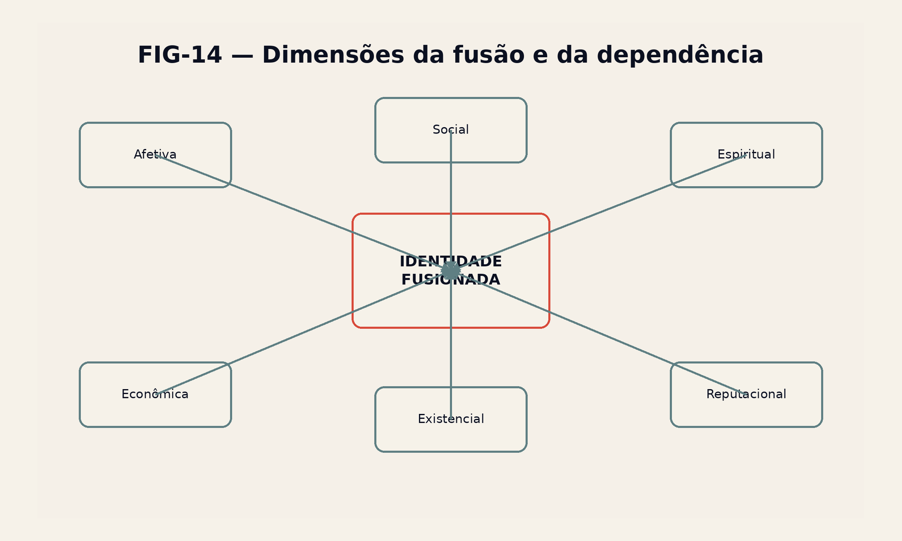

### Alto controle sem chamar toda religião de seita

“Seita” é uma palavra usada com imprecisão e, muitas vezes, como insulto contra religiões minoritárias. Doutrina exigente, liturgia, autoridade, missão, disciplina, sacrifício e convicção exclusiva não bastam, isoladamente, para declarar alto controle. Tradições religiosas também oferecem comunidade, caridade, transcendência, continuidade moral e recursos para resistir ao poder.

O exame deve recair sobre padrões: isolamento de fontes de apoio; vigilância sobre vida cotidiana; confissão usada para coerção; punição desproporcional; medo sistemático; controle de recursos; impossibilidade prática de sair; desqualificação automática de ex-membros; autoridade sem prestação de contas; ameaça espiritual empregada para regular escolhas que beneficiam a liderança.

Não é a intensidade da crença que define a ocupação. É o modo como o poder administra a consciência e o custo de divergência.

Uma comunidade pode afirmar convicções fortes e ainda dizer: “Você pode sair sem ser perseguido; seus familiares continuarão falando com você; seus bens são seus; a pergunta não é pecado; líderes respondem por abuso; nenhuma revelação privada suspende a lei”. Outra pode apresentar escolha formal enquanto organiza morte social para quem escolhe.

Shunning — evitação ou rompimento institucionalizado — varia muito entre contextos. Pessoas têm direito a estabelecer limites e ninguém é obrigado a manter intimidade. Mas, quando a exclusão total é coordenada para punir divergência, controlar comportamento ou tornar a saída insuportável, o pertencimento transforma-se em instrumento.

A mensagem é simples: “Você é livre para sair, desde que aceite perder todos”.

### Controle coercitivo: o padrão que não cabe num episódio

Relações abusivas ajudam a compreender a ocupação porque mostram por que olhar apenas incidentes isolados é insuficiente. Controle coercitivo é examinado como padrão cumulativo (Home Office, 2023): isolamento, monitoramento, regras, humilhação, ameaça, exploração de recursos e redução dos meios de independência, resistência e escape. Não é um diagnóstico remoto nem uma etiqueta para todo ciúme, conflito ou relação desigual.

O controle pode usar atos que, isolados, parecem pequenos ou até cuidadosos. “Mande mensagem quando chegar.” “Eu administro o dinheiro porque você se estressa.” “Seus amigos não querem nosso bem.” “Essa roupa expõe você.” “Não conte à sua família; eles não entenderiam.” O sentido aparece no padrão: quem decide, quem perde alternativas, qual punição acompanha a recusa e como a vida cotidiana encolhe.

A responsabilidade é de quem escolhe controlar. A vítima não causa a coerção por amar, esperar mudança, depender financeiramente, voltar ou não conseguir nomear cedo o que vive. Permanecer pode ser resultado do próprio sistema: medo, isolamento, esperança intermitente, filhos, risco, vergonha, falta de recursos e erosão da confiança na própria percepção.

A inteligência não impede isso. Conhecer teorias de abuso não garante reconhecer a própria relação. A pessoa pode aplicar critérios com precisão a casos externos e produzir exceções sofisticadas para o seu.

> **Inteligência não é vacina contra captura narrativa. Em certas redomas, ela se transforma na advogada mais competente da prisão.**

### Fio de caso — Helena e a casa que foi ficando menor

Quando Helena começou o relacionamento, o cuidado parecia atento.

Ele perguntava se ela havia chegado, lembrava horários, oferecia-se para administrar contas que a deixavam ansiosa. Dizia que algumas amizades a exploravam e que sua família não respeitava o casal. Helena, acostumada a interpretar necessidade como amor, recebia a centralização como descanso.

A mudança não aconteceu de uma vez.

Primeiro, ela enviava localização para evitar preocupação. Depois, passou a justificar atrasos. Mais tarde, começou a escolher roupas imaginando a reação dele. Quando a irmã ligava, Helena saía para a varanda e falava baixo. Não havia uma regra escrita proibindo a conversa. Havia a expressão que encontraria quando voltasse para a sala.

Numa noite, durante o jantar, Helena disse que queria visitar a mãe no fim de semana. O garfo dele parou no prato.

“Vai de novo escolher sua família contra nós?”

A pergunta reorganizou a situação. Visitar a mãe tornou-se traição. Explicar-se parecia prova de culpa. Helena sentiu o ombro direito endurecer e respondeu que poderia ir outro dia.

O gesto foi pequeno. O território perdido, não.

Com o tempo, moradia, dinheiro, rotina, segredos, medo e afeto passaram pelo mesmo centro. Helena ainda tomava decisões, mas cada decisão precisava sobreviver à previsão da reação dele. Sua antiga habilidade de manter a paz tornou-se infraestrutura do controle.

Reconhecer o padrão não produziu saída instantânea. Produziu medo. Havia documentos, contas, dependência de transporte, mensagens monitoradas e a possibilidade de escalada se ele percebesse planejamento.

Por isso, autoria não poderia significar confronto performático. O primeiro gesto responsável foi silencioso: Helena usou um telefone ao qual ele não tinha acesso, procurou orientação especializada, registrou informações importantes e começou a reconstruir vínculos fora da relação.

Ela não estava provando coragem. Estava ampliando alternativas.

### Caso-âncora — Rafael, o profissional brilhante que não auditava a própria doutrina

Rafael percebeu o problema numa sala de hotel, durante um encontro fechado do grupo.

Um participante havia feito uma pergunta sobre uma cobrança adicional. O mentor sorriu, caminhou até ele e perguntou diante de todos: “Você quer clareza ou quer uma desculpa para continuar pequeno?”

Algumas pessoas riram. Rafael não.

O homem que perguntara baixou os olhos e disse que estava comprometido. No intervalo, recolheu os papéis depressa e saiu sem terminar o café. Rafael acompanhou o movimento. Reconheceu humilhação. Também reconheceu o impulso imediato de explicar por que aquilo talvez tivesse sido necessário.

Essa segunda percepção assustou mais do que a primeira.

Rafael era um profissional respeitado, treinado para detectar inconsistências. Entrara no círculo de desenvolvimento porque recebera disciplina, contatos e uma visão de missão. Havia resultados reais: projetos concluídos, novos clientes, amizades e coragem para decisões antes adiadas.

A crença central do grupo era que o mentor enxergava padrões que pessoas comuns não viam. O valor declarado era excelência. A hierarquia operante colocava lealdade acima de verdade quando as duas colidiam. Críticas externas vinham de inveja ou medo de transformação. A recompensa era pertencer a uma elite moral e intelectual. O custo da divergência incluía perder rede profissional, reputação e a história de que aqueles anos haviam sido investimento puro.

Rafael reconhecia erros factuais do mentor. Explicava cada um de forma diferente.

Uma previsão fracassada era “metáfora”. Uma cobrança contraditória era “teste de compromisso”. Um ex-integrante denunciando humilhação era “narcisista ferido” — embora Rafael jamais o tivesse avaliado. Quando um princípio prejudicava um concorrente, era rigor; quando prejudicava o mentor, tornava-se literalismo.

Sua inteligência não desaparecera. Trabalhava intensamente. Mas havia sido recrutada para uma tarefa anterior à investigação: preservar a conclusão.

Naquela noite, Rafael abriu o notebook para preparar uma apresentação de defesa do mentor. Ficou olhando o cursor piscar. Escreveu a primeira frase, apagou. Escreveu outra, apagou também.

Então abriu uma página em branco e registrou apenas o que vira: uma pergunta sobre dinheiro, uma exposição pública, risos, olhos abaixados, saída antecipada.

Foi a primeira vez em anos que descreveu um acontecimento do grupo sem acrescentar imediatamente a interpretação autorizada.

A pergunta de exame era:

> **Estou usando minha capacidade para descobrir o que é verdade ou para impedir que uma verdade custosa entre?**

A correção não exigiria negar todo benefício recebido. Rafael poderia conservar disciplina, reconhecer resultados e agradecer pessoas que o ajudaram. Precisaria também reparar danos, reconstruir vínculos externos e separar gratidão de imunidade.

A saída não começaria com uma frase triunfal. Começaria com luto: pelo grupo, pelo futuro imaginado e pela versão de si que acreditava estar acima desse risco.

Na manhã seguinte, Rafael não publicou denúncia nem confrontou o mentor. Enviou uma mensagem ao participante que saíra antes do café:

“Eu vi o que aconteceu. Você está bem?”

A resposta demorou quatro horas.

“Você é a primeira pessoa de lá que pergunta.”

### Personalização política: quando o líder vira extensão do eu

Política envolve interesses reais, projetos incompatíveis, história, classe, valores e consequências materiais. Apoiar um candidato não é idolatria. Defender Lula ou Bolsonaro não prova fusão. Rejeitar ambos também não prova independência. Eleitores podem escolher estrategicamente, comparar políticas, votar contra um risco, mudar de opinião e manter crítica ao próprio campo.

O Brasil de 2022, porém, oferece um caso claro de personalização intensa e divisão afetiva. No segundo turno, Luiz Inácio Lula da Silva venceu com 60.345.999 votos válidos, 50,90%, contra 58.206.354 votos, 49,10%, de Jair Bolsonaro (Tribunal Superior Eleitoral, 2022). O resultado apertado não demonstra captura de dezenas de milhões de pessoas. Demonstra um país eleitoralmente dividido entre duas figuras de enorme centralidade simbólica.

Pesquisa longitudinal realizada ao redor daquela eleição encontrou níveis particularmente intensos de polarização afetiva entre apoiadores agrupados em torno de Lula e Bolsonaro antes da campanha, com redução posterior (Petherick et al., 2026). O estudo também mostrou que corrigir percepções equivocadas sobre os grupos e suas posições podia reduzir parte dessa distância afetiva. Isso importa porque revela uma possibilidade de correção: nem todo antagonismo está congelado; parte depende do que imaginamos sobre o outro.

A idolatria política começa quando o líder deixa de ser agente público submetido a critérios e se torna extensão do valor pessoal. Uma crítica a ele é sentida como humilhação do eleitor. Uma investigação é aceita ou rejeitada conforme o alvo. Uma frase que seria imperdoável no adversário recebe contexto infinito no aliado. O princípio deixa de governar o julgamento; o pertencimento governa o princípio.

Isso pode ocorrer em campos opostos. Um eleitor absolve no próprio líder o personalismo que denuncia no outro. Outro trata toda crítica ao seu candidato como colaboração com o autoritarismo adversário. Um terceiro constrói identidade pela oposição absoluta: não ama o líder do seu lado, mas precisa odiar o outro para saber quem é.

### Caso composto — dois pesos e uma biografia política

Marcos dizia defender responsabilidade fiscal, respeito institucional e liberdade de expressão. Quando o adversário atacava uma instituição, chamava de ameaça. Quando seu líder fazia algo semelhante, explicava como reação necessária. Condenava gastos sem transparência no outro campo; no próprio, pedia “contexto”. Defendia liberdade de expressão para aliados e punição social imediata para oponentes.

O valor declarado era princípio. O valor operante era vitória do campo. A recompensa era sentir-se do lado que salvaria o país. O custo da divergência era ser chamado de traidor por amigos e perder a coerência pública construída durante anos.

Marcos não desconhecia os fatos. Selecionava pesos. Sua identidade política funcionava como sistema de contabilidade moral: débitos do aliado eram refinanciados; débitos do adversário venciam à vista.

A pergunta responsável não era “qual dos líderes é igual?”. Não eram. Comparar o mecanismo de exceção não declara equivalência de atos, histórias ou projetos. A pergunta era: “Meu critério continua o mesmo quando muda o autor?”.

A possibilidade de correção era construir uma tabela anterior aos nomes: que condutas seriam inaceitáveis para qualquer governante? Que evidências mudariam o apoio? Que políticas justificam voto apesar de críticas? Que limite encerraria a tolerância? Sem critérios prévios, o líder passa a decidir também a régua que o mede.

A neutralidade também merece exame simétrico. Há neutralidade prudente: falta de informação, recusa de falso dilema, posição em construção, responsabilidade institucional ou consciência de limites. Há não alinhamento legítimo. Mas existe neutralidade oportunista: esperar qual lado terá menor custo antes de declarar convicção; condenar em abstrato e adaptar-se em privado; usar “todos são iguais” para evitar responsabilidade concreta.

Nem toda neutralidade é covardia. Nem todo posicionamento é coragem. Uma pessoa pode gritar com o grupo e ainda estar escondida dentro dele. Outra pode suspender julgamento porque se recusa a terceirizá-lo.

### Por que sair dói mesmo quando a pessoa sabe

O erro mais arrogante é perguntar: “Como alguém tão inteligente não vê?”. Muitas vezes, vê partes. O problema é o preço de organizar essas partes numa conclusão.

Sair pode significar admitir que pessoas queridas participarão da punição. Pode exigir procurar emprego, moradia e comunidade. Pode ameaçar guarda de filhos, reputação ou segurança. Pode produzir luto espiritual: “E se eles estiverem certos e eu estiver traindo o sagrado?”. Pode destruir uma narrativa heroica e revelar danos cometidos em nome dela.

Há ainda esperança intermitente. Depois de humilhação vem acolhimento. Depois de ameaça vem promessa. Depois de afastamento vem reencontro intenso. A pessoa não permanece apenas por medo; permanece também porque experimentou bens reais e continua aguardando sua volta.

Isso não torna toda saída necessária nem toda permanência patológica. Algumas pessoas deixam grupos por conflito comum, mudam de partido, encerram relações incompatíveis ou alteram tradições sem coerção. O custo pode ser legítimo porque todo compromisso cria vínculos. A distinção está em como a estrutura reage: permite despedida, propriedade dos próprios recursos, relações externas, narrativa diversa e possibilidade de retorno sem degradação? Ou mobiliza medo, segredo, ameaça e morte social para impedir a escolha?

### Segurança antes da ruptura

Reconhecer controle não obriga a um confronto imediato. Em relações ou grupos nos quais existem ameaça, vigilância, perseguição, retenção de documentos, controle financeiro, risco físico, dependência de moradia, disputa por filhos ou acesso privilegiado a dispositivos, anunciar a saída ou desafiar diretamente a autoridade pode aumentar o perigo.

> **Não transforme confronto imediato em prova de autoria. Quando existe coerção ou perigo, autoria começa por segurança, apoio e recuperação de alternativas.**

O livro não oferece um roteiro universal de rompimento. A recuperação da autoria pode exigir planejamento, apoio especializado, orientação jurídica, cuidado em saúde, rede confiável, preservação segura de documentos, reconstrução de renda e avaliação do momento de agir. Em risco iminente, segurança vem antes da discussão perfeita.

Filhos, animais, moradia, medicação, mobilidade, acesso a telefone, documentos e dinheiro podem alterar o que é possível. Se dispositivos forem monitorados, até pesquisar ajuda ou manter anotações pode aumentar o risco. Nesses contextos, a pergunta não é “por que você ainda não saiu?”, mas “que condições precisam existir para que pensar e agir deixem de produzir punição imediata?”.

Isso não transforma cautela em submissão. Significa que autoria também calcula poder, alternativas e consequência. Uma decisão livre não precisa parecer heroica para ser real; às vezes, o gesto mais autoral é preparar uma saída sem informar ao sistema que ela está sendo preparada.

### Contracaso — compromisso com porta de saída

Uma comunidade espiritual possui doutrina firme e práticas exigentes. Membros contribuem, estudam e assumem responsabilidades. Lideranças são avaliadas por conselho independente. Denúncias não são resolvidas apenas internamente quando envolvem crime. Pessoas podem consultar fontes externas. Quem decide sair não perde contato familiar por regra. Contribuições não compram posição espiritual. Dúvida pode ser discutida sem exposição pública.

O compromisso é profundo, mas não depende de aprisionar. A porta de saída existe não apenas no estatuto, mas na vida.

Uma organização política também pode cultivar compromisso sem culto: mandatos e decisões são criticáveis; dados contrários circulam; nenhuma liderança é tratada como encarnação da pátria; apoiadores podem reconhecer acertos do adversário; crimes e abusos não recebem absolvição identitária.

O teste não é ausência de paixão. É prestação de contas.

> **COMANDO DE AUTORIA — MAPEIE ANTES DE ROMPER.**
>
> Não comece obrigatoriamente por “fico ou saio?”. Comece mapeando: de que dependo afetiva, social, espiritual, econômica e existencialmente? Que alternativas foram reduzidas? Que riscos aumentariam se eu confrontasse agora? Que apoio preciso para conseguir pensar e agir sem punição imediata?
>
> Quando houver coerção ou perigo, não transforme coragem em exposição desnecessária. Procure proteção e apoio especializado.

A recuperação da autoria não acontece num gesto cinematográfico. Às vezes, começa ao manter uma amizade externa. Guardar documentos. Consultar outra fonte. Nomear uma contradição sem corrigi-la na mesma hora. Reconstruir renda. Pedir ajuda. Permitir-se sofrer pelo que foi verdadeiro dentro de uma estrutura que também feriu.

Sair de uma redoma não exige declarar que tudo foi mentira. Exige recuperar o direito de distinguir.

## Caso do leitor — localize ocupação, custo e segurança

Volte à situação escolhida. Quando a influência começou a decidir quais perguntas eram permitidas — e qual dúvida passou a ter custo? O que você teme perder se revisar a história: vínculo, proteção, renda, reputação, salvação simbólica, comunidade ou a explicação que dava sentido à dor?

Que alternativas foram reduzidas, e sua segurança permite perguntar ou confrontar agora? Se não permite, de que apoio, informação, recurso ou vínculo externo você precisa antes de agir?

Não transforme uma resposta corajosa em exposição desnecessária. Nesta parte, autoria pode significar apenas reconhecer o território real e começar a ampliar alternativas.

A Parte IV acompanhou a ocupação: a ideia tornou-se familiar; reconheceu uma dor; forneceu linguagem; aprendeu a neutralizar correção; concentrou pertencimento e sobrevivência simbólica. O mapa já não está apenas sobre a mesa. Começou a decidir quais caminhos existem.

Quando a identidade recebida se torna indispensável, ela já não ocupa apenas o pensamento. Passa a reorganizar tempo, missão, vínculos, empatia e consequências.

É o eu emprestado em funcionamento.

# PARTE V — O EU EMPRESTADO EM FUNCIONAMENTO {#parte-v}

## Quando a identidade recebida começa a produzir consequências

A ocupação não termina no pensamento. Ela reorganiza tempo, propósito, vínculos e responsabilidade.

Nesta parte, a pergunta muda: **não basta saber quem estou tentando ser; preciso observar o que essa versão de mim produz nas pessoas ao redor.**

# CAPÍTULO 18 — FUGA COGNITIVA

Há atividades que nos devolvem à vida. E há atividades que nos ajudam a não encontrá-la.

Por fora, podem ser exatamente as mesmas.

Uma pessoa joga por duas horas e termina mais leve, conectada com amigos, satisfeita por ter aprendido algo difícil. Outra joga pelas mesmas duas horas e as usa para adiar uma conversa que a assusta. Uma assiste a uma série porque precisa descansar. Outra deixa o próximo episódio começar porque o silêncio, quando chega, pergunta o que ela pretende fazer com a própria vida. Uma trabalha com concentração porque construiu uma vocação. Outra trabalha até a exaustão porque o desempenho é o único lugar onde não precisa sentir que não sabe quem é.

A atividade não entrega sozinha o diagnóstico moral de quem a pratica. O que precisa ser examinado é a função.

Fuga cognitiva é o movimento de afastar-se temporariamente de pensamentos, emoções, decisões ou conflitos por meio de uma atividade que oferece alívio. Essa descrição não transforma toda distração em problema. A mente humana precisa alternar esforço e repouso. Fantasia, brincadeira, arte, sexualidade, humor, sono, comida, conversa, jogo e entretenimento podem regular o corpo, ampliar repertório e devolver presença. A fuga começa a ganhar outra qualidade quando a atividade deixa de ser intervalo e passa a impedir contato com aquilo que precisa ser reconhecido.

O mecanismo costuma ser simples:

**desconforto → atividade → alívio → adiamento → custo → novo desconforto.**

O alívio é verdadeiro. É justamente por isso que o ciclo se repete. A pessoa não está fingindo que se sente melhor enquanto rola a tela, compra, come, trabalha, pesquisa ou assiste. Ela realmente se sente melhor por alguns minutos. A questão é que o alívio resolve a presença do desconforto, não a situação que o produziu. Quando a atividade termina, o problema continua — muitas vezes acrescido do tempo perdido, da culpa, do dinheiro gasto, do compromisso quebrado ou da vergonha de ter repetido o que prometera evitar.

A vergonha, então, alimenta o comportamento que condena. Quanto mais a pessoa se chama de fraca, preguiçosa, viciada ou incapaz, mais deseja escapar da própria presença. E quanto mais escapa, mais material oferece à acusação. A punição interna parece disciplina, mas frequentemente funciona como combustível.

## Não é a quantidade, sozinha

A linguagem cotidiana tornou-se rápida em diagnosticar. “Estou viciado em série.” “Ela é dependente do celular.” “Ele só pensa em jogo.” O exagero pode parecer inofensivo, mas apaga distinções importantes.

Uso frequente não é automaticamente transtorno. Paixão não é automaticamente compulsão. Imersão não é automaticamente fuga. Há períodos em que um projeto, um campeonato, um lançamento, uma amizade ou uma obra exigem muitas horas sem que a pessoa tenha perdido autoria. O critério não pode ser apenas o relógio. Importam o controle, a prioridade dada à atividade, a persistência apesar de consequências relevantes e o prejuízo no funcionamento da vida.

A Classificação Internacional de Doenças da Organização Mundial da Saúde, por exemplo, não define transtorno por jogos pela simples quantidade de horas. O padrão envolve controle prejudicado sobre o jogo, prioridade crescente em relação a outras atividades e continuidade ou escalada apesar de consequências negativas. Para diagnóstico, precisa haver prejuízo significativo em áreas importantes da vida e, em condições habituais, o padrão deve ser evidente por pelo menos doze meses. A própria organização ressalta que apenas uma pequena proporção de quem joga desenvolve o quadro (World Health Organization, s.d.).

Essa cautela não minimiza sofrimento. Impede que sofrimento seja confundido com preferência intensa, hobby, profissão ou período de entusiasmo. Diagnóstico exige avaliação adequada; este livro oferece apenas investigação de função e autoria.

O mesmo rigor vale para redes sociais. Uma revisão sistemática com meta-análise de 51 estudos e 680.506 participantes distinguiu uso excessivo de uso problemático. O uso excessivo, isoladamente, não apresentou associação significativa com bem-estar subjetivo ou psicológico; o uso problemático apresentou correlações negativas. A heterogeneidade entre estudos foi alta, e correlação agregada não demonstra causa individual (Ansari et al., 2024). Outra revisão com meta-análise encontrou associação positiva entre ansiedade social e uso problemático de redes, sem permitir decidir pela correlação qual condição veio primeiro nem autorizar diagnóstico individual (Wu, Huang & Yang, 2024).

A pergunta madura não é “quantas horas tornam alguém ruim?”. É: **o que acontece comigo antes, durante e depois; consigo escolher, interromper e retornar; e que parte da vida está sendo prejudicada?**

A atividade cabe na vida ou a vida passou a caber nela? Depois de interrompê-la, a pessoa retorna mais capaz de responder ou precisa recomeçar imediatamente para não encontrar o que sente?

## A arquitetura que facilita, sem decidir por você

Plataformas digitais não são neutras. Rolagem infinita, reprodução automática, notificações, recompensas variáveis, métricas de aprovação e recomendações personalizadas reduzem o atrito para permanecer. A arquitetura foi desenhada para capturar atenção. Isso é contexto real.

Mas contexto não é destino.

Transformar o algoritmo em agente onipotente cria uma nova fuga: a pessoa passa a acreditar que nada pode fazer porque uma máquina já decidiu tudo. A crítica à arquitetura precisa preservar a agência sem humilhar quem está em dificuldade. O sistema aumenta a probabilidade de continuidade; não escreve sozinho a biografia de cada usuário.

A pergunta de autoria continua possível: “o que esta plataforma está me oferecendo exatamente no momento em que eu não quero permanecer comigo?”

Às vezes oferece estímulo. Às vezes oferece companhia. Às vezes oferece indignação, porque raiva organizada parece melhor que angústia difusa. Às vezes oferece uma sequência de conteúdos sobre autoconhecimento que mantém a pessoa estudando eternamente a decisão que não executa.

## Quando até o autoconhecimento vira esconderijo

Há uma forma socialmente elogiada de fuga cognitiva: aprender sem terminar de escolher.

A pessoa lê livros, salva vídeos, compra treinamentos, faz testes de personalidade, acompanha especialistas, conhece o vocabulário inteiro da própria dor. Ela sabe nomear padrões, traumas, estilos de apego, crenças limitantes, gatilhos e linguagens do amor. Seu repertório cresce. Sua vida, não.

O conhecimento deixa de funcionar como instrumento de decisão e passa a funcionar como adiamento sofisticado. Sempre falta um último vídeo, uma explicação mais profunda, um diagnóstico mais preciso, uma certeza que elimine o risco. A pessoa não foge da consciência por ignorância. Foge por meio da consciência acumulada que nunca se transforma em ato.

### Caso composto — A mulher que sabia tudo antes de agir

Este caso é composto a partir de padrões recorrentes e não representa uma pessoa identificável.

Durante quatro anos, Helena estudou relações abusivas, comunicação não violenta, codependência, limites e autonomia. Tinha cadernos organizados, frases sublinhadas e uma biblioteca inteira de respostas. Dizia que seu valor era a verdade. Na prática, o valor que vencia era a preservação do vínculo a qualquer custo.

Toda vez que uma conversa difícil se aproximava, ela assistia a mais uma aula sobre “como conversar com alguém defensivo”. Quando pensava em sair, pesquisava “como saber se é realmente o fim”. Quando o parceiro prometia mudar, ela comprava outro livro sobre reconstrução. O conhecimento lhe dava a recompensa imediata de sentir que estava fazendo alguma coisa. O custo acumulado era permanecer na mesma situação com vocabulário cada vez mais sofisticado.

O problema não era aprender. O problema era usar a aprendizagem para não decidir.

A pergunta que rompeu o ciclo não foi “o que mais preciso entender?”. Foi: “qual decisão eu já compreendi o suficiente para tomar, mas continuo adiando porque não quero pagar seu preço?”

Conhecimento sem ação não é necessariamente covardia. Às vezes é prudência. Às vezes a pessoa depende financeiramente, teme violência, não possui rede ou ainda está organizando proteção. A autoria não exige gestos teatrais. Exige honestidade sobre a diferença entre preparação real e preparação infinita.

## Produtividade: a fuga que recebe aplauso

Algumas fugas são criticadas. Outras recebem promoção.

Quem passa a madrugada jogando pode ser questionado. Quem passa a madrugada trabalhando costuma ser chamado de comprometido. No entanto, o trabalho também pode cumprir a função de impedir encontro com luto, solidão, conflito conjugal, insegurança ou ausência de identidade fora do desempenho.

A pessoa produtiva recebe recompensas concretas: dinheiro, admiração, status, sensação de controle. Por isso, sua fuga pode atravessar anos sem ser reconhecida. Ela diz que está construindo o futuro, mas talvez esteja evitando o presente. Diz que não tem tempo para sentir, quando na verdade organiza a vida para nunca precisar sentir sem uma tarefa nas mãos.

O critério, novamente, não é condenar dedicação. É perguntar se o trabalho serve à vida ou se a vida inteira foi transformada em combustível do trabalho. Descansar produz culpa? Relações são tratadas como interrupções? O corpo só é percebido quando falha? O valor declarado é responsabilidade, mas o valor operante é invulnerabilidade?

A produtividade torna-se fuga quando sua interrupção ameaça revelar um eu que não sabe existir sem produzir.

## Pornografia, comida, compras e o perigo das explicações totais

Temas carregados de moralismo exigem precisão.

Sexualidade não é patologia. Masturbação não é prova de desvio. Consumo de pornografia não possui o mesmo significado, frequência ou impacto para todas as pessoas. Há quem descreva conflito moral sem perda de controle; há quem relate uso repetitivo apesar de consequências; há relações afetadas por acordos quebrados, segredo ou expectativas irreais. Nenhuma dessas situações deve ser resolvida por slogans sobre “cérebro destruído” ou “dopamina sequestrada”.

O exame precisa voltar à função: o comportamento está integrado a uma vida escolhida ou é usado para escapar de estados internos de forma que aumenta prejuízos? Há consentimento e acordos? A pessoa consegue interromper? O uso substitui intimidade que ela deseja construir? Existe sofrimento por consequência real ou apenas culpa produzida por uma norma que nunca examinou?

Com comida e compras, vale o mesmo. Comer pode ser nutrição, prazer, cultura, encontro e regulação legítima. Comprar pode resolver necessidade, expressar gosto e participar da vida social. Mas ambos podem ser usados para anestesiar, recompensar ou produzir por minutos a sensação de ser outra pessoa. O pacote chega. A identidade prometida não.

Explicações totais seduzem porque retiram complexidade. “É tudo dopamina.” “É falta de disciplina.” “É trauma.” “É o capitalismo.” “É o algoritmo.” Cada frase pode tocar uma parte do fenômeno. Nenhuma, sozinha, absolve o trabalho de observar a situação concreta.

## O contracaso: quando o intervalo devolve autoria

Rafael trabalha com problemas complexos. Ao fim do dia, joga com dois amigos. Há desafio, humor e vínculo. Ele sabe a hora de parar, não mente sobre o tempo, mantém compromissos e percebe que termina mais disponível para a família. Em semanas difíceis, joga mais. Em semanas de projeto, joga menos. A atividade não ocupa o lugar das decisões; oferece recuperação para enfrentá-las.

Esse contracaso importa porque um livro sobre fuga pode produzir vigilância doentia. O leitor passa a suspeitar de todo prazer e transforma descanso em prova moral. Isso seria outra narrativa pronta: a de que só existe autoria sob tensão permanente.

Descanso não é ausência de coragem. Prazer não é traição ao propósito. A pergunta não é se a atividade nos tira temporariamente da realidade, porque a imaginação e o repouso também fazem isso. A pergunta é se ela nos devolve ou nos impede de voltar.

## O teste da escolha interrompida

Uma forma de distinguir repouso de esquiva é observar o que acontece quando a atividade precisa ser interrompida. A pessoa consegue negociar consigo, concluir o ciclo e retornar? Ou a interrupção produz irritação desproporcional porque ameaça devolver a pergunta que estava sendo silenciada?

Esse teste não deve ser usado como armadilha moral. Quem está profundamente concentrado pode reagir mal a uma interrupção, e isso não prova fuga. O que importa é o padrão: promessas repetidas que não se cumprem, ocultação, perda de compromissos e sensação de que a própria decisão não possui força diante do comportamento.

Também é útil perguntar se existe escolha antes de começar. Muitas atividades são abertas automaticamente: a mão busca o telefone antes que a intenção seja formada; a próxima compra aparece antes que a necessidade seja descrita; a tarefa extra é aceita antes que o corpo registre exaustão. Recuperar autoria começa por criar um intervalo pequeno entre impulso e gesto. Não para eliminar prazer, mas para permitir que o prazer seja escolhido.

O intervalo pode conter três perguntas: **o que estou sentindo? O que espero receber? O que ficará para depois?** Quando a resposta é honesta, a pessoa talvez ainda decida jogar, assistir, comer, comprar ou trabalhar. A diferença é que o comportamento deixa de entrar disfarçado de inevitável.

A pergunta funcional permanece: **consigo escolher quando começar, parar e retornar — ou a atividade passou a escolher por mim?**

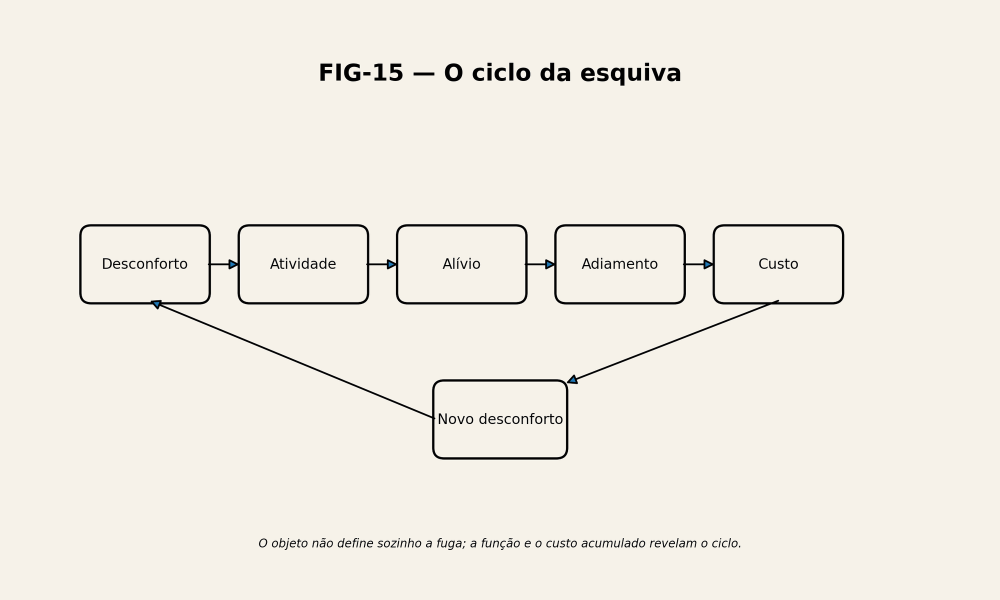

## O ponto que a atividade protege

A fuga cognitiva raramente protege apenas do tédio. Protege de uma pergunta.

“E se eu descobrir que não quero mais essa vida?”

“E se eu falhar quando finalmente tentar?”

“E se eu tiver de decepcionar alguém?”

“E se a missão que me deram não for minha?”

“E se eu não souber quem sou quando a distração parar?”

A atividade torna-se indispensável porque mantém a pergunta em suspensão. Mas perguntas suspensas continuam organizando escolhas. Aquilo que não é enfrentado não desaparece; passa a decidir por vias indiretas.

O primeiro movimento de autoria não é proibir imediatamente a atividade. É localizar o instante anterior. Que pensamento apareceu? Que sensação o corpo anunciou? Que decisão se aproximou? O que você ganhou ao sair de si? O que ficou mais caro ao voltar?

> **COMANDO DE AUTORIA**
>
> **IDENTIFIQUE O QUE VOCÊ EVITA ENCONTRAR.**
>
> Não comece pelo objeto. Comece pela função. Registre o que aconteceu nos minutos anteriores, qual alívio você recebeu e qual custo foi adiado. Depois pergunte: esta atividade me devolve à vida ou me ajuda a não retornar a ela?

Quando a resposta pronta já ocupa o eu, a distração não serve apenas para evitar dor. Ela também protege a missão que veio junto. É por isso que algumas pessoas não apenas fogem de perguntas; passam a viver para uma resposta que nunca escolheram.

# CAPÍTULO 19 — PROPÓSITO EMPRESTADO

Propósito é uma palavra que parece boa antes mesmo de ser examinada.

Poucas pessoas desejam uma vida sem direção. Queremos sentir que nosso esforço participa de algo maior que o próximo pagamento, a próxima tarefa ou a próxima aprovação. Propósito pode organizar prioridades, sustentar sacrifícios, atravessar crises e dar continuidade àquilo que o prazer momentâneo não consegue manter.

Justamente por isso, ele pode ser emprestado.

Uma missão pronta oferece alívio semelhante ao de uma identidade pronta. Diz quem você é, a que deve servir, quem deve admirar, o que precisa combater e como provar que sua vida tem valor. A pessoa não precisa construir critério lentamente. Recebe um enredo completo.

O problema não é ter missão. É usar a missão para não construir o eu que deveria escolhê-la.

## Quando o papel responde pela pessoa

Somos atravessados por papéis legítimos: mãe, pai, esposa, marido, profissional, líder, discípulo, cidadão, cuidador, artista, empreendedor, membro de uma comunidade. Eles criam deveres, linguagem, rotinas e pertencimento. Não existe identidade completamente isolada do mundo social.

A pergunta não é se os papéis nos influenciam. É se ainda há alguém capaz de examiná-los.

Uma mulher pode viver a maternidade como expressão profunda de amor e responsabilidade. Pode também ter aprendido que só merece existir enquanto necessária aos filhos. Um homem pode encontrar dignidade em prover. Pode também acreditar que não possui valor fora da utilidade financeira. Uma pessoa pode servir em uma igreja com fé escolhida. Pode também usar a vocação recebida para impedir qualquer pergunta sobre quem é quando o cargo termina.

O papel organiza; a ocupação substitui.

A diferença aparece quando a pessoa tenta imaginar-se sem ele. Se a resposta é apenas vazio, desonra ou inexistência, talvez o papel não esteja apenas compondo a identidade. Talvez esteja sustentando sozinho uma estrutura que nunca pôde ser construída.

## “Nasci para isso”

Há frases que expressam reconhecimento verdadeiro. Depois de anos de experiência, alguém percebe que determinada atividade reúne habilidades, valores e desejo. “Nasci para isso” pode ser uma metáfora de coerência.

Mas a frase também pode funcionar como blindagem.

Se nasci para isso, parar seria trair minha essência. Revisar seria covardia. Descansar seria desperdiçar o dom. Ouvir crítica seria permitir que pessoas menores atrapalhassem minha missão. A vocação deixa de ser escolhida continuamente e passa a exigir obediência.

O propósito emprestado não precisa vir de uma instituição autoritária. Pode vir da audiência. De um líder carismático. Da narrativa familiar. Da necessidade de reparar uma humilhação. De uma relação amorosa. De uma causa política. De um mercado que ensinou a pessoa a transformar cada traço da própria vida em produto.

A promessa é sempre parecida: “você finalmente saberá por que está aqui”.

O preço aparece depois: “agora você não pode mais ser outra coisa”.

## Missão como reparação

Alguns propósitos nascem menos do chamado e mais da ferida.

Quem foi ignorado pode desejar tornar-se indispensável. Quem foi humilhado pode construir uma missão que prove superioridade. Quem se sentiu impotente pode aderir a uma causa que oferece inimigo, exército e vitória. Quem não recebeu reconhecimento em casa pode buscá-lo em uma audiência que responde instantaneamente.

Nada disso torna a contribuição falsa. Uma ferida pode abrir sensibilidade para problemas reais. Pessoas transformam sofrimento em cuidado, injustiça em trabalho e ausência em presença. O erro seria declarar que toda vocação surgida da dor é fuga.

A pergunta é outra: a missão foi integrada ou ainda precisa alimentar a ferida para continuar existindo?

Quando a identidade depende do papel de salvador, talvez seja necessário que alguém permaneça quebrado. Quando depende do inimigo, talvez seja necessário que o conflito nunca termine. Quando depende da audiência, talvez seja necessário tornar a própria vida cada vez mais pública. Quando depende da superioridade moral, talvez seja impossível reconhecer erro sem perder o chão.

A missão deixa de servir à realidade e passa a exigir que a realidade sirva à missão.

### Fio de caso — Helena e a missão de salvar

Depois de reconhecer o controle na relação, Helena encontrou outra resposta pronta: transformar a própria dor em missão.

Durante algumas semanas, consumiu conteúdos que diziam que sobreviventes “não passam por tudo isso por acaso”. Uma mentora afirmou que a experiência de Helena era preparação para salvar outras mulheres. A ideia trouxe dignidade ao sofrimento. Também trouxe pressa.

Helena começou a imaginar cursos, atendimentos e uma comunidade antes de recuperar sono, renda e segurança. Quando sentia cansaço, pensava que estava desperdiçando o testemunho. Quando não queria contar detalhes, sentia culpa: talvez outra pessoa precisasse ouvi-los.

A missão parecia generosa. Ainda assim, repetia uma estrutura antiga. Mais uma vez, Helena precisava ser necessária para justificar a própria existência. Antes sustentava a paz da família e do relacionamento. Agora deveria sustentar a recuperação de desconhecidas.

A pergunta não era se um dia poderia transformar experiência em contribuição. Poderia. Era se tinha liberdade para não fazê-lo — ou para fazê-lo de forma limitada, preparada e sem entregar ao público a intimidade que ainda precisava proteger.

Helena escreveu numa folha:

“Minha dor pode informar o que escolho. Não tem o direito de escolher por mim.”

Guardou a frase na carteira. Pela primeira vez, a possibilidade de ajudar não veio acompanhada da obrigação de salvar.

## A causa que oferece inimigo e destino

Causas são necessárias. Direitos foram ampliados, abusos foram interrompidos e comunidades foram protegidas porque pessoas organizaram indignação e ação. O problema não é comprometer-se. É entregar à causa o direito de definir todas as pessoas, todos os fatos e toda a própria identidade.

Uma causa pode oferecer três recompensas imediatas:

1.  um nome para a dor;
2.  um inimigo para a angústia;
3.  uma missão para o vazio.

Quando essas três respostas chegam juntas, o alívio é poderoso. A pessoa sente que finalmente compreendeu a própria história. Descobre com quem deve caminhar e contra quem precisa lutar. Seu sofrimento deixa de parecer aleatório.

Mas a causa começa a usar a pessoa quando toda pergunta é interpretada como deslealdade, todo contraditório como violência e toda relação como campo de recrutamento. O mundo se torna material para confirmar o enredo. A pessoa não possui mais uma causa; a causa possui o modo como ela percebe tudo.

A Matriz NARRATIVA continua aplicável: qual é o núcleo? Quem possui autoridade? O que foi recortado? Quem foi reclassificado? Que emoção organiza a leitura? O que não pode ser testado? Qual valor é declarado e qual ação prova pertencimento?

Não é preciso reensinar a ferramenta. É preciso usá-la contra a missão que parece mais nobre.

## Audiência como prova de existência

A audiência oferece um tipo específico de propósito: o propósito medido.

Visualizações, curtidas, comentários, vendas e crescimento transformam reconhecimento em números. A pessoa consegue observar em tempo real se foi vista. Para quem passou parte da vida sentindo-se invisível, isso pode ser profundamente reparador.

Também pode criar dependência identitária.

O conteúdo deixa de ser uma forma de expressão e passa a responder se a pessoa existe. Um dia de queda não é apenas dado; é rejeição. Uma crítica não é apenas discordância; é ameaça à identidade. O descanso se torna perigoso porque a ausência pode reduzir alcance. A vida privada passa a ser avaliada por sua utilidade narrativa.

A pessoa diz que serve à audiência. Aos poucos, precisa que a audiência a confirme.

Esse movimento não invalida trabalho digital, arte pública ou liderança. Apenas exige uma pergunta que o mercado costuma evitar: quem você é nos dias em que ninguém reage?

## Caso composto — A missão que exigiu a vida inteira

Este caso é composto e não representa uma pessoa identificável.

Daniel entrou em uma organização depois de um período de fracasso profissional e isolamento. Pela primeira vez, recebeu uma função clara. Era bom em comunicar, organizar e mobilizar. A causa era legítima e os resultados eram concretos. Ele dizia que seu valor central era justiça.

Com o tempo, a missão passou a definir seus vínculos. Amigos que não participavam eram “alienados”. Familiares que pediam presença eram “egoístas”. Descanso era privilégio. Dúvida era vaidade. A recompensa imediata era sentir-se necessário e moralmente situado. O custo acumulado foi perder relações, saúde e capacidade de imaginar uma vida fora da organização.

Quando percebeu contradições internas, não conseguiu examiná-las. Se a causa estivesse errada em alguma parte, ele não perderia apenas uma opinião. Perderia quem acreditava ser.

O valor declarado continuava sendo justiça. O valor operante havia se tornado preservação da identidade recebida.

A pergunta metacognitiva foi simples e devastadora: “se esta organização desaparecesse amanhã, a justiça ainda seria meu valor — ou eu não saberia mais como praticá-la?”

A correção responsável não exigiu abandonar imediatamente tudo. Exigiu separar o valor da estrutura que alegava representá-lo. Daniel reduziu funções, restaurou vínculos, aceitou crítica e descobriu formas de agir que não dependiam de fidelidade total.

## Maternidade, paternidade, casamento e fé

Há campos em que a crítica precisa ser especialmente cuidadosa.

Dizer que uma pessoa se esconde em um papel não autoriza diminuir o papel. Maternidade e paternidade envolvem dependência real de crianças, deveres concretos e compromissos que não podem ser tratados como acessórios identitários. Casamento envolve história compartilhada, acordos e efeitos sobre terceiros. Fé pode ser fonte de sentido, comunidade e orientação escolhida.

Autoria não é licença para abandonar deveres sob o argumento de “descobrir quem sou”. Ao mesmo tempo, dever não exige desaparecimento completo do eu.

Uma mãe pode amar profundamente os filhos e reconhecer que não é apenas mãe. Um pai pode prover e também admitir fragilidade. Uma pessoa pode revisar o modo como vive o casamento sem transformar toda mudança em traição. Um crente pode examinar interpretações humanas sem abandonar a fé.

O eixo não está entre submissão total e irresponsabilidade. Está na capacidade de sustentar vínculo, dever e consciência ao mesmo tempo.

## A culpa de parar

O propósito emprestado revela-se com frequência no descanso.

Quando a pessoa para, sente culpa. Não porque exista uma tarefa urgente, mas porque o valor pessoal foi fundido ao desempenho. “Se não estou produzindo, servindo, cuidando ou lutando, estou desperdiçando minha existência.”

Essa crença produz uma vida sem intervalo e, paradoxalmente, sem escolha. A missão pode até ser socialmente admirada, mas a pessoa não é livre para renová-la. Apenas continua.

Descansar ameaça mostrar que o propósito não foi escolhido; foi usado para manter o eu ocupado.

## O contracaso: vocação revisável

Lívia trabalha há quinze anos com educação. Ela reconhece que a profissão participa de quem é, mas não esgota sua identidade. Em alguns períodos lidera projetos; em outros reduz carga para cuidar da saúde. Aceita que métodos antes úteis podem precisar de revisão. Não considera crítica pessoal uma profanação da causa.

Sua missão serve à realidade porque pode ser corrigida por ela. Se uma prática prejudica alunos, muda. Se uma nova evidência aparece, examina. Se precisa sair de um cargo, o valor não desaparece. A educação continua importante sem exigir que ela permaneça exatamente na mesma função.

Esse é um sinal de propósito escolhido: ele organiza a pessoa sem proibir que ela continue existindo além dele.

## O propósito que admite testemunhas

Propósitos escolhidos suportam testemunhas. Eles podem ser observados por pessoas que não dependem de agradar ao líder, à instituição ou ao próprio protagonista. Quando alguém de confiança aponta que a missão está consumindo saúde, filhos, parceria ou integridade, a resposta não precisa ser obediência automática; precisa ser exame.

A missão emprestada, ao contrário, tende a reclassificar toda testemunha incômoda. Quem pede equilíbrio “não entende o chamado”. Quem aponta contradição “tem medo da sua potência”. Quem pergunta sobre consequências “quer impedir seu crescimento”. Assim, a narrativa preserva a missão removendo a credibilidade de qualquer pessoa capaz de descrevê-la de fora.

Uma vocação robusta não precisa ser protegida de toda realidade. Ela aceita indicadores que não controla: saúde, coerência, qualidade do trabalho, efeitos sobre dependentes, capacidade de reparar e liberdade para revisar método. Quanto mais nobre a missão declarada, maior deve ser sua disponibilidade para prestar contas.

Prestar contas não significa entregar a consciência a outra autoridade. Significa reconhecer que ninguém enxerga integralmente o próprio ponto cego. Autoria não é isolamento epistêmico. É capacidade de escutar sem terceirizar a decisão.

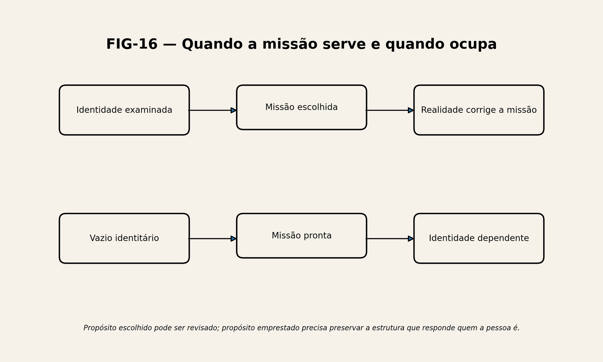

Uma missão escolhida pode ser corrigida pela realidade sem destruir a identidade. A missão pronta precisa preservar a estrutura que responde quem a pessoa é. A diferença não está na grandeza do trabalho, mas na possibilidade de revisão.

## Retirar a missão pronta

Não é necessário abandonar tudo para testar autoria. Basta realizar um experimento mental honesto.

Retire o cargo. Retire a audiência. Retire o parceiro. Retire o grupo. Retire o líder. Retire o inimigo. Retire a frase “nasci para isso”.

O que permanece como valor, habilidade, responsabilidade, desejo e vínculo real?

Se nada permanece, a conclusão não deve ser vergonha. Deve ser investigação. Talvez você tenha recebido uma missão antes de construir o eu capaz de escolhê-la. Talvez o papel tenha sido necessário para sobreviver. Talvez ele tenha oferecido estrutura em um período de caos. Reconhecer isso não invalida o que foi vivido.

Mas a missão que salvou você em um momento não adquire automaticamente o direito de possuí-lo para sempre.

> **COMANDO DE AUTORIA**
>
> **RETIRE A MISSÃO PRONTA E OBSERVE O QUE RESTA.**
>
> Liste o valor que a missão afirma representar, as ações concretas que o realizam e as partes de sua identidade que existem fora dela. Depois pergunte: posso revisar a forma sem perder o valor? Posso descansar sem deixar de existir? Posso continuar sendo alguém se o papel terminar?

Quando a missão responde quem você é, outras pessoas tendem a aparecer apenas em relação a ela: quem valida, quem serve, quem ameaça, quem atrapalha. É assim que o propósito emprestado prepara uma época de relações entre funções — uma era de anti-pessoas.

# CAPÍTULO 20 — A ERA DAS ANTI-PESSOAS

Uma pessoa não é apenas aquilo que faz por você.

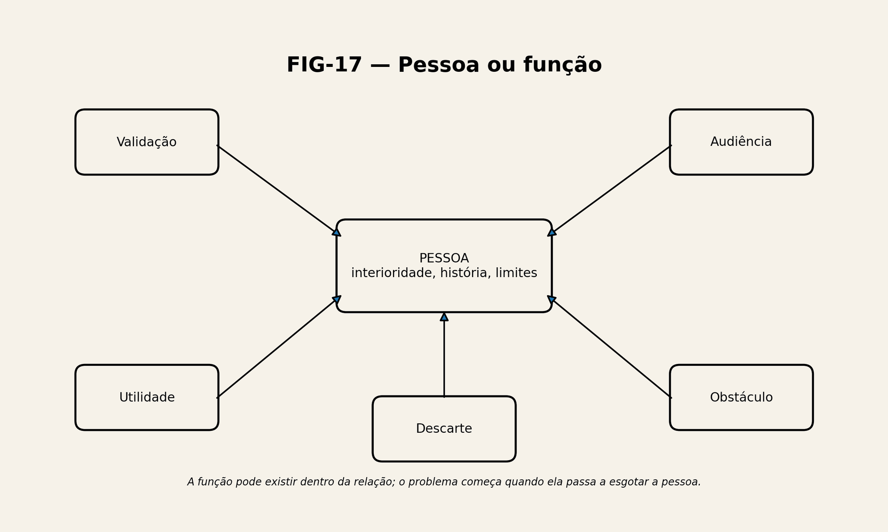

A função pode existir dentro da relação: parceiro, cliente, filho, profissional, eleitor, seguidor. O apagamento começa quando validação, utilidade, audiência, obstáculo ou descarte esgotam a pessoa inteira.

A frase parece óbvia. Nossa vida cotidiana, nem sempre.

Chamamos alguém de importante porque nos valida. De tóxico porque nos frustra. De aliado porque repete nossa linguagem. De inimigo porque pertence ao outro lado. De parceiro ideal porque cumpre uma lista. De inútil porque não oferece vantagem. De seguidor porque o conhecemos apenas como número. De cliente porque sua história aparece primeiro como oportunidade.

Não deixamos de enxergar corpos. Deixamos de reconhecer interioridade.

A anti-pessoa não é um novo tipo humano. É o modo como alguém aparece quando foi reduzido à função que cumpre dentro de nossa narrativa.

## Pessoa versus função

Toda relação possui funções. Amigos oferecem companhia. Profissionais prestam serviços. Pais cuidam. Filhos dependem. Parceiros constroem intimidade. Cidadãos compartilham regras. O problema não é reconhecer função. É acreditar que ela esgota a pessoa.

Quando o outro existe apenas como fonte de validação, sua discordância parece traição. Quando existe apenas como recurso, sua necessidade parece inconveniente. Quando existe apenas como ameaça, qualquer informação sobre sua humanidade enfraquece a história que precisamos contar. Quando existe apenas como audiência, seu sofrimento pode ser transformado em conteúdo sem que sua interioridade seja considerada.

A redução facilita decisões. É mais simples descartar um “narcisista”, “invejoso”, “fracassado”, “privilegiado”, “fanático”, “gado”, “comunista”, “fascista”, “energia ruim” ou “pessoa de baixo valor” do que encontrar um ser humano contraditório que talvez tenha causado dano e ainda assim não caiba inteiro no rótulo.

Nomear comportamentos pode proteger. Diagnósticos profissionais podem orientar tratamento. Categorias políticas podem descrever posições. O problema começa quando a palavra deixa de iluminar um aspecto e passa a autorizar a suspensão da humanidade.

## A linguagem terapêutica como tribunal

Termos psicológicos entraram no cotidiano e ampliaram repertório. Pessoas aprenderam a reconhecer manipulação, coerção, abuso, limites e padrões relacionais. Isso pode salvar vidas.

Também pode criar sentenças rápidas.

“Ele é narcisista.” “Ela está projetando.” “Você invalidou minha verdade.” “Não vou permitir acesso à minha energia.” A linguagem que deveria descrever experiências passa a classificar pessoas inteiras. Uma palavra funciona como diagnóstico, veredito e autorização para não conversar.

Isso não significa que toda conversa seja obrigatória. Há situações de violência, perseguição, coerção e risco em que afastamento é proteção. Reconhecer a humanidade do outro não exige proximidade. Empatia não exige concordância. Perdão não exige reconciliação.

Mas limite e desumanização são coisas diferentes.

Um limite diz: “essa conduta produz este efeito; por isso, farei isto para me proteger”. A desumanização diz: “você é apenas essa conduta; portanto, qualquer coisa que eu faça contra você se torna justificável”.

## Relações como catálogo de benefícios

Parte da cultura contemporânea descreve vínculos em linguagem de mercado. Pessoas possuem “alto valor” ou “baixo valor”. Relacionamentos precisam entregar “retorno”. Quem não acrescenta deve ser removido. Há conselhos úteis escondidos nessa linguagem: reciprocidade importa, abuso não deve ser romantizado, ninguém precisa aceitar humilhação para provar amor.

O risco é converter toda relação em balanço imediato.

Vínculos humanos incluem fases assimétricas. Um amigo adoece. Um parceiro perde trabalho. Um filho atravessa crise. Um pai envelhece. Uma pessoa que normalmente oferece presença pode passar um período recebendo mais do que entrega. Se todo desequilíbrio temporário for interpretado como exploração, relações só sobrevivem enquanto todos performam.

A lógica de catálogo cria abundância percebida: sempre haveria outra pessoa a um deslizar de distância. Aplicativos não causam sozinhos essa visão, mas podem torná-la familiar. Perfis são comparados rapidamente; detalhes são filtrados; decisões acontecem antes do encontro. O formato convida a perceber opções. A autoria precisa impedir que “opção” se torne “objeto”.

Uma pessoa pode ser incompatível sem ser inferior. Pode não servir ao projeto de vida sem ter menos valor humano. Pode precisar sair de sua proximidade sem ser apagada da condição de pessoa.

## Validação como moeda

Quando a identidade depende de reconhecimento, pessoas tornam-se espelhos.

Quem confirma é mantido perto. Quem pergunta demais começa a parecer hostil. Quem não reage à performance parece desinteressado. A relação deixa de ser encontro e vira sistema de abastecimento.

A validação não é ilegítima. Ser visto importa. Crianças constroem segurança por meio de respostas de cuidadores; adultos também precisam de reconhecimento. O problema surge quando o outro perde o direito de ter experiência própria porque foi contratado silenciosamente para confirmar a nossa.

Nessa estrutura, discordância não é informação. É privação.

A pessoa validante é idealizada enquanto cumpre a função. Depois é reclassificada como invejosa, tóxica ou fria. A mudança pode ter ocorrido no comportamento dela, mas também pode ter ocorrido na função exigida: ela deixou de repetir a resposta necessária.

## Empatia declarada, presença ausente

Vivemos cercados por discursos de empatia e, ao mesmo tempo, por respostas automáticas.

A pessoa publica sobre acolhimento, mas não escuta alguém que fala devagar. Defende saúde mental, mas ridiculariza o adversário em crise. Celebra diversidade, mas exige uniformidade dentro do grupo. Prega família, mas trata familiares como acessórios da própria imagem. Fala de amor, mas só reconhece o outro quando ele confirma sua narrativa.

Isso não é necessariamente hipocrisia consciente. Pode ser a distância entre valor declarado e valor operante.

O valor declarado é empatia. O valor que vence é lealdade ao grupo, eficiência, reputação, prazer ou proteção da própria identidade. A lógica da situação pergunta: o princípio continua válido quando a pessoa pertence ao lado que você rejeita?

Empatia testada apenas com semelhantes é afinidade. Empatia começa a mostrar força quando reconhece interioridade sem precisar negar conflito, responsabilidade ou limite.

## O adversário político como caricatura

A política oferece terreno fértil para anti-pessoas porque organiza identidades coletivas e ameaças. Quando o adversário é reduzido a maldade, ignorância ou patologia, não precisamos compreender por que pessoas diferentes chegaram a posições diferentes. Basta explicar o outro como defeito.

Compreender não significa absolver ideias, relativizar fatos ou abandonar posição. Significa reconhecer que seres humanos podem agir por medo, lealdade, interesse, experiência, informação parcial, tradição, cálculo e contradição. Uma crítica intelectualmente forte não precisa inventar um inimigo sem interioridade.

A caricatura produz prazer porque preserva pureza. O grupo próprio possui razões; o outro lado possui distúrbios. Nós cometemos erros; eles revelam essência. Nós reagimos ao contexto; eles são aquilo que fazem.

Esse teste de simetria revela a anti-pessoa dentro da narrativa.

## Filhos, parceiros e familiares como personagens

A redução não acontece apenas com desconhecidos. Pode ser mais intensa dentro de casa.

Pais podem transformar filhos em prova de sucesso, continuação de legado, companhia contra solidão ou reparação da própria infância. Filhos podem reduzir pais a fonte de dívida eterna ou obstáculo à autonomia. Parceiros podem ser usados como testemunhas de valor, provedores de segurança, reguladores emocionais ou figurantes de uma imagem pública.

Reconhecer essas funções não elimina amor. Relações humanas misturam afeto, necessidade, história e expectativa. O trabalho de autoria é impedir que a necessidade apague a pessoa que a satisfaz.

Seu filho não existe para confirmar que você foi um bom pai. Seu parceiro não existe para curar tudo o que veio antes. Seu amigo não existe para responder imediatamente. Seu público não existe para sustentar sua autoestima. Seu familiar não existe para aceitar qualquer comportamento em nome da história compartilhada.

A pessoa permanece pessoa quando deixa de cumprir a função esperada.

## Caso composto — Todos viraram peças da evolução

Este caso é composto e não representa uma pessoa identificável.

Depois de uma ruptura difícil, Camila mergulhou em conteúdos sobre autoestima e limites. O material a ajudou a reconhecer humilhações que havia normalizado. Aprendeu a dizer não e encerrou um vínculo que a adoecia. Essa primeira mudança foi legítima.

Aos poucos, porém, toda relação passou a ser lida pela mesma grade. A amiga que discordava “não acompanhava sua evolução”. A irmã que pedia explicações “queria acesso”. O colega que apontava erro “ameaçava sua potência”. Pessoas eram classificadas por vibração, valor e utilidade emocional.

O valor declarado era amor-próprio. O valor operante tornou-se proteção contra qualquer frustração. A recompensa imediata era sentir controle. O custo acumulado foi solidão, relações rasas e incapacidade de reparar conflitos.

A contradição apareceu quando Camila percebeu que exigia dos outros acolhimento irrestrito, mas chamava de invasão qualquer demanda recíproca.

A pergunta metacognitiva foi: “estou estabelecendo limites para preservar uma relação possível ou usando limites para não encontrar pessoas que não posso controlar?”

A correção não foi reabrir relações perigosas. Foi devolver gradação. Algumas pessoas permaneceram afastadas. Outras receberam conversa, pedido de desculpas e condições claras. O limite deixou de ser sentença sobre a essência do outro e voltou a ser decisão sobre conduta e proximidade.

## O contracaso: limite firme sem apagamento

André encerrou contato com um familiar que repetia ameaças e invasões. Não minimizou o risco. Guardou registros, organizou proteção e informou que não manteria convivência enquanto o comportamento continuasse. Não publicou humilhações, não recrutou a família inteira para odiar a pessoa e não precisou negar que existiam lembranças boas.

Reconhecer complexidade não o obrigou a voltar. A humanidade do outro não anulou sua segurança.

Esse contracaso é central: devolver ao outro a condição de pessoa não significa devolver acesso. A dignidade é incondicional; a proximidade, não.

## Cliente, seguidor, público

Em ambientes profissionais, funções são inevitáveis. Cliente compra. Seguidor acompanha. Público assiste. Mas a redução acontece quando o resultado importa mais que a pessoa.

Marketing pode explorar medo sem oferecer solução proporcional. Lideranças podem usar histórias privadas como prova. Criadores podem transformar sofrimento alheio em engajamento. Empresas podem chamar de comunidade um conjunto de consumidores cuja única voz relevante é a que converte.

A autoria exige coerência entre promessa e prática. Quem diz servir pessoas precisa perguntar se continuaria respeitando-as quando elas não compram, não elogiam ou não permanecem.

O outro não recupera humanidade porque recebemos um sentimento bonito. Recupera quando mudamos a forma de decidir.

## A pressa de encerrar pessoas

A anti-pessoa também nasce da pressa. O ambiente digital recompensa conclusões rápidas: uma frase, um recorte, uma captura de tela, um minuto de vídeo. A pessoa é julgada antes que contexto, frequência, reparação ou mudança possam aparecer. A velocidade não cria sozinha a desumanização, mas favorece decisões sem espessura.

Há comportamentos que precisam de resposta imediata. Segurança não pode aguardar uma biografia completa do agressor. Entretanto, fora da emergência, rapidez moral pode oferecer uma recompensa: sentir que sabemos quem é bom e quem é mau. A incerteza exige trabalho; o rótulo encerra.

Devolver interioridade não significa suspender julgamento para sempre. Significa tornar o julgamento proporcional ao que sabemos. Podemos afirmar: “esta conduta foi cruel”, sem concluir que conhecemos toda a essência. Podemos dizer: “não confio para esta função”, sem declarar que a pessoa não possui valor. Podemos responsabilizar sem fabricar uma caricatura necessária ao nosso prazer punitivo.

A diferença parece semântica até produzir ação. Quem enfrenta uma conduta busca proteção, justiça e reparação. Quem enfrenta uma essência imaginada tende a considerar qualquer punição insuficiente, porque não há mudança capaz de corrigir aquilo que foi definido como natureza total.

## Devolver interioridade

Há um exercício simples: atribuir ao outro uma vida que continua fora de sua narrativa.

A pessoa que não respondeu talvez esteja cansada, com medo, ocupada, indiferente ou escolhendo distância. Você não sabe automaticamente. O adversário possui história anterior ao conflito. O cliente tem limites financeiros. O filho tem desejos que não são extensão dos pais. O parceiro experimenta a relação a partir de um corpo e uma memória próprios.

Reconhecer interioridade reduz certeza, e reduzir certeza pode ser desconfortável. A anti-pessoa é útil porque não surpreende: ela faz exatamente o papel que lhe demos. A pessoa real resiste ao roteiro.

Ter sido ferido por alguém não torna sua percepção irrelevante. Também não transforma automaticamente cada gesto posterior dessa pessoa em mera função da ferida. O dano precisa ser nomeado, a proteção pode ser firme e a reparação pode ser exigida sem que você precise conhecer toda a interioridade do outro ou negar que ela exista. Reconhecer que o outro continua sendo pessoa não lhe devolve acesso, autoridade nem confiança; apenas impede que a desumanização se torne o método pelo qual você tenta recuperar a própria dignidade.

> **COMANDO DE AUTORIA**
>
> **DEVOLVA AO OUTRO A CONDIÇÃO DE PESSOA.**
>
> Descreva o comportamento que precisa ser enfrentado sem transformar esse comportamento na totalidade do outro. Defina o limite necessário, o efeito que deseja impedir e a proximidade possível. Depois pergunte: estou protegendo dignidade e responsabilidade ou preciso que o outro deixe de ser humano para justificar minha decisão?

Quando pessoas são reduzidas a funções, a liberdade tende a ser definida como ausência de obrigação em relação a elas. O eu passa a acreditar que ser autêntico significa não responder pelo impacto que produz. A ocupação chega então ao seu gesto mais sofisticado: a fuga rebatizada como verdade pessoal.

# CAPÍTULO 21 — AUTENTICIDADE SEM RESPONSABILIDADE

“Seja você mesmo” pode ser uma libertação.

Para quem viveu sob medo, coerção, humilhação ou exigências impossíveis, a frase abre espaço. Ela lembra que nenhum vínculo saudável exige desaparecimento. Autoriza gosto, voz, limite, mudança e diferença. Em muitos contextos, autenticidade é recuperação de dignidade.

Mas toda frase libertadora pode se tornar comando quando deixa de ser examinada.

O eu que antes obedecia ao grupo pode passar a obedecer ao impulso. A autoridade muda de lugar, mas a estrutura permanece: algo responde sem contraditório, imuniza-se contra consequência e exige que outras pessoas se adaptem.

Autenticidade sem responsabilidade é apenas outra narrativa pronta — desta vez com o eu no lugar do líder.

## O impulso como autoridade final

Sentir é informação. Não é sentença automática.

Desejo, raiva, cansaço, paixão, medo e repulsa revelam estados reais. Ignorá-los pode produzir adoecimento e submissão. Mas tratá-los como autoridade final elimina mediação entre experiência e ação.

“Eu senti” explica parte do comportamento; não o justifica inteiro. “Eu precisava” pode descrever urgência; não apaga acordos. “Essa é minha verdade” comunica perspectiva; não transforma interpretação em fato incontestável.

Autenticidade examinada pergunta: o que sinto? De onde pode vir? O que esse sentimento protege? Qual ação é coerente com meus valores e com a existência das outras pessoas? Que consequência previsível assumirei?

Licenciosidade pergunta apenas: o que quero agora?

Submissão pergunta apenas: o que esperam de mim?

Autonomia responsável sustenta as duas presenças: eu existo; o outro também.

## Os slogans e seus limites

### “Não aceite menos”

A frase pode interromper humilhação. Lembra que reciprocidade e respeito não são luxo. Mas “menos” precisa ser definido. Menos que dignidade? Menos que fantasia? Menos que uma imagem ideal impossível de sustentar?

Sem critério, qualquer frustração vira prova de desvalor. Relações reais são comparadas a promessas sem corpo. A pessoa protege padrões legítimos ou exige que o mundo confirme uma expectativa nunca negociada?

### “Perca pessoas, mas não se perca”

Há vínculos cuja manutenção exige desaparecimento. Neles, afastar-se pode ser autoria. Mas a frase pode virar autorização para tratar toda negociação como perda de si.

Relacionar-se modifica. Amar cria obrigações escolhidas. Ter filhos, assinar contratos, assumir sociedade e construir história produz efeitos que não desaparecem quando o desejo muda. Nem toda adaptação é autoabandono. Às vezes é compromisso.

### “Seja quem quiser”

A frase defende liberdade de revisão. Ninguém precisa permanecer preso a uma versão antiga para satisfazer espectadores. Mas querer ser não equivale automaticamente a tornar-se, e toda transformação encontra realidade, competência, corpo, tempo e consequência.

Autoria não é inventar-se sem limites. É participar conscientemente da construção possível.

### “Não devo nada a ninguém”

Talvez você não deva acesso, intimidade, obediência, silêncio ou permanência a quem o agride. Mas pode dever dinheiro, cuidado parental, informação contratual, reparação, devolução, aviso, honestidade ou cumprimento de responsabilidade assumida.

A frase liberta de dívidas imaginárias e pode apagar dívidas reais.

### “Quem me ama aceita tudo”

Amor não exige aprovação total. Uma pessoa pode amar e recusar uma conduta. Pode permanecer e estabelecer condição. Pode sair e ainda reconhecer a história. Exigir aceitação ilimitada transforma amor em servidão.

Esses slogans não são falsos em todos os contextos. São incompletos. E frases incompletas tornam-se perigosas quando governam situações complexas como se fossem leis universais.

## Limite, controle e punição

Limite descreve o que eu farei diante de determinada conduta para proteger segurança, dignidade ou funcionamento.

Controle tenta determinar o que o outro deve fazer para impedir meu desconforto.

Punição procura produzir sofrimento como resposta.

Na prática, fronteiras podem se misturar. “Se você gritar, encerrarei a conversa” é diferente de “você está proibido de sentir raiva”. “Não permanecerei em uma relação com violência” é diferente de “se me contrariar, desaparecerei para ensinar uma lição”.

O corte de contato pode ser necessário em situações de risco, perseguição, coerção ou repetição grave. Não deve ser transformado em técnica universal para qualquer conflito. Às vezes, não conversar é proteção. Às vezes, é punição silenciosa. A função e o contexto importam.

O eixo não manda permanecer. Manda assumir com honestidade o que a decisão faz.

## Direito de mudar e história compartilhada

Pessoas mudam. Desejos terminam. Convicções são revistas. Projetos deixam de fazer sentido. Defender autoria exige reconhecer o direito de sair de identidades, grupos e relações.

Mas o direito de mudar não reescreve automaticamente o passado.

Se duas pessoas construíram patrimônio, existem deveres de divisão. Se há filhos, a parentalidade continua mesmo quando o casamento termina. Se um contrato foi assumido, há procedimentos. Se uma promessa foi usada para obter confiança e depois quebrada, pode haver reparação. Se alguém depende de uma transição organizada, a liberdade de um não autoriza abandono abrupto sem considerar riscos previsíveis.

Responsabilidade não significa permanecer onde há violência. Significa não usar a própria libertação para tornar invisível o custo imposto aos outros quando existem alternativas mais honestas e seguras.

Há situações em que sair imediatamente é a única proteção possível. Nelas, exigir explicações, mediação ou despedida pode aumentar perigo. O princípio precisa reconhecer assimetria. Não se pede responsabilidade à vítima na forma de oferecer mais acesso ao agressor.

A pergunta é sempre situada: quais deveres são reais, quais foram impostos abusivamente e quais consequências podem ser reduzidas sem sacrificar segurança?

## Família não é licença para abuso — autonomia não é licença para abandono

Duas narrativas extremas disputam o tema.

Uma afirma que família deve ser preservada a qualquer custo, mesmo sob violência, humilhação e coerção. A outra sugere que qualquer desconforto familiar prova incompatibilidade e que cortar pessoas é demonstração de evolução.

Nenhuma das duas oferece eixo.

Família cria história e, em muitos casos, deveres. Não cria propriedade sobre a pessoa. Autonomia permite limite e saída. Não transforma automaticamente todos os afetados em danos colaterais irrelevantes.

O eixo exige segurança, dignidade, dever proporcional, realidade material e possibilidade de reparação. Em alguns casos, preservará o vínculo com novas condições. Em outros, exigirá distância. Em outros, encerramento definitivo. O mesmo princípio não produz a mesma ação em todas as situações.

## Perdão e reconciliação

Perdão é frequentemente usado para pressionar vítimas. “Se perdoou, precisa voltar.” Essa conclusão é falsa.

Uma pessoa pode deixar de organizar a vida pelo desejo de vingança e ainda manter distância. Pode reconhecer a humanidade de quem a feriu sem negar o risco. Reconciliação exige condições adicionais: segurança, reconhecimento, mudança, reparação e liberdade real.

Da mesma forma, recusar reconciliação não autoriza humilhação permanente. A responsabilidade da vítima é primeiro consigo e com sua proteção; não é oferecer absolvição pública para provar superioridade moral.

O livro não dará uma fórmula universal. Dará critérios para impedir que palavras nobres — perdão, família, autenticidade, amor-próprio — substituam exame.

## Fio de caso — Marina e o momento que não podia virar conteúdo

Joana, amiga de Marina havia quinze anos, chegou ao apartamento sem maquiagem e sem vontade de ser aconselhada. Sentou-se no sofá, segurou a xícara com as duas mãos e contou que o casamento atravessava uma crise.

Marina ouviu os primeiros minutos. Depois disse:

“Isso que você falou é muito forte. Posso gravar um áudio sem citar seu nome?”

Joana levantou os olhos.

Marina explicou que outras mulheres poderiam ser ajudadas. Falou de anonimização, impacto e propósito. Enquanto falava, já procurava o telefone sobre a mesa.

“Eu não vim aqui para ajudar sua audiência”, Joana respondeu. “Vim porque precisava da minha amiga.”

A mão de Marina parou a poucos centímetros do aparelho.

A frase revelou uma consequência que as métricas não mostravam. Marina havia aprendido a transformar dor em significado, e significado em conteúdo. A habilidade ajudara muita gente. Naquela sala, porém, começava a reduzir uma pessoa a matéria-prima para a identidade pública que precisava sustentar.

Marina sentiu vontade de defender a intenção. Queria dizer que não publicaria sem autorização, que seu trabalho era sério, que Joana sabia disso. Todas as frases podiam ser verdadeiras e ainda assim evitar o fato: a amiga precisara pedir para existir fora da vitrine.

Marina virou o telefone com a tela para baixo.

“Desculpa”, disse. “Continua.”

Não houve grande reconciliação. Joana demorou alguns segundos antes de voltar a falar. A confiança não retornou por causa de uma frase correta. Precisaria de repetição, limite e comportamento diferente.

Autenticidade responsável não exige que Marina abandone a carreira. Exige reconhecer que a missão, a marca e a expressão pessoal terminam onde começam a consentimento, a intimidade e a condição de pessoa do outro.

## Caso composto — A fuga rebatizada como autenticidade

Este caso é composto e não representa uma pessoa identificável.

Marcos passou anos evitando conflito. Concordava com tudo, acumulava ressentimento e dizia que era “fácil de lidar”. Depois de acompanhar conteúdos sobre autenticidade, decidiu que nunca mais se anularia.

A mudança começou de forma saudável. Ele expressou preferências, recusou tarefas extras e pediu respeito. Pouco depois, porém, qualquer negociação passou a parecer opressão. Abandonou um projeto sem avisar porque “não fazia mais sentido”. Rompeu uma parceria deixando dívidas porque “precisava se escolher”. Quando foi confrontado, respondeu que não controlaria a reação alheia.

O valor declarado era autenticidade. O valor operante tornou-se alívio imediato do desconforto. A recompensa era não permanecer em conversas difíceis. O custo foi transferido a parceiros, clientes e familiares.

A contradição era clara: Marcos exigia que todos respeitassem sua verdade, mas não reconhecia a realidade produzida por suas escolhas.

A pergunta metacognitiva foi: “estou finalmente dizendo quem sou ou apenas encontrei uma linguagem bonita para continuar fugindo de conflito?”

A correção responsável não foi voltar à submissão. Foi aprender a comunicar, negociar prazos, cumprir parte dos compromissos e reparar prejuízos. Autenticidade deixou de significar ação imediata e passou a incluir coerência ao longo do tempo.

## O contracaso: sair e assumir consequência

Renata decidiu encerrar um casamento sem violência, mas profundamente incompatível. Tinha direito de mudar. Não usou os filhos como mensageiros, não escondeu recursos, não transformou o ex-parceiro em monstro para justificar a decisão. Organizou moradia, informação, divisão de responsabilidades e espaço para o luto das crianças. Manteve limites quando conversas se tornavam ofensivas.

Sua decisão causou dor. Nem toda dor prova injustiça. Mas ela não tratou a dor como irrelevante apenas porque a escolha era legítima.

Esse contracaso mostra a diferença entre culpa e responsabilidade. Culpa pode exigir que alguém permaneça contra si. Responsabilidade pergunta como realizar uma mudança necessária reduzindo danos evitáveis e assumindo os inevitáveis.

## Reparação

Reparar não é apagar. É reconhecer o impacto, interromper repetição e oferecer restituição possível.

Um pedido de desculpas responsável não diz apenas “sinto muito por você ter se sentido assim”. Nomeia a ação. Reconhece consequência. Não exige perdão imediato. Indica mudança observável.

Há danos que não podem ser reparados diretamente sem reabrir risco. Há pessoas que não desejam contato. Nesses casos, reparação pode significar cumprir deveres por canais seguros, não repetir o padrão em outras relações e aceitar que o outro não precisa validar a mudança.

A autenticidade madura suporta não controlar a narrativa que terceiros terão sobre nós.

## Permanência responsável

Em uma cultura que celebra rupturas, permanecer pode parecer fraqueza. Em culturas que celebram sacrifício, sair pode parecer egoísmo. Nenhum gesto possui significado fixo.

Permanecer pode ser coragem quando envolve diálogo, tratamento, reconstrução e compromisso livre. Pode ser fuga quando evita medo de começar de novo. Sair pode ser autoria quando protege vida e dignidade. Pode ser fuga quando evita reparação, tédio ou frustração inevitável.

A função não absolve nem condena sozinha. Ela abre investigação.

Autoria não escolhe sempre ficar. Também não escolhe sempre partir. Escolhe responder pelo critério.

## Decisão legítima, método irresponsável

Uma decisão pode ser legítima e ainda ser executada de modo irresponsável. Terminar uma relação pode ser necessário; humilhar publicamente não. Deixar um trabalho pode ser coerente; desaparecer com informações essenciais pode transferir prejuízo evitável. Revisar uma crença pode ser autoria; usar a mudança para tratar antigos companheiros como inferiores pode repetir a mesma estrutura de fusão.

Essa distinção impede uma armadilha comum: acreditar que, porque o destino da escolha é justo, qualquer método se torna justo. A Matriz NARRATIVA ensinou a separar fato, interpretação, valor e comando. Aqui, o mesmo rigor precisa alcançar a execução.

Responsabilidade pergunta não apenas “tenho direito?”, mas “como exercerei esse direito?”. Há urgências em que o método possível é abrupto. Há riscos em que avisar aumenta perigo. Por isso, responsabilidade não é ritual fixo. É compromisso de não criar danos desnecessários quando existem alternativas seguras.

A pessoa autêntica não precisa transformar toda saída em cena de vitória. Algumas decisões maduras são silenciosas, documentadas, juridicamente cuidadosas e emocionalmente imperfeitas. Não parecem slogans. Parecem vida real.

## Quando o dano vira salvo-conduto

Há pessoas que foram objetivamente lesadas. Sofreram violência, traição, abandono, discriminação, exploração, coerção, fraude ou abuso de autoridade. Nesses casos, a palavra *vítima* pode descrever corretamente uma relação concreta: alguém sofreu uma ação injusta praticada por outra pessoa ou sustentada por um sistema. Negar isso em nome de “pensamento positivo” não produz autoria. Produz encobrimento.

O problema começa em outro lugar: quando a posição de quem sofreu o dano deixa de nomear um acontecimento e passa a governar todas as decisões posteriores. A ferida se transforma em explicação total, autorização moral e identidade. Toda discordância confirma que ninguém compreende. Toda consequência é atribuída ao que fizeram. Toda responsabilidade parece uma nova agressão. O passado continua real, mas passa também a administrar o presente.

Essa passagem pode acontecer sem cálculo consciente. Ser reconhecido como lesado oferece algo que talvez tenha faltado por muito tempo: linguagem, testemunha, inocência diante do abuso, pertencimento e alívio da vergonha. Tudo isso pode ser necessário. A dificuldade aparece quando preservar esse lugar se torna mais importante do que recuperar movimento.

Há uma diferença entre dizer:

“Isto aconteceu comigo, produziu efeitos e exige proteção ou reparação.”

e dizer:

“Por causa do que aconteceu, nada do que faço agora pode ser examinado.”

A primeira frase reconhece realidade. A segunda entrega ao dano o poder de suspender autoria.

Assumir responsabilidade não significa declarar que você causou o que sofreu. Culpa responde por autoria do dano. Responsabilidade, aqui, responde pelo próximo passo que está dentro de sua liberdade real. As duas perguntas não são iguais:

- Quem fez isso e deve responder pelo que fez?
- O que ainda depende de mim para que isso não decida sozinho o restante da minha vida?

Confundi-las produz dois erros opostos. No primeiro, a vítima é culpabilizada por não ter impedido uma violência que não controlava. No segundo, qualquer convite à ação é tratado como se absolvesse quem causou o dano. Nenhum dos dois ajuda.

Você pode não ter escolhido a dívida, a doença, o abandono, o corpo ferido, a infância, o preconceito, a perda ou o medo que recebeu. Ainda assim, quando existe alguma margem de ação, ninguém pode ocupá-la em seu lugar. Apoio pode ampliar recursos. Justiça pode responsabilizar. Terapia pode ajudar a reorganizar memória e resposta. Uma rede segura pode sustentar a travessia. Mas nenhuma dessas presenças consegue viver a decisão que só você pode assumir.

Isso não é uma convocação à autossuficiência. Há situações em que a primeira ação responsável é pedir ajuda, documentar fatos, obter proteção, aceitar cuidado, aprender uma habilidade, organizar renda, consultar um profissional ou sair de um ambiente de risco. Assumir a própria parte não é fazer tudo sozinho. É parar de esperar que a pessoa que feriu você, o grupo que falhou ou o mundo que foi injusto ofereça primeiro a autorização emocional para você começar.

Também não se exige a mesma resposta de quem possui recursos e de quem está sob ameaça, dependência ou privação. Liberdade material importa. Trauma interfere. Crianças, pessoas isoladas, dependentes financeiros, pessoas com deficiência sem apoio e quem vive sob vigilância podem ter poucas alternativas imediatas. Responsabilidade começa na margem que existe — às vezes mínima — e inclui o trabalho de ampliá-la com segurança. Exigir um gesto impossível e chamar a impossibilidade de acomodação seria apenas outra forma de violência.

Mas limitação não é sinônimo de ausência eterna de autoria. Uma margem pequena ainda pode conter uma escolha: contar a alguém, guardar um documento, não repetir uma mentira para si, procurar informação, interromper uma pequena cumplicidade, reconhecer um padrão, preparar uma saída, aceitar que a reparação talvez não venha de quem deveria oferecê-la.

O dano é um fato da história. Não precisa se tornar seu endereço permanente.

Uma pergunta difícil pode ajudar:

**O que eu precisaria continuar não fazendo para preservar a identidade de quem foi apenas lesado?**

Talvez a resposta seja “admitir que também errei depois”. Talvez seja “parar de usar a ferida para controlar”. Talvez seja “construir uma vida que não dependa do pedido de desculpas que nunca veio”. Talvez seja apenas “reconhecer que hoje possuo uma escolha que ontem eu não possuía”.

Essa pergunta não diminui a injustiça. Ela impede que a injustiça receba um segundo poder: além de ter ferido você, decidir quem você poderá ser.

Responsabilidade não inocenta quem causou o dano, não elimina a necessidade de justiça e não obriga reconciliação. Ela devolve a você o governo possível sobre a resposta. O autor do dano continua responsável por sua parte. Você se recusa apenas a deixá-lo como administrador permanente do seu próximo passo.

## A liberdade que reconhece o outro

Uma liberdade que só existe quando ninguém pode pedir nada é frágil. Ela depende de isolamento ou poder. A liberdade adulta convive com acordos, limites, frustração e consequência.

Isso não significa que todos os pedidos sejam legítimos. Significa que eles precisam ser examinados, não descartados apenas porque vieram de outra pessoa.

O eu emprestado costuma oscilar entre dois polos: desaparecer para pertencer ou absolutizar-se para nunca mais ser ferido. Nos dois casos, a autoria permanece ausente. No primeiro, o outro ocupa tudo. No segundo, o outro deixa de existir.

O eixo começa quando duas interioridades podem ser reconhecidas sem que uma precise engolir a outra.

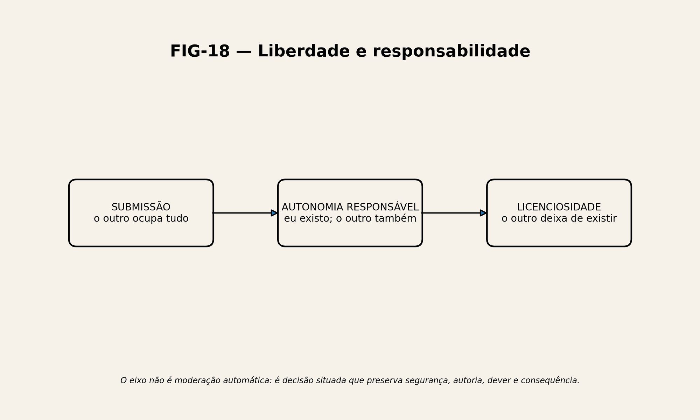

O eixo não é moderação automática entre submissão e licenciosidade. É autonomia responsável: o eu existe, o outro também, e a decisão responde por segurança, dever e consequência.

> **COMANDO DE AUTORIA**
>
> **ASSUMA A SUA PARTE.**
>
> Separe o que não foi sua culpa daquilo que agora está ao alcance de sua resposta. Nomeie quem deve responder pelo dano sem entregar a essa pessoa o governo permanente do seu próximo passo. Depois descreva quem será afetado por sua decisão, quais deveres são reais, quais foram impostos abusivamente, quais riscos exigem proteção e quais danos podem ser reduzidos. Pergunte: estou escolhendo com autoria ou usando a linguagem da liberdade para não responder pelo que faço?

## O que a responsabilidade não é

Responsabilidade não é viver sob acusação permanente. Não é aceitar toda culpa atribuída, explicar-se a quem não possui direito de acesso ou permanecer disponível para manipulação. Também não é prever todas as consequências possíveis, porque nenhuma decisão humana controla o futuro inteiro.

Ela exige algo mais delimitado: reconhecer efeitos razoavelmente previsíveis, cumprir deveres reais, corrigir o que puder ser corrigido e não esconder interesse próprio atrás de uma palavra moralmente atraente. Uma pessoa responsável pode errar. A diferença é que o erro não precisa ser imediatamente rebatizado como expressão de autenticidade.

Há ainda consequências que pertencem ao outro. Alguém pode sofrer porque você estabeleceu um limite legítimo, recusou uma exigência abusiva ou encerrou uma relação que não podia continuar. Reconhecer essa dor não significa assumir que toda dor causada é dano injusto. O critério não é impedir qualquer sofrimento; seria impossível. É não produzir sofrimento evitável por desprezo, mentira, crueldade ou fuga de dever.

Essa distinção protege os dois lados: impede que responsabilidade vire submissão e impede que autonomia vire indiferença.

## Caso do leitor — separe o dano da resposta

Retorne à situação que você escolheu no início do livro. Sem diminuir o que aconteceu, organize-a primeiro em quatro campos:

- **O que aconteceu comigo:** o dano, a omissão, a imposição, seus efeitos e o que não foi minha culpa.
- **O que pertence ao outro:** a responsabilidade que continua sendo da pessoa, instituição ou sistema.
- **O que o contexto limitou:** risco, coerção, dependência, trauma, falta de recursos e alternativas indisponíveis.
- **O que agora é minha responsabilidade:** a resposta que já voltou às minhas mãos.

Depois pergunte:

1. Que consequência minha resposta atual produz?
2. Quem paga por ela?
3. Que comportamento ainda chamo apenas de reação?
4. Que parte posso assumir sem tomar para mim a culpa do outro?

Se ainda existe coerção, vigilância ou perigo, o próximo passo pode ser apenas ampliar proteção e alternativas. Se há liberdade suficiente, não use a ausência de reparação como permissão para adiar indefinidamente o que já depende de você.

## A passagem necessária

A Parte V mostrou o eu emprestado em movimento.

Ele foge da pergunta por meio de atividades que aliviam. Recebe uma missão que responde quem deve ser. Reduz pessoas às funções que cumprem dentro de sua narrativa. E chama de autenticidade a liberdade de agir sem contraditório.

Nada disso prova que prazer, propósito, limite ou autonomia sejam ruins. Prova apenas que palavras boas não imunizam ninguém contra ocupação.

O problema não se resolve trocando uma lista de proibições por outra. Proibir telas, causas, grupos, relacionamentos ou desejos produziria apenas uma nova identidade pronta. A saída precisa devolver ao leitor a capacidade de observar o próprio pensamento, testar a narrativa, pertencer sem desaparecer e construir propósito sem baixá-lo pronto.

A pergunta que encerra esta parte não é “qual voz devo obedecer agora?”.

É mais difícil:

**se tudo o que hoje confirma quem você é desaparecesse amanhã, quem permaneceria para examinar o silêncio?**

É aí que começa o retorno da autoria.

# PARTE VI — O RETORNO DA AUTORIA {#parte-vi}

## Voltar não é retornar ao que você era

Recuperar autoria não significa apagar influências nem encontrar um eu intacto. Significa voltar a participar da resposta.

Metacognição abrirá o pensamento; pertencimento com autoria permitirá vínculo sem desaparecimento; propósito construído transformará identidade em direção revisável.

# CAPÍTULO 22 — SE TUDO DESAPARECESSE AMANHÃ, QUEM PERMANECERIA?

Imagine que, ao acordar, você não tenha acesso às pessoas, grupos, conteúdos, símbolos, frases, ambientes e recompensas que normalmente confirmam a sua identidade. Ninguém está ali para dizer que você pertence. Nenhum perfil repete suas certezas. Nenhum líder interpreta o mundo por você. Nenhuma audiência reage. Nenhum conflito permite provar quem você é por oposição. Nenhuma missão urgente oferece a sensação de indispensabilidade.

O que resta não é vazio no sentido de inexistência. O que resta é o campo onde a autoria pode voltar a ser exercida.

Essa experiência mental não exige que você abandone sua família, sua fé, sua comunidade, suas causas ou seus vínculos. Ela serve para separar sustentação de substituição. Toda pessoa é formada em relação. Toda linguagem é recebida antes de ser examinada. Toda identidade contém heranças, memórias, expectativas e pertencimentos. O problema não é ter sido influenciado. O problema começa quando já não conseguimos observar a influência porque ela se tornou indistinguível de nós.

Metacognição é, em termos simples, a capacidade de observar e regular o próprio processo de pensar. Não significa vigiar cada pensamento até a exaustão. Não significa desconfiar de tudo, paralisar decisões ou transformar a vida numa investigação infinita. Significa criar uma distância suficiente entre o pensamento e a obediência.

Há uma diferença decisiva entre pensar “isso é verdade” e perceber “estou pensando que isso é verdade”. A segunda formulação não nega a possibilidade de verdade. Apenas devolve ao pensamento a condição de objeto examinável.

Essa distância é pequena na linguagem e imensa na prática. Ela impede que toda emoção se transforme em prova, que toda repetição se transforme em realidade, que toda autoridade se transforme em consciência e que toda urgência se transforme em dever.

## A voz que parece sua

Quase nenhum pensamento chega com etiqueta de procedência. Você não pensa: “esta frase foi instalada por repetição num período de vulnerabilidade”. Você pensa a frase. Não sente: “esta culpa foi associada à discordância dentro de um vínculo importante”. Você sente culpa. Não percebe: “esta missão me oferece reconhecimento e proteção contra o vazio”. Você chama a missão de destino.

Por isso, a primeira tarefa não é decidir se você está certo ou errado. É localizar de onde a linguagem veio, que função cumpre e o que exige para continuar parecendo verdadeira.

Pergunte:

- Quando comecei a usar estas palavras?
- Quem as utilizava antes de mim?
- Em que contexto elas se tornaram importantes?
- Que emoção acompanha sua repetição?
- O que ganho ao mantê-las?
- O que temo perder se as revisar?
- Quem é beneficiado pela minha obediência a elas?
- Que custo recai sobre mim?
- Que custo recai sobre outras pessoas?

Essas perguntas não existem para desacreditar automaticamente tudo o que foi recebido. Uma crença herdada pode resistir ao exame e continuar sendo escolhida. Uma tradição pode ser verdadeira, bela e organizadora. Uma comunidade pode transmitir linguagem que amplia discernimento. Um mentor pode oferecer conceitos que devolvem liberdade. A procedência não condena a ideia. Mas a procedência importa porque revela por que algumas ideias parecem intocáveis.

O pensamento autoral não é aquele que nunca recebeu influência. É aquele que consegue dizer: “recebi isto, examinei isto, reconheço seus limites e ainda o escolho”.

## Estou vivendo um processo de fuga identitária?

### Um mapa de investigação, não um teste

> **Fuga identitária não é identificada pelo conteúdo da identidade, mas pela relação que a pessoa passou a manter com a própria consciência.**

A pergunta, portanto, não é “eu tenho fuga identitária?”. Este livro não propõe uma doença, um diagnóstico ou um rótulo que possa ser aplicado a alguém de fora. A pergunta investigável é:

**Em alguma área da minha vida, estou transferindo progressivamente a autoria de quem sou e de como decido?**

Ser religioso ou ateu, conservador ou progressista, militante ou avesso à política, integrante de uma comunidade, profissional dedicado, mãe, pai, artista, influenciador, gamer ou membro de qualquer grupo não responde à pergunta. Nenhum conteúdo identitário, isoladamente, demonstra fuga. O que precisa ser observado é a relação entre influência, consciência, liberdade de exame, pertencimento, responsabilidade e capacidade de revisão.

As três zonas a seguir não são caixas fixas. Uma pessoa pode preservar autoria no trabalho e entregá-la numa relação; pensar livremente numa comunidade e agir sob coerção financeira em casa; atravessar períodos de risco e depois recuperar espaço interno. As zonas servem para localizar movimentos, não para produzir uma sentença sobre quem alguém “é”.

### Autoria preservada

Há autoria preservada quando você recebe influência sem conceder posse sobre sua consciência. Você consegue:

- perguntar e desenvolver com suas palavras por que acredita;
- admitir que sua fonte, seu grupo e você podem errar;
- manter vínculos significativos com pessoas de fora;
- aplicar ao próprio lado critérios semelhantes aos que aplica ao adversário;
- dizer “não sei”, pedir tempo e mudar de opinião;
- revisar uma crença sem sentir que deixa de existir;
- reconhecer outras dimensões de si além do grupo, do papel, da ferida ou da missão;
- perceber consequências e assumir a parte que lhe cabe.

Isso não significa viver em dúvida permanente nem sustentar convicções fracas. Uma crença pode ser profunda, exigente e estável. A autoria aparece no fato de que ela permanece examinável e escolhida, em vez de precisar destruir a pergunta para sobreviver.

### Autoria em risco

A autoria entra em risco quando o vínculo, a missão ou a narrativa começa a exigir proteção contra o exame. Talvez você:

- esconda dúvidas para não perder aprovação;
- repita slogans que não consegue desenvolver;
- interprete crítica à ideia como ataque à sua dignidade;
- use um critério para o seu lado e outro para o lado adversário;
- precise demonstrar lealdade publicamente;
- pare de ouvir pessoas externas ou as classifique antes de escutá-las;
- declare verdade, amor ou justiça, mas opere por permanência no grupo;
- sinta que revisar uma crença ameaça seus vínculos ou sua existência;
- use um dano real como explicação total e licença para não examinar as próprias respostas.

Nenhum item, sozinho, prova fuga identitária. Pessoas escondem perguntas por timidez, prudência, hierarquia profissional ou medo passageiro. Slogans também podem condensar uma ideia que a pessoa compreende. O alerta está no padrão: a liberdade de examinar diminui ao mesmo tempo que aumenta o custo de discordar, a identidade se estreita e as contradições precisam ser protegidas.

### Autoria reduzida ou situação de coerção

Há situações em que não se trata apenas de dificuldade interna. Existem vigilância, ameaça, humilhação, punição ou controle. Relações externas são destruídas. Dinheiro, informação, fé, afeto, sexualidade, corpo ou movimento são administrados por outra pessoa ou sistema. Perguntas produzem retaliação. A fonte decide roupa, vínculos, leitura e futuro. Romper pode aumentar risco de violência, desabrigo, perda de sustento ou separação dos filhos.

Nessa zona, adesão não prova concordância e permanência não prova escolha livre.

> **Não transforme confronto imediato em prova de autoria. Quando existe coerção ou perigo, autoria começa por segurança, apoio e recuperação de alternativas.**

O primeiro gesto pode ser silencioso: reconhecer o que ocorre, buscar uma pessoa confiável, preservar documentos, consultar apoio especializado, organizar recursos e planejar sem alertar quem exerce controle. Este livro não substitui avaliação profissional, proteção jurídica, cuidado em saúde ou rede de apoio.

### Perguntas decisivas

Não some pontos. Não compare resultados com outras pessoas. Não use estas perguntas para acusar um familiar, um parceiro ou uma comunidade. Responda sobre uma área concreta da sua vida e procure relações persistentes entre as respostas:

1. Quem recebe o direito de dizer quem sou?
2. Que pergunta não posso fazer sem punição moral?
3. O que demonstraria que essa explicação está errada?
4. Aplico o mesmo critério ao meu grupo?
5. Que parte da realidade precisei parar de enxergar?
6. Que pessoas deixei de escutar?
7. Qual valor vence quando existe custo?
8. Estou escolhendo ou evitando punição?
9. Quem paga as consequências da minha fidelidade?
10. Quem continuo sendo se essa fonte desaparecer?
11. Minha explicação só admite causalidade de fora para dentro?
12. Uso o dano como autorização para não me examinar?
13. Minha próxima decisão depende de alguém confessar, mudar ou me resgatar?
14. Que parte da minha vida já voltou às minhas mãos?

Um “sim” isolado não prova fuga. O alerta aparece quando há um padrão persistente de:

**liberdade de exame diminuindo + custo da dúvida aumentando + identidade se estreitando + contradições sendo protegidas.**

Mesmo esse padrão não autoriza diagnóstico. Ele indica onde investigar com mais cuidado. Pode revelar influência intensa, dependência, medo, coerção, trauma, necessidade de pertencimento, conflito de valores ou uma combinação dessas condições. A função do mapa é devolver perguntas verificáveis e orientar segurança, exame e resposta.

Você não precisa responder tudo de uma vez. Escolha a pergunta que produz mais resistência e leve-a para a Auditoria Metacognitiva. O mapa localiza a área. A auditoria examina como a resposta está sendo produzida.

## Startes de Autoria — interrompa antes de obedecer

Os **Startes de Autoria** são a forma rápida de iniciar o exame. Não competem com a Matriz NARRATIVA nem com a Auditoria Metacognitiva. Eles indicam por onde começar quando você percebe que uma resposta chegou depressa demais.

**1. PARE.** O que aconteceu antes de alguém dizer o que isso significa?

**2. SEPARE FATO DE INTERPRETAÇÃO.** O que pode ser observado e que significado foi atribuído?

**3. IDENTIFIQUE A NARRATIVA.** Que explicação está organizando a situação e que posição atribui a você?

**4. LOCALIZE O OMITIDO.** Que fato, contexto, pessoa ou alternativa precisou ficar fora?

**5. DESCUBRA O REBATIZADO.** Que comportamento recebeu um nome mais bonito ou mais cruel do que aquilo que produz?

**6. IDENTIFIQUE O VALOR OPERANTE.** Quando existe custo, qual princípio recebe proteção concreta?

**7. TESTE A LÓGICA E A SIMETRIA.** A conclusão decorre dos fatos e o critério permanece quando mudam nomes, lados e interesses?

**8. LOCALIZE OS POLOS.** Que respostas absolutas tentam obrigá-lo a escolher por submissão ou reação?

**9. ENCONTRE O EIXO.** Que critério você aceitaria aplicar mesmo se o resultado contrariasse seu lado?

**10. ASSUMA A SUA PARTE.** O que não foi sua culpa, o que ainda pertence ao outro e o que já voltou às suas mãos?

Os startes interrompem. A auditoria aprofunda. O passo final — transformar exame em decisão e posição responsável — será construído no Capítulo 24.

## A Auditoria Metacognitiva

A Auditoria Metacognitiva não é um teste de pureza. Não existe uma versão totalmente independente de você esperando ser descoberta fora de toda relação. A auditoria serve para verificar se a sua identidade atual comporta exame, revisão, responsabilidade e contato com a realidade.

Ela pode ser aplicada a uma crença, a uma decisão, a uma missão, a um pertencimento ou a um conflito. Seu objetivo não é produzir uma resposta rápida. É tornar visível o sistema que produz a resposta.

### 1. Nomeie a afirmação sem adornos

Retire slogans, insultos, metáforas grandiosas e palavras que já carregam sentença moral. Escreva a afirmação de modo que uma pessoa discordante consiga reconhecer o que está sendo dito.

“Eles querem destruir tudo” é uma frase que contém inimigo, intenção e catástrofe sem demonstrar nenhum dos três. “Discordo da proposta X porque acredito que produzirá o efeito Y” é uma afirmação examinável.

“Minha família nunca me apoiou” pode condensar anos de experiências reais, mas permanece ampla demais para orientar uma decisão justa. “Quando escolhi A, as pessoas B e C responderam com estas condutas específicas” permite distinguir padrão, exceção, memória e interpretação.

Nomear sem adornos não diminui a dor. Impede que a dor seja obrigada a sustentar uma tese maior do que os fatos disponíveis.

### 2. Separe acontecimento, recorte e interpretação

Todo relato seleciona. Isso não torna todo relato falso. Torna necessário saber o que foi incluído, o que ficou de fora e como os elementos foram organizados.

Pergunte:

- O que aconteceu de forma observável?
- Que parte escolhi contar?
- Que parte não considerei?
- Que intenção atribuí às pessoas?
- Que relação causal supus?
- Que interpretação alternativa seria possível sem negar os fatos?

A interpretação autoral não é aquela que se recusa a concluir. É aquela que sabe onde termina o fato e começa a leitura.

### 3. Localize a autoridade

Quem pode corrigir essa crença? Que tipo de evidência seria suficiente? Existe alguém autorizado a discordar sem ser imediatamente classificado como ignorante, mau, invejoso, manipulado ou traidor?

Toda narrativa possui algum centro de validação: um texto, um líder, uma tradição, uma comunidade, uma experiência pessoal, uma instituição, um conjunto de dados ou um princípio. O problema não é haver autoridade. O problema é a autoridade ilimitada, imune a revisão e autorizada a reinterpretar toda objeção como prova de sua própria verdade.

Uma crença que só pode ser confirmada e nunca contrariada não está sendo examinada. Está sendo protegida.

### 4. Descubra o valor operante

Você pode declarar liberdade e agir por medo. Pode declarar amor e operar por controle. Pode declarar justiça e premiar apenas o próprio grupo. Pode declarar família e exigir silêncio. Pode declarar autenticidade e transferir custos. Pode declarar paz e evitar todo conflito necessário.

O valor operante é o que vence quando valores entram em choque.

Não pergunte apenas “em que acredito?”. Pergunte “o que minha conduta protege repetidamente quando preciso escolher?”.

Esse ponto exige coragem porque destrói a inocência da intenção. Muitas pessoas não fazem o mal que condenam. Mas produzem danos porque nunca examinam o valor que realmente governa suas decisões.

### 5. Teste a simetria

Você aceitaria o mesmo princípio se fosse usado pelo grupo adversário? Consideraria a mesma conduta legítima se praticada por alguém de quem você discorda? Aplicaria o mesmo padrão de evidência à crença que deseja rejeitar e àquela que deseja preservar?

A simetria não exige falsa equivalência. Contextos, poderes, riscos e consequências podem ser diferentes. O teste não pergunta se situações distintas são idênticas. Pergunta se você está mudando o critério apenas para proteger a conclusão preferida.

Quando o critério varia conforme a identidade de quem age, talvez você não esteja defendendo um valor. Talvez esteja defendendo pertencimento.

### 6. Calcule o custo da discordância

O que acontece se você disser “não sei”? O que acontece se pedir tempo? O que acontece se revisar publicamente uma opinião? O que acontece se não compartilhar a campanha, não repetir a frase, não participar do ataque, não aceitar o papel que lhe deram?

O custo pode ser emocional: culpa, ansiedade, sensação de deslealdade. Pode ser relacional: silêncio, afastamento, humilhação, ameaça. Pode ser material: perda de trabalho, moradia ou recursos. Pode ser espiritual: medo de condenação. Pode ser identitário: sensação de deixar de existir.

Quanto maior o custo da dúvida, menos a adesão prova convicção.

Isso não significa que toda comunidade que possui consequências seja coercitiva. Todo vínculo possui expectativas e toda escolha possui efeitos. A questão é se a pessoa pode discordar sem ser destruída, se pode sair sem ser perseguida, se pode preservar dignidade e se o conflito admite reparação.

### 7. Examine a função da missão

A missão orienta sua vida ou impede que você encontre a própria vida? Ela organiza capacidades, valores e responsabilidades ou substitui perguntas que você teme responder? Ela permite descanso, revisão e limites? Ou precisa que você permaneça em estado contínuo de urgência para não perceber que já não sabe quem é fora dela?

Um propósito autoral pode exigir esforço, renúncia e perseverança. A diferença é que ele permanece ligado à realidade. Pode ser corrigido por consequências, limites, novas informações e responsabilidades. A missão emprestada transforma qualquer correção em ameaça à identidade.

### 8. Inclua terceiros na equação

A narrativa que afirma libertá-lo produz o quê nas pessoas próximas? Seus limites protegem ou punem? Sua missão cuida ou instrumentaliza? Sua autenticidade reconhece consequências? Sua fé aumenta responsabilidade ou concede licença moral? Sua causa amplia humanidade ou precisa reduzir adversários a caricaturas?

A autoria não é medida apenas pela sensação interna de coerência. Também se revela na capacidade de responder pelos efeitos previsíveis da própria ação.

## Mapa de Retorno da Autoria

O sistema inteiro pode ser lembrado em três movimentos:

**PARE.** Suspenda o automatismo. Separe a ocorrência da explicação e localize a voz que chegou primeiro.

**EXAMINE.** Abra a narrativa, teste lógica e simetria, encontre o valor operante, calcule o custo da dúvida e inclua as pessoas afetadas.

**RESPONDA.** Formule uma decisão situada, responsável e revisável. Autoria não exige certeza total; exige presença consciente no lugar da consequência.

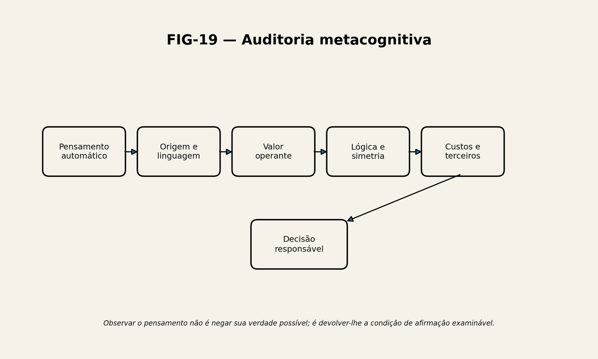

A figura condensa a passagem do pensamento automático à decisão responsável. Ela não promete eliminar a primeira reação. Mostra pontos nos quais a obediência pode deixar de ser automática.

## Caso composto — A mulher que sabia explicar tudo

O caso a seguir combina elementos de diferentes histórias e não corresponde a uma pessoa identificável.

Helena acumulava linguagem. Sabia falar de trauma, padrões, limites, propósito, energia, apego e autonomia. Cada nova palavra lhe oferecia alívio porque transformava confusão em explicação. Quando um relacionamento entrava em conflito, ela localizava rapidamente o rótulo que encerraria a conversa. Quando uma amiga discordava, reconhecia “incompatibilidade de frequência”. Quando o trabalho exigia constância, dizia que seu corpo estava rejeitando ambientes desalinhados.

Parte de suas leituras era útil. Alguns limites eram necessários. Algumas relações realmente precisavam terminar. O problema não estava nos conceitos. Estava no uso que Helena fazia deles.

A linguagem sempre confirmava a decisão que produzia alívio imediato. Nunca exigia que ela reparasse o dano causado, sustentasse uma conversa desconfortável ou admitisse que havia interpretado mal. Seu valor declarado era autenticidade. Seu valor operante era autoproteção contra vergonha.

Quando começou a auditoria, não perguntou “qual rótulo explica minha vida?”. Perguntou “que tipo de conclusão nunca permito que me alcance?”. A resposta foi simples e devastadora: “a conclusão de que, às vezes, eu também erro”.

Esse reconhecimento não anulou sua história. Não transformou abuso em responsabilidade compartilhada. Não exigiu reconciliação. Apenas devolveu uma parte da realidade que sua narrativa havia expulsado.

A partir daí, Helena começou a distinguir proteção de punição, limite de silêncio estratégico, incompatibilidade de incapacidade de negociar. Não abandonou toda a linguagem que aprendera. Passou a usá-la como ferramenta, não como tribunal.

## Contracaso — A convicção que sobreviveu ao exame

Daniel cresceu numa tradição religiosa e permaneceu nela na vida adulta. Durante anos, imaginou que só existiam duas possibilidades: obedecer sem perguntar ou abandonar tudo para provar autonomia. Quando começou a examinar sua fé, temeu que a dúvida fosse traição.

Ele estudou textos, conversou com pessoas de dentro e de fora, reconheceu abusos cometidos em nome da religião e separou esses abusos daquilo que considerava o núcleo de sua crença. Algumas interpretações foram revistas. Alguns líderes perderam autoridade. Alguns vínculos foram reorganizados.

No final, Daniel continuou crendo. A auditoria não o conduziu para fora. Conduziu-o para uma adesão mais responsável. Sua fé deixou de depender da incapacidade de olhar para o contraditório.

Esse contracaso importa porque recuperar autoria não significa chegar à conclusão previamente desejada por este livro. Se o exame só for considerado válido quando produzir afastamento, estaremos oferecendo outra narrativa pronta.

## Metacognição não é ruminação

Há pessoas que, ao aprenderem a observar o pensamento, transformam cada decisão em labirinto. Reabrem questões encerradas, procuram certeza absoluta, testam continuamente a pureza das motivações e suspeitam de toda influência. Isso não é autoria ampliada. Pode ser apenas outra forma de paralisia.

A auditoria precisa terminar em decisão situada.

Você nunca terá todos os dados. Nunca conhecerá integralmente as intenções alheias. Nunca eliminará toda contradição interna. Autoria não é onisciência. É disposição para decidir com os elementos disponíveis, declarar limites, revisar quando necessário e responder pelas consequências.

O pensamento autoral aceita a frase: “esta é a melhor decisão que consigo sustentar agora, por estes motivos, dentro destes limites”.

Essa frase contém firmeza e revisabilidade. Não exige certeza total para agir, nem transforma toda ação em destino irreversível.

## Quando o corpo reage antes da linguagem

Nem toda captura aparece primeiro como argumento. Às vezes, o corpo percebe o custo antes de a pessoa conseguir nomeá-lo: tensão ao abrir uma conversa, aceleração diante de uma notificação, exaustão depois de encontros específicos, medo desproporcional de decepcionar, alívio imediato quando uma decisão é tomada por outra pessoa.

Esses sinais não funcionam como veredictos. O corpo não é infalível, e sensações intensas não provam automaticamente que um ambiente é perigoso ou que uma escolha é correta. Ansiedade pode aparecer diante do risco real, mas também diante de mudanças necessárias. Alívio pode acompanhar uma decisão sábia, mas também uma fuga.

O valor do corpo está em fornecer dados que a narrativa talvez esteja tentando silenciar. Em vez de obedecer cegamente ao sinal, inclua-o na auditoria: o que acontece antes da reação? Que pensamento a acompanha? Que escolha se torna impossível? Que padrão se repete? O corpo não substitui critério; ele amplia o campo de observação.

Também é importante notar que algumas pessoas foram treinadas a ignorar o próprio desconforto em nome de lealdade, produtividade, fé, amor ou missão. Outras foram treinadas a tratar qualquer desconforto como prova de violência. Ambos os extremos retiram contexto. A autoria pergunta o que a reação significa nesta situação concreta, quais fatos a sustentam e que resposta preserva segurança e realidade.

## Fios de retorno — os primeiros gestos que não pareciam heroicos

A recuperação da autoria raramente começa com uma ruptura perfeita. Costuma começar com um intervalo pequeno entre a ordem recebida e a resposta.

Helena estava dentro do carro, estacionada duas ruas antes de casa, quando o telefone vibrou pela quarta vez. O corpo conhecia a sequência: aperto no peito, mãos frias, pressa de explicar. Em vez de responder, colocou o aparelho no porta-luvas e escreveu num papel: “Fato: estou vinte minutos atrasada. Interpretação prevista: estou desrespeitando a relação. Consequência temida: silêncio, acusação, vigilância”. Depois ligou para a profissional que a ajudava a organizar segurança. Não se sentiu livre. Sentiu medo com um pouco mais de mapa.

Caio abriu o histórico de vídeos e escolheu um dos que mais havia compartilhado. Pela primeira vez, não assistiu para sentir confirmação. Anotou as afirmações verificáveis e percebeu quantas frases dependiam de “sempre”, “toda mulher” e “nenhum homem”. Enviou ao amigo que havia silenciado: “Eu tratei sua pergunta como ataque. Quero ouvi-la de novo”. O amigo não respondeu naquela hora. Autoria não controlava o perdão.

Alex escreveu o nome que usava no centro de uma folha. Ao redor, acrescentou: “experiência afetiva”, “amizade”, “trabalho”, “humor”, “família”, “medos”, “corpo”, “coisas que ainda não sei”. Ficou olhando o espaço ocupado pelas outras palavras. Não precisou abandonar o nome. Precisou devolvê-lo ao tamanho de ferramenta.

Rafael abriu os documentos do grupo e fez duas colunas: benefícios recebidos e condutas que havia justificado. Durante muito tempo, imaginara que reconhecer um lado apagaria o outro. A folha permitiu sustentar ambos. Na mesma semana, recusou uma reunião fechada e recebeu mensagens insinuando ingratidão. Não respondeu com denúncia pública. Também não pediu desculpas por precisar pensar.

Marina passou uma tarde inteira com Joana sem fotografar a mesa. No início, o silêncio parecia desperdício. Depois, percebeu que não sabia mais como registrar uma memória apenas no corpo. Quando a mão foi automaticamente em direção ao telefone, parou no meio. Joana viu o gesto. Não comentou. Continuou contando a história.

Nenhuma dessas cenas conclui uma recuperação. Helena ainda precisava de proteção. Caio ainda sentia raiva. Alex ainda temia perder comunidade. Rafael ainda atravessaria luto. Marina ainda dependia economicamente da própria imagem.

Mas cada um havia produzido uma diferença mínima e decisiva:

> **a resposta já não ocorreu no mesmo instante em que a narrativa falou.**

## Um registro de sete dias

Para transformar a auditoria em prática sem cair em vigilância infinita, escolha uma única crença ou decisão e observe-a por sete dias. Registre apenas cinco elementos:

1.  a situação que ativou a crença;
2.  a frase automática que apareceu;
3.  a emoção e a reação corporal;
4.  a ação que você sentiu vontade de executar;
5.  a consequência produzida.

No final, procure padrões. A mesma frase aparece em contextos diferentes? A ação sempre busca alívio imediato? A consequência confirma a crença porque você criou as condições para confirmá-la? Há exceções que sua narrativa não registra?

Esse exercício não serve para produzir certeza clínica nem para diagnosticar a si mesmo. Serve para devolver sequência ao que antes parecia destino. Quando você enxerga situação, pensamento, emoção, ação e consequência como partes de um processo, ganha pontos de intervenção. Talvez não consiga impedir a primeira frase. Pode, porém, deixar de tratá-la como ordem.

## O silêncio depois das vozes

Se todas as fontes de confirmação desaparecessem, talvez você inicialmente sentisse desorientação. Isso não prova ausência de identidade. Prova que parte dela era sustentada em relação. O retorno da autoria não exige desprezar essa relação. Exige descobrir o que você consegue manter quando a recompensa social é retirada.

Quais valores continuam importantes sem aplauso? Que responsabilidade permanece quando ninguém está observando? Que crença você ainda escolheria se não pudesse usá-la para pertencer? Que missão continuaria válida se não lhe garantisse superioridade, reconhecimento ou inimigo?

A resposta não aparece inteira. Ela é construída por decisões reiteradas.

> **COMANDO DE AUTORIA: OBSERVE QUEM ESTÁ PENSANDO.**

Não para expulsar todas as vozes. Para reconhecer quais delas você está disposto a transformar em escolha.

# CAPÍTULO 23 — PERTENCER SEM DESAPARECER

Nenhuma pessoa se constrói sozinha. Aprendemos a falar porque alguém falou conosco. Formamos critérios dentro de relações. Descobrimos capacidades quando alguém as reconhece. Somos sustentados por famílias, amizades, comunidades, tradições, equipes, igrejas, movimentos, profissões e lugares.

Por isso, o objetivo deste capítulo não é ensinar independência absoluta. A fantasia de não precisar de ninguém pode ser tão capturante quanto a necessidade de pertencer a qualquer custo.

Pertencimento saudável não elimina influência. Ele cria condições para que a influência não substitua autoria.

## O direito de ser mais do que o grupo

Todo grupo simplifica. Para coordenar ação, precisa de nomes, regras, histórias, símbolos e expectativas. Isso pode ser legítimo. Uma equipe precisa saber o que está tentando realizar. Uma tradição precisa transmitir práticas. Uma comunidade precisa proteger limites mínimos.

O problema aparece quando a identidade coletiva reivindica o direito de definir a pessoa inteira.

Você pode ser cristão sem ser apenas a interpretação de um líder. Pode ser feminista sem ser reduzida à corrente dominante do ambiente. Pode ser conservador sem aceitar toda ação de um partido. Pode pertencer a uma profissão sem transformar desempenho em valor humano. Pode amar uma família sem repetir todos os padrões familiares. Pode integrar uma comunidade LGBTQIA+ sem adotar todas as leituras políticas associadas a ela. Pode participar de uma causa e ainda discordar de estratégias, linguagem e alianças.

A identidade maior que o grupo não é identidade contra o grupo. É a preservação de dimensões que o pertencimento não esgota.

Pergunte: quem sou eu aqui além do papel que desempenho? Que partes minhas não precisam ser úteis para merecer existência? Que vínculos possuo fora desta redoma? Que valores não dependem desta comunidade para continuar valendo?

## Critérios de pertencimento saudável

Nenhum critério isolado decide a qualidade de uma comunidade. Grupos reais são imperfeitos, atravessados por conflitos e assimetrias. O objetivo não é criar um selo automático de “saudável” ou “tóxico”. É oferecer perguntas capazes de revelar o grau de autoria permitido.

### É possível discordar sem perder a dignidade?

Discordância possui consequências. Uma associação pode excluir quem viola princípios centrais. Uma igreja pode definir doutrinas. Uma equipe pode exigir métodos. Um movimento pode delimitar objetivos. O teste não é ausência de fronteiras.

O teste é como a discordância é tratada.

A pessoa é ouvida antes de ser classificada? A crítica pode ser respondida sem humilhação? Existe diferença entre erro, divergência e traição? Há possibilidade de revisão para ambos os lados? A reputação do indivíduo é destruída para proteger a imagem do grupo?

Uma comunidade que exige concordância total não produz unidade. Produz silêncio.

### A autoridade possui limites claros?

Toda comunidade distribui autoridade. Pais possuem responsabilidades sobre filhos. Líderes coordenam. Professores ensinam. Especialistas conhecem áreas que outros não conhecem. Autoridade não é sinônimo de abuso.

Mas autoridade legítima precisa conhecer seu campo e seus limites.

Um líder espiritual não se torna automaticamente especialista em saúde, finanças, casamento e política. Um terapeuta não recebe direito sobre todas as decisões do cliente. Um influenciador não conhece a vida dos seguidores. Um movimento não pode reivindicar interpretação total da realidade.

Quanto mais uma autoridade se expande para áreas que não pode justificar, maior o risco de substituir a consciência de quem a segue.

### Existe saída sem destruição?

Sair pode doer. Vínculos compartilhados produzem luto. Comunidades podem discordar da decisão. Nem toda tristeza diante da saída é coerção.

A pergunta é se a pessoa pode partir sem perseguição, ameaça, exposição, chantagem ou apagamento completo de sua história. O grupo aceita que alguém possa ter contribuído sinceramente e ainda escolher outro caminho? Ou precisa reescrever todo ex-integrante como inimigo para preservar a narrativa?

A forma como uma comunidade trata quem sai revela o tipo de pertencimento que oferecia a quem ficava.

### O conflito admite reparação?

Grupos que fingem não ter conflito geralmente o escondem. Pertencimento saudável não é harmonia contínua. É capacidade de nomear tensão sem transformar qualquer desconforto em guerra.

Há canais para reclamação? Pessoas com menos poder conseguem falar? Erros de líderes são reconhecidos? Pedidos de desculpas produzem mudança? Ou a responsabilidade sempre desce a hierarquia e nunca sobe?

Reparação não exige perfeição. Exige que a estrutura não dependa da inocência permanente de quem possui autoridade.

### A pessoa mantém vínculos fora da comunidade?

Redomas se fortalecem quando todas as relações significativas passam pelo mesmo centro. Família, amizade, trabalho, lazer, informação e espiritualidade são absorvidos pelo grupo. Qualquer ameaça ao pertencimento se torna ameaça à vida inteira.

Comunidades saudáveis não precisam controlar todas as pontes. Podem preferir certos vínculos, alertar sobre riscos e proteger valores, mas não exigem que toda alteridade desapareça.

A capacidade de conversar com pessoas diferentes não enfraquece necessariamente a convicção. Muitas vezes, impede que a convicção se sustente apenas por isolamento.

## Fé sem entrega total da consciência

A fé merece tratamento específico porque toca aquilo que muitas pessoas consideram absoluto. Uma tradição religiosa não é apenas clube social. Pode organizar sentido, moralidade, esperança, comunidade, história e transcendência.

Reconhecer isso impede duas simplificações: chamar toda fé de captura e declarar toda autoridade religiosa imune a exame.

Crer não exige acreditar que todo representante de Deus fala por Deus. Obedecer a uma tradição não exige abandonar consciência, contexto e responsabilidade. Submeter-se voluntariamente a práticas espirituais não significa conceder a uma pessoa poder ilimitado sobre a própria vida.

A fé que sobrevive ao exame não se torna menor. Torna-se menos dependente do medo de perguntar.

Isso também significa proteger a distinção entre questionar uma interpretação e atacar o sagrado de alguém. O livro não precisa negar a fé para defender autoria. Precisa impedir que a linguagem do sagrado seja usada para bloquear todo contraditório, justificar abuso ou impedir saída.

## Amor sem autoapagamento

Relações íntimas exigem concessão. Ninguém constrói vida compartilhada preservando todas as preferências individuais. Casamentos, amizades, famílias e comunidades dependem de negociação, paciência, responsabilidade e renúncia.

Autoapagamento não é qualquer renúncia. É o processo em que a pessoa perde progressivamente o direito de perceber, nomear, desejar, discordar e existir fora da necessidade do outro.

O amor autoral consegue dizer “nós” sem apagar “eu”. Consegue cuidar sem transformar cuidado em identidade única. Consegue reconhecer deveres sem usar dever para legitimar violência. Consegue permanecer por compromisso e sair por segurança quando a permanência exige destruição.

Não existe fórmula universal para decidir quando ficar ou sair. Existem critérios: risco, coerção, possibilidade de reparação, reciprocidade, responsabilidade compartilhada, proteção de crianças, dependência material, história e limites reais.

A autoria não condena quem permaneceu para sobreviver. Também não condena quem precisou partir. Ela devolve à pessoa o direito de examinar a situação sem receber do livro uma sentença pronta.

## Fios de pertencimento — vínculos que não exigiram senha

Helena reencontrou a irmã numa padaria pequena, perto do lugar onde fazia atendimento. Chegou vinte minutos antes e escolheu uma mesa de onde conseguia ver a porta. Tinha preparado explicações, justificativas e pedidos de desculpa.

Quando a irmã sentou, Helena disse apenas: “Eu não contei porque achei que você me obrigaria a sair antes de eu conseguir”.

A irmã respirou fundo. Havia raiva, preocupação e perguntas. Mas respondeu:

“Eu não vou decidir por você. Quero ajudar você a ficar mais segura.”

Helena começou a chorar sem tentar transformar o choro em mensagem útil. A relação não exigia que ela provasse força nem que adotasse uma decisão imediata. Oferecia presença com limite e realidade.

Alex entrou em outro grupo menor, indicado por uma pessoa de confiança. Na primeira conversa, disse que não sabia qual palavra usaria dali a um ano. Esperou a correção. Uma participante respondeu: “Então hoje você sabe que não sabe”. O encontro seguiu para outro assunto. A comunidade não precisou resolver Alex para acolhê-lo.

Rafael procurou um antigo colega de quem se afastara quando entrou no círculo do mentor. Esperava ouvir “eu avisei”. O colega não disse. Perguntou o que Rafael precisava reparar e o que ainda desejava conservar do período vivido. A conversa permitiu gratidão sem imunidade e crítica sem destruição total da própria biografia.

Pertencimento com autoria não é um ambiente onde ninguém discorda, sente raiva ou estabelece fronteiras. É um vínculo em que a pessoa não precisa entregar a capacidade de pensar para continuar merecendo dignidade.

Os três encontros tiveram algo em comum: ninguém ofereceu uma nova identidade pronta para substituir a anterior. Ofereceram relação suficiente para que a pergunta continuasse aberta.

## Caso composto — O homem que só existia dentro da causa

O caso a seguir é composto.

Rafael encontrou numa organização política aquilo que nunca havia encontrado em casa: linguagem, reconhecimento, função e irmãos de luta. Pela primeira vez, sua indignação parecia útil. Ele aprendeu, estudou, organizou eventos e desenvolveu competências reais.

O pertencimento não era falso. A causa também não era necessariamente injusta. O problema começou quando todas as relações externas passaram a ser medidas pela utilidade política. Amigos que não participavam eram superficiais. Familiares que questionavam estratégias eram cúmplices do inimigo. Descanso virou culpa. Dúvida virou privilégio.

Quando Rafael discordou de uma decisão interna, não conseguiu formular a crítica sem sentir que estava traindo a própria existência. A organização não era apenas o que ele fazia. Era a prova de que sua vida tinha valor.

A recuperação não exigiu que abandonasse toda posição política. Começou quando ele reconstruiu vínculos que não dependiam de alinhamento total, retomou uma atividade sem função militante e aceitou que poderia servir à justiça sem pertencer a uma única estrutura.

Mais tarde, decidiu permanecer na causa, mas reduziu sua dependência identitária. Passou a discordar sem teatralizar ruptura, a reconhecer limites sem demonizar todos e a aceitar que nenhuma organização tinha direito sobre sua pessoa inteira.

## Contracaso — A comunidade que suportou a diferença

Uma comunidade de bairro organizou-se para cuidar de idosos, crianças e famílias em insegurança alimentar. Seus membros possuíam crenças religiosas e posições políticas diferentes. Havia conflitos. Em determinado momento, duas lideranças discordaram publicamente sobre a forma de distribuir recursos.

Em vez de transformar a divergência em prova de caráter, o grupo publicou os critérios, revisou os dados, ouviu os envolvidos e alterou parte do processo. Nenhuma liderança foi declarada infalível. Ninguém precisou fingir que o conflito não existia.

O pertencimento se fortaleceu não porque todos concordaram, mas porque a comunidade demonstrou que a discordância não precisava destruir dignidade, vínculo e finalidade comum.

Esse contracaso é importante porque grupos podem ampliar autoria. Uma boa comunidade não apenas aceita pessoas autônomas; ajuda a formar pessoas capazes de responsabilidade, cooperação e revisão.

## Apoio que devolve movimento

Há formas de pertencimento que se organizam ao redor de uma ferida compartilhada. Nomear o dano, encontrar testemunhas e deixar de sofrer sozinho pode restaurar dignidade. O vínculo se torna problemático quando precisa que seus membros permaneçam impotentes para continuar existindo.

Uma comunidade responsável reconhece a injustiça sem transformar “ferido” na única identidade disponível. Não exige que a pessoa conte a dor repetidamente, não trata melhora como traição, não depende de um inimigo eterno e não oferece pertencimento em troca da renúncia à própria parte. Apoio não substitui ação: aumenta segurança, recursos, linguagem e capacidade para que a pessoa possa agir.

Isso também vale para quem acolhe. Ajudar não é assumir governo sobre a vida do outro. É possível oferecer abrigo, informação, escuta e companhia sem converter cuidado em autoridade total. A pergunta de um apoio autoral não é “como faço você escolher o que considero certo?”, mas “do que você precisa para perceber alternativas, decidir com mais liberdade e responder com segurança?”.

Quando houve dano entre membros, reparação e reintegração — se forem possíveis e desejadas — exigem responsabilidade de todos. Quem causou o dano não pode exigir que o tempo apague sua parte. Quem sofreu não precisa oferecer proximidade para provar cura. A comunidade não deve silenciar o conflito para proteger a própria imagem. Ela pode preservar dignidade, exigir mudança observável e admitir que algumas relações não serão restauradas.

O pertencimento que devolve autoria celebra não apenas a chegada de alguém, mas também sua recuperação de movimento. Quem melhora não perde o direito de pertencer. Quem discorda não precisa virar inimigo. Quem sai não precisa ter a história destruída para que os demais continuem.

## A diferença entre lealdade e submissão identitária

Lealdade é uma disposição de permanecer responsável por um vínculo, uma pessoa ou uma causa mesmo quando a conveniência muda. Ela pode exigir sacrifício. Pode sustentar promessas em períodos difíceis. Sem alguma forma de lealdade, relações se tornam descartáveis e comunidades incapazes de atravessar conflito.

Submissão identitária é diferente. Ela exige que a pessoa entregue o direito de interpretar a própria experiência para provar fidelidade. A lealdade pode conviver com pergunta; a submissão precisa que a pergunta pareça traição. A lealdade reconhece deveres recíprocos; a submissão concentra dever num lado e inocência no outro. A lealdade pode dizer “continuo aqui e preciso que isto mude”. A submissão só reconhece “continuo aqui porque não tenho direito de nomear o que vejo”.

Essa distinção protege tanto o compromisso quanto a liberdade. Sem ela, qualquer permanência é chamada de apagamento e qualquer saída é chamada de coragem. A vida real é mais exigente. Há pessoas que permanecem por responsabilidade e pessoas que permanecem por medo. Há pessoas que saem para preservar vida e pessoas que saem para evitar toda consequência. A autoria não avalia apenas o movimento externo. Examina função, contexto, alternativas e efeitos.

## O grupo dentro de você

Mesmo depois de sair de uma comunidade, a comunidade pode continuar operando internamente. A pessoa antecipa críticas, sente culpa diante de escolhas permitidas, organiza decisões para responder a uma autoridade ausente e mantém conversas imaginárias com quem já não possui poder formal.

Isso não significa que a saída falhou. Significa que pertencimentos profundos deixam linguagem, hábitos e reflexos. A reconstrução exige tempo. Às vezes, também exige apoio profissional, especialmente quando houve coerção, ameaça ou trauma.

O objetivo não é apagar toda marca do grupo. Algumas marcas são recursos. Outras precisam ser reinterpretadas. O retorno da autoria acontece quando a voz internalizada deixa de ter poder automático e passa a ser uma entre as vozes que podem ser ouvidas, confrontadas e escolhidas.

Por isso, pertencer sem desaparecer inclui aprender a sair por dentro. Não basta mudar de endereço, perfil ou círculo social se a antiga estrutura continua definindo o que você pode pensar. Da mesma forma, não basta permanecer fisicamente num grupo se você só consegue preservar identidade por meio de silêncio interno e dissociação de si.

## Pertencer não é concordar pouco

Há um erro comum na busca de equilíbrio: imaginar que pertencimento saudável significa sempre ocupar posição intermediária. Não significa.

Você pode ter convicções fortes. Pode defender uma doutrina específica, uma causa exigente ou um conjunto rigoroso de práticas. O eixo não é moderação automática. É critério.

Uma comunidade pode exigir compromisso elevado sem capturar identidade, desde que sua autoridade seja delimitada, suas regras sejam claras, sua crítica seja possível e sua dignidade não dependa da submissão total.

Da mesma forma, um grupo aparentemente flexível pode produzir forte controle por meio de aprovação social, ambiguidade, exclusão indireta e medo de cancelamento.

Não examine apenas o discurso de liberdade. Observe a experiência concreta de quem pergunta, discorda, erra e sai.

## A solidão não é prova de autoria

Depois de uma experiência de captura, algumas pessoas transformam isolamento em virtude. Recusam novos vínculos, suspeitam de toda comunidade e consideram dependência qualquer necessidade afetiva.

Essa reação é compreensível, mas não precisa virar destino.

A necessidade de conexão não é fraqueza moral. Somos seres relacionais. O desafio não é eliminar a necessidade de pertencer, mas impedir que ela seja explorada para substituir consciência.

Autoria sem vínculo pode se tornar rigidez. Vínculo sem autoria pode se tornar desaparecimento. A tarefa é sustentar ambos.

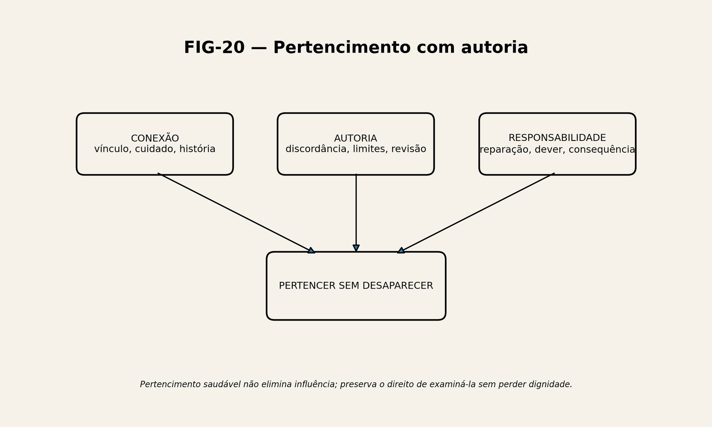

Pertencer sem desaparecer exige três elementos simultâneos: conexão, autoria e responsabilidade. Conexão sem autoria pode virar fusão. Autoria sem conexão pode virar rigidez defensiva. Ambas sem responsabilidade podem usar o outro sem reconhecê-lo.

Você não precisa provar independência ficando sozinho. Precisa construir relações em que sua presença não dependa de fingir que não vê, não sente ou não pensa.

> **COMANDO DE AUTORIA: PERTENÇA SEM ENTREGAR A CONSCIÊNCIA.**

Pertencer com autoria é aceitar influência sem conceder posse. É receber linguagem sem perder o direito de examiná-la. É amar pessoas e causas sem exigir que elas respondam por sua identidade inteira.

# CAPÍTULO 24 — PROPÓSITO NÃO SE BAIXA

Depois de recuperar a capacidade de observar o pensamento e de pertencer sem desaparecer, resta a pergunta que atravessou o livro desde o início: o que fazer da própria vida?

A promessa de um propósito pronto é sedutora porque resolve muitas angústias de uma vez. Diz quem você é, qual problema veio resolver, quem precisa de você e por que sua dor aconteceu. Converte acaso em destino, capacidade em obrigação e desejo em chamado.

Às vezes, essa linguagem nomeia uma direção verdadeira. Muitas pessoas reconhecem vocação com clareza e constroem vidas coerentes a partir dela. O problema não é sentir chamado. O problema é tratar qualquer formulação de propósito como resposta completa, imutável e imune à realidade.

Propósito não se baixa porque não chega inteiro de fora. Ele é construído no encontro entre aquilo que você valoriza, aquilo que sabe e pode aprender, a realidade que existe, as pessoas por quem responde, os limites que possui e o serviço que decide oferecer.

## Propósito não é essência secreta

A ideia de que existe uma única missão correta escondida dentro de você pode produzir mais ansiedade do que direção. Cada escolha parece arriscada, porque escolher errado significaria desperdiçar a vida verdadeira.

Mas vidas humanas não são provas com uma única resposta. A mesma pessoa pode construir propósitos legítimos em diferentes fases. Pode cuidar de filhos, criar uma empresa, ensinar, escrever, servir numa comunidade, recuperar saúde, acompanhar alguém doente ou reconstruir a própria vida.

Essas direções não precisam competir para revelar uma essência final.

Propósito é mais próximo de compromisso organizado do que de senha espiritual. Ele orienta decisões, distribui energia e conecta ação a significado. Pode ser estável sem ser imóvel. Pode ser profundo sem ser grandioso. Pode servir poucas pessoas e ainda ser real.

## Os elementos de um propósito construído

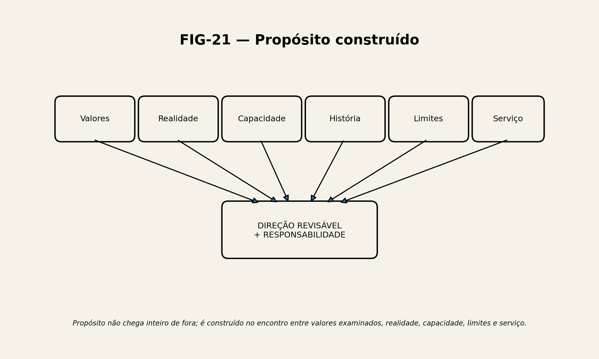

Propósito não chega inteiro de fora nem é extraído como essência secreta. É uma direção revisável construída no encontro entre valores, realidade, capacidade, história, limites, responsabilidade e serviço.

### Valores examinados

Propósito começa pelo que você está disposto a proteger quando escolhas reais entram em conflito.

Não basta declarar amor, liberdade, verdade, justiça ou família. É preciso definir como esses valores aparecem em condutas, quais limites possuem e como se relacionam.

Um propósito construído não usa valores como decoração. Usa-os como critérios.

Pergunte: que tipo de pessoa quero me tornar enquanto faço isto? Que valor precisa continuar operando quando o resultado demora? Que conduta seria incompatível com a missão, mesmo que aumentasse sucesso?

### Realidade

Propósito que não encontra realidade vira fantasia de identidade.

A realidade inclui necessidades concretas, dados, recursos, tempo, mercado, contexto, idade, saúde, leis, responsabilidades e consequências. Não para matar desejo, mas para transformá-lo em ação possível.

Uma pessoa pode sentir propósito em escrever, mas precisa aprender a escrever, terminar textos, aceitar revisão e encontrar leitores. Pode desejar cuidar, mas precisa conhecer limites técnicos e não prometer o que não pode oferecer. Pode querer liderar, mas precisa suportar responsabilidade, prestação de contas e efeitos sobre outros.

A realidade não é inimiga do propósito. É o lugar onde ele deixa de ser imagem e se torna prática.

### Capacidade e aprendizagem

Você não precisa estar pronto para começar, mas precisa reconhecer o que a tarefa exige. Propósito não substitui competência.

Capacidades atuais indicam possibilidades. Limitações indicam caminhos de aprendizagem, parceria ou mudança de formato. Nenhum chamado autoriza irresponsabilidade técnica.

Também é importante distinguir capacidade de obrigação. Ser bom em algo não significa que você deve dedicar a vida inteira a isso. Talento pode servir diferentes direções. O fato de outras pessoas precisarem da sua habilidade não lhes concede propriedade sobre ela.

### História

Sua história importa porque revela sensibilidades, feridas, recursos, temas recorrentes e conhecimentos incorporados. Mas história não é sentença.

Uma pessoa que sofreu pode transformar experiência em serviço. Também pode escolher não fazer da dor uma profissão. Ninguém deve ao mundo uma obra construída a partir do próprio trauma.

O passado pode informar propósito sem aprisionar identidade. Você não precisa repetir a ferida para provar que a superou, nem expor intimidade para legitimar autoridade.

### Limites

Todo propósito real encontra limites. Corpo, tempo, dinheiro, saúde, cuidado, leis, relações e contexto impõem fronteiras.

A narrativa grandiosa trata limite como falta de fé, disciplina ou coragem. A autoria pergunta o que pode ser sustentado sem destruir a pessoa e aqueles por quem ela responde.

Limite não é sempre desistência. Muitas vezes, é o que permite continuidade.

### Responsabilidade

Propósito autoral não termina na satisfação de quem o executa. Ele inclui pessoas afetadas, promessas feitas, recursos utilizados e danos possíveis.

Quanto maior o alcance, maior a necessidade de responsabilidade. Uma missão não se torna boa apenas porque produz sentido para seu autor.

Pergunte: quem paga o preço desta escolha? Quem assume o trabalho invisível? Que dependências estou criando? Que promessa não tenho condições de cumprir? Como corrigirei erros? Que parte do resultado depende de mim e que parte não controlo?

### Serviço

Serviço não significa autoabandono. Significa reconhecer que propósito ganha forma quando produz algum tipo de contribuição além da autopreservação da identidade.

Essa contribuição pode ser cuidado, beleza, conhecimento, organização, proteção, criação, sustento, presença ou reparação. Não precisa ser pública. Não precisa ser heroica.

O serviço autoral não transforma as pessoas em plateia da sua missão. Ele pergunta o que elas realmente precisam e aceita que a resposta possa corrigir a imagem que você deseja ter de si.

## Propósito e sustento material

Há discursos sobre propósito que ignoram dinheiro como se necessidade material fosse sinal de pouca evolução. Essa romantização costuma ser paga por alguém: família, parceiro, trabalhador invisível, dívida ou exaustão.

Construir propósito inclui perguntar como a vida será sustentada. Trabalho remunerado não precisa conter sozinho todo o sentido da existência. Uma profissão pode financiar uma contribuição realizada em outro espaço. Um projeto autoral pode crescer gradualmente. Uma vocação pode exigir desenho financeiro, prazo, reserva, parceria e adaptação.

Também não há desonra em desejar que o próprio trabalho significativo produza renda. O problema não é monetizar. É transformar necessidade de venda em autorização para prometer o que não pode cumprir, fabricar urgência, explorar vulnerabilidade ou medir valor humano apenas por conversão.

A autoria econômica reconhece limites sem reduzir a vida ao dinheiro. Pergunta quanto custa, quem trabalha, quem assume risco, que dependência será criada e que modelo permite continuidade. Propósito que só existe enquanto alguém absorve silenciosamente seus custos ainda não encontrou responsabilidade suficiente.

## Propósito em fases de sobrevivência

Nem toda etapa da vida permite grandes projetos. Há períodos em que propósito é atravessar tratamento, proteger filhos, reorganizar finanças, sair de perigo, cuidar de alguém ou recuperar capacidade básica de decisão.

Chamar essas fases de ausência de propósito é uma violência adicional. Sobreviver pode ser uma tarefa moral e concreta. Recuperar sono, organizar documentos, pedir ajuda, aprender a dizer não ou reconstruir rotina pode ser o trabalho autoral possível.

Isso não significa glorificar sofrimento. Significa recusar a ideia de que só vidas expansivas, públicas e produtivas possuem direção. Propósito também pode ser conservação, cura, presença e preparação.

Quando a realidade mudar, a direção pode mudar com ela. A pessoa não precisa transformar uma fase de sobrevivência em identidade permanente, nem desprezá-la por não parecer grandiosa.

## Como saber se a direção está viva

Um propósito construído precisa de revisão periódica. Pergunte, em intervalos definidos:

- esta direção ainda expressa os valores que escolho?
- a realidade confirma alguma utilidade?
- o custo permanece sustentável?
- estou aprendendo ou apenas defendendo uma imagem?
- as pessoas afetadas conseguem falar?
- continuo capaz de descansar, amar e existir fora da missão?
- o que precisa ser encerrado, delegado ou corrigido?

Revisão não é falta de compromisso. É manutenção de autoria. Projetos abandonados tarde demais podem causar tanto dano quanto projetos abandonados cedo demais. O critério não é perseverar sempre nem mudar sempre. É responder honestamente ao que a realidade passou a mostrar.

Uma profecia identitária exige confirmação. Um projeto de vida admite aprendizagem. A primeira pergunta “quem devo provar que sou?”. O segundo pergunta “que direção consigo sustentar, corrigir e servir nas condições reais que possuo?”.

## Da missão pronta ao projeto de vida

Uma missão pronta costuma falar em absolutos: “você nasceu para”, “só será feliz quando”, “se não fizer, estará traindo seu dom”. Um propósito construído fala em compromissos: “decido dedicar esta fase”, “quero desenvolver esta contribuição”, “revisarei esta direção à luz da realidade”.

A diferença não está apenas na linguagem. Está na relação com a revisão.

O propósito construído pode mudar sem destruir a pessoa. Ele não precisa fingir que todo desvio fazia parte de um plano. Pode admitir perda, erro, acaso e recomeço.

Isso não o torna superficial. Torna-o humano.

## Fios de caso — quando o propósito deixou de provar identidade

Marina reorganizou o trabalho sem anunciar uma “nova versão de si”. Criou dias sem publicação, recusou transformar conversas privadas em conteúdo e manteve atividades que não pretendia monetizar. A audiência caiu durante algumas semanas. O medo voltou.

Antes, a queda significaria que ela estava desaparecendo. Agora, tornou-se um dado a ser enfrentado: rever estratégia, ajustar renda, cumprir contratos e preservar limites. Marina continuou influenciando pessoas. A diferença era que já não precisava oferecer a própria vida inteira como prova da mensagem.

Helena escolheu uma formação na área de cuidado, mas não a apresentou como destino inevitável. Estudou limites técnicos, calculou custos, manteve outra fonte de renda durante a transição e decidiu quais partes da própria história não seriam usadas profissionalmente.

Cuidar continuava sendo um valor. Deixava de ser a condição para merecer amor.

Quando alguém perguntou se ela sentia que “tudo havia acontecido para prepará-la”, Helena demorou antes de responder.

“Não sei por que tudo aconteceu”, disse. “Sei o que decidi fazer com uma parte.”

A frase não oferecia uma narrativa total. Oferecia direção suficiente.

Propósito construído não apaga o medo, não elimina a influência e não produz certeza permanente. Ele muda a relação com a escolha: o trabalho, a missão e a contribuição podem ser importantes sem receber o direito de possuir a pessoa.

## Caso composto — A missão que nasceu da humilhação

O caso a seguir é composto.

Marcos passou parte da juventude sendo tratado como incapaz. Quando finalmente obteve reconhecimento profissional, prometeu que nunca mais seria ignorado. Começou a ensinar outras pessoas e descobriu talento real para comunicação.

Com o tempo, transformou a experiência em missão: provar que qualquer pessoa podia vencer se obedecesse ao método correto. A audiência cresceu. Quanto mais pessoas o admiravam, mais ele precisava sustentar a imagem de quem havia decifrado a vida.

Quando participantes não alcançavam resultados, Marcos atribuía fracasso à falta de compromisso. Quando sua saúde piorou, chamou exaustão de preço do propósito. Quando a família pediu presença, interpretou como tentativa de sabotar sua missão.

Seu valor declarado era transformação. Seu valor operante havia se tornado reparação da antiga humilhação por meio de reconhecimento contínuo.

A auditoria não concluiu que ensinar era falso. Revelou que a missão havia sido obrigada a curar uma ferida que nenhum número de seguidores conseguiria encerrar.

Marcos reduziu promessas, incluiu limites, buscou ajuda especializada, reconheceu resultados que não controlava e reorganizou tempo familiar. Continuou ensinando. O propósito não desapareceu quando perdeu grandiosidade. Pela primeira vez, tornou-se sustentável.

## Contracaso — O propósito pequeno que sustentou uma vida

Lúcia cuidava de uma biblioteca comunitária. O trabalho não produzia grande visibilidade. Ela catalogava livros, organizava rodas de leitura, ajudava crianças em tarefas e conhecia idosos que buscavam companhia.

Durante anos, pessoas próximas perguntaram quando ela faria algo “maior”. Lúcia examinou a questão. Não permaneceu por medo de mudança. Também não romantizou dificuldade financeira. Fez cursos, melhorou processos e construiu parcerias.

Seu propósito não era provar que nasceu para salvar a comunidade. Era contribuir para que pessoas tivessem acesso a leitura, encontro e imaginação. Essa direção podia mudar de forma sem perder sentido.

O valor do trabalho não dependia de ser a única coisa que Lúcia poderia fazer. Dependia de ser uma escolha que ela conseguia sustentar com competência, responsabilidade e presença.

## Uma prática de construção

Você não precisa responder “qual é o meu propósito?” como se estivesse diante de um oráculo. Pode começar com perguntas menores e verificáveis:

- Que realidade me chama atenção de forma persistente?
- Que valor quero tornar visível em ação?
- Que capacidade já possuo?
- O que preciso aprender?
- Que responsabilidade já assumo?
- Que limite não posso ignorar?
- Quem seria beneficiado?
- Que custo seria injusto transferir?
- Que primeira prática pode ser testada?
- Que sinal indicará que preciso revisar a direção?

Essas perguntas produzem projeto, não profecia.

Escolha uma direção provisória. Defina uma prática. Observe efeitos. Aprenda. Corrija. Reassuma ou abandone com responsabilidade.

A autoria não exige fidelidade eterna a toda decisão. Exige que você não use mudança para apagar compromissos, nem compromisso para impedir toda mudança.

## O propósito que ninguém pode responder por você

Outras pessoas podem reconhecer talentos, oferecer necessidades, transmitir valores, abrir caminhos e confirmar frutos. Nenhuma delas pode assumir integralmente a responsabilidade pela direção que você escolhe.

É por isso que propósito não se baixa. Uma missão pronta pode ser recebida em segundos. Um propósito autoral precisa atravessar tempo, realidade, relação, limite e consequência.

Talvez você descubra que parte do que chamava propósito era desejo de aprovação. Talvez perceba que uma tradição recebida continua verdadeira para você. Talvez mantenha a mesma profissão com outro critério. Talvez encerre um projeto. Talvez comece pequeno.

O resultado não precisa parecer extraordinário para ser autoral.

O lugar que só você pode ocupar não é necessariamente um palco. É o ponto de responsabilidade em que ninguém pode perceber, decidir, responder e construir exatamente no seu lugar.

> **COMANDO DE AUTORIA: CONSTRUA O QUE SÓ VOCÊ PODE RESPONDER.**

Não porque você esteja sozinho. Mas porque nem o grupo mais amoroso, o líder mais sábio, o algoritmo mais preciso ou a causa mais justa pode substituir a parte da vida que exige a sua presença consciente.

## Posicione-se

O exame não termina numa compreensão elegante. Em algum momento, aquilo que você percebeu precisa encontrar uma decisão — ainda que a decisão seja pedir tempo, buscar informação ou reconhecer que não existe segurança para agir agora.

> **COMANDO DE AUTORIA**
>
> **POSICIONE-SE.**
>
> Posicionar-se não é correr para um dos polos. É declarar o que você sabe, reconhecer o que ainda não sabe, escolher um critério, assumir a sua parte, tomar uma decisão possível e responder pelo que ela produzir.

Posicionamento não exige certeza total. Pode ser provisório e conter uma condição de revisão. Mudar depois de receber fatos novos não é fracasso; pode ser fidelidade ao eixo. Permanecer não é automaticamente covardia. Sair não é automaticamente coragem. Não agir também produz consequências, embora existam situações em que esperar e preparar segurança seja a ação responsável.

Toda posição adulta encontra algum custo: frustração, trabalho, perda de aprovação, renúncia, reparação ou limite. Assumir esse custo não significa aceitar abuso, culpa falsa ou perigo desnecessário. Significa não chamar de impossibilidade aquilo que, na verdade, é o desconforto de responder.

Responsabilidade inclui reparar quando sua decisão produziu dano injusto ou quando o método foi irresponsável. Também inclui buscar ajuda quando decidir sozinho reduz segurança ou excede seus recursos. Autoria não é isolamento. É presença consciente na escolha, inclusive quando a escolha precisa ser construída com apoio.

### Caso do leitor — formule uma posição

Retorne pela última vez à situação que escolheu na introdução. Responda sem tentar produzir uma frase perfeita:

1. O que sei?
2. O que ainda não sei?
3. O que não foi minha culpa?
4. O que agora é minha responsabilidade?
5. Qual é meu eixo?
6. Qual decisão é possível?
7. Qual custo aceito assumir?
8. Que ajuda preciso buscar?
9. Quando revisarei essa decisão?

Sua posição não precisa ser uma ruptura espetacular. Pode consistir em adiar uma resposta, pedir informação, interromper um automatismo, procurar ajuda, estabelecer um limite, reparar um dano, admitir que não sabe, preparar uma saída segura, permanecer de modo responsável ou sair assumindo consequências.

Conclua:

> **A decisão que assumo agora é…**

Depois, acrescente uma ação observável, uma pessoa ou recurso de apoio e uma data ou condição de revisão. A autoria deixa de ser apenas ideia quando encontra realidade.

## A passagem para o fim

Recuperar autoria não encerra influência. Não elimina contradição. Não oferece imunidade contra novas capturas. Você continuará sendo lido por narrativas, afetado por pertencimentos e tentado por respostas prontas.

A diferença é que agora possui perguntas.

Pode observar quem está pensando. Pode testar o valor que realmente opera. Pode pertencer sem entregar a consciência. Pode construir propósito sem transformar missão em identidade total. Pode reconhecer que o outro existe. Pode assumir consequências.

O retorno da autoria não é a chegada a um eu acabado. É a recuperação do lugar de onde você participa da própria construção.

No epílogo, não haverá uma última identidade para vestir. Haverá apenas o reconhecimento de que existe um lugar no mundo que nenhuma voz externa pode ocupar por você: o lugar da resposta.

# EPÍLOGO — O LUGAR QUE SÓ VOCÊ PODE OCUPAR

Você chegou ao final de um livro que começou com uma suspeita:

Talvez o seu problema não fosse falta de identidade.

Talvez houvesse vozes demais respondendo em seu lugar.

Depois de atravessar espelhos, algoritmos, movimentos, rótulos, exposição, identificação, adoção, redomas, fusão, distração, propósito emprestado, pessoas reduzidas a função e mantras de autenticidade, seria tentador encerrar com uma definição sobre quem você é.

Não farei isso.

Seria confortável. Também seria incoerente.

Este livro não foi escrito para retirar uma identidade pronta e colocar outra no lugar. Uma pessoa pode repetir “narrativa”, “eixo”, “metacognição” e “autoria” e continuar terceirizando a consciência. Pode usar a Matriz NARRATIVA para vencer discussões. Pode chamar todo vínculo exigente de captura. Pode transformar “pensar por si” em licença para não escutar ninguém.

Autoria não é isolamento, pureza, certeza permanente ou ausência de influência.

Autoria é o lugar irredutível da resposta.

Outras pessoas podem amar, ensinar, corrigir, confrontar, proteger, decepcionar e ampliar seu mundo. Uma tradição pode transmitir sabedoria. Uma comunidade pode sustentar o que sozinho seria pesado demais. Um especialista pode enxergar o que você não possui formação para avaliar. Um vínculo pode criar deveres reais.

Mas ninguém pode examinar, decidir, reparar e construir exatamente no seu lugar.

É isso que torna a autoria intransferível — não a fantasia de que você não precisa de ninguém.

Talvez você ainda não saiba responder quem é. Talvez parte do que descobriu doa. Talvez alguns vínculos suportem a sua pergunta e outros revelem que dependiam do seu silêncio. Não use a dificuldade como prova de fracasso.

Uma consciência recuperada aparece em movimentos pequenos:

quando você distingue o fato da explicação;

quando admite “não sei” sem correr para preencher o vazio;

quando reconhece uma contradição do próprio lado;

quando conserva um vínculo sem desaparecer;

quando encerra um vínculo sem negar a humanidade do outro;

quando muda de ideia e assume o que a mudança produz;

quando uma causa serve à realidade em vez de exigir que a realidade sirva à causa;

quando o propósito deixa de ser personagem e começa a se tornar participação.

Nenhum desses movimentos oferece imunidade. Você continuará sendo influenciado. Continuará errando. Poderá confundir familiaridade com verdade, intensidade com profundidade, pertencimento com identidade e liberdade com ausência de responsabilidade.

A diferença é que agora possui perguntas — e um lugar de onde respondê-las.

Amanhã, talvez nada pareça grandioso.

O telefone acende sobre a mesa. Uma mensagem exige posição imediata. Alguém espera que você compartilhe, condene, aceite, compre, rompa, prove lealdade ou responda antes de pensar. Seu corpo reconhece a velha urgência. A mão se aproxima da tela.

Então você para.

Coloca os pés no chão. Vira o telefone para baixo. Abre uma janela ou prepara um café. Em uma folha, escreve:

**O que aconteceu?**

**Que narrativa chegou primeiro?**

**O que ficou de fora?**

**Que valor realmente está operando?**

**Eu aplicaria o mesmo critério se os lados fossem trocados?**

**Quem pagará o custo da resposta?**

**O que não foi minha culpa?**

**Que parte já voltou às minhas mãos?**

Talvez, depois do exame, você concorde com a mensagem. Talvez discorde. Talvez imponha um limite. Talvez preserve uma tradição. Talvez reconheça que ainda não sabe.

E responda apenas:

“Preciso pensar. Retorno amanhã.”

Nada explode. Nenhuma música começa. Talvez ninguém aplauda.

Mas, naquele intervalo, uma voz externa não conseguiu transformar urgência em obediência. Você recebeu influência sem entregar governo. Reconheceu o outro sem apagar a si. Aceitou que decidir tem custo e que nem toda resposta precisa nascer pronta.

Esse gesto não revela uma essência perfeita. Revela presença.

A pergunta-mestra deste livro foi:

> **Quem está pensando dentro de mim quando acho que penso por mim?**

Quase sempre haverá mais de uma voz: família, medo, plataforma, líder, ferida, tradição, experiência, verdade recebida, convicção amadurecida. Autoria não exige silenciá-las. Exige impedir que qualquer uma receba governo absoluto sem exame.

Você não precisa sair de todos os grupos para existir. Precisa poder permanecer sem entregar a consciência.

Não precisa rejeitar todos os nomes. Precisa continuar maior do que o nome.

Não precisa desconfiar de toda autoridade. Precisa conhecer sua competência, seus limites e sua resposta ao erro.

Não precisa abandonar causas. Precisa reconhecer quando uma causa começa a usar sua dor, seus vínculos e sua humanidade como combustível.

Não precisa encontrar uma missão grandiosa. Precisa construir uma direção que a realidade possa corrigir e pela qual você consiga responder.

O mundo continuará oferecendo identidades prontas. Algumas nomearão dores reais. Algumas corrigirão injustiças reais. Algumas ampliarão sua vida. Outras pedirão, pouco a pouco, que você entregue a pergunta em troca de pertencimento.

Você não reconhecerá tudo imediatamente.

Conserve o direito de examinar.

Esse direito não pertence ao grupo, ao líder, à plataforma, ao relacionamento, ao diagnóstico, ao movimento nem a este livro.

Pertence à pessoa que viverá as consequências.

Pertence a você.

Não porque seja autossuficiente.

Porque existe um ponto em que a realidade encontra sua consciência e espera uma resposta.

Talvez essa resposta seja “sim”.

Talvez seja “não”.

Talvez seja “ainda não sei”.

Mas, quando ela nasce depois do exame e aceita responder pelo que produz, já não é apenas repetição.

**É presença. É autoria. É o lugar que só você pode ocupar.**

# MAPA DE UMA SITUAÇÃO

Este mapa permite aplicar a travessia depois da leitura sem transformar o conceito em teste. Escolha uma situação concreta. Registre apenas o que for seguro guardar. Não some pontos, não produza diagnóstico e não o use para invadir a consciência de outra pessoa.

## Do acontecimento ao comando

1. **Situação examinada** — qual relação, crença, grupo, missão, conflito, hábito ou decisão estou examinando?
2. **Acontecimento verificável** — o que ocorreu de modo observável?
3. **Recorte recebido** — o que entrou no relato e em qual ordem?
4. **Interpretação** — que significado ou causa foi atribuído?
5. **Reclassificação** — que fato recebeu um nome moral diferente?
6. **Comando** — o que essa leitura exige que eu pense, sinta, faça, evite ou prove?

## Da fonte ao critério

7. **Fonte e autoridade** — quem apresentou a leitura e por que essa voz merece confiança?
8. **Omitido** — que fato, contexto, pessoa ou alternativa ficou de fora?
9. **Valor declarado** — que princípio a narrativa afirma proteger?
10. **Valor operante** — qual princípio vence quando existe custo?
11. **Contradição** — onde linguagem, critério, conduta e consequência deixam de coincidir?
12. **Polos** — que respostas absolutas disputam minha adesão?
13. **Eixo** — que critério verificável aplicarei aos dois polos?

## Da responsabilidade à segurança

14. **O que pertence ao outro** — que ação, dívida, dever ou reparação não é minha?
15. **O que o contexto limita** — que recursos, vínculos, poderes e alternativas interferem?
16. **O que não foi minha culpa** — que dano não foi causado por mim?
17. **O que agora é minha responsabilidade** — que parte já voltou às minhas mãos?
18. **Risco e segurança** — agir, confrontar, registrar ou sair aumenta algum perigo? De que proteção preciso?

## Da decisão à revisão

19. **Decisão possível** — qual é o próximo passo real, proporcional e seguro?
20. **Custo** — que desconforto, renúncia ou consequência aceito assumir?
21. **Apoio necessário** — que pessoa, serviço, conhecimento ou recurso pode ampliar minha liberdade?
22. **Consequência observada** — o que a decisão produziu em mim, no outro e na situação?
23. **Data ou condição de revisão** — quando e diante de que fatos examinarei novamente?

## Frases de ação

- “Preciso pensar. Retorno depois.”
- “Ainda não sei.”
- “Não aceito decidir sob ameaça.”
- “Essa parte não me pertence.”
- “Esta parte é minha.”
- “Posso reconhecer seu ponto sem entregar meu critério.”
- “Preciso de ajuda para fazer isso com segurança.”
- “O que aconteceu explica minha dor; não decidirá sozinho meu próximo passo.”
- “Minha decisão é esta, e estou disposto a responder por ela.”

# DICIONÁRIO AUTORAL {#dicionario-autoral}

Este dicionário reúne os sentidos específicos que algumas palavras recebem nesta obra. Ele serve para consulta, não para classificação de pessoas. Nenhum verbete funciona isoladamente como diagnóstico, prova de captura ou autorização para invadir a consciência alheia.

**Acontecimento ou fato.** Aquilo que ocorreu e pode ser descrito de modo observável antes que causa, intenção, significado ou dever moral sejam acrescentados.

**Autoria.** Capacidade situada de examinar o que se recebe, sustentar perguntas, escolher critérios dentro da liberdade real e responder pelas consequências. Não significa independência absoluta nem criação de um eu sem influência.

**Auditoria Metacognitiva.** Exame de quem está pensando, quais fontes participam do pensamento, que valor governa a conclusão e que custo acompanha a discordância. Não é ruminação nem vigilância permanente de si.

**Caso do Leitor.** Uma situação concreta escolhida no início e retomada ao final de cada parte para transferir a aprendizagem do campo das ideias para a própria vida.

**Cinco camadas.** Sequência que acompanha a passagem do acontecimento ao comando: fato, recorte, interpretação, reclassificação e comando.

**Coerção.** Redução da liberdade por ameaça, vigilância, punição, dependência, controle ou risco real. Quando existe coerção, responsabilidade precisa ser avaliada pela margem de escolha disponível, e segurança precede confronto.

**Comandos de Autoria.** Interrupções breves ensinadas depois dos conceitos. Não substituem raciocínio; ajudam a impedir que automatismo, urgência ou pressão decidam antes do exame.

**Condição objetiva de vítima.** Situação de quem sofreu violência, fraude, abuso, discriminação, exploração, abandono, traição ou outra violação. Reconhecê-la não aprisiona automaticamente a pessoa em uma identidade.

**Contradição.** Ponto em que premissa, linguagem, critério, conduta ou consequência deixam de coincidir. Nem toda tensão é contradição, e nem toda contradição é mentira consciente.

**Culpa.** Atribuição de responsabilidade pelo ato que produziu o dano. Não deve ser deslocada para quem sofreu apenas porque essa pessoa agora precisa decidir como responder.

**Dano.** Prejuízo, violação, perda, medo, humilhação, coerção ou sofrimento efetivamente produzido. O dano pode explicar consequências sem receber autoridade automática sobre todo o futuro.

**Desmonte a Narrativa.** Roteiro de aplicação que recupera o acontecimento, abre o recorte, localiza interpretação, reclassificação, comando, autoridade, valor, possibilidade de correção, custo da dúvida e consequência.

**Eixo de Autoria.** Ponto de equilíbrio da autoria: critério verificável aplicado aos polos por realidade, valores examinados, coerência, responsabilidade, consequências, simetria, contexto e reconhecimento do outro. Não é média, neutralidade automática ou obrigação de conceder metade da razão a cada lado.

**Filtro da Sensatez.** Verificação final antes da ação: fatos, contexto, proporcionalidade, mesmo critério, consequências, responsabilidade e humanidade do outro. Não é um método concorrente nem um pedido de passividade.

**Fixação identitária na posição de lesado.** Processo em que o fato verdadeiro “fui lesado” deixa de nomear uma experiência e passa a governar toda decisão, oferecer inocência permanente ou suspender indefinidamente a parte que já voltou às mãos da pessoa. Não é sinônimo de ser vítima.

**Fuga cognitiva.** Função que uma atividade pode assumir quando serve repetidamente para evitar sentir, pensar, escolher ou enfrentar. Não é definida apenas por tempo de uso, intensidade ou tipo de atividade.

**Fuga identitária.** Conceito autoral de investigação para a transferência progressiva da autoria do eu a uma fonte externa que passa a fornecer identidade, pertencimento, interpretação, hierarquia moral e conduta enquanto diminui a liberdade de exame. Não é diagnóstico.

**Fusão.** Estágio em que discordar de uma fonte, grupo, relação, líder ou narrativa parece ameaçar a própria existência, os vínculos ou a possibilidade de continuar sendo alguém.

**Imunização.** Movimento pelo qual uma explicação neutraliza antecipadamente toda crítica: objeções, dúvidas e evidências contrárias são reclassificadas como novas provas de que a narrativa está certa.

**Influência.** Participação inevitável de pessoas, vínculos, culturas, tradições, tecnologias e ideias na formação do eu. Influência amplia, orienta ou limita; não equivale automaticamente a ocupação.

**Interpretação.** Significado, intenção ou relação causal atribuídos ao acontecimento. Pode ser plausível e ainda precisar de exame, contexto e possibilidade de correção.

**Mapa de Retorno da Autoria.** Organização dos movimentos de recuperação: interromper, examinar, distinguir responsabilidades, recuperar alternativas, buscar apoio, decidir e revisar.

**Matriz NARRATIVA.** Modelo autoral de nove movimentos para auditar uma narrativa inteira: Núcleo; Autoridade; Recorte; Reclassificação; Afeto e atores; Testabilidade; Imunização; Valores; Ação e autoria. Produz perguntas verificáveis, não diagnóstico.

**Narrativa.** Organização de acontecimentos que seleciona fatos, estabelece relações, distribui papéis morais, mobiliza emoções e sugere conduta. Narrativa não é sinônimo de mentira.

**Ocupação.** Redução progressiva do espaço de exame quando uma fonte deixa de oferecer referência e começa a exigir governo sobre identidade, interpretação e decisão.

**Polos.** Respostas extremas, absolutizadas ou apresentadas como mutuamente excludentes. Localizá-los não obriga a ficar no meio nem pressupõe que possuam igual sustentação nos fatos.

**Propósito emprestado.** Missão recebida que passa a responder quem a pessoa deve ser e quanto vale, sem conservar condições reais de exame, ajuste ou saída.

**Recorte.** Seleção do que entra no relato, do que fica de fora, da ordem em que os fatos aparecem e do contexto que os acompanha.

**Reclassificação.** Mudança do nome moral de um acontecimento para torná-lo aceitável, condenável ou invisível. É o ponto em que omissão pode ser chamada de neutralidade, medo de prudência ou submissão de fidelidade.

**Redoma narrativa.** Ambiente explicativo que reduz contato com fontes, pessoas e evidências capazes de corrigir a narrativa, transformando proteção em fechamento.

**Reparação.** Dever moral, relacional, institucional ou jurídico de quem causou dano, quando aplicável. A recuperação da autoria de quem sofreu não elimina essa dívida.

**Responsabilidade presente.** Parte da resposta que já pode ser assumida dentro da liberdade real disponível agora. Não absolve o causador, não inventa recursos e não transforma sobrevivência sob risco em consentimento.

**Startes de Autoria.** Versão rápida dos comandos para criar intervalo entre estímulo e resposta. Servem para interromper obediência automática e devolver tempo ao exame.

**Valor declarado.** Princípio que uma pessoa, grupo ou narrativa afirma proteger.

**Valor operante.** Princípio que efetivamente vence quando dois valores entram em conflito e existe custo. Não revela sozinho o “verdadeiro caráter”, porque coerção, medo, recursos e alternativas também interferem na ação.

# RECURSOS DE APOIO E SEGURANÇA {.unlisted}

Este livro oferece critérios de investigação; ele não substitui proteção, cuidado profissional ou uma rede real. Se a situação escolhida envolve vigilância, ameaça, violência, controle financeiro, coerção espiritual, risco de retaliação ou medo de ruptura, não transforme confronto imediato em prova de autoria.

Em risco imediato, priorize sair do alcance do perigo e procurar um serviço local de emergência ou uma pessoa segura. Não mantenha anotações, histórico de navegação ou arquivos que possam aumentar a vigilância sobre você.

- **Violência e controle coercitivo:** consulte o [Painel da Rede de Atendimento](https://www.gov.br/mulheres/pt-br/ligue180/painel-da-rede-de-atendimento), do Ministério das Mulheres, para localizar serviços especializados.
- **Sofrimento psíquico intenso:** uma Unidade Básica de Saúde ou um Centro de Atenção Psicossocial pode acolher e orientar. Consulte a página oficial dos [Centros de Atenção Psicossocial](https://www.gov.br/saude/pt-br/composicao/saes/desmad/raps/caps), do Ministério da Saúde.
- **Necessidade de escuta emocional:** o [CVV — Centro de Valorização da Vida](https://www.cvv.org.br/?oai_link_source=model_response_hotline) oferece canais de apoio e informações atualizadas em seu site.
- **Orientação jurídica ou social:** procure a Defensoria Pública, o Ministério Público, o CRAS, o CREAS ou os serviços especializados de sua cidade, conforme a natureza da situação.

Serviços, endereços e formas de atendimento podem mudar. Confirme sempre as informações na página oficial antes de agir. Buscar ajuda não reduz autoria; amplia alternativas reais para que uma decisão seja possível e segura.

# SOBRE SOL LIMA {.unlisted}

**Sol Lima** é escritora brasileira, pesquisadora independente e criadora da metodologia *Relacione-se®*. Seu trabalho investiga como vínculos, narrativas, pertencimentos e escolhas moldam a relação que uma pessoa mantém consigo e com os outros.

Em seus livros, transforma experiência, pesquisa e conceitos autorais em ferramentas de exame. Não escreve para entregar identidades prontas, mas para recuperar perguntas, critérios, responsabilidade e posicionamento.

*Fuga Identitária* integra uma obra maior sobre feminicídio emocional, reconstrução da autoria e reposicionamento diante da própria vida.

# REFERÊNCIAS E DOCUMENTOS CONSULTADOS

## Nota de rigor

As referências abaixo sustentam afirmações verificáveis usadas na obra. **Fuga identitária**, a Matriz NARRATIVA, os Comandos de Autoria, a noção de valor operante e as interpretações normativas são formulações autorais, não diagnósticos clínicos. Estudos de caso privados são compostos. Associação estatística não é apresentada como causalidade individual. Quando a literatura é qualitativa, emergente ou limitada, o texto explicita esse limite.

## Referências normalizadas

ADOMAVICIUS, Gediminas et al. Recommender systems, ground truth, and preference pollution. *AI Magazine*, v. 43, n. 2, p. 177–189, 2022. DOI: 10.1002/aaai.12055.

AJZEN, Icek. The theory of planned behavior. *Organizational Behavior and Human Decision Processes*, v. 50, n. 2, p. 179–211, 1991. DOI: 10.1016/0749-5978(91)90020-T.

ANSARI, Sameer; IQBAL, Naved; ASIF, Resham; HASHIM, Mohammad; FAROOQI, Saif R.; ALIMORADI, Zainab. Social media use and well-being: a systematic review and meta-analysis. *Cyberpsychology, Behavior, and Social Networking*, v. 27, n. 10, p. 704–719, 2024. DOI: 10.1089/cyber.2024.0001. Empregado apenas para associações agregadas e para a distinção entre intensidade de uso e uso problemático.

AMERICAN PSYCHOLOGICAL ASSOCIATION. *APA Dictionary of Psychology*: verbetes “LGBTQ”, “sexual orientation”, “gender identity”, “metacognition” e “self-regulation”. Washington, DC: APA. Consulta editorial em 2026.

BAKSHY, Eytan; MESSING, Solomon; ADAMIC, Lada A. Exposure to ideologically diverse news and opinion on Facebook. *Science*, v. 348, n. 6239, p. 1130–1132, 2015. DOI: 10.1126/science.aaa1160.

BALDWIN, Avery; RIPLEY, Amanda. Exploring other-than-human identity: religious experiences in the life-stories of otherkin. *Qualitative Sociology Review*, v. 16, n. 3, 2020. DOI: 10.18778/1733-8077.16.3.02.

BANDURA, Albert. Moral disengagement in the perpetration of inhumanities. *Personality and Social Psychology Review*, v. 3, n. 3, p. 193–209, 1999. DOI: 10.1207/S15327957PSPR0303_3.

BÍBLIA. Romanos 12:15. Usada como fonte textual da tradição mencionada no estudo de situação, não como prova de aplicação religiosa única.

BRANJE, Susan et al. Dynamics of identity development in adolescence: a decade in review. *Journal of Research on Adolescence*, v. 31, n. 4, p. 908–927, 2021. DOI: 10.1111/jora.12678.

BRASIL. *Constituição da República Federativa do Brasil de 1988*. Brasília, DF: Presidência da República, 1988. Arts. 5º, 6º, 14 e 196. Disponível no [texto oficial da Constituição Federal](https://www.planalto.gov.br/ccivil_03/constituicao/constituicao.htm). Acesso em: 29 jul. 2026.

BRASIL. Lei nº 13.185, de 6 de novembro de 2015. Institui o Programa de Combate à Intimidação Sistemática. Disponível no [texto oficial da Lei nº 13.185/2015](https://www.planalto.gov.br/ccivil_03/_ato2015-2018/2015/lei/l13185.htm). Acesso em: 29 jul. 2026.

BRASIL. Lei nº 14.811, de 12 de janeiro de 2024. Acrescenta o art. 146-A ao Código Penal e dispõe sobre intimidação sistemática e intimidação sistemática virtual. Disponível no [texto oficial da Lei nº 14.811/2024](https://www.planalto.gov.br/ccivil_03/_ato2023-2026/2024/lei/l14811.htm). Acesso em: 29 jul. 2026.

BREWSTER, Melanie E.; MORADI, Bonnie. Perceived experiences of anti-bisexual prejudice: instrument development and evaluation. *Journal of Counseling Psychology*, v. 57, n. 4, p. 451–468, 2010. DOI: 10.1037/a0021116.

CHOI, Eun U.; HOGG, Michael A. Self-uncertainty and group identification: a meta-analysis. *Group Processes & Intergroup Relations*, 2020. DOI: 10.1177/1368430219846990.

CINELLI, Matteo et al. The echo chamber effect on social media. *Proceedings of the National Academy of Sciences*, v. 118, n. 9, 2021. DOI: 10.1073/pnas.2023301118.

COLLIER, Kevin M. et al. Does parental mediation of media influence child outcomes? A meta-analysis on media time, aggression, substance use, and sexual behavior. *Developmental Psychology*, v. 52, n. 5, p. 798–812, 2016. DOI: 10.1037/dev0000108.

COVINGTON, Paul; ADAMS, Jay; SARGIN, Emre. Deep neural networks for YouTube recommendations. In: *Proceedings of the 10th ACM Conference on Recommender Systems*. 2016. p. 191–198. DOI: 10.1145/2959100.2959190.

CRENSHAW, Kimberlé W. Demarginalizing the intersection of race and sex: a Black feminist critique of antidiscrimination doctrine, feminist theory and antiracist politics. *University of Chicago Legal Forum*, v. 1989, art. 8, p. 139–167, 1989. Disponível no [repositório acadêmico da Columbia Law School](https://scholarship.law.columbia.edu/faculty_scholarship/3007/). Acesso em: 30 jul. 2026.

DAMON, William; MENON, Jenni; BRONK, Kendall Cotton. The development of purpose during adolescence. *Applied Developmental Science*, v. 7, n. 3, p. 119–128, 2003. DOI: 10.1207/S1532480XADS0703_2.

DECI, Edward L.; EGHRARI, Haleh; PATRICK, Brian C.; LEONE, Dean R. Facilitating internalization: the self-determination theory perspective. *Journal of Personality*, v. 62, n. 1, p. 119–142, 1994. DOI: 10.1111/j.1467-6494.1994.tb00797.x.

DISTEFANO, R.; MEUWISSEN, A. S. Parenting in context: a systematic review of the correlates of autonomy support. *Journal of Family Theory & Review*, 2022. DOI: 10.1111/jftr.12465.

ENTMAN, Robert M. Framing: toward clarification of a fractured paradigm. *Journal of Communication*, v. 43, n. 4, p. 51–58, 1993. DOI: 10.1111/j.1460-2466.1993.tb01304.x.

FEINSTEIN, Brian A. et al. The effects of minority stress and social support on the mental health of bisexual adults. *Behavior Therapy*, 2022. DOI: 10.1016/j.beth.2022.01.013.

FLAIBAM GIOVANELLI, J. et al. Parental mediation in the use of screens by children and adolescents: a systematic literature review. *Ciencias Psicológicas*, v. 19, n. 1, e-4130, 2025. DOI: 10.22235/cp.v19i1.4130.

FRIESEN, Justin P.; CAMPBELL, Troy H.; KAY, Aaron C. The psychological advantage of unfalsifiability: the appeal of untestable religious and political ideologies. *Journal of Personality and Social Psychology*, v. 108, n. 3, p. 515–529, 2015. DOI: 10.1037/pspp0000018.

GING, Debbie. Alphas, betas, and incels: theorizing the masculinities of the manosphere. *Men and Masculinities*, v. 22, n. 4, p. 638–657, 2019. DOI: 10.1177/1097184X17706401.

GOVERNMENT OF CANADA. *2SLGBTQI+ terminology: glossary and common acronyms*. Women and Gender Equality Canada, 2023.

GREEN, Melanie C.; BROCK, Timothy C. The role of transportation in the persuasiveness of public narratives. *Journal of Personality and Social Psychology*, v. 79, n. 5, p. 701–721, 2000. DOI: 10.1037/0022-3514.79.5.701.

GRIVELL, Timothy; CLEGG, Helen; ROXBURGH, Elizabeth C. An interpretative phenomenological analysis of identity in the therian community. *Identity*, v. 14, n. 2, p. 113–135, 2014. DOI: 10.1080/15283488.2014.891999.

HASLAM, Nick. Concept creep: psychology’s expanding concepts of harm and pathology. *Psychological Inquiry*, v. 27, n. 1, p. 1–17, 2016. DOI: 10.1080/1047840X.2016.1082418.

HAYES, Steven C. et al. Experiential avoidance and behavioral disorders: a functional dimensional approach to diagnosis and treatment. *Journal of Consulting and Clinical Psychology*, v. 64, n. 6, p. 1152–1168, 1996. DOI: 10.1037/0022-006X.64.6.1152.

HIGGINS, E. Tory. Self-discrepancy: a theory relating self and affect. *Psychological Review*, v. 94, n. 3, p. 319–340, 1987. DOI: 10.1037/0033-295X.94.3.319.

HILL, Patrick L. et al. Purpose in life in emerging adulthood: development and validation of a new brief measure. *The Journal of Positive Psychology*, v. 11, n. 3, p. 237–245, 2016. DOI: 10.1080/17439760.2015.1048817.

HOFFNER, Cynthia A.; BOND, Bradley J. Parasocial relationships, social media, and well-being. *Current Opinion in Psychology*, v. 45, art. 101306, 2022. DOI: 10.1016/j.copsyc.2022.101306.

HOFMANN, Stefan G.; HAY, Alice C. Rethinking avoidance: toward a balanced approach to avoidance in treating anxiety disorders. *Journal of Anxiety Disorders*, v. 55, p. 14–21, 2018. DOI: 10.1016/j.janxdis.2018.03.004.

HOGG, Michael A. et al. Uncertainty, entitativity, and group identification. *Journal of Experimental Social Psychology*, v. 43, n. 1, p. 135–142, 2007. DOI: 10.1016/j.jesp.2005.12.008.

HOME OFFICE. *Controlling or coercive behaviour: statutory guidance framework*. Londres: UK Home Office, 2023. Referência comparativa; não substitui a legislação brasileira nem autoriza diagnóstico remoto.

HOOKS, bell. *Feminist theory: from margin to center*. Boston: South End Press, 1984.

HORTON, Donald; WOHL, R. Richard. Mass communication and para-social interaction. *Psychiatry*, v. 19, n. 3, p. 215–229, 1956. DOI: 10.1080/00332747.1956.11023049.

KUNDA, Ziva. The case for motivated reasoning. *Psychological Bulletin*, v. 108, n. 3, p. 480–498, 1990. DOI: 10.1037/0033-2909.108.3.480.

LAYCOCK, Joseph P. We are spirits of another sort: ontological rebellion and religious dimensions of the otherkin community. *Nova Religio*, v. 15, n. 3, p. 65–90, 2012. DOI: 10.1525/nr.2012.15.3.65.

MANSOURY, Masoud et al. Feedback loop and bias amplification in recommender systems. In: *Proceedings of CIKM*. 2020. DOI: 10.1145/3340531.3412152.

MCADAMS, Dan P.; MCLEAN, Kate C. Narrative identity. *Current Directions in Psychological Science*, v. 22, n. 3, p. 233–238, 2013. DOI: 10.1177/0963721413475622.

MCCOLE, A. R.; ANDERSON, J. R. Not queer enough: a systematic review of the literature exploring experiences of bi-erasure. *Journal of Bisexuality*, publicação on-line, 2025. DOI: 10.1080/15299716.2025.2498333.

MCCOMB, Carly A.; VANMAN, Eric J.; TOBIN, Stephanie J. A meta-analysis of the effects of social media exposure to upward comparison targets on self-evaluations and emotions. *Media Psychology*, v. 26, n. 5, p. 612–635, 2023. DOI: 10.1080/15213269.2023.2180647.

MCCURDY, Allison L. et al. Measurement of parental autonomy support: a review of theoretical concerns and developmental considerations. *Journal of Family Theory & Review*, v. 12, n. 3, p. 382–397, 2020. DOI: 10.1111/jftr.12389.

MONTOYA, R. Matthew et al. A re-examination of the mere exposure effect: the influence of repeated exposure on recognition, familiarity, and liking. *Psychological Bulletin*, v. 143, n. 5, p. 459–498, 2017. DOI: 10.1037/bul0000085.

OECD. *Purpose*. OECD Future of Education and Skills 2030: concept note. Paris: OECD, 2024. Disponível no [documento oficial da OECD](https://www.oecd.org/content/dam/oecd/en/topics/policy-issues/future-of-education-and-skills/learning-compass-constructs/Purpose.pdf). Acesso em: 30 jul. 2026.

O’LEARY, A. P.; FLETCHER, W. Thinking about believing: can metacognitive reflection encourage belief updating? *Journal of Intelligence*, v. 12, n. 5, art. 47, 2024. DOI: 10.3390/jintelligence12050047.

PETHERICK, Anna et al. Dynamics of sociopolitical polarization and effects of misperception-correcting information around the 2022 Brazilian elections. *Nature Communications*, v. 17, art. 4862, 2026. DOI: 10.1038/s41467-026-72990-9.

RIBEIRO, Manoel H. et al. The evolution of the manosphere across the web. *Proceedings of the International AAAI Conference on Web and Social Media*, v. 15, p. 196–207, 2021. DOI: 10.1609/icwsm.v15i1.18053.

RYAN, Richard M.; DECI, Edward L. Self-determination theory and the facilitation of intrinsic motivation, social development, and well-being. *American Psychologist*, v. 55, n. 1, p. 68–78, 2000. DOI: 10.1037/0003-066X.55.1.68.

RYAN, Richard M.; DECI, Edward L. Self-regulation and the problem of human autonomy: does psychology need choice, self-determination, and will? *Journal of Personality*, v. 74, n. 6, p. 1557–1586, 2006. DOI: 10.1111/j.1467-6494.2006.00420.x.

SCHWARTZ, Shalom H. An overview of the Schwartz theory of basic values. *Online Readings in Psychology and Culture*, v. 2, n. 1, art. 11, 2012. DOI: 10.9707/2307-0919.1116.

SCHWARTZ, Seth J. et al. Examining the light and dark sides of emerging adults’ identity. *Journal of Youth and Adolescence*, v. 40, p. 839–859, 2011. DOI: 10.1007/s10964-010-9606-6.

SEVILLA-FERNÁNDEZ, David et al. Parental mediation and the use of social networks: a systematic review. *PLOS ONE*, v. 20, n. 2, e0312011, 2025. DOI: 10.1371/journal.pone.0312011.

SPERBER, Dan et al. Epistemic vigilance. *Mind & Language*, v. 25, n. 4, p. 359–393, 2010. DOI: 10.1111/j.1468-0017.2010.01394.x.

STANOVICH, Keith E.; WEST, Richard F.; TOPLAK, Maggie E. Myside bias, rational thinking, and intelligence. *Current Directions in Psychological Science*, v. 22, n. 4, p. 259–264, 2013. DOI: 10.1177/0963721413480174.

SWANN, William B. Jr. et al. When group membership gets personal: a theory of identity fusion. *Psychological Review*, v. 119, n. 3, p. 441–456, 2012. DOI: 10.1037/a0028589.

TRIBUNAL SUPERIOR ELEITORAL. Resultado definitivo do segundo turno da eleição presidencial de 2022: Luiz Inácio Lula da Silva, 60.345.999 votos válidos (50,90%); Jair Bolsonaro, 58.206.354 votos válidos (49,10%). Brasília, DF: TSE, 2022.

UDRY, Jessica; BARBER, Sarah J. The illusory truth effect: a review of how repetition increases belief in misinformation. *Current Opinion in Psychology*, v. 56, art. 101736, 2024. DOI: 10.1016/j.copsyc.2023.101736.

VAN LAER, Tom et al. The extended transportation-imagery model: a meta-analysis of the antecedents and consequences of consumers’ narrative transportation. *Journal of Consumer Research*, v. 40, n. 5, p. 797–817, 2014. DOI: 10.1086/673383.

VERSCHUEREN, M. et al. Identity statuses throughout adolescence and emerging adulthood. *Psychologica Belgica*, v. 57, n. 1, p. 32–42, 2017. DOI: 10.5334/pb.348.

WORLD HEALTH ORGANIZATION. *Guidelines on physical activity, sedentary behaviour and sleep for children under 5 years of age*. Geneva: WHO, 2019.

WORLD HEALTH ORGANIZATION. *Frequently asked questions on sexual and gender diversity, health and human rights: an introduction to key concepts*. 2. ed. Geneva: WHO, 2024.

WORLD HEALTH ORGANIZATION. *Gaming disorder*. ICD-11 frequently asked questions. Geneva: WHO, s.d. Disponível na [página oficial sobre transtorno por jogos](https://www.who.int/standards/classifications/frequently-asked-questions/gaming-disorder). Acesso em: 30 jul. 2026.

WORLD HEALTH ORGANIZATION. *Comprehensive sexuality education*: questions and answers. Geneva: WHO, 18 maio 2023. Disponível nas [perguntas e respostas oficiais sobre educação integral em sexualidade](https://www.who.int/news-room/questions-and-answers/item/comprehensive-sexuality-education). Acesso em: 30 jul. 2026.

WORLD HEALTH ORGANIZATION. *Comprehensive sexuality education*. Geneva: WHO, atualização de 11 mar. 2026. Disponível na [ficha oficial sobre educação integral em sexualidade](https://www.who.int/news-room/fact-sheets/detail/comprehensive-sexuality-education). Acesso em: 30 jul. 2026.

WORLD HEALTH ORGANIZATION. *From loneliness to social connection: charting a path to healthier societies*. Geneva: WHO Commission on Social Connection, 2025.

WU, Wenfeng; HUANG, Liangrong; YANG, Fang. Social anxiety and problematic social media use: a systematic review and meta-analysis. *Addictive Behaviors*, v. 153, art. 107995, 2024. DOI: 10.1016/j.addbeh.2024.107995. Empregado como evidência associativa, sem inferência causal individual.

YEE, Nick; BAILENSON, Jeremy. The Proteus effect: the effect of transformed self-representation on behavior. *Human Communication Research*, v. 33, n. 3, p. 271–290, 2007. DOI: 10.1111/j.1468-2958.2007.00299.x.

ZORALIOGLU, Yildiz; YALCIN, Emre. Dynamic feedback loops in recommender systems: analyzing fairness, popularity bias, and user group disparities. *Journal of Intelligent Information Systems*, 2026. DOI: 10.1007/s10844-026-01025-y.
