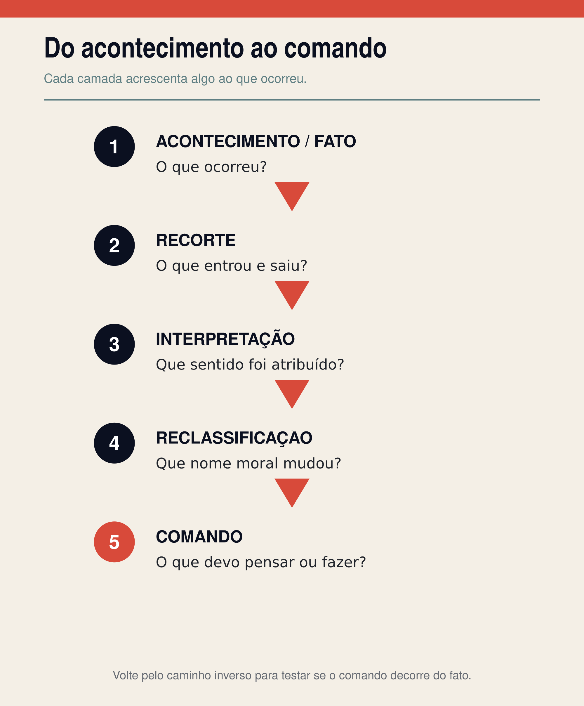
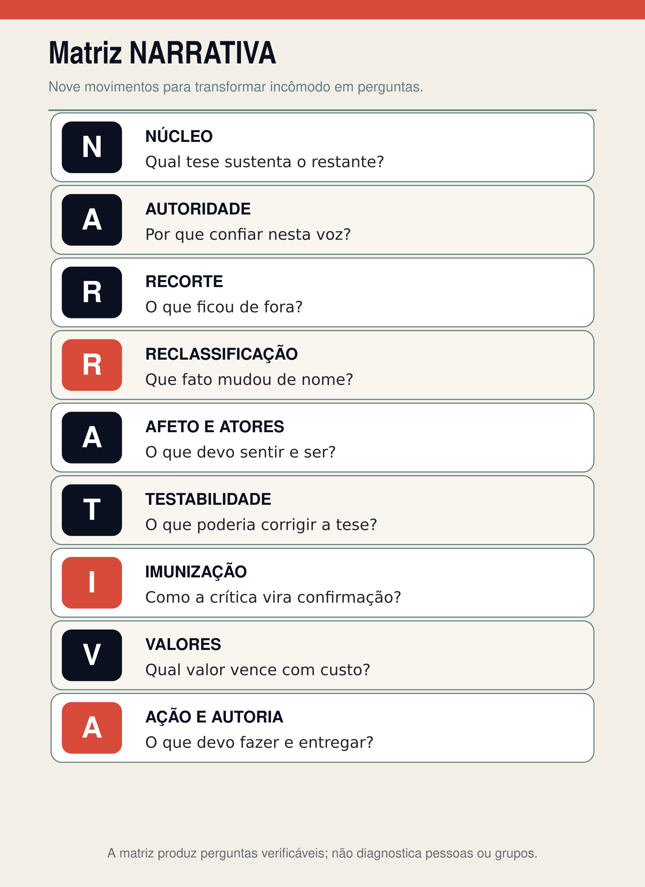
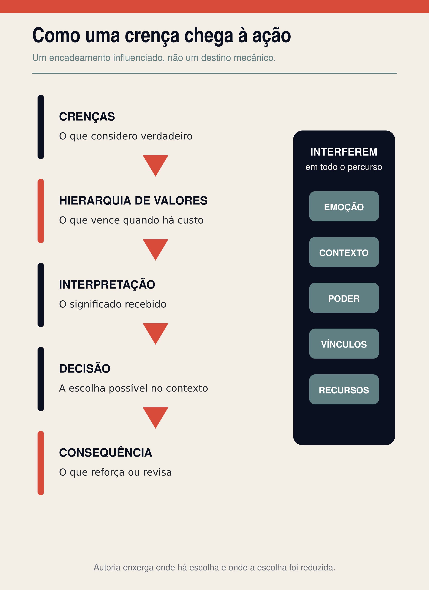
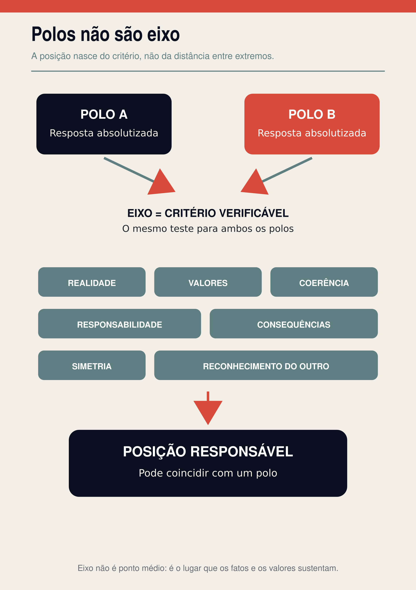

# PARTE II

## Leia o que lê você

Uma mensagem permanece sem resposta por algumas horas. Para uma pessoa, isso significa: “Ela deve estar ocupada; vou esperar”. Para outra: “Fui desconsiderada; preciso me afastar antes que me humilhem”. O acontecimento é o mesmo. A história construída ao redor dele muda o sentimento, a conduta e até o tipo de pessoa que cada uma acredita precisar ser.

Não vivemos diante de fatos nus. Vivemos entre acontecimentos já recortados, nomeados e ligados a explicações. Parte dessas explicações recebemos da família, da cultura, da fé, da escola, dos grupos e das experiências que tivemos. Parte elaboramos para tornar a vida suportável. Algumas nos ensinam a reconhecer a realidade; outras nos treinam para não vê-la inteira.

Na Parte I, você aprendeu que uma resposta pode ser recebida sem que a autoria seja entregue. Agora precisamos examinar a arquitetura dessa resposta. Não apenas *o que* ela afirma, mas o caminho pelo qual um acontecimento se transforma em significado, o significado se transforma em dever e o dever começa a parecer uma escolha inteiramente sua.

Duas pessoas podem olhar a mesma situação e sair dela com obrigações morais opostas porque não receberam apenas informações. Receberam personagens, causas, ameaças, valores e comandos. Antes de decidirem o que fazer, uma narrativa já lhes disse o que estava acontecendo.

Isso não significa que toda narrativa seja falsa ou manipuladora. Significa que toda narrativa merece ser lida.

A pergunta desta parte não será “qual história você deve adotar?”. Se eu lhe entregasse mais uma explicação pronta e pedisse fidelidade, este livro repetiria o problema que pretende investigar. A pergunta será mais exigente:

**como descobrir o que uma explicação acrescentou aos fatos — e se esse acréscimo continua coerente quando encontra a vida?**

Narrativa ensinará você a enxergar a explicação.

Lógica ensinará a testar se essa explicação permanece de pé.

Talvez a narrativa mais influente em sua vida não seja aquela que inventou fatos. Talvez seja aquela que decidiu o significado deles antes que você pudesse examiná-los.

Esta parte lhe dará instrumentos para interromper essa antecipação. Eles não decidirão por você. Servirão para abrir o fato, recuperar o contexto e devolver à consciência o tempo que a narrativa tentou ocupar.

---

# 4. Toda fuga identitária precisa de uma narrativa

Você entra numa sala depois de uma conversa interrompida. Duas pessoas se calam. Não ouviu o que diziam, não sabe se o assunto terminou e não dispõe de prova alguma sobre a razão do silêncio. Ainda assim, em segundos, uma explicação pode se formar: “Estavam falando de mim”.

O corpo reage à história antes de você verificar o acontecimento. O rosto se fecha. A distância aumenta. Uma pergunta que poderia esclarecer parece perigosa. Quando alguém tenta conversar, a interpretação já encontrou outros episódios, reorganizou lembranças e produziu uma conclusão: “Sempre me excluem”.

Não é preciso mentir para si de propósito. A mente procura continuidade. Um fato ambíguo recebe um sentido compatível com experiências anteriores; o sentido organiza uma emoção; a emoção faz alguns detalhes parecerem mais importantes do que outros. Em pouco tempo, aquilo que começou como possibilidade passa a ser vivido como realidade.

É nesse intervalo — entre o que aconteceu e o que o acontecimento passou a significar — que a narrativa trabalha.

## Narrativa não é sinônimo de mentira

Há narrativas que preservam a verdade quando a estatística não consegue preservar a experiência. Uma família conta como atravessou uma perda e transmite memória. Um povo narra sua história para não deixar desaparecer a violência que sofreu. Uma tradição religiosa organiza fé, esperança, responsabilidade e pertencimento. Uma pessoa reúne episódios dispersos da própria vida e finalmente reconhece um fio de continuidade.

Na psicologia da identidade narrativa, a história que alguém constrói sobre a própria vida ajuda a integrar passado reconstruído, presente percebido e futuro imaginado. Não é uma gravação neutra de tudo o que ocorreu; é uma elaboração de sentido que pode oferecer unidade e direção (McAdams; McLean, 2013). Portanto, chamar algo de narrativa não o acusa de falsidade. Memória, cultura, experiência, fé e sabedoria também chegam a nós em forma de história.

Neste livro, contudo, usaremos a palavra num campo mais amplo. Narrativa é uma organização de acontecimentos que seleciona elementos, estabelece relações, distribui papéis morais, mobiliza emoções e sugere uma conduta. Ela responde, de maneira explícita ou silenciosa:

o que aconteceu;

por que aconteceu;

quem agiu bem;

quem causou o dano;

o que está ameaçado;

e o que alguém como você deve fazer agora.

Uma explicação pode ser verdadeira e ainda ser incompleta. Pode conter fatos corretos e produzir uma inferência frágil. Pode nomear uma dor real e atribuir sua causa à pessoa errada. Pode preservar uma memória indispensável e, em outro contexto, usar essa memória para impedir toda revisão. Por isso, a alternativa não é “narrativa ou verdade”. A questão é: **que relação esta narrativa mantém com a verdade, com seus limites e com a possibilidade de correção?**

## Como uma história ganha força

Uma lista de dados pode informar. Uma narrativa faz o leitor ocupar uma posição.

Pesquisas sobre persuasão narrativa descrevem o envolvimento — frequentemente chamado de transporte — pelo qual atenção, imaginação e emoção se concentram no mundo apresentado por uma história. Em certos contextos experimentais, maior envolvimento narrativo esteve associado a crenças mais coerentes com a história e a menos contra-argumentação durante sua recepção (Green; Brock, 2000). Uma meta-análise posterior mostrou que esses efeitos variam conforme características da narrativa, do receptor e do contexto; histórias não controlam todas as pessoas do mesmo modo nem dispensam exame crítico (van Laer et al., 2014).

Essa ressalva importa. Se dissermos que “uma história domina qualquer mente”, criaremos outra história totalizante. Narrativas persuadem por caminhos reconhecíveis, não por magia.

Primeiro, pela **identificação**. Você reconhece uma dor, um desejo ou um personagem e reduz a distância entre “isso aconteceu com alguém” e “isso fala de mim”.

Depois, pela **coerência**. A vida é fragmentada, mas a narrativa liga início, causa e consequência. Mesmo uma ligação incorreta pode ser psicologicamente atraente quando elimina ambiguidade.

Há também o **pertencimento**. Algumas histórias não oferecem apenas uma explicação; oferecem um “nós”. Aceitar a leitura passa a significar integrar uma comunidade, enquanto duvidar parece ameaçar vínculo, reputação ou amor.

A **redução da complexidade** traz alívio. Um mundo com causas múltiplas, responsabilidades distribuídas e evidências incompletas exige esforço. Uma história com um culpado único, um herói puro e uma solução total devolve sensação de controle.

O **afeto** dá urgência. Medo, culpa, orgulho, indignação, esperança e alívio não são defeitos do pensamento. São partes da experiência humana. Tornam-se problemáticos quando substituem a verificação ou quando alguém precisa continuar sentindo uma emoção específica para continuar pertencendo.

Por fim, existe a **autoridade**. A história pode vir de alguém amado, admirado, temido, considerado especialista ou reconhecido como representante de algo sagrado. A confiança pode ser razoável. O erro começa quando a posição da fonte transforma exame em deslealdade.

Os personagens recorrentes — herói, vítima, culpado, salvador, traidor e ameaça — ajudam a organizar o drama moral. Eles não provam que exista conspiração. Uma pessoa pode ocupar de fato a posição de vítima; uma ameaça pode ser real; alguém pode agir heroicamente. O problema surge quando os papéis deixam de descrever condutas e passam a blindar identidades: o herói não pode errar, a vítima não pode causar dano, o aliado não pode perguntar, o adversário não pode dizer a verdade.

## Quem transmite também pode estar convencido

É confortável imaginar que toda narrativa limitadora foi desenhada por um manipulador frio. Essa hipótese nos permite separar o mundo entre os que enganam e os que enxergam. A realidade costuma ser mais difícil.

Quem transmite uma explicação também pode ter sido formado por ela. Pode repetir uma regra porque acredita estar protegendo alguém. Pode omitir fatos sem perceber que os considera irrelevantes. Pode usar uma expressão eufemística porque já não consegue nomear a conduta de outro modo. Pode amar sinceramente e, ao mesmo tempo, defender uma estrutura que fere.

A persuasão não exige sempre um plano consciente. Exige uma explicação que pareça coerente, circule por fontes confiáveis, encontre necessidades reais e ofereça recompensa por adesão. Isso não elimina responsabilidade por consequências. Apenas impede que confundamos análise com caça a vilões.

Se procurarmos somente intenção maligna, deixaremos de reconhecer sistemas sustentados por pessoas bem-intencionadas. E talvez deixemos de examinar as narrativas que nós mesmos transmitimos convencidos de estar fazendo o bem.

## Da explicação corrigível à explicação totalizante

Uma explicação corrigível diz: “É assim que compreendo os fatos até aqui”. Ela apresenta razões, admite incerteza, reconhece limites, diferencia princípio de aplicação e conserva alguma condição sob a qual precisaria ser revista.

Uma explicação totalizante diz: “Tudo o que aconteceu, acontece ou acontecerá confirma o que já concluí”. O apoio prova que ela está certa. A dúvida também. Se alguém permanece, é porque reconheceu a verdade; se sai, é porque nunca foi digno dela. Se melhora, o método funcionou; se piora, não se entregou o bastante. Se pergunta, demonstra resistência; se silencia, demonstra concordância.

A primeira narrativa pode orientar sem ocupar todo o mundo. A segunda absorve o mundo para não encontrar limite.

Não é a força da convicção que distingue uma da outra. Uma pessoa pode sustentar com firmeza uma crença examinada. A diferença está no tratamento dado à evidência, à pergunta, à exceção, à consequência e à liberdade de revisar.

## As cinco camadas entre o acontecimento e o comando

Para perceber como uma narrativa se forma, precisamos separar cinco camadas. Elas não são um teste clínico nem uma prova automática de manipulação. São uma ferramenta de leitura: **acontecimento, recorte, interpretação, reclassificação e comando**.

Imagine uma equipe de trabalho diante de um novo projeto. Durante uma reunião, duas pessoas pedem dados sobre prazo e custo. A gestora encerra a conversa dizendo que voltará com informações. No dia seguinte, circula uma mensagem: “Precisamos proteger a cultura de inovação contra quem resiste a mudanças”.

### 1. Acontecimento ou fato

É aquilo que ocorreu e pode ser observado ou documentado com razoável segurança.

Duas pessoas fizeram perguntas sobre prazo e custo. A gestora encerrou a reunião. Uma mensagem foi enviada no dia seguinte.

O fato ainda não diz que as perguntas eram prudentes, hostis, necessárias ou sabotadoras. Ele delimita o que sabemos antes de atribuir motivo.

Pergunta da camada: **o que ocorreu?**

### 2. Recorte ou seleção

Nenhuma narrativa inclui tudo. O enquadramento seleciona aspectos da realidade e lhes dá maior saliência, influenciando como o problema, suas causas e possíveis respostas serão percebidos (Entman, 1993). Selecionar é inevitável; ocultar uma informação decisiva sem admitir o recorte é outra coisa.

Na mensagem, entraram as perguntas e a ideia de resistência. Ficaram de fora o orçamento incompleto, o prazo ainda não calculado, a responsabilidade profissional de quem perguntou e o fato de outras pessoas terem manifestado a mesma dúvida em particular.

Pergunta da camada: **o que entrou, o que ficou de fora e qual contexto mudaria a leitura?**

### 3. Interpretação

É o significado atribuído ao acontecimento e a relação causal construída entre os elementos.

As perguntas foram interpretadas como resistência. A hesitação foi ligada a uma suposta falta de compromisso. Outra leitura seria possível: as perguntas tentavam impedir uma promessa inviável. Ainda não sabemos qual interpretação é mais adequada; precisamos de evidência.

Pergunta da camada: **que significado ou causa foi acrescentado ao fato?**

### 4. Reclassificação

É a mudança do nome moral de uma conduta. Por meio dela, algo que pareceria condenável, questionável ou apenas ambíguo recebe um termo mais aceitável — ou o inverso. Estudos de Bandura sobre desligamento moral mostram como justificativas e linguagem sanitizada podem reduzir o contato com a responsabilidade por uma ação (Bandura, 1999). Isso não significa que toda troca de palavras seja enganosa; conceitos novos também corrigem injustiças antigas. O teste é observar o que o novo nome permite deixar de ver.

No exemplo, punir perguntas pode ser reclassificado como “proteger a cultura”. Conformidade pode receber o nome de “mentalidade inovadora”. A prudência pode ser rebatizada de “resistência”.

Pergunta da camada: **que novo nome tornou algo aceitável, condenável ou invisível?**

### 5. Comando

Toda narrativa com força prática conduz a algum movimento. O comando pode ser explícito — “não questione” — ou implícito: prove seu compromisso, escolha um lado, afaste-se, cale-se, compre, denuncie, tema, confie, repita.

No caso da equipe, o comando é: para pertencer ao grupo dos inovadores, reduza perguntas e demonstre entusiasmo. Talvez ninguém escreva essas palavras. Ainda assim, os membros aprendem qual conduta preserva sua posição.

Pergunta da camada: **o que devo pensar, sentir, fazer, evitar ou provar depois de aceitar esta explicação?**

As camadas acrescentam elementos umas às outras. Um fato é selecionado; o recorte recebe significado; o significado recebe um nome moral; o nome orienta uma ação. Voltando pelo caminho inverso, é possível perguntar se o comando realmente decorre do que ocorreu.

## Quando mudar o nome muda o dever

> **A narrativa mais poderosa não apaga o fato. Ela muda o nome do fato até que a contradição pareça fidelidade.**

Uma omissão pode ser chamada de neutralidade.

Uma separação pode ser chamada de pureza.

O medo pode ser chamado de prudência.

A obediência a uma pessoa pode ser chamada de fidelidade superior.

A perda da própria voz pode ser chamada de unidade.

Esses pares não são equivalências universais. Neutralidade existe e pode ser ética. Separar-se pode proteger alguém de violência. O medo pode informar perigo real. Obediência pode ser consentida e responsável. Unidade pode nascer de cooperação livre. Os pares funcionam como perguntas de investigação: **neste caso concreto, o nome descreve a conduta ou a protege de exame?**

Sem essa cautela, a ferramenta se tornaria uma máquina de suspeita. Bastaria trocar qualquer virtude por um vício e declarar vitória. Ler narrativas exige mais: voltar ao fato, recuperar o omitido, comparar consequências e ouvir a melhor explicação contrária.

Só depois desse trabalho os primeiros Comandos de Autoria fazem sentido.

> **IDENTIFIQUE A NARRATIVA.**
>
> Diante de uma explicação que parece completa, escreva em uma frase: “Esta história diz que aconteceu ___ porque ___; nela, eu sou ___ e devo ___”.
>
> Se você ainda não consegue completar a frase, não conclua. Continue observando.

> **SEPARE FATO DE INTERPRETAÇÃO.**
>
> Faça duas colunas mentais. Na primeira, coloque o que poderia ser registrado por uma câmera, documento ou testemunho convergente. Na segunda, coloque motivos, intenções, causas e significados atribuídos.
>
> Interpretação não é descartável. Apenas não deve entrar disfarçada de fato.

As cinco camadas revelam o caminho do acontecimento ao comando. Mas uma narrativa inteira contém mais do que esse caminho. Ela tem uma tese central, fontes de autoridade, mecanismos de pertencimento, respostas preparadas contra a dúvida e custos para quem sai.

Para examiná-la sem depender apenas da sensação de que “há algo errado”, precisamos de um método mais completo.

Precisamos aprender a ler a narrativa antes que ela leia você.

---

# 5. Leia a narrativa antes que ela leia você

Há momentos em que uma explicação incomoda antes que saibamos dizer por quê. As frases parecem corretas. A pessoa que fala parece segura. Há testemunhos, uma comunidade acolhedora e palavras que descrevem dores reais. Mesmo assim, alguma coisa não se encaixa.

Nessa hora, dois erros são comuns.

O primeiro é abandonar a percepção porque ainda não temos vocabulário: “Se não consigo provar, devo estar imaginando”.

O segundo é transformar a sensação em veredito: “Senti algo estranho, portanto tudo é manipulação”.

Nenhum dos dois produz autoria. No primeiro, entregamos o julgamento à segurança alheia. No segundo, entregamos o julgamento ao medo. Precisamos converter o incômodo em perguntas que possam ser examinadas.

Para isso, proponho a **Matriz NARRATIVA**, um modelo autoral de alfabetização narrativa composto por nove movimentos. Ela não é teste psicométrico, diagnóstico, escala clínica ou prova automática de manipulação. Não mede pessoas. Não concede licença para rotular grupos. Sua função é mais modesta e mais útil: produzir perguntas verificáveis.

As cinco camadas do capítulo anterior acompanham a passagem do acontecimento ao comando. A Matriz NARRATIVA audita a explicação inteira: sua tese, sua fonte, seus recortes, seus afetos, sua relação com a correção, seus valores e o preço que cobra da autoria.

Vamos aplicá-la a um estudo de caso composto. Ele reúne padrões observáveis em promessas contemporâneas de autoconhecimento, produtividade e pertencimento, mas não corresponde a uma pessoa, empresa ou programa específico.

Uma mulher a quem chamaremos de Elisa atravessa uma mudança profissional. Sente-se atrasada, insegura e incapaz de explicar o que quer. Encontra na internet um programa que promete revelar sua “identidade essencial” em vinte e um dias. A divulgação acerta em dores que ela nunca soube nomear: cansaço de agradar, medo de escolher e sensação de viver a vida dos outros.

No início, as aulas oferecem exercícios úteis. Elisa escreve sobre limites, reconhece decisões tomadas por aprovação e encontra pessoas com experiências semelhantes. O alívio é real. Depois, porém, a linguagem começa a fechar o campo: quem não obtém resultado “ainda está apegado ao personagem”; familiares que questionam o método “temem a versão desperta” da participante; críticas públicas são apresentadas como evidência de que o programa ameaça o sistema; e a renovação paga é descrita como prova de compromisso consigo.

Nada nessa cena permite concluir automaticamente que existe fraude ou controle. Pode haver conteúdo legítimo, resultados distintos e profissionais sinceros. A matriz não começa pelo veredito. Começa pela leitura.

## N — Núcleo

O núcleo é a tese sem a qual o restante perde força. Inclui a promessa central e, muitas vezes, a ameaça que torna a promessa urgente.

No caso de Elisa, a tese não é apenas “autoconhecimento pode ajudar”. É algo mais abrangente: “Você possui uma identidade essencial bloqueada por condicionamentos; nosso método consegue revelá-la; resistir ao método demonstra a força do bloqueio”.

A promessa é recuperar o verdadeiro eu. A ameaça é continuar vivendo uma identidade falsa. Se Elisa aceita esse núcleo inteiro, cada dificuldade posterior pode ser interpretada como nova prova de que precisa do programa.

Pergunte:

**O que preciso aceitar para que o restante pareça lógico?**

Tente escrever a resposta sem os slogans da fonte. Uma frase clara costuma mostrar o tamanho real da afirmação. “Este curso oferece exercícios de reflexão” é uma tese limitada. “Somente este processo atravessa as defesas que impedem você de ser quem nasceu para ser” reivindica outra autoridade e exige outra evidência.

## A — Autoridade

Autoridade não é um problema em si. Dependemos do conhecimento de outras pessoas. Ninguém verifica sozinho cada procedimento médico, cada cálculo de engenharia ou cada documento histórico. A vida coletiva exige confiança.

Por isso, o teste não é “essa voz tem autoridade?”. É: **de onde vem essa autoridade, para qual assunto ela é válida, quais interesses a atravessam e como pode ser examinada?**

Formação, experiência, método, transparência, responsabilidade profissional e disposição para corrigir erros fortalecem confiança. Carisma, número de seguidores, riqueza, sofrimento superado e depoimentos emocionantes podem ser relevantes para uma história pessoal, mas não substituem competência nem demonstram que uma promessa funciona para todos.

No programa, a liderança apresenta a própria transformação como principal credencial. Os relatos de participantes selecionados reforçam legitimidade. O interesse financeiro na renovação é pouco mencionado. Nada disso prova má-fé; apenas impede que admiração seja confundida com verificação.

Pergunte:

**Por que esta voz merece confiança, até onde vai sua competência e o que acontece quando alguém examina suas afirmações?**

## R — Recorte

Todo relato escolhe. O problema não é existir seleção; é a seleção decisiva desaparecer como se fosse o mundo inteiro.

O programa mostra participantes que mudaram de carreira, encerraram relações e relatam grande clareza. Não apresenta com a mesma visibilidade quem não percebeu mudança, quem abandonou sem conflito, quem melhorou por outros fatores ou quem teve efeitos indesejados. Depoimentos não são inúteis: revelam experiência. Mas uma coleção escolhida não informa, sozinha, frequência, causa ou generalização.

O recorte também atua sobre a história de Elisa. Quando ela conta que a irmã questionou o preço, o grupo destaca a falta de apoio. Ficam de fora anos de cuidado, o contexto financeiro e a possibilidade de a pergunta expressar preocupação legítima.

Pergunte:

**O que entrou, o que precisou ficar fora e qual informação ausente poderia mudar a conclusão?**

Localizar o omitido não significa inventar uma versão oposta. Significa procurar contexto antes de conceder totalidade ao recorte.

## R — Reclassificação

Reclassificar é alterar o nome moral de um acontecimento. O método pode chamar dúvida de “resistência”, discordância de “apego ao personagem”, dependência de “compromisso” e afastamento de vínculos de “elevação de frequência”. Em outro ambiente, o movimento pode ser inverso: prudência é chamada de covardia, cuidado é chamado de controle, crueldade é chamada de sinceridade.

Novos nomes às vezes libertam. Dar nome a uma violência antes naturalizada pode tornar o dano visível. Reconhecer um direito pode corrigir uma classificação injusta. Portanto, a pergunta não é se houve mudança de vocabulário, mas se o novo termo esclarece fatos ou os torna inalcançáveis.

No caso de Elisa, “resistência” pode nomear um fenômeno humano real: evitamos verdades desconfortáveis. Mas, se toda objeção recebe esse nome, a palavra deixa de explicar e passa a proteger o método.

Pergunte:

**Que contradição ganhou um nome mais aceitável — e o que deixo de enxergar quando aceito esse nome?**

## A — Afeto e atores

Narrativas não apresentam apenas ideias. Elas distribuem lugares e ensinam sentimentos.

Quem é o herói? Quem é a vítima? Quem salva? Quem ameaça? Quem trai? O que você deve temer perder? De que deve sentir vergonha? Que orgulho recebe ao pertencer?

Elisa é convidada a ocupar o papel de alguém “em despertar”. A liderança é apresentada como guia que atravessou o caminho. Os participantes comprometidos formam uma comunidade de coragem. Pessoas que questionam podem ser reunidas na categoria dos “adormecidos”. O medo de continuar falsa combina-se ao orgulho de fazer parte dos que enxergam.

O afeto não invalida o conteúdo. Uma história comovente pode ser verdadeira. Uma comunidade pode oferecer pertencimento saudável. O teste é observar se a emoção amplia a capacidade de conhecer ou se passa a decidir de antemão o que pode ser conhecido.

Pergunte:

**O que devo sentir e quem preciso me tornar para pertencer?**

Quando o único modo de continuar sendo “corajoso”, “consciente”, “leal” ou “bom” é concordar com a fonte, um papel moral começou a governar a investigação.

## T — Testabilidade

Uma explicação séria precisa correr algum risco diante da realidade. Isso não significa que toda convicção humana possa ser reduzida a um experimento simples. Questões morais, existenciais e religiosas não funcionam como teste de laboratório. Ainda assim, afirmações sobre resultados, causas e condutas podem apresentar critérios de correção.

Se um programa promete um efeito mensurável, o que contaria como fracasso? Se atribui toda melhora ao método, como distingue o efeito do tempo, de outras ajudas ou da expectativa? Se diz interpretar a identidade de alguém, que evidência permitiria reconhecer um erro?

No estudo de Friesen, Campbell e Kay (2015), elementos não testáveis puderam oferecer vantagens psicológicas a crenças valorizadas, inclusive proteção diante de evidências ameaçadoras. O resultado não autoriza chamar toda crença não testável de falsa; mostra por que uma explicação que não admite condição de erro pode ser atraente e difícil de revisar.

Pergunte:

**O que demonstraria que esta explicação está errada, limitada ou mal aplicada?**

Se a resposta for “nada”, talvez você não esteja diante de uma explicação que interpreta a realidade, mas de uma estrutura que a absorve.

## I — Imunização

Imunização é a preparação de uma narrativa contra qualquer crítica possível. A objeção deixa de ser informação e vira sintoma do objetor.

“Se você discorda, é porque ainda não entendeu.”

“Se saiu, prova que nunca esteve comprometido.”

“Se a família pergunta, é porque se sente ameaçada.”

“Se pesquisadores não confirmam, é porque o sistema os comprou.”

Em todas essas respostas, o conteúdo da crítica não precisa ser avaliado. A origem atribuída ao crítico basta para descartá-la.

Seria imprudente ignorar que interesses, preconceitos e conflitos existem. Fontes podem atacar uma ideia por razões ruins. Mas explicar *por que alguém critica* não responde *se a crítica procede*. A origem de uma objeção e sua validade são perguntas diferentes.

Aqui apenas reconhecemos o mecanismo. O fechamento completo de uma redoma — com perseguição, punição de saída e ruptura sistemática de vínculos — será examinado adiante, no capítulo próprio.

Pergunte:

**Como toda objeção pode ser transformada em nova prova a favor da narrativa?**

## V — Valores

Toda narrativa invoca valores. Liberdade, amor, verdade, família, justiça, pureza, segurança, autenticidade, progresso e lealdade dão peso moral à ação proposta.

A pergunta decisiva não é apenas “qual valor foi pronunciado?”, mas “qual valor vence quando há custo?”.

O programa afirma valorizar autonomia. Quando Elisa deseja pausar para avaliar as finanças, porém, a continuidade do vínculo é usada para pressioná-la. Nesse momento, talvez o valor operante não seja autonomia, mas permanência, receita, reputação ou confirmação do método.

Também é possível que participantes pressionem uns aos outros sem orientação explícita da liderança. Valores operam na cultura de um grupo por normas, recompensas e medos compartilhados.

Pergunte:

**Qual valor é declarado, qual vence na prática e quem arca com a consequência dessa hierarquia?**

No próximo capítulo, aprofundaremos essa diferença. Por enquanto, perceba que a linguagem moral não prova a realização do valor que nomeia.

## A — Ação e autoria

Uma narrativa mostra sua força no tipo de conduta que passa a exigir.

O que você deve fazer, comprar, abandonar, esconder, repetir ou provar? Quem se beneficia? Qual é o custo de discordar? É possível permanecer com perguntas? É possível sair sem perder dignidade, amizade, renda, reputação ou toda referência de si?

No caso de Elisa, o comando deixa de ser apenas “reflita sobre sua vida”. Torna-se “renove para provar compromisso, interprete dúvidas como resistência e reduza contato com quem ameaça sua transformação”. O preço já não é somente financeiro. Inclui entregar ao método o poder de dizer o que cada objeção significa.

Pergunte:

**O que devo fazer e quanto de consciência preciso entregar para continuar pertencendo?**

Uma ferramenta de autoconhecimento deveria aumentar a capacidade de Elisa formular critérios, pedir evidências, reconhecer limites e escolher. Se precisa tornar-se indispensável para continuar funcionando, talvez tenha começado a substituir a capacidade que prometeu fortalecer.

## A matriz inteira em movimento

Ao reunir os nove movimentos, a leitura fica mais precisa:

O **núcleo** promete revelar a identidade verdadeira e ameaça Elisa com a permanência no falso eu.

A **autoridade** se apoia na transformação pessoal da liderança, em carisma e testemunhos, sem deixar claros todos os limites e interesses.

O **recorte** privilegia resultados positivos e interpreta a preocupação familiar fora de seu contexto.

A **reclassificação** chama dúvida de resistência e renovação de compromisso.

O **afeto e os atores** oferecem orgulho de despertar, medo de regressão, guias, despertos e adormecidos.

A **testabilidade** é fraca quando sucesso confirma o método e fracasso confirma o bloqueio.

A **imunização** transforma crítica em prova do poder da transformação.

Os **valores** declarados são autonomia e verdade; a permanência pode tornar-se o valor operante.

A **ação e autoria** exigem renovação, lealdade interpretativa e custo crescente de saída.

Esse conjunto justifica uma investigação. Ainda não autoriza uma sentença sobre cada pessoa envolvida. A matriz não substitui documentos, contexto, escuta, comparação e consequência observável.

> **LOCALIZE O OMITIDO.**
>
> Procure a informação que a narrativa teria mais dificuldade de acomodar: um resultado negativo, uma causa alternativa, o contexto anterior, o benefício da fonte ou a melhor versão da objeção.
>
> Não preencha o vazio com imaginação. Transforme-o em pergunta.

> **DESCUBRA O REBATIZADO.**
>
> Escolha uma palavra moralmente carregada — “amor”, “liberdade”, “lealdade”, “cura”, “neutralidade”, “coragem”.
>
> Descreva a conduta sem essa palavra. Depois pergunte: o nome esclarece o que ocorreu ou impede que eu o avalie?

## Um contracaso: a narrativa que não teme a saída

Compare o programa de Elisa com um grupo de orientação profissional que também conta histórias fortes. Participantes narram mudanças, reconhecem medos e encontram pertencimento. A coordenação apresenta um método, mas delimita sua finalidade: ajudar a organizar possibilidades, não revelar uma essência oculta.

Os responsáveis informam formação, custos, conflitos de interesse e limites. Resultados diferentes são registrados. Uma pessoa pode dizer “isto não me ajudou” sem ser transformada em exemplo de resistência. Dúvidas são respondidas pelo conteúdo, não pela desqualificação de quem pergunta. A saída não exige romper vínculos nem provar coragem. O grupo incentiva consulta a outras fontes e reconhece quando uma questão requer cuidado clínico, jurídico ou financeiro especializado.

Essa também é uma narrativa. Ela possui valores, personagens, memória e direção. Sua força não está em fingir neutralidade absoluta, mas em conservar porosidade: pode ser questionada, corrigida, complementada e deixada.

Narrativas saudáveis não são histórias sem convicção. São histórias cuja convicção não depende da destruição de toda alternativa.

## A varredura de seis perguntas

Nem sempre você terá tempo ou condições para aplicar os nove movimentos por escrito. Use, então, uma varredura rápida:

1. **O que essa narrativa explica?**
2. **Quem ela diz que eu sou?**
3. **Quem ela precisa que eu tema, despreze ou pare de escutar?**
4. **Que fato ela rebatiza para preservar a própria coerência?**
5. **Que pergunta eu seria punido por fazer?**
6. **Quem continuo sendo se deixar de acreditar?**

Uma resposta preocupante não fecha o caso. Um conjunto repetido merece atenção.

E aplique a matriz também às histórias de que você gosta. Estudos sobre raciocínio tendencioso mostram que pessoas podem avaliar evidências de modo favorável às conclusões que desejam, desde que consigam construir justificativas aparentemente razoáveis (Kunda, 1990). O viés a favor do próprio lado apresenta pouca relação com medidas tradicionais de inteligência em diferentes tarefas; ser inteligente pode aumentar recursos para argumentar sem garantir disposição para revisar (Stanovich; West; Toplak, 2013).

Portanto, não transforme alfabetização narrativa em superioridade. Quem aprende a desmontar somente a narrativa do adversário tornou-se um defensor mais sofisticado da própria redoma.

Use a matriz neste livro.

Pergunte qual é a minha tese, quais fatos selecionei, que valores invoco, que emoções mobilizo e que ação proponho. Verifique se apresento contrapontos reais ou apenas adversários fáceis. Observe se discordar de Sol é tratado como prova de fuga identitária. Se for, a obra terá violado sua própria promessa.

Agora você consegue desmontar a arquitetura de uma explicação. Mas ainda falta compreender por que determinadas partes têm tanto peso. Por que “família” vence “verdade” numa casa, enquanto em outra a verdade é pronunciada a qualquer custo? Por que duas pessoas recebem a mesma informação e saem dela com decisões opostas, ambas convencidas de agir corretamente?

A narrativa organiza o significado.

Crenças e valores decidem o que esse significado terá permissão para mover.

---

# 6. Crenças e valores

Duas pessoas recebem a mesma notícia: a empresa em que trabalham será reorganizada.

Uma pensa: “Mudança é oportunidade; preciso me apresentar para a nova função”. A outra: “Mudança é o aviso que antecede o descarte; devo ficar invisível até a ameaça passar”. Nenhuma reagiu apenas ao comunicado. Cada uma encontrou a notícia com crenças sobre si, autoridade, risco, merecimento e futuro.

Se perguntarmos por que agiram de modos opostos, talvez ambas respondam: “Foi a decisão mais sensata”. E podem estar sendo sinceras. A sensatez, porém, já foi construída sobre aquilo que cada uma considera verdadeiro e importante.

**Crença responde: o que considero verdadeiro?**

**Valor responde: o que considero importante, bom ou sagrado?**

**Hierarquia de valores responde: qual princípio vence quando dois entram em conflito?**

Essas três perguntas explicam parte do caminho entre informação e conduta. Não explicam tudo. Uma pessoa pode saber o que valoriza e não conseguir agir por medo, coerção, trauma, dependência econômica ou risco real. Ainda assim, sem localizar crenças e hierarquias, muitas decisões parecem surgir do nada.

## O mundo que uma crença prepara

Algumas crenças são proposições verificáveis: “A reunião começa às nove”. Outras são modelos amplos que orientam percepção: “Autoridade protege”, “autoridade humilha”, “discordar rompe amor”, “o mundo recompensa esforço”, “ninguém é confiável”.

Ao longo da vida, formamos crenças sobre diferentes territórios.

Sobre **si mesmo**: sou capaz, sou difícil, sou descartável, preciso agradar, tenho direito de perguntar, não sobrevivo sozinho.

Sobre **o outro**: pessoas ajudam, pessoas exploram, quem me ama concorda, quem discorda deseja meu mal, ninguém faz algo sem interesse.

Sobre **Deus e o sagrado**: o divino acolhe pergunta, exige submissão, está presente na compaixão, fala exclusivamente por uma autoridade, julga intenção, julga regra.

Sobre **o mundo**: é lugar de cooperação possível, campo de batalha permanente, ordem moral, acaso, ameaça, oportunidade ou prova.

Sobre **autoridade**: merece confiança por posição, precisa prestar contas, sabe mais do que eu, pode ser corrigida, não deve ser contrariada.

Sobre **perigo**: está em todo desacordo, somente em dano observável, na exclusão, no fracasso, na mudança, na perda de controle.

Sobre **merecimento e pertencimento**: preciso provar valor; recebo dignidade por existir; pertenço enquanto obedeço; posso discordar e continuar amado.

Essas crenças não ficam guardadas numa sala abstrata da mente. Elas definem quais narrativas parecem plausíveis. Quem aprendeu que conflito significa abandono ouvirá uma discordância como ameaça de ruptura. Quem aprendeu que pergunta é cuidado poderá ouvir a mesma frase como tentativa de aperfeiçoar uma decisão.

Isso não torna a realidade relativa. Uma interpretação pode ser mais bem sustentada pelos fatos do que outra. Significa apenas que ninguém chega aos fatos sem história.

## Valores não vivem sozinhos

Valores são princípios amplos que orientam escolhas e transcendem uma situação específica. Na teoria de Schwartz, eles se organizam por motivações que podem ser compatíveis ou entrar em conflito; buscar segurança, autodireção, tradição, benevolência ou realização produz tensões reais, não defeitos automáticos de caráter (Schwartz, 2012).

Você pode valorizar liberdade e cuidado. Num momento, a liberdade exige dizer não; em outro, o cuidado exige permanecer. Pode valorizar verdade e privacidade. Pode defender lealdade e justiça, até descobrir que proteger uma pessoa exige contrariar o grupo.

O conflito não prova que um dos valores seja falso. Ele revela a necessidade de hierarquia, contexto e responsabilidade.

É aqui que proponho uma distinção central para esta obra.

**Valor declarado** é o princípio que uma pessoa afirma defender.

**Valor operante** é o princípio que efetivamente vence quando existe custo.

Uma organização declara transparência, mas pune quem informa um erro. A preservação da imagem tornou-se valor operante.

Uma família declara amor, mas exige silêncio de quem sofreu para evitar constrangimento. A aparência de união pode ter vencido o cuidado.

Uma pessoa declara autonomia, mas abandona todo critério próprio para conservar aprovação. O pertencimento pode estar operando acima da liberdade.

“Valor operante” não significa essência secreta nem caráter verdadeiro revelado por um episódio isolado. Condutas podem resultar de pânico, coerção, falta de recursos, hábito, informação incompleta ou risco. Para inferir uma hierarquia, precisamos observar repetição, alternativas disponíveis, consciência, poder e consequência.

É injusto dizer a alguém submetido a ameaça: “Se você não saiu, então não valoriza liberdade”. A ausência de ação pode revelar falta de segurança, não falta de valor. O conceito serve para examinar sistemas de decisão, não para culpar quem teve sua escolha reduzida.

Também é possível que um valor permaneça importante e, ainda assim, perca numa decisão. Uma mãe pode valorizar presença e trabalhar longas horas porque a sobrevivência material não oferece alternativa. Um profissional pode valorizar honestidade e adiar uma denúncia enquanto procura proteção contra retaliação. A conduta isolada não autoriza uma leitura moral total. O valor operante aparece melhor quando observamos aquilo que recebe prioridade repetida **entre opções realmente disponíveis**.

Essa precisão protege o leitor de uma armadilha: usar a ferramenta para transformar toda dificuldade alheia em confissão involuntária. Ler valores exige olhar para a liberdade concreta, não apenas para a frase pronunciada.

## Convicção examinada e convicção protegida

Uma convicção examinada pode ser profunda. Ela não precisa mudar a cada crítica. Sustenta razões, escuta evidência, distingue a crença de sua aplicação e reconhece o que não sabe. A pergunta pode fortalecê-la, limitá-la ou corrigi-la sem destruir a dignidade de quem crê.

Uma convicção protegida já classificou a dúvida como falha moral. Antes de ouvir a questão, sabe que ela nasceu de fraqueza, orgulho, impureza, ignorância ou deslealdade. Por isso, não precisa respondê-la.

A diferença não está entre fé e ciência, conservador e progressista, tradição e mudança. Todas essas esferas podem abrigar convicções examinadas ou protegidas. A diferença está na relação entre crença, evidência, identidade e correção.

Nós dependemos do testemunho de outras pessoas e desenvolvemos formas de avaliar a competência e a confiabilidade de quem comunica. Esse trabalho de vigilância epistêmica não elimina confiança; tenta torná-la calibrada (Sperber et al., 2010). Quando uma comunidade transforma toda verificação em traição, ela não pede apenas que o membro aceite uma conclusão. Pede que entregue o instrumento pelo qual poderia avaliá-la.

## Da crença à consequência

O caminho pode ser representado assim:

> **Crenças → hierarquia de valores → interpretação narrativa → atitude → intenção → decisão → ação → consequência → reforço ou revisão.**

Imagine alguém que acredita: “Conflitos destroem famílias”. Essa crença encontra uma hierarquia na qual reputação e permanência estão acima de verdade e reparação. Quando ocorre uma agressão verbal, a narrativa interpreta o silêncio como proteção. A atitude em relação a denunciar o episódio é negativa. A intenção passa a ser “evitar escândalo”. A decisão é pedir à pessoa ferida que não fale. A ação preserva aparência imediata. A consequência pode ser repetição do dano e perda de confiança. Depois, o grupo pode revisar a crença — ou usar a própria ruptura produzida pelo silêncio como prova de que “falar destrói famílias”.

O encadeamento ajuda a localizar passagens; não descreve uma máquina. Na teoria do comportamento planejado, atitudes, normas percebidas e percepção de controle contribuem para intenções, enquanto intenção e controle não garantem sozinhos que a ação ocorrerá (Ajzen, 1991). Emoção, medo, coerção, trauma, recursos, vínculos, poder, contexto e alternativas reais interferem em cada etapa.

As **normas percebidas** respondem: “O que pessoas importantes esperam que eu faça?”. Mesmo sem ordem direta, a expectativa de aprovação ou rejeição pesa.

O **controle percebido** responde: “Tenho meios para agir?”. Alguém pode desejar denunciar uma injustiça, mas depender financeiramente de quem a cometeu. Pode querer sair de uma relação, mas não dispor de moradia, proteção ou rede. Pode querer discordar de um grupo e temer perder todos os vínculos ao mesmo tempo.

Autoria não é imaginar que contexto não existe. É enxergar com precisão onde a escolha está disponível, onde foi reduzida e que apoios são necessários para ampliá-la.

## Estudo de caso composto: a paz que exigia silêncio

O caso a seguir é composto e não representa uma família específica.

Numa casa, a palavra mais repetida é “paz”. Todos dizem valorizar família, amor e lealdade. Quando um dos membros ridiculariza outro diante de visitas, porém, a pessoa atingida é orientada a não responder: “Não estrague o encontro”. Depois, em particular, escuta que precisa ser mais compreensiva porque o agressor “é assim mesmo”.

O valor declarado é paz.

O acontecimento é humilhação pública.

A narrativa diz que o conflito começou quando a pessoa ferida reagiu, não quando foi atacada.

A reclassificação chama silêncio de maturidade e nomeia a tentativa de reparação como drama.

Quando surge custo — reconhecer o dano, contrariar alguém influente e suportar desconforto —, outro valor vence: preservação da aparência, controle do ambiente ou proteção da reputação.

Isso não significa que todo silêncio seja cumplicidade. Alguém pode calar para sobreviver, escolher o momento seguro ou evitar escalada. Também não significa que toda família deva expor conflitos diante de terceiros. A pergunta é se existe, depois, espaço real para reconhecer, reparar e impedir repetição.

Se a única “paz” disponível exige que a mesma pessoa sempre absorva o dano, não há paz compartilhada. Há distribuição desigual do custo.

> **IDENTIFIQUE O VALOR OPERANTE.**
>
> Escolha uma decisão em que dois valores entraram em conflito. Escreva o valor declarado e depois observe: quando apareceu custo, qual princípio recebeu proteção concreta?
>
> Antes de concluir, verifique liberdade real, risco, poder, repetição e alternativas. O objetivo não é condenar uma pessoa; é localizar quem governou a decisão.

## Contracaso: quando a hierarquia é revista

Na mesma situação, imagine outra resposta. Depois do encontro, uma das pessoas mais respeitadas da família procura quem foi ferido, ouve sem exigir silêncio e reconhece: “Chamamos de paz uma conduta que preservava nosso conforto”.

Ela conversa com quem humilhou, estabelece limite para novos episódios e admite aos demais que o grupo errou. Algumas pessoas ficam contrariadas. A imagem de harmonia sofre. O problema não desaparece numa conversa.

Ainda assim, a hierarquia mudou. A reputação deixou de vencer automaticamente. Dignidade, verdade e reparação passaram a orientar a ação. A família assumiu o custo da coerência.

Revisar uma hierarquia de valores não é escolher sempre a palavra mais bonita. É decidir que consequência estamos dispostos a suportar para não transferir o preço ao mais vulnerável.

No livro *Reposicione-se™*, crenças, valores e mapas herdados serão trabalhados como parte de um processo mais amplo de reposicionamento. Aqui, a função é específica: revelar quem está governando a decisão antes que você chame a decisão de sua.

Agora já podemos compreender por que alguém proclama um valor e pratica outro sem necessariamente planejar uma mentira. Falta testar a justificativa. A narrativa chama de paz, pureza, lealdade ou neutralidade aquilo que fez. Mas o nome continua coerente quando encontra a consequência?

É hora de aplicar a lógica da situação.

---

# 7. A lógica da situação

Lógica, neste livro, não significa frieza. Não é uma forma elegante de humilhar quem se contradiz. Também não é um certificado de superioridade concedido a quem fala com segurança.

Pessoas inteligentes racionalizam. Pessoas sinceras sustentam contradições. Pessoas amorosas podem reproduzir regras cruéis convencidas de que protegem alguém. E qualquer um de nós consegue exigir do adversário uma coerência que nunca aplicou ao próprio grupo.

Por isso, a lógica da situação não começa com “como provo que o outro está errado?”. Começa com: **a explicação que recebi permanece coerente quando encontra o acontecimento, os valores que invoca e as consequências que produz?**

Uma contradição pode existir sem mentira consciente. Nem toda tensão, porém, é contradição. Dois valores legítimos podem colidir. Uma regra pode admitir exceção justificável. Um paradoxo aparente pode desaparecer quando recuperamos o contexto.

Nomear com precisão é parte da autoria.

## Antes de acusar, distinga

Há **contradição real** quando duas afirmações ou condutas não podem permanecer verdadeiras sob o mesmo sentido e as mesmas condições. Alguém afirma que “toda pessoa pode perguntar”, mas pune toda pergunta dirigida à liderança.

Há **aparente contradição** quando o contexto relevante mudou. Uma médica defende confidencialidade, mas comunica uma informação porque existe obrigação legal e risco delimitado. As condutas diferem; o princípio pode continuar coerente.

Há **tensão legítima entre valores** quando dois bens não podem ser realizados integralmente ao mesmo tempo. Proteger privacidade e alertar sobre perigo podem exigir uma decisão difícil. Não existe solução sem custo.

Uma **exceção justificada** apresenta razão pertinente, proporcional e aplicável a casos semelhantes. Uma **exceção conveniente** surge para proteger nosso lado do critério que usamos contra o outro.

**Racionalização** é a construção de uma justificativa aceitável depois que desejo, medo, hábito ou interesse já empurrou a decisão. A pessoa pode acreditar na razão que oferece.

**Incoerência performativa** ocorre quando o próprio ato contradiz o conteúdo proclamado — por exemplo, exigir que ninguém imponha regras enquanto se impõe essa proibição como regra absoluta.

**Hipocrisia consciente** envolve sustentar publicamente um princípio que se sabe violar para preservar vantagem ou imagem.

Chamo de **hipocrisia prática** a incoerência sustentada na conduta mesmo quando a pessoa não admite ou não percebe plenamente o mecanismo. A expressão não tenta adivinhar caráter. Nomeia a distância observável entre valor proclamado, critério aplicado e prática repetida.

Essas distinções impedem duas injustiças: aliviar toda incoerência com a frase “é complexo” e chamar qualquer complexidade de hipocrisia.

## Os cinco testes

### 1. Premissa

A premissa é o ponto de partida que precisa ser aceito para a conclusão parecer necessária.

Pergunte: **aquilo de que parti é verdadeiro, verificável e suficientemente completo?**

“Ela não respondeu porque me despreza” contém um fato — não respondeu — e uma premissa causal ainda não verificada. “Quem discorda deste método teme a verdade” pressupõe conhecer a motivação de todos os críticos. “Se uma regra veio de autoridade, cumpri-la sempre produz bem” transforma posição em garantia.

Testar a premissa não exige certeza absoluta. Exige distinguir o que sabemos, o que inferimos e o que apenas recebemos.

### 2. Coerência interna

Pergunte: **a conclusão contradiz outra crença que também declaro fundamental?**

Uma comunidade afirma que cada pessoa responde moralmente por suas decisões, mas proíbe o membro de examinar uma orientação. Uma família ensina honestidade, mas exige mentira para proteger reputação. Uma liderança proclama liberdade e interpreta toda saída como traição.

Às vezes, a contradição se resolve pela hierarquia: dois princípios entraram em conflito e um foi priorizado por razão defensável. O teste pede que essa prioridade seja reconhecida, não escondida.

### 3. Simetria

Pergunte: **aplico o mesmo critério ao meu grupo e ao grupo adversário?**

Se uma fonte ligada ao outro lado erra, isso prova corrupção do sistema; quando a nossa erra, é um caso isolado? Se o adversário muda de opinião, é oportunista; quando o aliado muda, amadureceu? Se o outro se beneficia de uma política, é interesse; se nós nos beneficiamos, é direito?

Simetria não significa fingir que casos diferentes são iguais. Significa que diferenças de tratamento precisam vir de diferenças relevantes nos fatos, não apenas de pertencimento.

### 4. Consequência

Pergunte: **o efeito concreto preserva ou destrói o valor invocado?**

Uma ação pode ser bem-intencionada e produzir dano. Uma regra pode ter surgido para proteger e, em outro contexto, passar a ferir. Consequência não é o único critério moral — alguns princípios custam caro justamente porque são princípios —, mas ignorá-la permite que qualquer resultado seja chamado de sucesso.

Se a “unidade” depende de silêncio forçado, que tipo de unidade foi preservado? Se a “proteção” aumenta isolamento e medo, o método precisa ser revisto. Se a “verdade” é comunicada por humilhação, talvez a conduta destrua a dignidade que a verdade deveria servir.

### 5. Congruência

Pergunte: **minha conduta pratica o que minha linguagem proclama?**

Congruência não é perfeição. Pessoas falham e podem reconhecer, reparar e mudar. O problema não é existir distância entre ideal e prática. É usar o ideal para impedir que a distância seja nomeada.

Quem diz valorizar pergunta pode demonstrá-lo ao responder uma pergunta difícil. Quem defende responsabilidade assume a consequência do próprio erro. Quem proclama compaixão não precisa abandonar convicções, mas precisa examinar se a forma escolhida ainda reconhece o outro como pessoa.

Os cinco testes trabalham juntos. Uma premissa pode estar correta, mas a aplicação ser assimétrica. Uma regra pode ser internamente coerente e produzir consequências incompatíveis com o valor que a justificava. Uma conduta pode ter bom efeito imediato e ainda violar o princípio declarado.

## Polos e eixo

Quando uma pessoa perde um critério interno, tende a procurar posição pela distância dos outros. Se um lado grita, corre para o oposto. Quando descobre abuso no grupo ao qual pertenceu, conclui que tudo o que o grupo negava deve ser verdadeiro. Troca de polo sem recuperar autoria.

Polos são respostas extremas, absolutizadas ou tratadas como mutuamente excludentes. Entre “toda autoridade deve ser obedecida” e “nenhuma autoridade merece confiança”, por exemplo, ambos os polos dispensam o trabalho de avaliar competência, limite e prestação de contas.

Localizar polos não obriga a dar metade da razão a cada um. O eixo não é neutralidade automática, covardia ou média aritmética. Se um polo é sustentado pelos fatos e o outro exige abuso, o critério pode nos levar para perto do primeiro. O eixo não está geometricamente no meio. Está epistemicamente no lugar que pode ser justificado.

Chamo de eixo um **critério interno verificável** capaz de avaliar ambos os polos por realidade observável, valores conscientemente examinados, coerência, responsabilidade, consequências, simetria e reconhecimento do outro.

> **Sem eixo, a pessoa não se posiciona: oscila. E quem oscila entre extremos continua sendo governado de fora — apenas muda de lado.**

Encontrar o eixo não produz sempre uma resposta confortável. Pode obrigar você a contrariar seu grupo sem aderir ao grupo rival. Pode preservar parte de uma tradição e rejeitar uma aplicação. Pode reconhecer um direito sem endossar toda justificativa construída ao redor dele.

O eixo permite dizer: “Não escolherei pela identidade de quem falou. Aplicarei o mesmo critério”.

## Estudo de caso composto: a celebração proibida e o funeral permitido

O caso a seguir é composto, inteiramente anonimizado e não corresponde a uma pessoa ou comunidade particular.

Uma pessoa idosa chega a mais um aniversário. Em sua casa, parentes conversam e reconhecem a alegria de tê-la viva. Um representante de uma comunidade de fé chega para uma visita. Durante a conversa, fala sobre a responsabilidade de representar Deus na Terra.

A regra de sua comunidade considera inadequado celebrar aniversários. Por fidelidade a essa orientação, ele não oferece um abraço ligado à data nem diz que se alegra por mais um ano de vida. Se aquela pessoa morresse, contudo, poderia voltar à casa, abraçar a família e chorar no funeral.

A mesma tradição bíblica contém a orientação de alegrar-se com os que se alegram e chorar com os que choram, em Romanos 12:15.

A pergunta não acusa toda fé nem decide sozinha o que alguém deve celebrar:

> **Se o afeto é permitido diante do caixão, por que seria proibido diante da vida?**

Vamos aplicar os testes.

**Premissa.** É necessário distinguir participar de uma celebração contrária à consciência de oferecer reconhecimento humano à pessoa viva. A premissa de que qualquer gesto de alegria pela vida equivale à adesão religiosa à data precisa ser demonstrada, não apenas repetida.

**Coerência interna.** Se representar Deus inclui compaixão e participação no sofrimento, por que a participação na alegria recebe tratamento moral oposto? Pode existir uma interpretação teológica coerente para a diferença. Nesse caso, ela deve ser explicitada e examinada, não protegida por autoridade.

**Simetria.** O sofrimento autoriza aproximação; a alegria exige distância. Qual diferença moral relevante sustenta a assimetria? A pergunta se torna ainda mais importante quando o consolo no funeral é usado como evidência de amor, enquanto a ausência no aniversário também recebe o nome de amor.

**Consequência.** A regra pode preservar a consciência de quem não celebra. Também pode comunicar à pessoa idosa que uma formulação organizacional importa mais do que o reconhecimento de sua existência. O efeito precisa entrar na avaliação.

**Congruência.** A linguagem de representação divina e amor ao próximo encontra correspondência na conduta concreta? Congruência não exige abandonar a crença. Pode exigir procurar uma forma de demonstrar cuidado sem violar a consciência.

O contraditório é sério: alguém pode considerar a não celebração uma prática sincera, refletida e livre. Liberdade de consciência protege inclusive escolhas que outros não compreendem. Não cabe a este livro ordenar participação em um rito.

A crítica começa em outro ponto: quando uma regra exige que a ausência de um gesto humano seja chamada de amor superior e proíbe examinar se há outra forma coerente de preservar consciência e compaixão.

> **NOMEIE A CONTRADIÇÃO.**
>
> Não diga apenas “isso é hipócrita”. Escreva: “O princípio declarado é ___; a conduta é ___; a consequência é ___; a incoerência aparece porque ___”.
>
> Se você não consegue preencher sem adivinhar intenção, ainda precisa de contexto.

> **TESTE A LÓGICA.**
>
> Recupere a premissa, compare-a com outro princípio declarado e acompanhe o resultado. Pergunte se a regra serve ao valor ou se o valor passou a servir à regra.

## Estudo de caso composto: a neutralidade que dependia da política

Este segundo caso também é composto e não identifica denominação, pessoa, partido ou eleição.

Uma comunidade descreve a ordem social como moralmente dominada pelo mal. Participar de uma escolha política é reclassificado como contaminação. O membro que se abstém preserva, segundo a narrativa, pureza, fidelidade ou neutralidade.

Ao mesmo tempo, os integrantes vivem legitimamente sob leis, usam ruas, escolas, serviços de saúde, infraestrutura, proteção institucional e políticas públicas construídas por decisões coletivas. A narrativa modifica o significado de participação: escolher conta como adesão moral ao sistema; receber os efeitos inevitáveis ou benéficos da escolha coletiva deixa de contar como relação com ele.

Minha posição autoral é que pode existir aí uma **hipocrisia prática da separação**: condenar moralmente a esfera comum, recusar responsabilidade por qualquer escolha e, ao mesmo tempo, negar a interdependência da qual a própria vida depende.

A definição precisa é essencial. Direitos e serviços públicos não são prêmio por voto. Ninguém perde dignidade, saúde, educação ou proteção porque se absteve. Usar um serviço público não significa apoiar partido, governo ou candidato. A Constituição brasileira protege a liberdade de consciência e crença, define direitos sociais e organiza a soberania popular e o voto sem transformar cidadania em troca comercial (Brasil, 1988, arts. 5º, 6º e 14). O direito à saúde é declarado universal no artigo 196.

Liberdade religiosa inclui a possibilidade de neutralidade política. A abstenção pode resultar de consciência examinada. Pessoas contribuem para a vida comum por cuidado, trabalho, tributos, voluntariado, convivência, fiscalização e muitas outras formas. Também é possível examinar as opções disponíveis e concluir que nenhuma merece apoio.

A crítica, portanto, não é: “recebeu um direito, logo é hipócrita”. Esse raciocínio seria jurídica e moralmente errado.

A contradição investigada está na condenação total da esfera coletiva, na delegação da consciência e na mudança conveniente daquilo que recebe o nome de participação.

**Premissa.** “Qualquer escolha política constitui amizade moral com todo o sistema.” A premissa trata voto, apoio partidário, responsabilidade cívica e adesão espiritual como se fossem a mesma coisa. Eles podem se relacionar; não são automaticamente equivalentes.

**Coerência interna.** Se toda interação com a ordem comum contamina, por que leis e serviços não contam? Se algumas interações podem ser recebidas sem adesão moral, talvez escolher também possa ser distinguido de idolatrar.

**Simetria.** A ação de votar é atribuída ao “mundo”; os benefícios e proteções são recebidos como neutros. O critério muda conforme a ação cobra responsabilidade ou oferece recurso.

**Consequência.** A omissão não retira a pessoa dos efeitos da decisão. Apenas transfere a outros a escolha que continuará alcançando sua família, sua liberdade e seus serviços. Em contextos de voto obrigatório, a legislação também distingue voto, justificativa e regularidade eleitoral; o ponto deste caso, porém, é ético e narrativo, não uma acusação jurídica.

**Congruência.** Uma comunidade pode afirmar separação moral e reconhecer honestamente interdependência cívica. A incongruência surge quando precisa fingir que a própria vida não participa daquilo que condena integralmente.

> **O problema não é a pessoa receber um direito. É a narrativa exigir os frutos da vida coletiva enquanto transforma toda responsabilidade de escolha em amizade com o inimigo.**

> **Não participar de uma disputa partidária pode ser uma escolha. Fingir que nenhuma decisão política participa de sua vida é perder a lógica da situação.**

Há um contracaso importante. Uma pessoa pode não aderir a partido ou candidato, reconhecer que depende de decisões coletivas, examinar as opções por conta própria e assumir outras responsabilidades: acompanhar políticas locais, defender direitos, cuidar da comunidade, justificar sua abstenção, votar em branco ou manter neutralidade por convicção. Ela não chama todo cidadão participante de moralmente contaminado nem entrega a outro a definição do que pode examinar.

Essa pessoa não cabe automaticamente na crítica. O eixo não exige voto em candidato. Exige consciência sobre critérios, consequências e interdependência.

> **TESTE A SIMETRIA.**
>
> Aplique ao seu grupo a frase que usa contra o outro. Se precisar mudar o nome da mesma conduta para preservar o aliado, descubra qual diferença real justifica a mudança.

> **LOCALIZE OS POLOS.**
>
> Escreva as duas respostas absolutas que disputam sua adesão. Depois retire os slogans e descreva o que cada uma faz com fatos, pessoas e consequências.

> **ENCONTRE O EIXO.**
>
> Formule um critério que você aceitaria aplicar mesmo se o resultado contrariasse seu lado: realidade observável, valor examinado, responsabilidade, consequência, simetria e reconhecimento do outro.
>
> O eixo pode levá-lo a um dos polos. A diferença é que você chegou por critério, não por reflexo.

## O leitor que a narrativa não consegue possuir

Você não precisa sair desta parte desconfiando de todas as histórias. Precisa sair capaz de ouvir uma explicação sem desaparecer dentro dela.

Quando uma afirmação tocar sua dor, **identifique a narrativa**.

Quando a emoção transformar possibilidade em certeza, **separe fato de interpretação**.

Quando a história parecer perfeita, **localize o omitido**.

Quando uma virtude justificar uma conduta que a contradiz, **descubra o rebatizado**.

Quando dois princípios forem proclamados, **identifique o valor operante**.

Quando linguagem e prática se afastarem, **nomeie a contradição**.

Quando lhe oferecerem apenas dois lados, **localize os polos** e **encontre o eixo**.

E antes de exigir coerência do adversário, **teste a lógica** e **teste a simetria** em si.

Esses comandos não entregam uma decisão automática. Produzem espaço para que a decisão volte a ter autor.

Talvez você conclua que uma narrativa recebida é verdadeira e merece compromisso. Talvez reconheça uma contribuição real e rejeite sua pretensão de totalidade. Talvez descubra que uma crença precisa ser revista. Talvez perceba que ainda não dispõe de elementos. “Não sei” pode ser uma posição mais autoral do que uma certeza emprestada.

## Aplique a ferramenta também a este livro

O exercício metacognitivo começa quando você consegue observar não apenas *o que* pensa, mas *como* chegou a pensar assim. Num experimento sobre contrainformação, os dois grupos revisaram crenças; o grupo orientado a uma reflexão metacognitiva apresentou mudança adicional que não alcançou o limiar convencional de significância estatística (O’Leary; Fletcher, 2024). O estudo é promissor, mas não autoriza transformar uma técnica breve em garantia de atualização. Metacognição não nos torna imunes. Torna o caminho mais visível.

Aplique as ferramentas também a estas páginas:

Qual fato Sol selecionou?

Que interpretação acrescentou?

Que valor ela colocou acima de outro?

Qual contraditório recebeu espaço?

O que poderia corrigir sua conclusão?

Que ação este livro pede — e quanto de sua consciência ele permite conservar?

Se o resultado desta parte for apenas concordância comigo, falhamos. O objetivo é que você possa discordar com mais precisão, concordar com mais consciência e suspender julgamento sem entregar seu pensamento a quem fala mais alto.

Agora você sabe ler a arquitetura de uma narrativa.

Na Parte III, poderemos observar onde ela encontra seus primeiros espelhos: quem nos ensina o que merece atenção, quem oferece personagens para o eu, como uma casa organiza silêncio e pertencimento, como sistemas aprendem nossos desejos e quando um movimento deixa de orientar uma pessoa para começar a usá-la.

Antes de perguntar a que grupo alguém pertence, perguntaremos:

**quem aprendeu a fornecer o mundo dentro do qual essa pessoa se reconhece?**

---

# Notas de pesquisa da Entrega 2

As referências abaixo sustentam as distinções sobre identidade narrativa, persuasão, enquadramento, raciocínio motivado, valores, intenção, metacognição e testabilidade. A **Matriz NARRATIVA**, as cinco camadas como ferramenta editorial integrada, os **Comandos de Autoria**, os cinco testes da lógica da situação, a noção de **eixo como critério verificável**, as expressões **valor operante**, **hipocrisia prática** e **hipocrisia prática da separação**, bem como as interpretações normativas dos casos são formulações autorais desta obra. Os estudos de caso são compostos e não correspondem a pessoas, famílias, organizações ou comunidades particulares.

Ajzen, I. “The Theory of Planned Behavior”. *Organizational Behavior and Human Decision Processes*, v. 50, n. 2, p. 179–211, 1991. DOI: 10.1016/0749-5978(91)90020-T.

Bandura, A. “Moral Disengagement in the Perpetration of Inhumanities”. *Personality and Social Psychology Review*, v. 3, n. 3, p. 193–209, 1999. DOI: 10.1207/S15327957PSPR0303_3.

*Bíblia*. Romanos 12:15. A passagem é usada neste capítulo como fonte textual da tradição mencionada no caso, não como prova de que toda comunidade religiosa deva adotar uma aplicação única.

Brasil. *Constituição da República Federativa do Brasil de 1988*. Brasília, DF: Presidência da República, 1988. Texto compilado, especialmente arts. 5º, 6º, 14 e 196. Disponível em: https://www.planalto.gov.br/ccivil_03/constituicao/constituicao.htm. Acesso em: 27 jul. 2026.

Entman, R. M. “Framing: Toward Clarification of a Fractured Paradigm”. *Journal of Communication*, v. 43, n. 4, p. 51–58, 1993. DOI: 10.1111/j.1460-2466.1993.tb01304.x.

Friesen, J. P.; Campbell, T. H.; Kay, A. C. “The Psychological Advantage of Unfalsifiability: The Appeal of Untestable Religious and Political Ideologies”. *Journal of Personality and Social Psychology*, v. 108, n. 3, p. 515–529, 2015. DOI: 10.1037/pspp0000018.

Green, M. C.; Brock, T. C. “The Role of Transportation in the Persuasiveness of Public Narratives”. *Journal of Personality and Social Psychology*, v. 79, n. 5, p. 701–721, 2000. DOI: 10.1037/0022-3514.79.5.701.

Kunda, Z. “The Case for Motivated Reasoning”. *Psychological Bulletin*, v. 108, n. 3, p. 480–498, 1990. DOI: 10.1037/0033-2909.108.3.480.

McAdams, D. P.; McLean, K. C. “Narrative Identity”. *Current Directions in Psychological Science*, v. 22, n. 3, p. 233–238, 2013. DOI: 10.1177/0963721413475622.

O’Leary, A. P.; Fletcher, W. “Thinking about Believing: Can Metacognitive Reflection Encourage Belief Updating?”. *Journal of Intelligence*, v. 12, n. 5, art. 47, 2024. DOI: 10.3390/jintelligence12050047.

Schwartz, S. H. “An Overview of the Schwartz Theory of Basic Values”. *Online Readings in Psychology and Culture*, v. 2, n. 1, art. 11, 2012. DOI: 10.9707/2307-0919.1116.

Sperber, D.; Clément, F.; Heintz, C.; Mascaro, O.; Mercier, H.; Origgi, G.; Wilson, D. “Epistemic Vigilance”. *Mind & Language*, v. 25, n. 4, p. 359–393, 2010. DOI: 10.1111/j.1468-0017.2010.01394.x.

Stanovich, K. E.; West, R. F.; Toplak, M. E. “Myside Bias, Rational Thinking, and Intelligence”. *Current Directions in Psychological Science*, v. 22, n. 4, p. 259–264, 2013. DOI: 10.1177/0963721413480174.

van Laer, T.; de Ruyter, K.; Visconti, L. M.; Wetzels, M. “The Extended Transportation-Imagery Model: A Meta-Analysis of the Antecedents and Consequences of Consumers’ Narrative Transportation”. *Journal of Consumer Research*, v. 40, n. 5, p. 797–817, 2014. DOI: 10.1086/673383.
