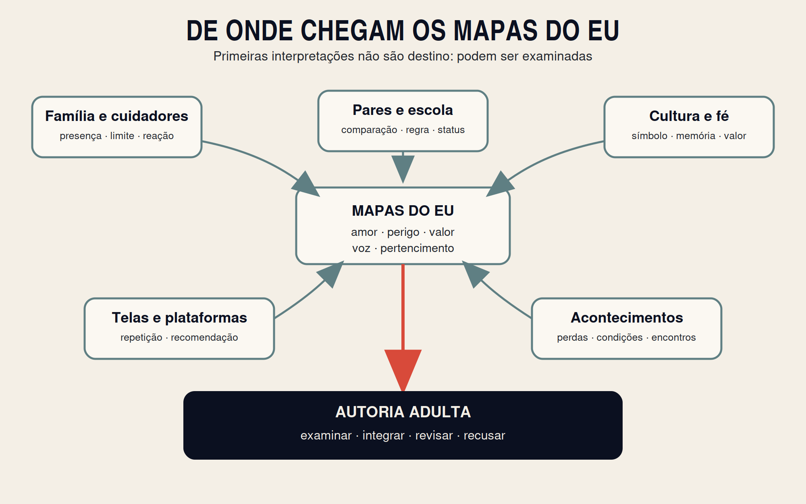
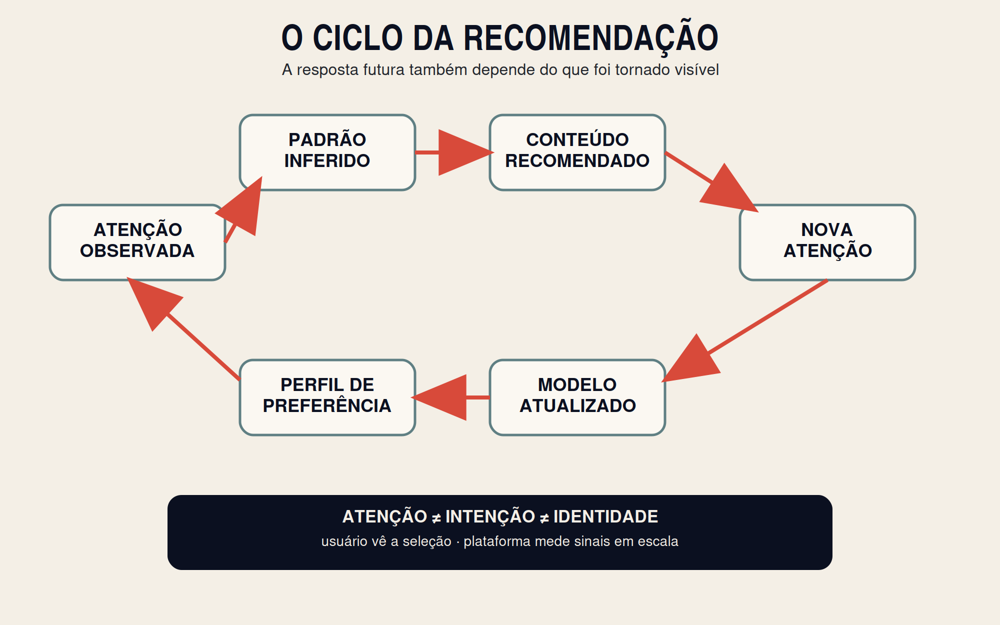
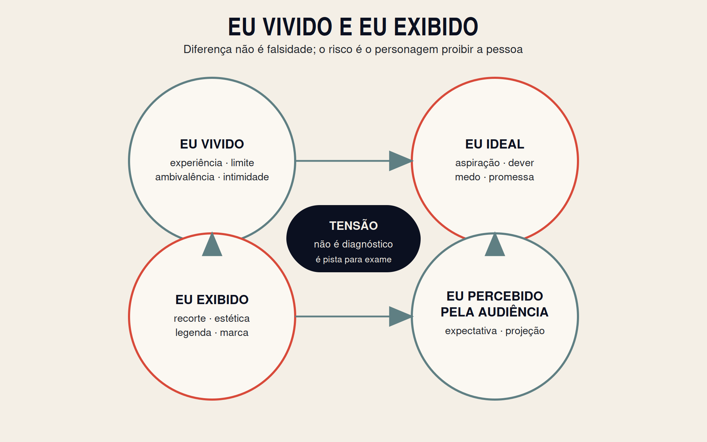
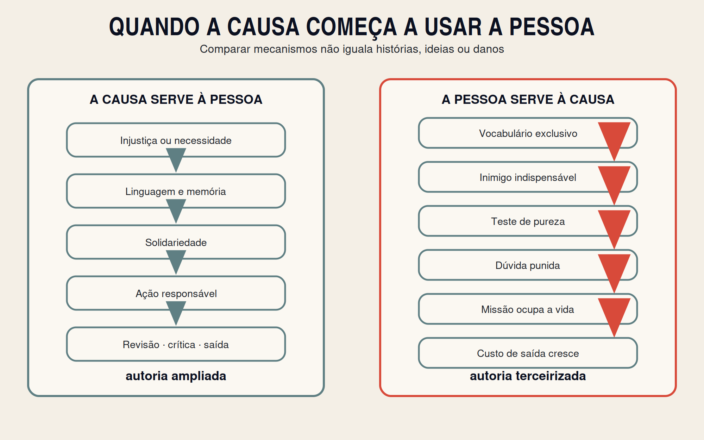

# Fuga Identitária: A Anatomia da Diluição do Eu

## Parte III — Os fornecedores do eu

**Autora:** Sol Lima  
**Entrega:** 3 do ciclo numerado de 0 a 7  
**Estado:** Escrita integral → Auditoria factual → Revisão editorial → Revisão de Sol

---

# Parte III — Os fornecedores do eu

## Quem colocou o primeiro espelho diante de você?

A Parte II terminou com uma pergunta: **quem aprendeu a fornecer o mundo dentro do qual essa pessoa se reconhece?**

Agora precisamos olhar para os fornecedores.

Você não começou a vida diante de um espelho neutro. Antes de possuir linguagem suficiente para dizer quem era, outras pessoas já reagiam à sua presença. Um rosto se abria ou se fechava. Um comportamento recebia atenção; outro, silêncio. Algumas emoções eram acolhidas; outras pareciam produzir incômodo. Certas perguntas encontravam explicação. Outras descobriam, muito cedo, que perguntar tinha custo.

Depois vieram as telas, as comparações, as comunidades, as causas, os líderes, os personagens e os nomes. Cada fonte podia ampliar sua consciência. Também podia oferecer uma imagem tão coerente, tão repetida ou tão recompensada que você começasse a habitá-la sem perceber quanto havia deixado de examinar.

Esta parte não procura culpados universais. Família não é sinônimo de captura. Tecnologia não é sinônimo de alienação. Movimento não é sinônimo de fanatismo. Nome não é sinônimo de prisão. Nenhuma pessoa se forma sem referências, e nenhuma referência é ética apenas porque produz conforto.

A pergunta será outra:

> **Quando uma referência deixa de ampliar a consciência e passa a exigir a terceirização da autoria?**

Os fornecedores não operam da mesma forma: família oferece mapas precoces; algoritmo devolve padrões de atenção; personagem organiza visibilidade; movimento oferece história e ação; rótulo torna experiências comunicáveis. Cada fonte pode ampliar consciência ou exigir coerência.

Herança não é destino. O que veio de fora não é falso por origem, e o que parece vir de dentro não é verdadeiro por natureza. Autoria exige que aquilo que o constitui possa ser examinado, integrado, recusado ou revisto.

Não desconfie de tudo. Distinga fonte de dono. Uma fonte oferece elementos para pensar. Um dono exige o direito de concluir por você.

A transformação prometida é esta:

> **Você não escolhe o primeiro espelho que recebe. Pode, porém, aprender a reconhecer o que ele mostrou, o que ocultou e quanto de sua vida ainda tem permissão para refletir.**

---

# Capítulo 8 — Os primeiros espelhos

## Família, cuidado, autoridade e quem você aprendeu a ser antes de escolher

Antes de existir “eu sou”, existiu alguém dizendo, com palavras ou reações, “você é”.

Nem sempre a frase foi pronunciada. Talvez tenha chegado como suspiro, comparação, risada, impaciência, elogio, proteção, ausência ou medo. A criança observa o que produz proximidade e o que ameaça o vínculo. Aprende pela atenção, pela repetição, pela consequência e também pelo silêncio. Descobre quais emoções cabem na casa, quais comportamentos recebem reconhecimento e quais versões de si parecem tornar a convivência mais segura.

Esse aprendizado não ocorre apenas em uma configuração familiar específica. Crianças podem ser formadas por mães, pais, avós, irmãos, famílias extensas, cuidadores, famílias adotivas, famílias reconstituídas, lares com um ou mais responsáveis e redes comunitárias. O ponto não é definir uma forma legítima de família. É compreender que o primeiro mundo de qualquer pessoa é relacional.

A identidade não nasce pronta dentro da criança e depois apenas se revela. Ela se organiza em interação com pessoas, linguagem, cultura, limites, oportunidades e experiências. Pesquisas sobre desenvolvimento da identidade mostram que exploração e compromisso se transformam ao longo do tempo e são influenciados por relações e contextos, sem que nenhum episódio determine sozinho quem alguém será (Branje et al., 2021). O primeiro espelho é poderoso, mas não é uma sentença.

## Cinco coisas que costumam ser confundidas

Quando um adulto tenta compreender de onde veio sua maneira de existir, pode misturar fenômenos diferentes. Convém separá-los.

**Mapa herdado** é a explicação inicial sobre como o mundo funciona: quem pode ser confiável, o que significa amor, como se conquista reconhecimento, o que acontece quando alguém erra, qual emoção é permitida e o que a família considera perigo.

**Estratégia de adaptação** é o comportamento desenvolvido para sobreviver ou pertencer naquele ambiente: agradar, desaparecer, antecipar necessidades, fazer graça, ser impecável, cuidar dos outros, não pedir, enfrentar tudo sozinho, produzir conflito para receber atenção ou tornar-se “o responsável”.

**Crença sobre si** é a conclusão que a pessoa começa a tirar da repetição: “sou difícil”, “sou fraco”, “sou a única pessoa confiável”, “preciso merecer amor”, “minha presença pesa”, “só tenho valor quando resolvo”.

**Regra ou valor familiar** é aquilo que organiza a convivência: lealdade, estudo, trabalho, fé, reputação, silêncio, independência, obediência, humor, cuidado, desempenho. Uma família pode declarar um valor e operar por outro. Pode dizer que valoriza verdade, mas punir quem nomeia um problema; dizer que valoriza união, mas exigir apagamento para evitar conflito.

**Identidade escolhida mais tarde** é a forma como o adulto revisa, preserva, rejeita ou integra o que recebeu. A herança participa dessa identidade, mas não precisa governá-la sem exame.

Separar essas cinco camadas impede duas injustiças. A primeira é tratar toda influência familiar como manipulação. A segunda é chamar de “personalidade” aquilo que talvez tenha começado como resposta adaptativa a um contexto específico.

Uma criança considerada “madura demais” pode ter recebido reconhecimento porque não dava trabalho. Isso não prova que toda maturidade seja ferida. Indica apenas que elogio e função podem ter se fundido. Um menino chamado de “forte” por não chorar pode crescer valorizando coragem, mas também pode aprender que pedir ajuda ameaça sua identidade. Uma menina elogiada por cuidar de todos pode desenvolver generosidade verdadeira e, ao mesmo tempo, não saber onde termina o amor e começa a obrigação de desaparecer.

O objetivo não é desqualificar as qualidades adquiridas. É devolver escolha ao adulto que as carrega.

> **Uma adaptação pode ter salvado você em uma casa e limitado você em todas as outras.**

## Autoridade que forma e autoridade que substitui

Toda criança precisa de autoridade. Precisa de adultos que protejam, ensinem, contenham impulsos, expliquem consequências e sustentem limites que ela ainda não consegue sustentar sozinha. Confundir autoridade com opressão abandona a criança à própria imaturidade. Confundir autoridade com obediência absoluta abandona a criança ao poder de quem manda.

Autoridade saudável combina presença, previsibilidade, cuidado, limite e reparação. Não exige perfeição dos cuidadores. Exige que o adulto possa reconhecer o próprio erro sem perder toda legitimidade; que a regra possa ser explicada; que o limite não humilhe; que a proteção não impeça toda experiência; que a autonomia cresça conforme a capacidade cresce.

Autonomia, nesse sentido, não é fazer tudo o que se deseja. É desenvolver a possibilidade de endossar ações e valores como próprios, em vez de funcionar apenas por pressão externa. A literatura sobre apoio à autonomia parental mostra que esse processo depende de contexto, recursos e condições emocionais dos cuidadores; não é uma qualidade fixa que algumas famílias possuem e outras não (McCurdy et al., 2020; Distefano & Meuwissen, 2022).

Uma autoridade pode dizer “não” e ainda formar autoria. Pode explicar o perigo, ouvir a frustração, manter a decisão e, depois, permitir que a criança participe de escolhas proporcionais à idade. Outra autoridade pode dizer “sim” a tudo e ainda impedir autoria, porque transforma o adulto em solucionador permanente, evita qualquer consequência e ensina que desconforto significa incapacidade.

O critério não é dureza ou permissividade isoladamente. É o que a relação está ensinando sobre realidade, responsabilidade e voz.

## Ausência não é uma palavra única

Quando um adulto reconhece que faltou cuidado em sua história, a palavra “abandono” pode parecer explicar tudo. Às vezes, houve abandono deliberado. Às vezes, houve violência, negligência grave ou recusa persistente de responsabilidade. Esses fatos não precisam ser suavizados.

Em outras histórias, porém, a ausência nasceu de exaustão, pobreza, jornadas extensas, doença, falta de rede, desigualdade na divisão do cuidado, migração, luto, incapacidade emocional, desconhecimento ou sobrevivência. O efeito sobre a criança pode ter sido real mesmo quando a intenção não era ferir.

Distinguir efeito de intenção não serve para inocentar automaticamente o adulto. Serve para impedir que a análise substitua uma história complexa por um vilão único. A pessoa pode dizer: “eu precisei de presença e não a tive” sem afirmar algo que não sabe sobre a intenção de quem faltou.

Essa distinção também protege o leitor de uma armadilha: transformar compreensão estrutural em nova forma de apagamento. Dizer que um cuidador estava sobrecarregado não apaga o que a criança perdeu. Dizer que a criança sofreu não prova que o cuidador desejava fazê-la sofrer.

Autoria adulta começa quando a pessoa consegue sustentar mais de uma verdade sem precisar destruir nenhuma delas.

## A tela que chegou antes do apoio

Famílias exaustas receberam tecnologias capazes de ocupar atenção antes de receberem informação, tempo, políticas de cuidado e alternativas suficientes. Uma tela pode ensinar, aproximar parentes, oferecer lazer, ampliar repertório, permitir comunicação e criar momentos legítimos de descanso. Não há base para tratar todo uso como dano ou toda família que recorre a ele como negligente.

A pergunta relevante é funcional: o que a tela está fazendo naquela relação?

Diretrizes da Organização Mundial da Saúde para crianças pequenas integram comportamento sedentário, atividade física e sono, em vez de tratar a tela como causa isolada de todo problema (WHO, 2019). Revisões sobre mediação parental também indicam que contexto, conteúdo, idade, acompanhamento e estilo de mediação importam; proibição total e ausência total de orientação não são as únicas opções (Collier et al., 2016; Sevilla-Fernández et al., 2025; Giovanelli et al., 2025).

A tela se torna relevante para os primeiros espelhos quando substitui, de modo persistente, experiências pelas quais a criança aprende reciprocidade: esperar resposta, interpretar expressão, reparar conflito, suportar tédio, negociar, movimentar o corpo, dormir, brincar e descobrir que outra pessoa não existe sob comando instantâneo.

Isso não significa que telas provoquem TDAH, TEA, TOD ou qualquer diagnóstico. Esses quadros exigem avaliação clínica e não podem ser reduzidos a uma explicação sociotécnica. Também não significa que retirar a tela “revele a criança verdadeira”. Mudanças ambientais podem modificar comportamento sem provar uma causa única.

O foco deste livro é mais estreito: se grande parte do alívio, do reconhecimento e da organização emocional chega por um dispositivo, quem está ensinando a criança a compreender a si, ao outro e ao desconforto?

## Estudo de caso composto: a paz que cabia na palma da mão

O caso a seguir é composto, inteiramente anonimizado e não corresponde a uma família particular.

Uma cuidadora trabalha em dois turnos, cuida da casa e quase nunca termina o dia sem culpa. A criança pede atenção quando ela ainda precisa preparar comida, responder mensagens e resolver problemas. O vídeo no telefone produz silêncio imediato. O corpo da adulta relaxa. Pela primeira vez em horas, ninguém exige nada.

Com o tempo, o dispositivo aparece em toda transição: para comer, vestir-se, esperar, viajar, acalmar-se e dormir. A criança reage quando a tela é retirada. A reação confirma à cuidadora que a criança “precisa” dela. A culpa aumenta. Para compensar a ausência, a regra cede. A paz momentânea passa a ser interpretada como sinal de cuidado suficiente.

Não há desamor nessa cena. Há exaustão, recurso limitado e um alívio que começou a organizar a relação.

A Matriz NARRATIVA permite ler o caso sem acusação. O núcleo é: “se a criança está calma, está bem”. A autoridade vem da eficácia imediata do dispositivo. O recorte mostra o silêncio e omite o que não está sendo praticado. A reclassificação transforma ausência de conflito em harmonia. O afeto combina alívio e culpa. A ação exigida é repetir a solução.

A contradição não está em usar uma tela. Está em confundir regulação terceirizada com desenvolvimento de regulação.

A cuidadora precisa de apoio, não de humilhação. A criança precisa de presença suficiente, não de perfeição. A mudança pode começar pequena: uma refeição sem tela, uma transição acompanhada, um limite previsível, um pedido de ajuda, uma reparação depois da explosão, um adulto que reconhece “eu usei isso para sobreviver, mas não quero que seja a única forma de ficarmos bem”.

## Contracaso: tecnologia dentro do vínculo

Em outra família, a tela também existe. A criança assiste a conteúdos escolhidos, joga, conversa com parentes e participa de atividades digitais. Os adultos acompanham parte do que ela consome, mantêm horários possíveis, protegem o sono e não tratam toda frustração como emergência. Às vezes cedem. Às vezes erram. Depois conversam e reorganizam a regra.

A tecnologia não ocupa o lugar de toda reciprocidade. Entra em uma relação que já possui voz, limite e reparação. Nesse contexto, o dispositivo pode ampliar experiências sem se tornar o principal intérprete do mundo interno da criança.

O contracaso importa porque impede a conclusão preguiçosa: “tela é captura”. Não é o objeto isolado que define a fuga. É a função que assume e a autoria que preserva ou substitui.

> **IDENTIFIQUE O MAPA HERDADO.**
>
> Escreva três regras que pareciam naturais em sua casa: sobre amor, conflito, autoridade, dinheiro, corpo, fé, sucesso, erro ou afeto.
>
> Depois pergunte: “essa regra descreve a realidade, uma estratégia daquela família ou uma conclusão que eu ainda não examinei?”
>
> **Aplicação:** Que frase sobre você começou como reação de outra pessoa e hoje parece definição?

Reconhecer um mapa herdado não exige acusar quem o transmitiu. Muitos adultos entregam aos filhos aquilo que também receberam sem escolha. Outros tentaram fazer melhor com os recursos que possuíam. Alguns falharam gravemente e precisam ser responsabilizados. Nenhuma dessas possibilidades muda a tarefa atual.

Você não escolheu o primeiro espelho.

Agora pode decidir se ele continuará sendo o único.

---
# Capítulo 9 — O algoritmo não sabe quem você é

## Ele apenas aprende o que captura a sua atenção

Você pesquisa uma coisa uma vez e ela reaparece durante dias. Assiste a um vídeo por curiosidade e recebe uma sequência inteira sobre o mesmo assunto. Para diante de uma publicação que o irrita e, pouco depois, encontra mais conteúdos capazes de provocar a mesma reação.

A sensação pode ser estranha: “essa plataforma me conhece”.

Não necessariamente.

Um sistema de recomendação não precisa compreender sua história, seus valores, a diferença entre uma dúvida passageira e uma convicção, nem o motivo pelo qual você permaneceu diante de um conteúdo. Precisa estimar, com alguma precisão, o que tem maior probabilidade de produzir uma próxima ação observável.

Algoritmo é uma palavra ampla. Plataformas diferentes usam objetivos, modelos, sinais e sistemas diferentes. Alguns procedimentos selecionam candidatos; outros ordenam conteúdos; outros estimam relevância, segurança, interesse, probabilidade de clique, tempo de exibição, retorno, compartilhamento ou compra. A arquitetura industrial descrita historicamente pelo YouTube, por exemplo, separava geração de candidatos e ranqueamento, usando grandes quantidades de sinais comportamentais para prever o que apresentar (Covington, Adams & Sargin, 2016). Isso não autoriza afirmar que todas as plataformas funcionem hoje da mesma maneira. Autoriza uma distinção fundamental:

> **Predizer uma ação não é conhecer uma pessoa.**

## O que o sistema consegue observar

A plataforma não lê sua alma. Observa rastros.

Tempo de permanência. Retorno. Sequência de consumo. Busca. Curtida. Compartilhamento. Comentário. Seguimento. Abandono. Repetição. Compra. Bloqueio. Pausa. Abertura de notificação. Interação com conteúdos parecidos. Relação entre o que você fez e o que fizeram outras pessoas com padrões parcialmente semelhantes.

Esses sinais podem ser muito informativos. Também são ambíguos.

Você pode assistir a um vídeo porque concorda. Porque discorda. Porque está pesquisando. Porque ficou chocado. Porque alguém próximo vive aquilo. Porque a imagem prendeu sua atenção. Porque doeu. Porque teve medo. Porque desejou. Porque não entendeu.

Para um sistema que aprende com comportamento, essas motivações diferentes podem produzir o mesmo rastro: permanência.

É por isso que um feed pode confundir curiosidade com identidade, indignação com interesse, sofrimento com preferência e investigação com adesão.

A plataforma não precisa declarar “você é isso”. Basta repetir “pessoas que fizeram algo parecido também olharam isto”. A repetição começa a construir uma paisagem. E uma paisagem frequente pode adquirir aparência de mundo inteiro.

## A economia da atenção

Atenção não é apenas um estado psicológico. Em muitos modelos de negócio, é recurso econômico. Quanto mais tempo uma pessoa permanece, mais oportunidades existem para publicidade, coleta de sinais, venda, retenção, influência, assinatura, dados e crescimento de audiência.

Isso não significa que todo conteúdo recomendado faça parte de uma conspiração consciente. Sistemas podem produzir consequências sem intenção humana centralizada. Criadores respondem ao que recebe alcance. Usuários respondem ao que aparece. Plataformas ajustam modelos ao que aumenta determinados indicadores. A dinâmica emerge de muitos interesses, escolhas e mecanismos.

Por isso, a pergunta **quem lucra?** não deve ser usada como acusação automática. Lucro pode significar dinheiro, mas também atenção, reputação, adesão, dados, influência, preservação de grupo, poder de agenda ou crescimento de comunidade. Localizar o beneficiário ajuda a compreender o incentivo; não prova sozinho manipulação.

## O ciclo da recomendação

Um sistema observa atenção. Infere um padrão. Recomenda conteúdo. A recomendação produz nova atenção. O novo comportamento atualiza o padrão.

Essa sequência parece simples, mas muda a pergunta sobre preferência. O dado futuro não é totalmente independente da recomendação anterior. A pessoa escolhe entre opções que alguém ou algum sistema decidiu tornar visíveis. Sua resposta, então, é registrada como evidência de preferência e usada para selecionar a próxima oferta.

Pesquisas sobre ciclos de retroalimentação em sistemas de recomendação mostram que recomendações, consumo e atualização do modelo podem reforçar popularidade, reduzir diversidade agregada ou alterar a representação dos gostos ao longo do tempo, embora os efeitos dependam do sistema, do domínio e do comportamento dos usuários (Mansoury et al., 2020; Adomavicius et al., 2022; Zoralioglu & Yalcin, 2026).

Esse ciclo não elimina agência. Você pode procurar fontes diferentes, interromper sequências, ajustar preferências, não interagir, sair, comparar e voltar deliberadamente a conteúdos longos ou divergentes. Mas existe assimetria: o usuário vê uma seleção; a plataforma possui mais dados, experimenta interfaces, mede respostas em escala e decide grande parte da ordem de exposição.

Autoria digital não exige fingir que essa assimetria não existe. Exige agir sabendo que existe.

Existe ainda uma diferença entre **escolha local** e **autoria do percurso**. Você pode escolher livremente entre cinco vídeos e, mesmo assim, não ter decidido por que aqueles cinco, naquela ordem, se tornaram o campo da escolha. Também pode receber uma recomendação e recusá-la. Nenhuma das duas descrições, isoladamente, resolve o problema.

A pergunta mais útil é dupla: **o que fiz diante do que apareceu — e como foi construído o conjunto do que apareceu?** A primeira devolve responsabilidade ao usuário. A segunda impede que o desenho da plataforma desapareça. Culpar somente o algoritmo retira agência; culpar somente a pessoa transforma arquitetura em cenário neutro.

## Familiaridade não é verdade

Uma ideia repetida parece mais familiar. E familiaridade pode ser confundida com plausibilidade. Esse fenômeno não nasceu com as redes, mas a distribuição personalizada aumenta a capacidade de repetir conteúdos em sequência e em formatos diferentes.

O ponto precisa ser formulado com cuidado: repetição não controla automaticamente a crença. Pessoas discordam do que veem, resistem, esquecem, procuram contrapontos e mudam de opinião por muitas razões. Ainda assim, o que aparece com frequência se torna mais disponível à memória e mais fácil de recuperar quando precisamos explicar o mundo.

Se durante semanas você recebe vídeos afirmando que relacionamentos são guerra, que toda mulher age de uma forma ou todo homem de outra, talvez não adote imediatamente a tese. Mas começará a reconhecer o vocabulário, os exemplos, os inimigos e as histórias. Quando algo acontecer, aquela explicação já estará pronta.

A repetição fornece material antes que a vida exija interpretação.

## Bolha, câmara de eco e mundo real

“Bolha” tornou-se uma explicação rápida para tudo o que há de errado na internet. A realidade é menos simples.

Pessoas escolhem amigos, fontes e grupos por afinidade. Redes sociais também podem expor usuários a divergência, notícias, arte, ciência e experiências que jamais encontrariam em seu círculo imediato. Um estudo amplamente citado sobre Facebook encontrou que tanto a composição da rede quanto o ranqueamento influenciavam a exposição a notícias ideologicamente divergentes; as escolhas do usuário também tinham papel relevante (Bakshy, Messing & Adamic, 2015). Outros trabalhos encontraram padrões de segregação e formação de câmaras de eco em plataformas diferentes, com intensidade variável conforme o desenho da plataforma e o tipo de conteúdo (Cinelli et al., 2021).

A conclusão responsável não é “o algoritmo prende todos em uma bolha”. É: personalização, seleção social e comportamento do usuário podem estreitar repertórios em determinados contextos; em outros, a recomendação pode ampliar descoberta.

Emoção também não deve ser tratada como veneno automático. Conteúdo que comove, diverte ou indigna pode informar e mobilizar. O risco aparece quando intensidade emocional substitui exame e quando o sistema aprende que sua atenção é mais previsível diante do choque do que diante da complexidade.

## Estudo de caso composto: a pesquisa que virou destino

Este caso é composto e não corresponde a uma pessoa real particular.

Depois de um término doloroso, um homem pesquisa: “por que fui trocado?”. Assiste a um vídeo que promete explicar padrões de atração. O conteúdo oferece alívio: não foi apenas rejeição; existe uma estrutura. Ele assiste até o fim.

A plataforma recomenda outro vídeo, depois outro. Alguns falam de autoestima e limites. Outros apresentam mulheres como calculadoras de status. Outros ensinam que vulnerabilidade masculina produz desprezo. A dor inicial encontra uma narrativa total: relações são disputa; afeto é negociação; homens conscientes enxergam a verdade que os demais recusam.

Ele não procurou uma identidade. Procurou explicação.

Mas o sistema registrou atenção, não intenção. A repetição forneceu vocabulário, comunidade, heróis e inimigos. Em poucas semanas, o homem começa a reinterpretar relações antigas pela nova lente. Exceções deixam de ser pessoas concretas e passam a ser “casos que confirmam a regra de outro modo”.

Aplique a Matriz NARRATIVA ao feed.

O **Núcleo** é a promessa de que uma teoria única explicará toda rejeição. A **Autoridade** vem da segurança dos criadores, dos relatos de conversão e dos números apresentados sem contexto. O **Recorte** seleciona histórias de traição e omite relações cooperativas. A **Reclassificação** transforma ressentimento em lucidez. O **Afeto** oferece alívio, orgulho e inimigo. A **Testabilidade** enfraquece porque qualquer mulher que discorde é classificada como exemplo da própria manipulação. A **Imunização** chama críticos de ingênuos ou submissos. O **Valor** declarado é respeito próprio; o valor operante pode tornar-se controle. A **Ação** exigida é consumir mais, suspeitar mais e provar que “acordou”.

O algoritmo não criou sozinho a dor, a narrativa ou a comunidade. Também não decidiu conscientemente capturá-lo. Fez algo mais limitado e ainda assim relevante: aumentou a disponibilidade de uma explicação porque ela reteve atenção.

## Contracaso: recomendação que amplia repertório

Uma mulher começa a assistir a vídeos sobre jardinagem. Recebe conteúdos de botânica, pequenos produtores, agricultura urbana, conservação de sementes e paisagismo. Descobre autores, faz um curso técnico, entra em uma comunidade e passa a cultivar alimentos.

A recomendação não estreitou sua identidade. Abriu um campo de experiência que encontrou confirmação fora da tela: plantas cresceram ou morreram, técnicas funcionaram ou falharam, pessoas experientes corrigiram seus erros. Ela não precisou defender o sistema de recomendação para preservar o novo interesse. Pode sair da plataforma e continuar aprendendo.

O contracaso mostra o critério: uma recomendação amplia autoria quando oferece possibilidades que podem ser testadas na realidade, integradas a outros vínculos e abandonadas sem destruir o eu.

> **LOCALIZE A REPETIÇÃO.**
>
> Escolha um tema que aparece com frequência no seu feed. Não pergunte primeiro se é verdadeiro ou falso. Pergunte: “quantas vezes encontrei esta ideia, em quantos formatos e por quais caminhos?”
>
> Depois procure deliberadamente uma fonte competente que não dependa do mesmo circuito de referências.

> **PERGUNTE QUEM LUCRA.**
>
> Liste os possíveis beneficiários da sua atenção: plataforma, anunciante, criador, movimento, comunidade, produto, reputação, coleta de dados ou você mesmo.
>
> A existência de benefício não prova fraude. Ela revela o incentivo que precisa ser considerado.

O algoritmo não sabe quem você é.

Ele sabe, em diferentes graus, o que você fez diante do que lhe foi mostrado.

O perigo começa quando essa diferença desaparece e você passa a tratar uma previsão de atenção como revelação de identidade.

---

# Capítulo 10 — O eu ideal

## Quando uma possibilidade vira personagem

Você escolhe uma fotografia entre vinte. Corrige a luz. Retira o ruído do fundo. Escreve uma legenda que organiza o que sentiu. Nada disso é mentira por definição. Toda comunicação seleciona. Toda roupa apresenta alguma coisa. Toda fala deixa algo de fora.

O problema não começa quando você edita uma imagem.

Começa quando a vida passa a ser editada para não contradizer a imagem.

Existe o **eu vivido**: aquilo que você experimenta por dentro, com ambivalência, limite, desejo, vergonha, mudança e intimidade. Existe o **eu ideal**: a pessoa que você gostaria de ser, ou teme precisar ser, para alcançar valor, amor, segurança ou reconhecimento. Existe o **eu exibido**: a parte escolhida, enquadrada e tornada pública. E existe ainda o **eu percebido pela audiência**: a personagem que outras pessoas constroem a partir do que você mostrou, das expectativas delas e do contexto que nunca viram.

Esses quatro eus não coincidem completamente. Não deveriam.

Intimidade exige regiões que não pertencem à plateia. Aspiração exige distância entre quem somos e quem desejamos tornar-nos. Representação exige escolha. A discrepância, portanto, não prova falsidade. O risco aparece quando a diferença precisa ser escondida, quando o personagem deixa de ser um papel e começa a proibir a pessoa que o sustenta.

## Comparar não é apenas invejar

A comparação social faz parte da orientação humana. Observamos outras pessoas para estimar possibilidades, padrões, riscos e posição. Comparações “para cima” podem inspirar, ensinar e ampliar ambição; também podem aumentar insuficiência quando a distância parece intransponível ou quando ignoramos as condições que produziram o resultado. Comparações “para baixo” podem oferecer gratidão ou perspectiva; também podem alimentar superioridade ou impedir aprendizagem.

A teoria da autodiscrepância ajuda a compreender por que a distância entre o eu atual e certas representações ideais pode produzir emoções diferentes. A tensão depende do tipo de padrão, do significado atribuído a ele e da possibilidade percebida de aproximação, não apenas da existência de diferença (Higgins, 1987). Uma meta-análise de estudos experimentais encontrou, em média, efeitos negativos pequenos da exposição a alvos de comparação ascendente nas autoavaliações e emoções, com variação entre desfechos e contextos; isso não significa que toda comparação produza dano em toda pessoa (McComb, Vanman & Tobin, 2023).

Nas redes, porém, a comparação raramente ocorre entre duas vidas completas. Comparamos bastidores extensos com recortes eficientes. Comparamos um corpo em movimento com uma imagem escolhida. Comparamos uma semana comum com o ponto alto de outra pessoa. Comparamos processos longos com resultados apresentados sem o custo, a ajuda, o capital, a equipe, o fracasso ou a repetição que os precederam.

Isso não significa que influenciadores estejam sempre enganando. Produzir conteúdo é trabalho. Enquadrar, editar, selecionar e repetir formatos faz parte da atividade. O erro começa quando a audiência esquece que está diante de uma produção e a usa como medida direta da própria existência.

## Relação parassocial: vínculo percebido, não fraude automática

Quando alguém aparece todos os dias, fala olhando para a câmera, conta episódios íntimos e responde a comentários, o cérebro social recebe sinais de proximidade. O espectador pode sentir que conhece aquela pessoa. Horton e Wohl chamaram de relação parassocial a experiência de intimidade percebida com uma figura pública cuja reciprocidade é limitada ou inexistente (Horton & Wohl, 1956).

Esse vínculo pode informar, acompanhar e inspirar. Uma comunicadora pode ajudar alguém a dar nome a um problema. Um professor pode tornar o conhecimento acessível. Uma artista pode oferecer companhia durante um período difícil. A unilateralidade não torna o vínculo imaginário em seus efeitos emocionais, nem o torna automaticamente nocivo.

A assimetria, porém, precisa permanecer visível. A pessoa pública fala para milhares. Você conhece aquilo que ela decidiu tornar público. Ela pode não conhecer seu nome, sua história, seus riscos ou as consequências de você aplicar uma orientação geral à sua vida particular. Uma revisão contemporânea descreve relações parassociais como fenômenos heterogêneos, capazes de se associar a aprendizagem, pertencimento e bem-estar em alguns contextos, e a comparação negativa ou outros efeitos adversos em outros; o conteúdo, a vulnerabilidade do público e a forma de uso importam (Hoffner & Bond, 2022).

O influenciador é ao mesmo tempo pessoa, trabalho e posição numa economia de visibilidade. Pode acreditar sinceramente no que ensina e também depender de alcance, venda e permanência. Reconhecer o interesse não elimina a contribuição. Impede que afeto seja usado como certificado de competência universal.

## Avatar, skin e experimentação

Num jogo, você pode escolher outro corpo, outra voz, outra espécie, outra força, outra estética. Pode experimentar coragem, liderança, humor, beleza, poder, cooperação ou pertencimento. O avatar não é necessariamente uma fuga do eu. Pode ser ferramenta de brincadeira, aprendizagem, competência, criação e vínculo.

Pesquisas sobre o chamado efeito Proteus encontraram que características atribuídas a avatares podem influenciar temporariamente comportamento e autoapresentação em ambientes virtuais, embora o tamanho, a duração e a generalização dos efeitos variem, e não autorizem afirmar que uma skin reprograma uma identidade (Yee & Bailenson, 2007). Estudos posteriores mostram um quadro mais complexo, dependente de identificação, contexto, desenho da experiência e diferenças individuais.

A pergunta não é “por que alguém deseja ser diferente num ambiente imaginário?”. A imaginação humana sempre criou máscaras, personagens e mundos. A pergunta é: **o que essa possibilidade permite experimentar — e o que começa a proibir quando a pessoa volta?**

Um avatar pode oferecer um laboratório seguro para ensaiar habilidades que depois atravessam a vida. Também pode tornar-se o único lugar em que alguém se sente competente, desejado ou reconhecido. Nesse caso, o problema não é a fantasia. É a perda de pontes entre experiência virtual e agência fora dela.

## A audiência que entra na cabeça

A plateia não precisa estar presente para governar uma ação. Depois de muito tempo publicando, algumas pessoas passam a observar a si mesmas como conteúdo. Antes de viver, imaginam como a cena aparecerá. Antes de sentir, procuram a legenda. Antes de escolher, calculam se a decisão combina com a marca pessoal.

Chamo esse processo de **audiência internalizada**: agir como se um observador estivesse permanentemente avaliando a coerência do personagem.

Isso pode acontecer com qualquer identidade pública. A pessoa engraçada sente culpa por estar triste. A especialista em produtividade não admite cansaço. A mulher “forte” não pede ajuda. O homem “inabalável” não reconhece medo. A defensora da autenticidade precisa transformar toda hesitação em certeza performada. Até a espontaneidade passa a ser planejada para parecer espontânea.

A autenticidade, então, converte-se em desempenho de autenticidade.

Não porque tudo publicado seja falso, mas porque somente emoções que confirmam a narrativa podem ser exibidas. O personagem não mente necessariamente sobre o que existe. Ele impede que o restante exista com legitimidade.

## Estudo de caso composto: a mulher que virou sua própria vitrine

Este caso é composto e não corresponde a uma pessoa específica.

Marina construiu uma presença digital competente sobre independência, coragem e reinvenção profissional. O conteúdo nasceu de experiências reais. Ela havia reconstruído a vida depois de uma ruptura, estudado, criado um negócio e aprendido a falar diante da câmera.

A audiência cresceu porque muitas mulheres se reconheciam nela. Marina recebia mensagens dizendo: “Você me deu força”. O trabalho tornou-se renda, comunidade e propósito.

Com o tempo, qualquer momento de dúvida passou a ameaçar mais do que seu humor. Ameaçava o personagem que sustentava o negócio. Quando desejava descansar, pensava que decepcionaria seguidoras. Quando queria pedir ajuda, temia perder autoridade. Quando uma decisão não produzia uma boa narrativa de superação, escondia-a até de amigas. Sua vida precisava provar continuamente a frase pela qual era conhecida.

Marina não havia inventado uma personagem do nada. Havia transformado uma parte verdadeira em obrigação total.

A Matriz NARRATIVA revela a passagem. O núcleo dizia: “Eu sou a mulher que sempre se levanta”. A autoridade vinha de sua própria história e do reconhecimento público. O recorte preservava vitórias e escondia dependência, exaustão e ambivalência. A reclassificação chamava descanso de fraqueza e silêncio de irrelevância. O afeto combinava orgulho com medo de desaparecer. A ação exigida era continuar produzindo coerência.

O público não a obrigava necessariamente de forma explícita. Parte da vigilância já havia sido internalizada.

O sinal de captura não era possuir uma marca pessoal. Era perder acesso a desejos que não rendiam conteúdo e a necessidades que não combinavam com a marca.

## Contracaso: papel público com porta de saída

Outra criadora define fronteiras. Explica que ensina a partir de uma área delimitada e não oferece orientação individual sobre temas que não conhece. Mantém vínculos que não dependem de audiência. Possui horários sem publicação, interesses que não monetiza e pessoas diante das quais não precisa representar competência.

Ela também seleciona imagens e planeja conteúdo. Mas consegue dizer “não sei”, mudar de opinião, desaparecer durante alguns dias e reconhecer uma dificuldade sem convertê-la imediatamente em produto. A persona organiza trabalho; não ocupa toda a pessoa.

O contracaso não exige ausência de performance. Toda função social possui performance. Exige permeabilidade: o papel pode terminar, ser corrigido e conviver com uma vida que não precisa provar nada.

> **COMPARE O EU VIVIDO AO EU EXIBIDO.**
>
> Escolha uma identidade que você apresenta ao mundo: profissional, afetiva, espiritual, estética, política ou digital.
>
> Pergunte: **o que existe em mim quando não há plateia, desempenho ou prova?**
>
> O que o personagem me permite experimentar? O que ele começou a proibir? Que necessidade eu teria vergonha de admitir porque ela contradiz a imagem?

Representar não é desaparecer.

O desaparecimento começa quando a representação se torna a única versão autorizada de você.

E o personagem individual não é o único fornecedor. Algumas identidades chegam como “nós”: uma causa, uma história coletiva, uma missão e um lugar moral. Elas podem ampliar a linguagem e tornar a ação possível. Também podem começar a exigir que toda a pessoa caiba no papel de membro.

---

# Capítulo 11 — Quando o movimento começa a usar a pessoa

## Uma causa pode precisar da sua ação sem precisar do seu desaparecimento

Movimentos sociais mudaram leis, ampliaram direitos, denunciaram violências, preservaram memórias, organizaram solidariedade e tornaram visíveis experiências antes silenciadas. Comunidades religiosas sustentaram pessoas em luto, criaram redes de cuidado, ofereceram disciplina, transcendência e serviço. Grupos políticos construíram participação cívica. Coletivos profissionais, terapêuticos e culturais deram linguagem a problemas reais.

Uma causa não se torna ilegítima porque possui identidade coletiva.

Nenhuma ação comum existiria se cada pessoa precisasse reinventar sozinha todos os conceitos, símbolos, estratégias e valores. O “nós” pode ampliar capacidade. O problema começa quando o “nós” passa a reivindicar monopólio sobre o “eu”.

Participação, engajamento, militância, devoção, identificação, fusão e alto controle não são sinônimos. Uma pessoa pode dedicar anos a uma causa examinada e continuar autora. Outra pode frequentar discretamente um grupo e já não conseguir formular uma pergunta sem consultar o vocabulário permitido.

A intensidade não decide. O mecanismo decide.

> **Uma causa pode precisar da sua ação. O perigo começa quando passa a precisar do seu desaparecimento.**

## Nove sinais de passagem

A passagem de “a pessoa usa o movimento” para “o movimento usa a pessoa” raramente ocorre por um único sinal. Procure conjuntos repetidos.

**Vocabulário exclusivo.** Conceitos internos podem ser úteis. Tornam-se problemáticos quando somente quem aceita o vocabulário é considerado capaz de compreender a realidade, e palavras externas são descartadas antes do exame.

**Identidade total.** A causa deixa de ser uma dimensão importante e passa a explicar profissão, amizade, amor, humor, estética, moralidade e valor pessoal. Nada permanece fora dela.

**Inimigo indispensável.** Toda comunidade possui adversários, críticas e conflitos. O alerta surge quando o grupo precisa manter um inimigo absoluto para preservar coesão, urgência e pureza.

**Teste de pureza.** A pessoa precisa provar que está do lado certo por linguagem, postagem, consumo, denúncia, ruptura ou silêncio. A fidelidade é medida por sinais cada vez mais estreitos.

**Hierarquia moral interna.** Alguns membros tornam-se intérpretes autorizados da virtude. O status depende de demonstrar maior consciência, lealdade, sofrimento, radicalidade ou proximidade com a liderança.

**Punição à pergunta.** A dúvida deixa de ser respondida pelo conteúdo. Recebe diagnóstico moral: ignorância, opressão, fraqueza, pecado, traição, contaminação ou falta de consciência.

**Missão que substitui vida.** Descanso, família, trabalho, amizade e interesses deixam de possuir valor próprio. Só importam se servirem à causa.

**Assimetria de critérios.** O que prova corrupção no adversário vira exceção compreensível no aliado. O mesmo comportamento muda de nome conforme o lado.

**Custo crescente de saída.** Divergir ameaça vínculos, reputação, identidade, salvação, trabalho ou sentido. A Parte IV examinará como esse custo se fecha em redoma e dependência. Aqui basta reconhecer que a liberdade de permanecer só é significativa quando existe alguma possibilidade real de sair.

Nenhum sinal isolado transforma uma comunidade em grupo de alto controle. Uma organização pode usar linguagem própria, possuir disciplina, exigir compromisso e ainda admitir correção, prestação de contas e saída. O diagnóstico apressado seria apenas outra forma de identidade de trincheira.

## Compromisso profundo não é desaparecimento

Uma pessoa pode amar profundamente um grupo e continuar autora. Pode arriscar tempo, recursos e reputação por algo que considera justo. Pode organizar grande parte da vida em torno de uma missão. O fato de o compromisso possuir custo não prova captura.

A teoria da **fusão de identidade** descreve situações em que o eu pessoal e o eu grupal se tornam fortemente conectados, sem necessariamente se tornarem indistinguíveis. Em alguns contextos, essa ligação pode sustentar solidariedade e ação extraordinária; em outros, pode aumentar disposição para sacrifícios extremos. A pesquisa não autoriza diagnosticar membros a distância nem concluir que todo engajamento intenso seja patológico (Swann et al., 2012).

Por isso, o teste não é “quanto você se importa?”. É:

Você ainda consegue reconhecer um erro do grupo sem sentir que sua própria existência foi anulada?

A causa permite que seus valores pessoais a corrijam, ou redefine qualquer valor para proteger a si mesma?

Há pessoas diante das quais você continua sendo mais do que membro, militante, fiel, fã ou adversário?

Você pode descansar sem tratar descanso como deserção?

Um compromisso autoral não precisa ser morno. Precisa conservar instâncias de revisão. O membro pode dizer “nós erramos” sem deixar de existir, “eu discordo” sem ser reduzido a inimigo e “não participarei desta ação” sem que toda sua história seja confiscada.

A captura não se mede pelo volume da paixão. Mede-se pela quantidade de pessoa que precisa desaparecer para que a paixão continue parecendo legítima.

## O mesmo critério, contextos diferentes

Aplicar o mesmo método não significa declarar que todos os movimentos possuem a mesma história, o mesmo poder, a mesma reivindicação ou o mesmo efeito. A escravidão e a campanha por sua abolição não se tornam moralmente equivalentes porque ambos organizaram grupos. Um movimento por direitos civis e uma comunidade fundada em supremacia não se tornam iguais porque ambos usam símbolos.

Simetria exige critérios consistentes. Não exige cegueira às diferenças relevantes.

A pergunta é mais precisa: **em cada contexto, a linguagem, o pertencimento e a missão ampliam a capacidade de reconhecer fatos e pessoas — ou começam a exigir identidade total?**

### Feminismos: direitos, correntes e trincheiras

Não existe um único feminismo. Há tradições liberais, socialistas, marxistas, radicais, negras, interseccionais, decoloniais, comunitárias e outras, com divergências profundas sobre sexo, gênero, classe, raça, trabalho, família, violência e Estado. Crenshaw mostrou como experiências de mulheres negras podiam desaparecer quando raça e gênero eram tratados separadamente; bell hooks criticou um feminismo incapaz de alcançar mulheres fora da experiência branca e de classe média (Crenshaw, 1989; hooks, 1984).

Reconhecer essa diversidade impede que “o feminismo” seja transformado em causa única de todas as mudanças familiares ou sociais. Direitos civis, acesso à educação, proteção contra violência, participação política e autonomia econômica não constituem captura por definição.

O mecanismo de trincheira pode aparecer quando uma corrente reivindica representar toda mulher; quando discordância interna é tratada como traição ao próprio sexo; quando a biografia de cada pessoa precisa caber numa explicação única de opressão; ou quando fatos inconvenientes sobre mulheres, homens ou instituições são recusados porque ameaçam a identidade moral do grupo.

Também pode aparecer no antifeminismo quando toda mulher que reivindica autonomia é transformada em inimiga da família, quando mudanças complexas são atribuídas a uma conspiração única ou quando o homem só consegue reconhecer a si mesmo pela oposição a uma caricatura de mulher.

A crítica à identidade total não pertence a um lado.

### Sofrimento masculino, masculinismos e manosfera

Homens enfrentam problemas reais: suicídio, violência, fracasso escolar em certos contextos, solidão, trabalho perigoso, dificuldades de cuidado, expectativas rígidas de força e falta de linguagem emocional. Discutir sofrimento masculino não é misoginia. Questionar uma tese feminista não transforma automaticamente alguém em incel ou adepto da red pill.

A manosfera reúne ecossistemas diferentes — fóruns de direitos dos homens, comunidades de sedução, grupos “red pill”, espaços de celibato involuntário e outras subculturas — que não devem ser comprimidos numa categoria única. A literatura descreve conexões, migrações de linguagem e gradações de misoginia, ressentimento e determinismo entre alguns desses espaços, sem autorizar a acusação de todo homem que procura orientação (Ging, 2019; Ribeiro et al., 2021).

O fornecedor identitário torna-se visível quando a dor recebe uma explicação total: mulheres formam uma classe inimiga; relações obedecem a regras imutáveis de mercado; vulnerabilidade é fraqueza; exceções confirmam a regra; pertencimento exige desprezo; e o homem prova lucidez repetindo o roteiro.

Um movimento pode começar nomeando solidão e terminar exigindo que a pessoa preserve a solidão para continuar confirmando o movimento.

### Política: participação e fusão

Movimentos progressistas, conservadores, nacionalistas e partidários podem organizar valores e ação legítima. Democracias dependem de associação, disputa e mobilização. O problema não é possuir posição política.

O sinal aparece quando o partido se torna medida de caráter total; quando toda notícia é avaliada primeiro pela identidade de quem a divulgou; quando o erro do aliado precisa ser rebatizado; quando vínculos pessoais só sobrevivem sob concordância; quando a vida recebe sentido principalmente pela vitória sobre o inimigo.

A personalização em torno de líderes e a fusão política serão aprofundadas no Capítulo 17. Aqui não precisamos transformar nomes próprios em centro da análise. Basta observar se a causa ainda permite que o membro aplique a ela o critério que exige do adversário.

### Fé, comunidade e alto controle

Fé não é sinônimo de fuga. Doutrina não é sinônimo de coerção. Disciplina religiosa pode ser livre, examinada e significativa. Comunidades de fé oferecem linguagem moral, esperança, ritual, memória, cuidado, serviço e pertencimento. Uma convicção não se torna ilegítima por não ser reduzível a um experimento de laboratório.

O objeto deste livro é o mecanismo de alto controle: quando uma autoridade humana reivindica interpretar toda dúvida; quando Deus, salvação ou pureza são usados para retirar da pessoa a possibilidade de exame; quando a comunidade se torna fonte única; quando a disciplina protege a liderança da prestação de contas; quando sair parece equivaler a perder identidade, vínculos e destino espiritual.

Não é necessário chamar toda religião de seita para reconhecer controle. Tampouco é preciso abandonar a fé para questionar uma organização. Uma comunidade pode sustentar convicções fortes e ainda distinguir doutrina de poder humano, aceitar perguntas, proteger quem denuncia dano e reconhecer que nenhuma liderança possui acesso ilimitado à consciência alheia.

### Gurus, coaches, fandoms e conspirações

Ensino, mentoria e coaching podem oferecer método, responsabilidade e aprendizagem. Fandoms podem produzir amizade, criatividade e prazer. Comunidades alternativas podem preservar conhecimentos negligenciados. O problema não está na existência de admiração ou orientação.

Ele aparece quando o profissional promete interpretar tudo; quando resultado positivo prova o método e resultado negativo prova resistência; quando renovação se torna prova de compromisso; quando o líder ocupa o lugar de consciência; quando fãs precisam defender qualquer conduta para preservar a própria identidade; quando uma teoria conspiratória absorve toda ausência de evidência como evidência de ocultação.

Carisma não prova fraude. Sofrimento superado não prova competência universal. Número de seguidores não prova verdade. E crítica não prova perseguição.

## Estudo de caso composto comparativo: duas causas, mecanismos semelhantes

Os casos a seguir são compostos. As causas, histórias e efeitos não são declarados equivalentes. A comparação alcança apenas os mecanismos de pertencimento.

No primeiro grupo, uma jovem entra num coletivo progressista depois de vivenciar discriminação no trabalho. Encontra linguagem para descrever o que ocorreu, apoio para formalizar uma denúncia e pessoas que a ajudam a recuperar dignidade. Com o tempo, uma corrente interna começa a exigir demonstrações públicas de pureza. Uma pergunta sobre estratégia é tratada como reprodução da opressão. Amizades com pessoas “insuficientemente conscientes” tornam-se suspeitas. O silêncio numa campanha é interpretado como violência.

No segundo grupo, um jovem entra numa comunidade conservadora depois de sentir que seus valores familiares são ridicularizados. Encontra amizade, serviço voluntário e argumentos que o ajudam a sustentar convicções. Com o tempo, uma liderança começa a definir qualquer dúvida como infiltração ideológica. Fontes externas são condenadas em bloco. Relações com pessoas de posições diferentes tornam-se prova de fraqueza. Recusar uma publicação é tratado como covardia diante do inimigo.

As injustiças, teorias e objetivos dos grupos são distintos. O mecanismo observado é semelhante: linguagem que primeiro organiza; pertencimento que depois vigia; inimigo que mantém coesão; teste de pureza; pergunta convertida em falha moral; identidade total.

A Matriz NARRATIVA pode ser aplicada a ambos sem decidir previamente que suas causas possuem o mesmo valor. Localize o núcleo, a autoridade, o recorte, a reclassificação, o afeto, a possibilidade de correção, a imunização, os valores e a ação exigida.

Depois, aplique o teste de simetria: **o comportamento que você condena no movimento adversário recebe outro nome quando aparece no seu?**

## Contracasos: pertencimento que conserva pessoa

Um movimento saudável não precisa ser indiferente nem fraco. Pode defender tese, organizar ação e criticar injustiça. O que preserva autoria é sua relação com a pergunta e a saída.

Um coletivo registra divergências internas, revisa estratégia, publica correções e permite que alguém reduza participação sem destruir sua reputação. A pessoa pode discordar da liderança e continuar comprometida com a causa.

Uma comunidade de fé ensina convicções, mas distingue mandamento, interpretação e decisão prudencial. Lideranças prestam contas. Denúncias são encaminhadas a autoridades competentes. Quem pergunta não é tratado como inimigo de Deus. Quem sai não precisa ser apagado para que os demais continuem crendo.

Uma militante mantém amizades, família, trabalho, arte e interesses que não servem à campanha. Lê fontes externas, reconhece fatos inconvenientes ao próprio lado e sabe dizer: “a causa importa muito, mas não é tudo o que sou”.

Esses contracasos demonstram que dissenso não destrói necessariamente pertencimento. Pode impedir que pertencimento se transforme em posse.

> **IDENTIFIQUE A NARRATIVA.**
>
> Escreva, sem slogans: “Este movimento diz que o problema central é ___; a autoridade é ___; o inimigo é ___; o membro ideal deve ___; a dúvida será interpretada como ___”.

> **TESTE A SIMETRIA.**
>
> Escolha um comportamento que seu grupo condena. Procure o mesmo comportamento entre aliados. Se o nome mudar, identifique a diferença real que justifica a mudança — ou reconheça a exceção conveniente.

Você não precisa abandonar toda causa para recuperar autoria.

Precisa saber se pode participar sem transformar a causa em resposta para tudo o que é, ama, teme e deve fazer.

O próximo fornecedor é ainda mais íntimo. Não oferece apenas uma missão coletiva. Oferece um nome. E um nome pode ser o primeiro lugar em que alguém finalmente se reconhece.

Também pode tornar-se o molde diante do qual toda experiência precisa prestar contas.

---

# Capítulo 12 — Nomes que acolhem, rótulos que aprisionam

## Um nome pode abrir a porta sem precisar fechar a casa

Há experiências que permanecem confusas enquanto não encontram linguagem. A pessoa percebe um padrão, uma atração, uma diferença, um sofrimento ou uma forma de pertencimento, mas não consegue comunicá-lo. Quando encontra um nome, algo se organiza.

“Não sou a única.”

“Isso existe.”

“Há outras pessoas que viveram algo parecido.”

O alívio não deve ser ridicularizado. Nomes podem reduzir isolamento, facilitar busca por comunidade e direitos, orientar pesquisa, preservar história e tornar uma experiência comunicável. Categorias ajudam instituições a medir desigualdades e formular políticas. Palavras permitem que pessoas encontrem cuidado e umas às outras.

Rótulo, portanto, não é automaticamente prisão.

E ausência de rótulo não garante liberdade. Alguém pode recusar todos os nomes e continuar inteiramente governado por uma identidade implícita que nunca examinou.

O critério continua sendo autoria.

## Seis funções que não são iguais

Um nome pode atuar como **descrição**: uma palavra que resume parte observável da experiência.

Pode oferecer **pertença**: acesso a pessoas, história, símbolos e apoio.

Pode funcionar como **hipótese de autocompreensão**: uma possibilidade que ajuda a investigar a própria vida sem encerrá-la.

Pode ser **categoria política ou institucional**: instrumento de organização coletiva, pesquisa e reivindicação de direitos.

Pode tornar-se **identidade total**: a chave que pretende explicar toda biografia, todo desejo, todo conflito e todo valor.

E pode produzir **exigência performativa**: a obrigação de demonstrar publicamente que se corresponde ao roteiro associado ao nome.

Essas funções podem coexistir. O problema surge quando uma palavra recebida para descrever começa a decidir o que a experiência tem permissão para ser.

## LGBT, LGBTQIA+ e o sinal de mais

Siglas relacionadas à diversidade sexual e de gênero variaram ao longo do tempo, entre países, instituições e comunidades. Termos como LGBT, LGBTQ, LGBTQIA+ e 2SLGBTQI+ não possuem uma única sequência universal. A ordem e a inclusão de letras respondem a histórias, prioridades e contextos diferentes.

Em usos institucionais atuais, o sinal “+” costuma indicar inclusão aberta de orientações sexuais, identidades e expressões de gênero não enumeradas na sequência principal. Não significa uma autorização oficial para que qualquer afirmação imaginável seja automaticamente incorporada à sigla. Também não transforma fenômenos identitários de outra natureza em extensão de LGBTQIA+ (Government of Canada, 2023; American Psychological Association, 2023–2026).

É importante distinguir dimensões que frequentemente são confundidas. **Orientação sexual** refere-se a padrões de atração sexual e/ou afetiva. **Identidade de gênero** refere-se à experiência e identificação de gênero. **Expressão de gênero** diz respeito à apresentação, que pode ou não corresponder a expectativas sociais. Essas dimensões podem relacionar-se, mas não são sinônimas.

Reconhecer distinções não obriga ninguém a aceitar sem exame toda teoria construída em torno delas. Também não autoriza reduzir pessoas a caricaturas ou tratar sua existência como argumento abstrato.

O método deste livro não perguntará se determinada pessoa “é realmente” aquilo que diz ser. Não possuímos acesso total à experiência alheia. Perguntará como o nome funciona: o que descreve, que pertencimento oferece, que realidade reconhece, que perguntas admite e o que passa a exigir.

## Microrrótulos: precisão e vigilância

Microrrótulos podem oferecer precisão. Uma palavra mais específica pode ajudar alguém a distinguir experiência, encontrar interlocutores e deixar de interpretar diferença como falha individual. Em comunidades pequenas, o nome pode funcionar como gesto de reconhecimento.

A precisão, porém, possui uma ambivalência. Quanto mais estreita a categoria, maior pode tornar-se a vigilância sobre coerência. A pessoa observa cada emoção para verificar se continua pertencendo. Uma mudança comum do desejo ou da linguagem parece ameaça à identidade. O grupo pode exigir provas, histórias de origem e performances compatíveis.

Isso não significa que toda nova nomenclatura nasce de busca por atenção. “Novidade como capital social” é uma hipótese contextual: em ambientes nos quais singularidade, ruptura e visibilidade recebem recompensa, apresentações mais específicas do eu podem circular melhor. Mas um mecanismo de plataforma não permite concluir a motivação íntima de cada pessoa.

Algumas pessoas encontram nome porque foram invisibilizadas. Outras experimentam palavras antes de decidir. Outras preferem categorias amplas. Outras recusam rótulos. Autoria inclui o direito de adotar, combinar, suspender, revisar ou abandonar nomes sem humilhar quem os utiliza de modo diferente.

## Apagamento bissexual: quando a inclusão também policia

A bissexualidade oferece um contracaso importante à ideia de que mais categorias sempre produzem reconhecimento automático. Pessoas bissexuais podem ser lidas exclusivamente pela parceria atual: “se está com homem, é heterossexual”; “se está com mulher, é lésbica”. Podem enfrentar suspeita de indecisão, promiscuidade, transição ou falta de compromisso.

Esse apagamento pode ocorrer fora e dentro de comunidades LGBTQIA+. Pesquisas descrevem invalidação, pressão monosexista e estresse de minoria associados a experiências de bissexualidade, com efeitos heterogêneos sobre bem-estar e saúde mental. Esses estudos não autorizam atribuir todo sofrimento ao rótulo nem tratam toda comunidade como hostil; mostram que um sistema criado para reconhecer identidades também pode reproduzir policiamento interno (Brewster & Moradi, 2010; Feinstein et al., 2022; McCole & Anderson, 2025).

A contradição revela o problema da identidade total: quando a categoria exige coerência simples, uma experiência ambivalente ou mutável parece ameaça ao mapa. A pessoa deixa de ser ouvida porque o grupo já decidiu qual nome sua vida deveria confirmar.

O nome que liberta uma pessoa pode ser usado por outra para vigiar.

## Therians e otherkin: fenômenos distintos, pesquisa limitada

Therians e otherkin não devem ser apresentados como uma letra implícita da sigla LGBTQIA+. São comunidades e formas de autoidentificação diferentes, com histórias, vocabulários e interpretações próprias.

Em descrições encontradas na literatura e nas próprias comunidades, pessoas *therian* relatam identificação interna, espiritual, psicológica ou simbólica com um animal não humano; *otherkin* é termo mais amplo usado por algumas pessoas que se identificam, de formas variadas, com seres não humanos, míticos ou ficcionais. Definições não são completamente uniformes.

A pesquisa empírica é pequena. Estudos qualitativos com comunidades therian descrevem construção de identidade, experiências de pertencimento, estigma e uso de espaços on-line, mas amostras restritas não permitem estimar prevalência nem estabelecer consenso clínico (Grivell, Clegg & Roxburgh, 2014; Laycock, 2012; Baldwin & Ripley, 2020).

Também é necessário distinguir autoidentificações comunitárias da expressão clínica **licantropia clínica**, usada em relatos raros de delírio no qual uma pessoa acredita ter se transformado ou estar se transformando fisicamente em animal. A existência dessa literatura não permite classificar therians ou otherkin, em bloco, como psicóticos. Diagnóstico exige avaliação individual, sofrimento, prejuízo, contexto e critérios clínicos; um nome comunitário não substitui avaliação.

O livro não usará exemplos extravagantes como prova. Estranheza para o observador não mede autoria. Uma identidade tradicional também pode ser totalizante; uma identidade incomum pode permanecer simbólica, revisável e integrada à realidade.

A pergunta permanece: o nome é uma linguagem que a pessoa usa ou uma autoridade que passou a usar a pessoa?

## Quando a pessoa começa a servir ao nome

Um rótulo começou a exigir demais quando produz um ou vários destes movimentos:

um roteiro fixo sobre como sentir, vestir, desejar ou narrar o passado;

prova pública de autenticidade;

um inimigo necessário para sustentar o pertencimento;

recusa de nuance e ambivalência;

punição por mudança;

leitura total da biografia, como se todo episódio anterior sempre tivesse apontado inevitavelmente para aquela conclusão;

necessidade de reinterpretar exceções para preservar a categoria;

impossibilidade de dizer “isso explica parte de mim, não tudo”.

Nenhum sinal isolado decide. Uma pessoa recém-nomeada pode falar intensamente sobre o tema porque finalmente encontrou linguagem. Uma comunidade discriminada pode precisar de coesão para enfrentar dano real. Uma categoria política pode exigir definição para produzir dados e direitos. O contexto importa.

O critério decisivo é se a identidade conserva contato com realidade, possibilidade de revisão e reconhecimento do outro.

## Estudo de caso composto: o nome que primeiro acolheu

Este caso é composto e não representa uma pessoa específica.

Durante anos, Alex sentiu que sua experiência afetiva não cabia nas expectativas do ambiente em que cresceu. Encontrar um termo numa comunidade on-line trouxe alívio. Pela primeira vez, leu relatos semelhantes, conseguiu conversar sem vergonha e encontrou pessoas que não tratavam sua diferença como defeito.

O nome serviu.

Com o tempo, porém, um subgrupo passou a exigir uma narrativa mais rígida. Para ser reconhecido, Alex precisava descrever a infância por um roteiro específico, usar um vocabulário preciso e demonstrar posição sobre temas que nunca havia estudado. Quando mencionava ambivalência, escutava que ainda estava preso a condicionamentos. Quando se relacionava com alguém que não correspondia às expectativas do grupo, sua identidade era questionada.

O termo que havia reduzido solidão começou a produzir vigilância. Alex passou a examinar cada sentimento não para compreender-se, mas para confirmar que ainda possuía direito ao nome.

Aplique as ferramentas da Parte II.

O fato é que o nome organizou experiências e permitiu pertencimento. O recorte posterior transformou certas histórias em modelo universal. A reclassificação chamou ambivalência de negação. O valor declarado era inclusão; o valor operante começou a ser coerência interna do grupo. A ação exigida era provar continuamente pertencimento.

Nada disso invalida a experiência original de Alex. O erro seria concluir: “se o grupo policiou, então o nome era falso”. O que precisa ser revisto não é necessariamente a experiência, mas a autoridade concedida à comunidade para determinar sua forma legítima.

## Contracaso: um nome que continua ferramenta

Outra pessoa adota um rótulo porque ele descreve bem sua experiência atual. Usa-o para comunicar limites e encontrar comunidade. Reconhece que a palavra possui história e implicações coletivas, mas não exige que toda memória seja reorganizada para prová-la.

Quando surge uma exceção, observa em vez de escondê-la. Pode dizer “não sei”, “isso mudou”, “prefiro uma categoria mais ampla” ou “não quero usar nome algum agora”. Seus vínculos não dependem de demonstração pública constante. O grupo não perde estabilidade porque ela revisou a linguagem.

Nesse caso, o rótulo oferece precisão sem reivindicar soberania.

> **TESTE O RÓTULO.**
>
> Escreva o nome e complete: “Ele descreve ___; não explica necessariamente ___; ajuda-me a ___; começa a limitar-me quando ___”.
>
> Depois pergunte se a experiência continua observável mesmo quando a palavra é retirada.

> **PERGUNTE O QUE ELE EXPLICA E O QUE PASSA A EXIGIR.**
>
> Se o nome desaparecer, a experiência continua podendo ser observada, narrada e examinada?
>
> Você pode revisar a palavra sem perder dignidade, vínculos e acesso à própria história? Pode reconhecer pessoas com experiências diferentes sem transformá-las em ameaça à sua?

Nomes podem acolher. Rótulos podem aprisionar. Às vezes, a mesma palavra faz as duas coisas em momentos diferentes.

O direito de nomear-se precisa caminhar com o direito de continuar maior do que o nome.

## O que os fornecedores têm em comum — e o que não têm

Família, algoritmo, personagem, movimento e rótulo não são uma única causa. A família encontra a pessoa antes da liberdade comparativa. O algoritmo responde a rastros. O personagem organiza visibilidade. O movimento oferece história e ação. O rótulo torna experiência comunicável.

Cada fonte pode ajudar, influenciar ou capturar por mecanismos próprios.

O que as reúne nesta parte é uma pergunta de autoria: a fonte aceita ser corrigida por sua experiência, pela realidade e por outras fontes — ou só aceita obediência?

Reconhecer um mapa herdado não exige acusar quem o transmitiu. Localizar repetição não exige negar toda recomendação. Comparar o eu vivido ao exibido não exige abandonar toda presença pública. Identificar a narrativa de um movimento não exige desertar de toda causa. Testar um rótulo não exige ridicularizar quem o utiliza.

Exige recuperar a diferença entre receber e pertencer a si.

Talvez você reconheça uma frase familiar que ainda governa escolhas. Um feed que transformou curiosidade em paisagem. Um personagem que já não permite descanso. Uma causa que ocupa todo o campo moral. Um nome que primeiro trouxe linguagem e agora exige coerência impossível.

Não transforme esse reconhecimento em novo veredito sobre si.

Você não escolheu todos os primeiros espelhos. Não controlou tudo o que apareceu. Não inventou sozinho as necessidades que uma comunidade atendeu. E não precisa declarar falsa toda a sua história para começar a examiná-la.

Pergunte apenas:

Qual fonte tem permissão para me corrigir — e qual só aceita que eu confirme o que ela já decidiu?

Na próxima parte, veremos como uma fonte deixa de ser apenas referência e começa a ocupar progressivamente a consciência. Não bastará dizer que houve influência. Acompanharemos os estágios: exposição, identificação, adoção, redoma narrativa, fusão e dependência.

A Parte III mostrou **de onde** chegam os mapas.

A Parte IV mostrará **como** um mapa começa a tomar o lugar do território.

---

# Notas de pesquisa da Entrega 3

As referências abaixo sustentam distinções sobre socialização e autonomia, mediação tecnológica, sistemas de recomendação, comparação social, relações parassociais, avatares, movimentos, identidade coletiva, bissexualidade e comunidades therian/otherkin. Os conceitos **fornecedores do eu**, **fonte versus dono**, **audiência internalizada**, os Comandos de Autoria desta parte e as interpretações normativas dos casos são formulações autorais desta obra. Os estudos de caso são compostos e não correspondem a pessoas, famílias, movimentos ou comunidades particulares.

Adomavicius, G.; Bockstedt, J. C.; Curley, S. P.; Zhang, J. “Recommender systems, ground truth, and preference pollution”. *AI Magazine*, v. 43, n. 2, p. 177–189, 2022. DOI: 10.1002/aaai.12055.

American Psychological Association. “LGBTQ”; “Sexual Orientation”; “Gender Identity”. *APA Dictionary of Psychology* e recursos institucionais, atualizações 2023–2026.

Bakshy, E.; Messing, S.; Adamic, L. A. “Exposure to ideologically diverse news and opinion on Facebook”. *Science*, v. 348, n. 6239, p. 1130–1132, 2015. DOI: 10.1126/science.aaa1160.

Baldwin, A.; Ripley, A. “Exploring Other-Than-Human Identity: Religious Experiences in the Life-Stories of Otherkin”. *Qualitative Sociology Review*, v. 16, n. 3, 2020. DOI: 10.18778/1733-8077.16.3.02.

Branje, S.; de Moor, E. L.; Spitzer, J.; Becht, A. I. “Dynamics of Identity Development in Adolescence: A Decade in Review”. *Journal of Research on Adolescence*, v. 31, n. 4, p. 908–927, 2021. DOI: 10.1111/jora.12678.

Brewster, M. E.; Moradi, B. “Perceived experiences of anti-bisexual prejudice: Instrument development and evaluation”. *Journal of Counseling Psychology*, v. 57, n. 4, p. 451–468, 2010. DOI: 10.1037/a0021116.

Cinelli, M.; De Francisci Morales, G.; Galeazzi, A.; Quattrociocchi, W.; Starnini, M. “The echo chamber effect on social media”. *Proceedings of the National Academy of Sciences*, v. 118, n. 9, 2021. DOI: 10.1073/pnas.2023301118.

Covington, P.; Adams, J.; Sargin, E. “Deep Neural Networks for YouTube Recommendations”. *Proceedings of the 10th ACM Conference on Recommender Systems*, p. 191–198, 2016. DOI: 10.1145/2959100.2959190.

Collier, K. M.; Coyne, S. M.; Rasmussen, E. E.; Hawkins, A. J.; Padilla-Walker, L. M.; Erickson, S. E.; Memmott-Elison, M. K. “Does parental mediation of media influence child outcomes? A meta-analysis on media time, aggression, substance use, and sexual behavior”. *Developmental Psychology*, v. 52, n. 5, p. 798–812, 2016. DOI: 10.1037/dev0000108.

Crenshaw, K. “Demarginalizing the Intersection of Race and Sex”. *University of Chicago Legal Forum*, 1989, p. 139–167.

Distefano, R.; Meuwissen, A. S. “Parenting in context: A systematic review of the correlates of autonomy support”. *Journal of Family Theory & Review*, 2022. DOI: 10.1111/jftr.12465.

Feinstein, B. A. et al. “The effects of minority stress and social support on the mental health of bisexual adults”. *Behavior Therapy*, 2022. DOI: 10.1016/j.beth.2022.01.013.

Ging, D. “Alphas, Betas, and Incels: Theorizing the Masculinities of the Manosphere”. *Men and Masculinities*, v. 22, n. 4, p. 638–657, 2019. DOI: 10.1177/1097184X17706401.

Government of Canada. *2SLGBTQI+ Terminology: Glossary and Common Acronyms*. Women and Gender Equality Canada, 2023.

McCole, A. R.; Anderson, J. R. “Not Queer Enough: A Systematic Review of the Literature Exploring Experiences of Bi-Erasure”. *Journal of Bisexuality*, publicação on-line, 2025. DOI: 10.1080/15299716.2025.2498333.

Grivell, T.; Clegg, H.; Roxburgh, E. C. “An Interpretative Phenomenological Analysis of Identity in the Therian Community”. *Identity: An International Journal of Theory and Research*, v. 14, n. 2, p. 113–135, 2014. DOI: 10.1080/15283488.2014.891999.

Higgins, E. T. “Self-discrepancy: A theory relating self and affect”. *Psychological Review*, v. 94, n. 3, p. 319–340, 1987. DOI: 10.1037/0033-295X.94.3.319.

hooks, bell. *Feminist Theory: From Margin to Center*. Boston: South End Press, 1984.

Horton, D.; Wohl, R. R. “Mass Communication and Para-Social Interaction”. *Psychiatry*, v. 19, n. 3, p. 215–229, 1956. DOI: 10.1080/00332747.1956.11023049.

Laycock, J. P. “We Are Spirits of Another Sort: Ontological Rebellion and Religious Dimensions of the Otherkin Community”. *Nova Religio*, v. 15, n. 3, p. 65–90, 2012. DOI: 10.1525/nr.2012.15.3.65.

Mansoury, M.; Abdollahpouri, H.; Pechenizkiy, M.; Mobasher, B.; Burke, R. “Feedback Loop and Bias Amplification in Recommender Systems”. *Proceedings of CIKM*, 2020. DOI: 10.1145/3340531.3412152.

Hoffner, C. A.; Bond, B. J. “Parasocial relationships, social media, & well-being”. *Current Opinion in Psychology*, v. 45, art. 101306, 2022. DOI: 10.1016/j.copsyc.2022.101306.

McComb, C. A.; Vanman, E. J.; Tobin, S. J. “A Meta-Analysis of the Effects of Social Media Exposure to Upward Comparison Targets on Self-Evaluations and Emotions”. *Media Psychology*, v. 26, n. 5, p. 612–635, 2023. DOI: 10.1080/15213269.2023.2180647.

McCurdy, A. L.; Williams, K. N.; Lee, G. Y.; Benito-Gomez, M.; Fletcher, A. C. “Measurement of Parental Autonomy Support: A Review of Theoretical Concerns and Developmental Considerations”. *Journal of Family Theory & Review*, v. 12, n. 3, p. 382–397, 2020. DOI: 10.1111/jftr.12389.

Ribeiro, M. H.; Blackburn, J.; Bradlyn, B.; De Cristofaro, E.; Stringhini, G.; Long, S.; Greenberg, S.; Zannettou, S. “The Evolution of the Manosphere Across the Web”. *Proceedings of the International AAAI Conference on Web and Social Media*, v. 15, p. 196–207, 2021. DOI: 10.1609/icwsm.v15i1.18053.

Sevilla-Fernández, D.; Díaz-López, A.; Caba-Machado, V.; Machimbarrena, J. M.; Ortega-Barón, J.; González-Cabrera, J. “Parental mediation and the use of social networks: A systematic review”. *PLOS ONE*, v. 20, n. 2, e0312011, 2025. DOI: 10.1371/journal.pone.0312011.

Flaibam Giovanelli, J.; Soares da Silva, L.; Abadio de Oliveira, W.; Scatena, A.; Ferreira Semolini, F.; Monezi Andrade, A. L. “Parental mediation in the use of screens by children and adolescents: a systematic literature review”. *Ciencias Psicológicas*, v. 19, n. 1, e-4130, 2025. DOI: 10.22235/cp.v19i1.4130.

Swann, W. B. Jr.; Jetten, J.; Gómez, Á.; Whitehouse, H.; Bastian, B. “When group membership gets personal: A theory of identity fusion”. *Psychological Review*, v. 119, n. 3, p. 441–456, 2012. DOI: 10.1037/a0028589.

World Health Organization. *Guidelines on Physical Activity, Sedentary Behaviour and Sleep for Children under 5 Years of Age*. Geneva: WHO, 2019.

Yee, N.; Bailenson, J. “The Proteus Effect: The Effect of Transformed Self-Representation on Behavior”. *Human Communication Research*, v. 33, n. 3, p. 271–290, 2007. DOI: 10.1111/j.1468-2958.2007.00299.x.

Zoralioglu, T.; Yalcin, E. “Long-term effects of recommender feedback loops on diversity and popularity”. *Journal of Intelligent Information Systems*, 2026. DOI: 10.1007/s10844-026-01025-y.
